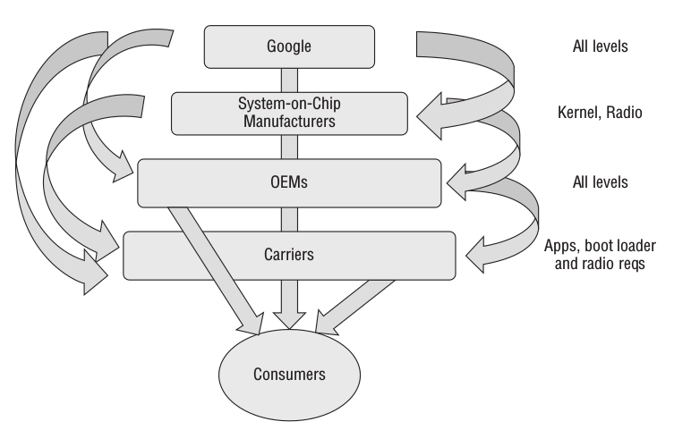
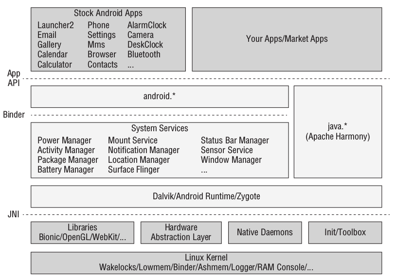
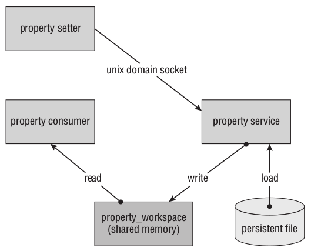
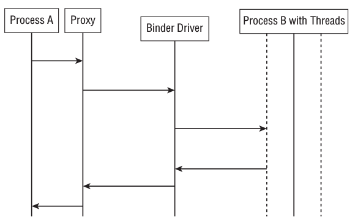
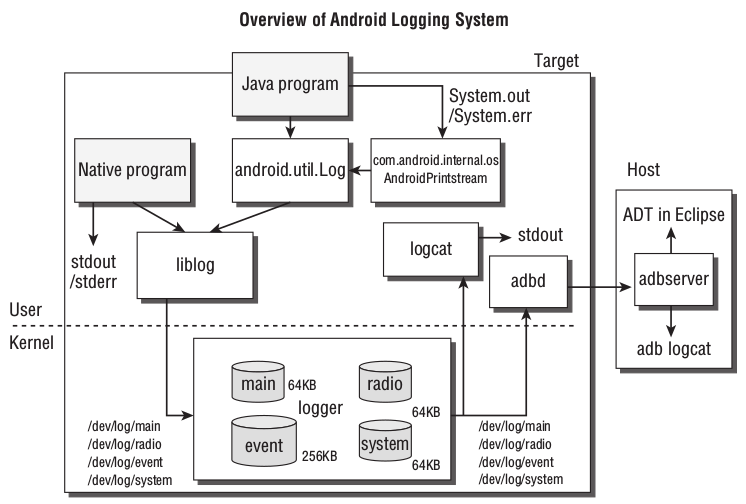

# Android 安全攻防权威指南

## 第一章 纵观Android生态圈

## 第二章 Android的安全设计与架构
Android 的总体架构由五个主要层次上的组件构成：Android 应用层，Android 框架层，Dalvik 虚拟机层，用户空间原生代码层和 Linux 内核层。

### 理解安全边界和安全策略执行
安全边界是系统中分隔不同信任级别的特殊区域。

Android 操作系统应用了两套独立又相互配合的权限模型：以 Linux 内核使用用户和用户组来实施权限控制的 Android 沙箱模型，以 DalvikVM 和 Android 框架形式存在的 Android 运行时模型。

##### Android沙箱
Android 系统沿用了 Linux 的 `UID/GID` 权限模型，并定义了从名称到独特标示符 `Android ID（AID）`的映射表。此外，Android 还使用了辅助用户组机制，以允许进程访问共享或受保护的资源，并能用于向进程授予额外的权限。

在应用执行时，它们的 `UID` 、 `GID` 和辅助用户组都会被分配给新创建的进程。在一个独特的 `UID` 、 `GID` 环境下运行，使得操作系统可以在内核中实施底层的限制措施，也让运行环境能够控制应用之间的交互。

##### Android权限
要确定应用用户的权限和辅助用户组，Android 系统会处理应用包中的 `AndroidManifest.xml` 文件中指定的高级权限。应用的权限由 `PackageManager` 在安装时从应用的 `Manifest` 文件中提取，并存储在 `/data/system/packages.xml` 文件中。这些条目会在应用进程的实例化阶段用于向进程授予适当的权限。

权限至用户组的映射表存储在 `/etc/permissions/platform.xml` 文件中。
1. API权限
API 权限用于控制访问高层次的功能，一些 API 权限与内核级的安全实施机制相对应。
2. 文件系统权限
3. IPC权限

应用于一些在 Android Binder IPC 机制上建立的主要 Android 应用组件。

### 深入理解各个层次
##### Android应用层
`AndroidManifest.xml`：特别注意 `sharedUserId` 属性，如果两个应用由相同的密钥签名，它们可以在各自的 Manifest 文件中指明同一个用户标识符，这两个应用就会在相同的 UID 环境下运行，从而能访问相同的文件系统数据存储以及潜在的其他资源。

`Intent`：`Intent` 是一种消息对象，包含一个要执行操作的相关信息。如果调用方或被调用方指明了发送或接收消息的权限要求，那么 Android 运行时将对 `Intent` 执行权限检查。当在 `Manifest` 文件中声明特定的组件时，可以指明一个 `Intent Filter`，来定义端点处理的标准。（隐式Intent）

`Activity`：`Activity`是一种面向用户的应用组件或用户界面。`Activity` 的底层管理是由被称为 `Activity Manager` 的组件进行处理。其中 `launchMode` 属性会影响 Activity 的启动方式。

`Broadcast Receiver`：在应用希望接收一个匹配某种特定标准的隐式 Intent 时出现。

`Service`：在后台运行而无需用户界面的应用组件。

`Content Provider`：为各种通用、共享的数据存储提供结构化访问接口。

##### Android框架层
Android 框架层为开发者提供了执行通用任务的组件，包括任何仍然在 `DalvikVM` 中执行的非应用特定代码。通用的框架层程序包位于 `android.*` 名字空间中。框架层还包括了用于管理内部类所提供功能的服务，这些管理器由 `system_server` 在系统初始化之后启动。

##### DalvikVM
DalvikVM 是基于寄存器而不是栈。这些寄存器被指定为虚拟机内存的存储位置，用于模拟微处理器的寄存器功能。`DalvikVM` 使用 `Java Native Interface（JNI）` 与底层原生代码进行交互。

Android 设备启动时，`Zygote` 进程是最先运行的进程之一，它负责启动其他服务以及加载 Android 框架所使用的程序库，然后，Zygote 进程作为每个 Dalvik 进程的加载器，通过复制自身进程副本来创建进程。`Zygote` 还能启动 `system_server` 进程，这个进程容纳了所有系统核心服务，并在 system 的 `AID` 用户环境中以特权权限运行。

##### 用户空间原生代码层
这一层主要由两大类组件构成：程序库和核心系统服务。

1. 程序库：Android 框架层中的较高层次类所依赖的许多底层功能都是通过共享程序库的方式来实现，并通过 `JNI` 进行访问。
2. 核心服务：建立基本操作系统环境的服务与 Android 原生组件。

`init`：`init` 程序通过执行一系列命令对用户空间环境进行初始化，Android 基于从 `/init.rc` 中找到的指令来执行命令。

`Property服务`：`Property` 服务位于 Android 的初始化服务中，它提供一个持续性的、内存映射的、基于键值对的配置服务。

`无线接口层`：提供通讯功能。

`debuggerd`：`debuggerd` 守护进程提供 Android 的基本崩溃报告。

`ADB`：由 Android 设备上的 `adbd` 守护进程，在宿主工作站上运行的 `adb` 服务器，以及相应的 `adb` 命令行客户端组成。

`Volume守护进程`：或称 `vold`，是 Android 系统上负责安装和卸载各种文件系统的服务。`vold` 也处理 `Android Secure Container（ASEC）` 文件的安装和卸载，当应用包存储到 `FAT` 等不安全的文件系统上时，`ASEC` 会对其进行加密处理，在应用加载时通过环回（loopback）设备进行安装，通常挂载到 `/mnt/asec`。不透明二进制块（OOB）也是由 `vold` 进行安装和卸载的，这些文件与应用共同打包，以存储由一个共享密钥加密的数据，与 `ASEC` 容器不同的是，对 `OBB` 的安装和卸载是在由应用自身而非系统来执行的。

##### 内核
1. Binder

`Binder` 内核驱动是整个 `Binder` 架构的粘合剂。`Binder` 以客户端/服务器模型运行，允许一个进程同时调用多个“远程”进程中的多个方法。`Binder` 架构将底层细节进行了抽象，使得这些方法调用起来就像是本地函数调用。Binder 的信息流图：

`Binder` 也使用进程 `ID（PID）` 和 `UID` 信息作为一种标识调用进程的手段，允许被调用方作出访问控制决策。通常会调用 `Binder.getCallingUid` 和 `Binder.getCallingPid` 等函数，或者调用 `checkCallingPermission` 等高层次上的检查函数。

2. ashmem

匿名共享内存服务提供了基于文件、通过引用计数的共享内存接口，ashmem 能够自动收缩内存缓存，并在全局可用内存较低时回收内存区域，非常适合低内存环境。在底层使用 `ashmem` 只需调用 `ashmem_create_region` 并对返回的文件描述符使用 `mmap` 函数。在较高层次上，Android 框架层提供了 `MemoryFile` 类，作为 `ashmem` 驱动的封装器。

3. pmem
`pmem` 用来管理大块物理上连续的内存区块，这些区块可以在用户空间进程和其他内核驱动之间共享。与 `ashmem` 不同，`pmem` 驱动需要一个分配进程，为 `pmem` 的内存堆保留一个文件描述符，直到所有其他索引都关闭。

4. 日志记录器

作为 `logcat` 命令的支持，这个驱动用于查看日志缓冲区，它根据信息的类型，提供了4个独立的日志缓冲区：`main`（主缓冲区）、radio（无线电缓冲区）、event（事件缓冲区）和 system（系统缓冲区）。

5. Paranoid Networking

Android 内核基于一个调用进程的辅助用户组来限制网络操作，而这个调用进程就是被称为 `Paranoid Networing` 的内核修改模块。在高层次上，这个模块将一个 `AID`映射到应用层的权限声明或请求上。

## 第三章 root Android设备
## 第四章 应用安全性评估
## 第五章 理解Android的攻击面
## 第六章 使用模糊测试来挖掘漏洞
## 第七章 调试与分析安全漏洞
## 第八章 用户态软件的漏洞利用
## 第九章 ROP漏洞利用技术
## 第十章 攻击内核
## 第十一章 攻击RIL无线接口层
## 第十二章 漏洞利用缓解技术
## 第十三章 硬件层的攻击
