# Android 软件安全与逆向分析


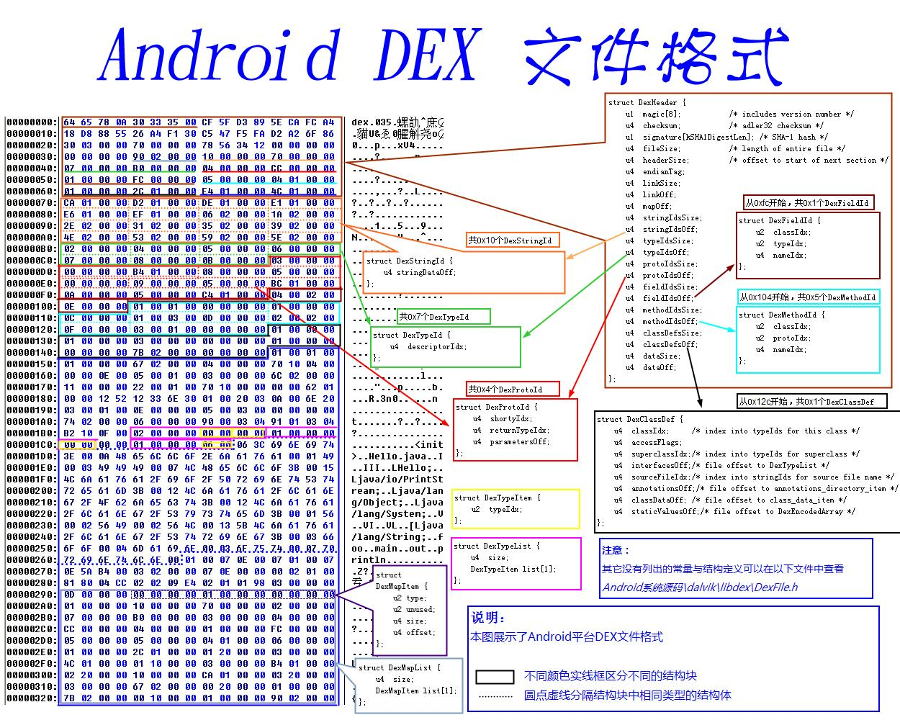

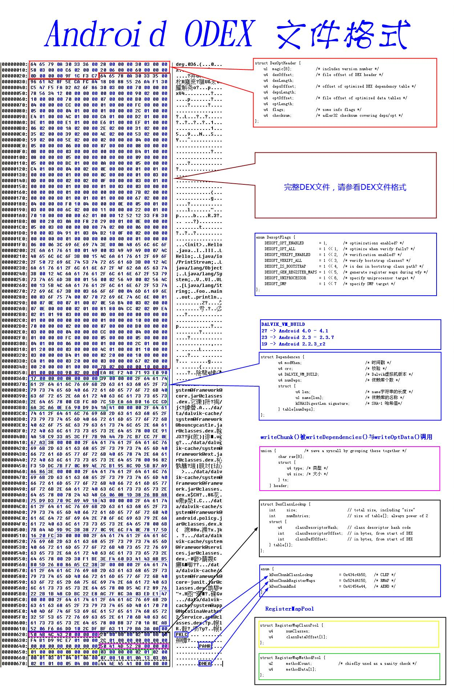

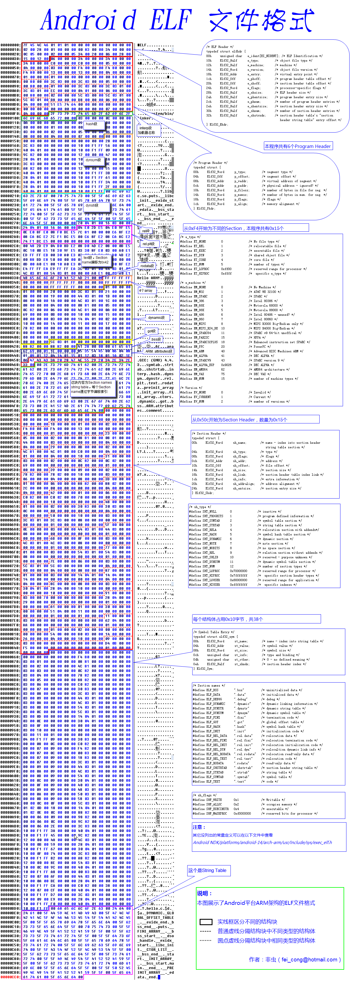


## 第三章 进入 Android Dalvik 虚拟机
#### Dalvik虚拟机的特点
`dx` 工具将所有的 Java 类文件中的常量池进行分解，消除其中的冗余信息，重新组合形成一个常量池，所有的类文件共享同一个常量池。

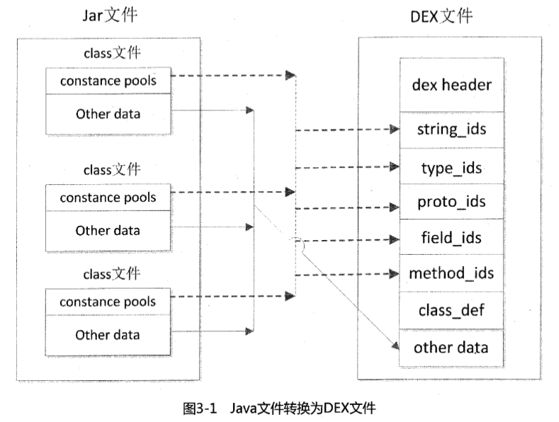

实例：
```java
public class Hello {
	public int foo(int a, int b) {
		return (a + b) * (a - b);
	}

	public static void main(String[] argc) {
		Hello hello = new Hello();
		System.out.println(hello.foo(5, 3));
	}
}
```
```
javac Hello.java    // .class
dx --dex --output=Hello.dex Hello.class    // .dex
```
Java 字节码：
```
javap -c -classpath . Hello
```
```
Compiled from "Hello.java"
public class Hello {
  public Hello();
    Code:
       0: aload_0
       1: invokespecial #1                  // Method java/lang/Object."<init>":()V
       4: return

  public int foo(int, int);
    Code:
       0: iload_1
       1: iload_2
       2: iadd
       3: iload_1
       4: iload_2
       5: isub
       6: imul
       7: ireturn

  public static void main(java.lang.String[]);
    Code:
       0: new           #2                  // class Hello
       3: dup
       4: invokespecial #3                  // Method "<init>":()V
       7: astore_1
       8: getstatic     #4                  // Field java/lang/System.out:Ljava/io/PrintStream;
      11: aload_1
      12: iconst_5
      13: iconst_3
      14: invokevirtual #5                  // Method foo:(II)I
      17: invokevirtual #6                  // Method java/io/PrintStream.println:(I)V
      20: return
}
```

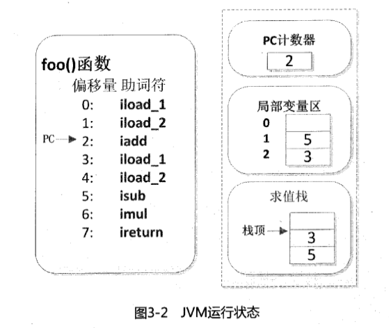

Java 字节码指令列表：https://en.wikipedia.org/wiki/Java_bytecode_instruction_listings

Dalvik 字节码：
```
dexdump -d Hello.dex
```
```
Processing '/home/bibi/Downloads/源代码/chapter3/3.1/Hello.dex'...
Opened '/home/bibi/Downloads/源代码/chapter3/3.1/Hello.dex', DEX version '035'
Class #0            -
  Class descriptor  : 'LHello;'
  Access flags      : 0x0001 (PUBLIC)
  Superclass        : 'Ljava/lang/Object;'
  Interfaces        -
  Static fields     -
  Instance fields   -
  Direct methods    -
    #0              : (in LHello;)
      name          : '<init>'
      type          : '()V'
      access        : 0x10001 (PUBLIC CONSTRUCTOR)
      code          -
      registers     : 1
      ins           : 1
      outs          : 1
      insns size    : 4 16-bit code units
00014c:                                        |[00014c] Hello.<init>:()V
00015c: 7010 0400 0000                         |0000: invoke-direct {v0}, Ljava/lang/Object;.<init>:()V // method@0004
000162: 0e00                                   |0003: return-void
      catches       : (none)
      positions     : 
        0x0000 line=1
      locals        : 
        0x0000 - 0x0004 reg=0 this LHello; 

    #1              : (in LHello;)
      name          : 'main'
      type          : '([Ljava/lang/String;)V'
      access        : 0x0009 (PUBLIC STATIC)
      code          -
      registers     : 5
      ins           : 1
      outs          : 3
      insns size    : 17 16-bit code units
000164:                                        |[000164] Hello.main:([Ljava/lang/String;)V
000174: 2200 0100                              |0000: new-instance v0, LHello; // type@0001
000178: 7010 0000 0000                         |0002: invoke-direct {v0}, LHello;.<init>:()V // method@0000
00017e: 6201 0000                              |0005: sget-object v1, Ljava/lang/System;.out:Ljava/io/PrintStream; // field@0000
000182: 1252                                   |0007: const/4 v2, #int 5 // #5
000184: 1233                                   |0008: const/4 v3, #int 3 // #3
000186: 6e30 0100 2003                         |0009: invoke-virtual {v0, v2, v3}, LHello;.foo:(II)I // method@0001
00018c: 0a00                                   |000c: move-result v0
00018e: 6e20 0300 0100                         |000d: invoke-virtual {v1, v0}, Ljava/io/PrintStream;.println:(I)V // method@0003
000194: 0e00                                   |0010: return-void
      catches       : (none)
      positions     : 
        0x0000 line=7
        0x0005 line=8
        0x0010 line=9
      locals        : 

  Virtual methods   -
    #0              : (in LHello;)
      name          : 'foo'
      type          : '(II)I'
      access        : 0x0001 (PUBLIC)
      code          -
      registers     : 5
      ins           : 3
      outs          : 0
      insns size    : 6 16-bit code units
000198:                                        |[000198] Hello.foo:(II)I
0001a8: 9000 0304                              |0000: add-int v0, v3, v4
0001ac: 9101 0304                              |0002: sub-int v1, v3, v4
0001b0: b210                                   |0004: mul-int/2addr v0, v1
0001b2: 0f00                                   |0005: return v0
      catches       : (none)
      positions     : 
        0x0000 line=3
      locals        : 
        0x0000 - 0x0006 reg=2 this LHello; 

  source_file_idx   : 1 (Hello.java)
```

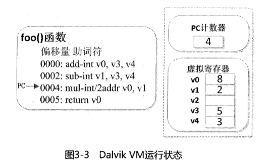

Dalvik 虚拟机属于 Android 运行时环境，它与一些核心库共同承担 Android 应用程序的运行工作。

Android 系统启动加载完内核后，第一个执行的是 `init` 进程， `init` 进程首先要做的是设备的初始化工作，然后读取 `init.rc` 文件并启动系统中的重要外部程序 `Zygote`。`Zygote` 进程是 Android 所有进程的孵化器进程，它启动后首先初始化 `Dalvik` 虚拟机，然后启动 `system_server` 并进入 `Zygote` 模式，通过 `socket` 等候命令。当执行一个 Android 应用程序时，`system_server` 进程通过 `Binder IPC` 方式发送命令给 `Zygote`，`Zygote` 收到命令后通过 `fork` 自身创建一个 Dalvik 虚拟机的实例来执行应用程序的入口函数，一个程序就启动完成了。

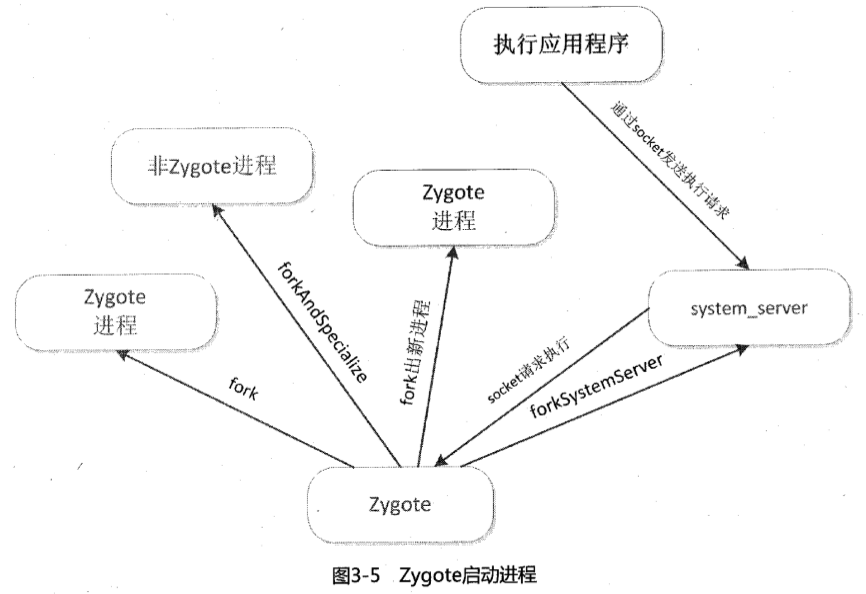

Zygote 提供了三种创建进程的方法：
- `fork()`：创建一个 Zygote 进程（这种方式实际不会被调用）；
- `forkAndSpecialize()`：创建一个非 Zygote 进程；
- `forkSystemServer()`：创建一个系统服务进程。

其中，Zygote 进程可以再 `fork()` 出其他进程，非 Zygote 进程则不能，而系统服务进程在终止后它的子进程也必须终止。

当进程 fork 成功后，执行的工作就交给 Dalvik 虚拟机。Dalvik 虚拟机首先通过 `loadClassFromDex()` 函数完成类的装载工作，每个类被成功解析后都会拥有一个 `ClassObject` 类型的数据结构存储在运行时环境中，虚拟机使用 `gDvm.loadedClass` 全局哈希表来存储与查询所有装载进来的类，随后，字节码验证器使用 `dvmVerifyCodeFlow()` 函数对装入的代码进行校验，接着虚拟机调用 `FindClass()` 函数查找并装载 `main` 方法类，随后调用 `dvmInterpret()` 函数初始化解释器并执行字节码流。

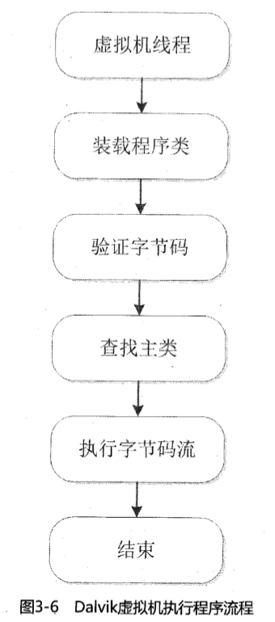

#### Dalvik汇编语言基础为分析Android程序做准备
Dalvik指令语法由指令的位描述与指令格式标识来决定。
位描述约定：
- 每16位的子采用空格分隔开来。
- 每个字母表示4位，每个字母按照顺序从高字节开始，排列到低字节。每四位之间可能使用竖线 "|" 来表示不同的内容。
- 顺序采用 A~Z 的单个大写字母作为一个4位的操作码，op 表示一个8位的操作码。
- "∅"来表示这字段所有位为0值。
指令格式约定：
- 指令格式标识大多由三个字符组成，前两个是数字，最后一个是字母。
- 第一个数字表示指令有多少个16位的子组成。
- 第二个数字表示指令最多使用寄存器的个数。特殊标记 "r" 标识使用一定范围内的寄存器。
- 第三个字母为类型码，表示指令用到的额外数据的类型。
还有一种特殊情况是末尾可能会多出另一个字母，如果是字母 `s` 表示指令采用静态链接，如果是字母 `i` 表示指令应该被内联处理。

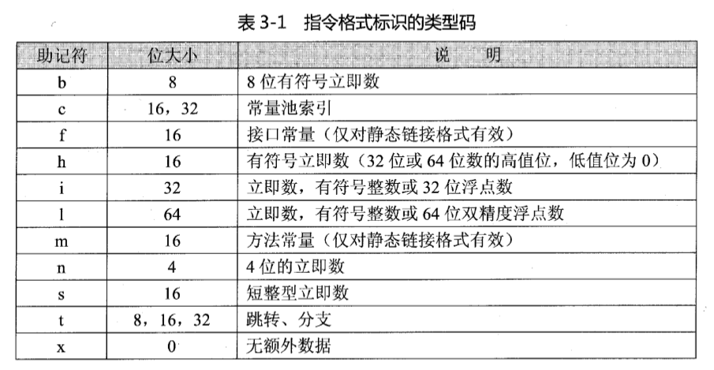

Dalvik指令语法约定：
- 每条指令从操作码开始，后面紧跟参数，参数个数不定，每个参数之间采用逗号分开。
- 每条指令的参数从指令第一部分开始，op 位于低8位，高8位可以是一个8位的参数，也可以是两个4位的参数，还可以为空，如果指令超过16位，则后面部分依次作为参数。
- 如果参数采用 "vX" 的方式表示，表明它是一个寄存器，如 v0、v1 等。
- 如果参数采用 "#+X" 的方式表示，表明它是一个常量数字。
- 如果参数采用 "+X" 的方式表示，表明它是一个相对指令的地址偏移。
- 如果参数采用 "kind@X" 的方式表示，表明它是一个常量池索引值。kind 可以是 string、type、field、meth。
Dalvik将部分寄存器映射到了 ARM 寄存器上，还有一部分则通过调用栈进行模拟。Dalvik中用到的寄存器都是32位的，支持任何类型，64位类型用2个相邻寄存器表示。取值范围是 v0~v65535。我们知道Dalvik虚拟机为每个进程维护一个调用栈，这个调用栈其中一个作用就是用来虚拟寄存器。Android SDK 中有一个名为 `dalvik.bytecode.Opcodes` 的接口，它定义了一份完整的Dalvik字节码列表，处理这些字节码的函数为一个宏 `HANDLE_OPCODE()`，每个字节码的处理过程可以在 `dalvik/vm/mterp/c` 中找到。

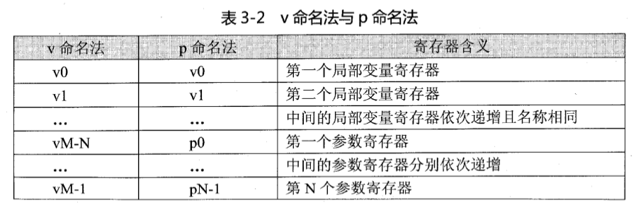

Dalvik字节码有一套自己的类型、方法和字段表示方法，与Dalvik虚拟机指令集一起组成Dalvik汇编代码：

1. 类型

Dalvik字节码只有两种类型，基本类型与引用类型。除了对象与数组属于引用类型外，其他的Java类型都是基本类型。

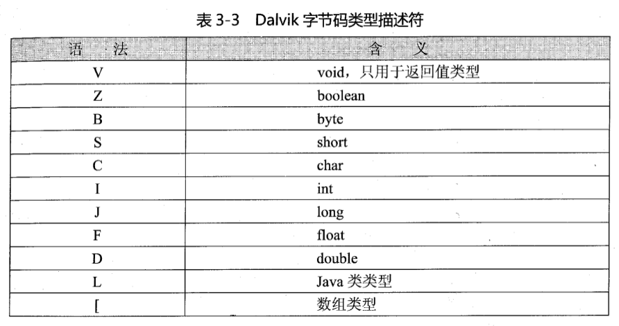

- `L` 类型可以表示Java类型中的任何类，以 `Lpackage/name/ObjectName;` 形式表示。
- `[` 类型可以表示所有基本的数组。`[` 后面紧跟基本类型描述符  ，多个 `[` 在一起时表示多维数组。
- `L`与`[`同时使用表示对象数组。

2. 方法

Dalvik使用方法名、类型参数与返回值来详细描述一个方法。
```
Lpackage/name/ObjectName;->MethodName(III)Z
```
`Lpackage/name/ObjectName;-` 理解为一个类型，`MethodName` 为具体的方法名，`(III)Z` 是方法的签名部分，其中括号内的 `III` 为方法的参数（此处位三个整型参数），`Z` 表示方法的返回类型（boolean类型）。

BakSmali 生成的方法代码以 `.method` 指令开始，以 `.end method` 指令结束，根据方法类型不同，会用 `#` 号加以注释。

3. 字段
```
Lpackage/name/ObjectName;->FieldName:Ljava/lang/String;
```
字段由类型 `Lpackage/name/ObjectName;`，字段名 `FieldName`，字段类型 `Ljava/lang/String;` 组成，其中字段名与字段类型中间用冒号 `:` 隔开。

BakSmali 生成的字段代码以 `.field` 指令开头，根据字段类型的不同，用 `#` 号加以注释。

#### Dalvik指令集
1. 指令特点
2. 空操作指令

空操作指令的助记符为 `nop`，值为 00，通常用于对齐代码。

3. 数据操作指令

数据操作指令为 `move`，原型为 `move destination, source`。
```
move vA, vB        // vB -> vA，都是4位
move/from16 vAA, vBBBB        // vBBBB -> vAA，源寄存器16位，目的寄存器8位
move/16 vAAAA, vBBBB        // vBBBB -> vAAAA，都是16位
move-wide vA, vB        // 4位的寄存器对赋值，都是4位
move-wide/from16 vAA, vBBBB
move-wide/16 vAAAA, vBBBB        // 与move-wide相同
move-object vA, vB        // 对象赋值，都是4位
move-object/from16 vAA, vBBBB        // 对象赋值，源寄存器16位，目的寄存器8位
move-object/16 vAAAA, vBBBB        // 对象赋值，都是16位
move-result vAA        // 将上一个 invoke 类型指令操作的单字非对象结果赋值给 vAA 寄存器
move-result-wide vAA        // 将上一个 invoke 类型指令操作的双字非对象结果赋值给 vAA 寄存器
move-result-object vAA        // 将上一个 invoke 类型指令操作的对象结果赋值给 vAA 寄存器
move-exception vAA        // 保存一个运行时发生的异常到 vAA 寄存器。这条指令必须是异常发生时的异常处理器的一条指令，否则无效。
```
4. 返回指令

基础字节码为 `return`。
```
return-void        // 从一个void方法返回
return vAA        // 返回一个32位非对象类型的值，返回值寄存器位8位的寄存器vAA
return-wide vAA        // 返回一个64位非对象类型的值，返回值寄存器为8位的vAA
return-object vAA        // 返回一个对象类型的值，返回值寄存器为8位的vAA
```
5. 数据定义指令

基础字节码为 `const`。
```
const/4 vA, #+B        // 将数值符号扩展为32位后赋值给寄存器vA
const/16 vAA, #+BBBB        // 将数值符号扩展为32位后赋值给寄存器vAA
const vAA, #+BBBBBBBB        // 将数值赋值给寄存器vAA
const/high16 vAA, #+BBBB0000        // 将数值右边零扩展为32位后赋值给寄存器vAA
const-wide/16 vAA, #+BBBB        // 将数值符号扩展为64位后赋值给寄存器vAA
const-wide/32 vAA, #+BBBBBBBB        // 将数值符号扩展为64位后赋值给寄存器vAA
const-wide vAA, #+BBBBBBBBBBBBBBBB        // 将数值赋给寄存器对vAA
const-wide/high16 vAA, #+BBBB000000000000        // 将数值右边零扩展为64位后赋值给寄存器对vAA
const-string vAA, string@BBBB        // 通过字符串索引构造一个字符串并赋值给寄存器vAA
const-string/jumbo vAA, string@BBBBBBBB        // 通过字符串索（较大）引构造一个字符串并赋值给寄存器vAA
const-class vAA, type@BBBB        // 通过类型索引获取一个类型引用并赋值给寄存器vAA
const-class/jumbo vAAAA, type@BBBBBBBB        // 通过给定的类型索引获取一个类引用并赋值给寄存器vAAAA。这条指令占用两个字节，值为 0x00ff。
```
6. 锁指令

用在多线程程序中对同一对象操作。
```
monitor-enter vAA        // 为指定的对象获取锁
monitor-exit vAA        // 释放指定的对象的锁
```
7. 实例操作指令
```
check-cast vAA, type@BBBB
check-cast/jumbo vAAAA, type@BBBBBBBB        // 将vAA寄存器中的对象引用转换成指定的类型，如果失败会抛出 ClassCastException 异常。如果类型B指定的是基本类型，对于非基本类型的A来说，运行始终会失败。
instance-of vA, vB, type@CCCC
instance-of vAAAA, vBBBB, type@CCCCCCCC        // 判断vB寄存器中的对象引用是否可以转换成指定的类型，如果可以vA寄存器赋值为1，否则vA寄存器赋值为0。
new-instance vAA, type@BBBB
new-instance vAAAA, type@BBBBBBBB         // 构造一个指定类型对象的新实例，并将对象引用赋值给vAA寄存器，类型符type指定的类型不能是数组类。
```
8. 数组操作指令
```
array-length vA, vB        // 获取vB寄存器中数组的长度并将值赋给vA寄存器。
new-array vA, vB, type@CCCC
new-array/jumbo vAAAA, vBBBB, type@CCCCCCCC        // 构造指定类型（type@CCCCCCCC）与大小（vBBBB）的数组，并将值赋给vAAAA寄存器
filled-new-array {vC, vD, vE, vF, vG}, type@BBBB        // 构造指定类型（type@BBBB）和大小（vA）的数组并填充数组内容。vA寄存器是隐含使用的，处理指定数组的大小外还指定了参数的个数，vC~vG 是使用的参数寄存器列表。
filled-new-array/range {vCCCC .. vNNNN}, type@BBBB        // 同上，只是参数寄存器使用 range 字节码后缀指定了取值范围，vC 是第一个参数寄存器，N=A+C-1。
fill-array-data vAA, +BBBBBBBB        // 用指定的数据来填充数组，vAA寄存器为数组引用，引用必须为基础类型的数组，在指令后面紧跟一个数据表。
arrayop vAA, vBB, vCC        // 对vBB寄存器指定的数组元素进行取值和赋值。vCC寄存器指定数组元素索引，vAA寄存器用来存放读取的或需要设置的数组元素的值。读取元素使用 aget 类指令，元素赋值使用 aput 类指令。
```
9. 异常指令
```
throw vAA        // 抛出vAA寄存器中指定类型的异常
```
10. 跳转指令

有三种跳转指令：无条件跳转（goto）、分支跳转（switch）和条件跳转（if）。
```
goto +AA
goto/16 +AAAA
goto/32 +AAAAAAAA        // 无条件跳转到指定偏移处，不能为0。
packed-switch vAA, +BBBBBBBB        // 分支跳转指令。vAA寄存器为 switch 分支中需要判断的值，BBBBBBBB 指向一个 packed-switch-payload 格式的偏移表，表中的值是有规律递增的。
sparse-switch vAA, +BBBBBBBB        // 分支跳转指令。vAA寄存器为 switch 分支中需要判断的值，BBBBBBBB 指向一个 sparse-switch-payload 格式的偏移表，表中的值是无规律的偏移量。
if-test vA, vB, +CCCC        // 条件跳转指令。比较vA寄存器与vB寄存器的值，如果比较结果满足就跳转到CCCC指定的偏移处，CCCC不能为0。if-test 类型的指令有：
        if-eq        // if(vA==vB)
        if-ne        // if(vA!=vB)
        if-lt        // if(vA<vB)
        if-ge        // if(vA>=vB)
        if-gt        // if(vA>vB)
        if-le        // if(vA<=vB)
if-testz vAA, +BBBB        // 条件跳转指令。拿vAA寄存器与0比较，如果比较结果满足或值为0就跳转到BBBB指定的偏移处，BBBB不能为0。if-testz 类型的指令有：
        if-eqz        // if(!vAA)
        if-nez        // if(vAA)
        if-ltz        // if(vAA<0)
        if-gez        // if(vAA>=0)
        if-gtz        // if(vAA>0)
        if-lez        // if(vAA<=0)
```
11. 比较指令

对两个寄存器的值进行比较，格式为 `cmpkind vAA, vBB, vCC`，其中 vBB 和 vCC 寄存器是需要比较的两个寄存器或两个寄存器对，比较的结果放到 vAA 寄存器。指令集中共有5条比较指令：
```
cmpl-float
cmpl-double        // 如果vBB寄存器大于vCC寄存器，结果为-1，相等结果为0，小于结果为1
cmpg-float
cmpg-double        // 如果vBB寄存器大于vCC寄存器，结果为1，相等结果为0，小于结果为-1
cmp-long        // 如果vBB寄存器大于vCC寄存器，结果为1，相等结果为0，小于结果为-1
```
12. 字段操作指令

用于对对象实例的字段进行读写操作。对普通字段与静态字段操作有两种指令集，分别是 `iinstanceop vA, vB, field@CCCC` 与 `sstaticop vAA, field@BBBB`。扩展为 `iinstanceop/jumbo vAAAA, vBBBB, field@CCCCCCC` 与 `sstaticop/jumbo vAAAA, field@BBBBBBBB`。

普通字段指令的指令前缀为 `i`，静态字段的指令前缀为 `s`。字段操作指令后紧跟字段类型的后缀。

13. 方法调用指令

用于调用类实例的方法，基础指令为 `invoke`，有 `invoke-kind {vC, vD, vE, vF, vG}, meth@BBBB` 和 `invoke-kind/range {vCCCC .. vNNNN}, meth@BBBB` 两类。扩展为 `invoke-kind/jumbo {vCCCC .. vNNNN}, meth@BBBBBBBB` 这类指令。

根据方法类型的不同，共有如下五条方法调用指令：
```
invoke-virtual 或 invoke-virtual/range        // 调用实例的虚方法
invoke-super 或 invoke-super/range        // 调用实例的父类方法
invoke-direct 或 invoke-direct/range        // 调用实例的直接方法
invoke-static 或 invoke-static/range        // 调用实例的静态方法
invoke-interface 或 invoke-interface/range        // 调用实例的接口方法
```
方法调用的返回值必须使用 `move-result*` 指令来获取，如：
```
invoke-static {}, Landroid/os/Parcel;->obtain()Landroid/os/Parcel;
move-result-object v0
```
14. 数据转换指令

格式为 `unop vA, vB`，vB寄存器或vB寄存器对存放需要转换的数据，转换后结果保存在vA寄存器或vA寄存器对中。
```
neg-int
neg-long
neg-float
neg-double        // 求补
not-int
not-long        // 求反
int-to-long
int-to-float
int-to-double        // 整型数转换
long-to-int
long-to-float
long-to-double        // 长整型数转换
float-to-int
float-to-long
float-to-double        // 单精度浮点数转换
double-to-int
double-to-long
double-to-float        // 双精度浮点数转换
int-to-byte
int-to-char
int-to-short
```
15. 数据运算指令

包括算术运算符与逻辑运算指令。

数据运算指令有如下四类：
```
binop vAA, vBB, vCC        // 将vBB寄存器与vCC寄存器进行运算，结果保存到vAA寄存器。以下类似
binop/2addr vA, vB
binop/lit16 vA, vB, #+CCCC
binop/lit8 vAA, vBB, #+CC
```
第一类指令可归类：
```
add-type        // vBB + vCC
sub-type        // vBB - vCC
mul-type        // vBB * vCC
div-type        // vBB / vCC
rem-type        // vBB % vCC
and-type        // vBB AND vCC
or-type        // vBB OR vCC
xor-type        // vBB XOR vCC
shl-type        // vBB << vCC
shr-type        // vBB >> vCC
ushr-type        // （无符号数）vBB >> vCC
```

## 第四章 Android可执行文件
#### Android程序的生产步骤
1. 打包资源，生成 R.java 文件。
2. 处理 aidl 文件，生成相应的 Java 文件。
3. 编译工程源代码，生成相应的 class 文件。
4. 转换所有的 class 文件，生成 classes.dex 文件。
5. 打包生成 APK 文件。
6. 对 APK 文件进行签名。
7. 对签名后的 APK 文件进行对齐处理。

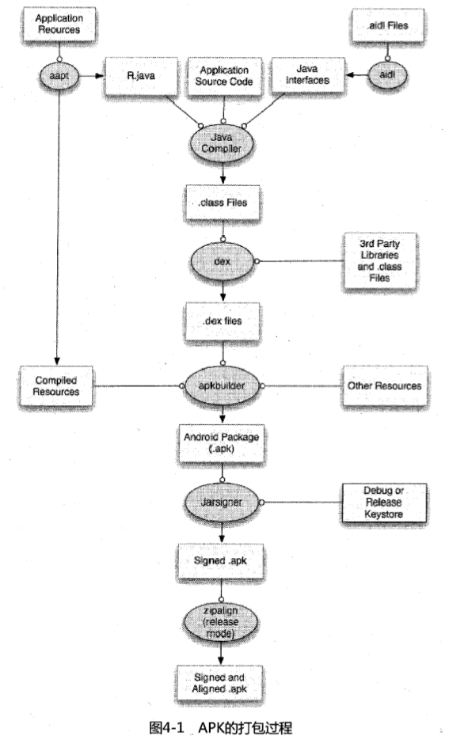

##### dex文件格式

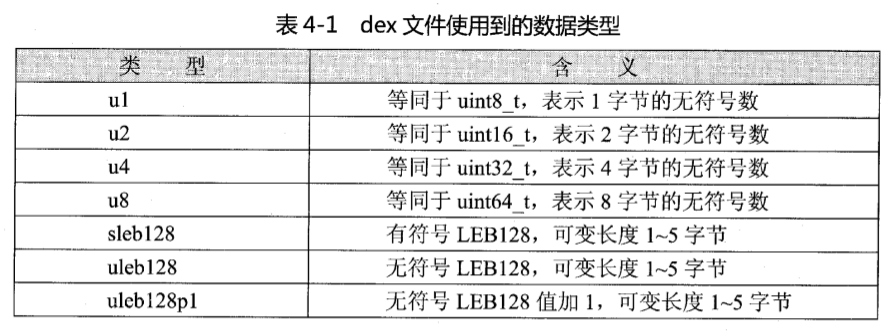

每个 `LEB128` 由1~5个字节组成，所有的字节组合在一起表示一个32位的数据，每个字节只有7位为有效位，如果第1个字节的最高位为1，表示 LEB128 需要使用第2个字节，依次类推，直到最后的字节最高位为0，如果读取5个字节后下一个字节最高位仍为1，表示该 dex 文件无效。


一个 dex 文件由7个部分组成。dex header 为 dex 头，它指定了 dex 文件的一些属性，并记录了其它６部分数据结构在 dex 文件中的物理偏移。 string_ids 到 class_def 结构可以理解为索引结构区，真实的数据存放在 data 数据区，最后的 link_data 为静态链接数据区。

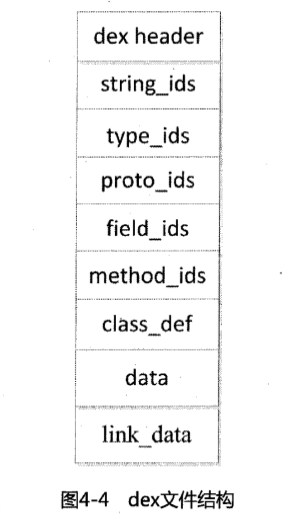

未经优化的 dex 文件结构表示如下：
```
struct DexFile {
    DexHeader      Header;
    DexStringId    StringIds[stringIdsSize];
    DexTypeId      TypeIds[typeIdsSize];
    DexProtoId     ProtoIds[protoIdsSize]
    DexMethodId    MethodIds[methodIdsSize];
    DexClassDef    ClassDefs[classDefsSize];
    DexData        Data[];
    DexLink        LinkData;
};
```
DexHeader 结构占用 0x70 个字节，声明如下：
```
struct DexHeader {
    u1 magic[8];                    // dex版本标识
    u4 checksum;                    // adler32检验
    u1 signature[kSHA1DigestLen];   // SHA-1哈希值
    u4 fileSize;                    // 整个文件大小
    u4 headerSize;                  // DexHeader结构大小
    u4 endianTag;                   // 字节序标记
    u4 linkSize;                    // 链接段大小
    u4 linkOff;                     // 链接段偏移
    u4 mapOff;                      // DexMapList的文件偏移
    u4 stringIdsSize;               // DexStringId的个数
    u4 stringIdsOff;                // DexStringId的文件偏移
    u4 typeIdsSize;                 // DexTypeId的个数
    u4 typeIdsOff;                  // DexTypeId的文件偏移
    u4 protoIdsSize;                // DexProtoId的个数
    u4 protoIdsOff;                 // DexProtoId的文件偏移
    u4 fieldIdsSize;                // DexFieldId的个数
    u4 fieldIdsOff;                 // DexFieldId的文件偏移
    u4 methodIdsSize;               // DexMethodId的个数
    u4 methodIdsOff;                // DexMethodId的文件偏移
    u4 classDefsSize;               // DexClassDef的个数
    u4 classDefsOff;                // DexClassDef的文件偏移
    u4 dataSize;                    // 数据段的大小
    u4 dataOff;                     // 数据段的文件偏移
};
```

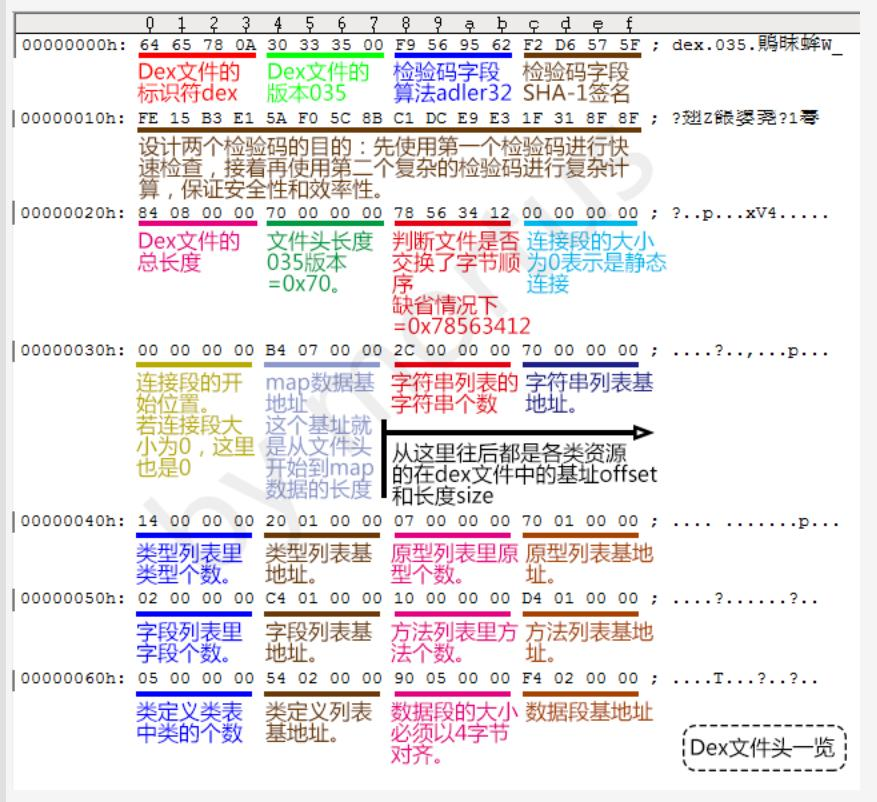

Dalvik 虚拟机解析 dex 文件的内容，最终将其映射成 `DexMapList` 数据结构。DexHeader 结构的 `mapOff` 字段指明了 DexMapList 结构在 dex 文件中的偏移，声明如下：
```
struct DexMapList {
    u4 size;                // DexMapItem的个数
    DexMapItem list[1];     // DexMapItem结构
};

// 其中 DexMapItem 的结构声明
struct DexMapItem {
    u2 type;        // kDexType开头的类型
    u2 unused;      // 用于字节对齐
    u4 size;        // 指定类型的个数
    u4 offset;      // 指定类型数据的文件偏移
};
```
`DexStringId` 结构声明：
```
struct DexStringId {
    u4 stringDataOff;        // 字符串数据偏移
};
```
`DexTypeId` 结构声明：
```
struct DexTypeId {
    u4 descriptorIdx;        // 执行DexStringId列表的索引
};
```
`DexProtoId` 结构声明：
```
struct DexProtoId {
    u4 shortIdx;        // 执行DexStringId列表的索引
    u4 returnTypeIdx;   // 指向DexTypeId列表的索引
    u4 parametersOff;   // 指向DexTypeList的偏移
};

// 其中 DexTypeList 的结构声明
struct DexTypeList{
    u4 size;                // 接下来DexTypeItem的个数
    DexTypeItem list[1];    // DexTypeItem结构
};

// 再其中 DexTypeItem 的结构声明
struct DexTypeItem {
    u2 typeIdx;        // 指向DexTypeId列表的索引
};
```
`DexFieldId` 结构体声明：
```
struct DexMethodId {
    u2 classIdx;        // 类的声明，指向DexTypeId列表的索引
    u2 protoIdx;        // 声明类型，指向DexProtoId列表的索引
    u4 nameIdx;         // 方法名，指向DexStringId列表的索引
};
```
`DexClassDef` 结构体声明：
```
struct DexClassDef {
    u4 classIdx;        // 类的类型，指向DexTypeId列表的索引
    u4 accessFlags;     // 访问标志
    u4 superclassIds;   // 父类类型，指向DexTypeId列表的索引
    u4 interfacesOff;   // 接口，指向DexTypeList的偏移
    u4 sourceFileIdx;   // 源文件名，指向DexStringId列表的索引
    u4 annotationsOff;  // 注解，指向DexAnnotationsDirectoryItem结构
    u4 classDataOff;    // 指向DexClassData结构的偏移
    u4 staticValuesOff; // 指向DexEncodedArray结构的偏移
};
```
`DexClassData` 结构体声明：
```
struct DexClassData {
    DexClassDataHeader  header;         // 指定字段与方法的个数
    DexField*           staticFields;   // 静态字段，DexField结构
    DexField*           instanceFields; // 实例方法，DexField结构
    DexMethod*          directMethods;  // 直接方法，DexMethod结构
    DexMethod*          virtualMethods; // 虚方法，DexMethod结构
};

// 其中 DexClassDataHeader 结构声明
struct DexClassDataHeader {
    u4 staticFieldsSize;        // 静态字段个数
    u4 instanceFieldsSize;      // 实例字段个数
    u4 directMethodsSize;       // 直接方法个数
    u4 virtualMethodsSize;      // 虚方法个数
};

// 其中 DexField 结构声明
struct DexField {
    u4 fieldIdx;        // 指向DexFieldId的索引
    u4 accessFlags;     // 访问标志
};

// 其中 DexMethod 结构声明
struct DexMethod {
    u4 methodIdx;       // 访问DexMethodId的索引
    u4 accessFlags;     // 访问标志
    u4 codeOff;         // 指向DexCode结构的偏移
};

// 再其中 DexCode 结构声明
struct DexCode {
    u2 registersSize;       // 使用的寄存器个数
    u2 insSize;             // 参数个数
    u2 outsSize;            // 调用其他方法时使用的寄存器个数
    u2 triesSize;           // Try/Catch个数
    u2 debugInfoOff;        // 指向调试信息的偏移
    u4 insnsSize;           // 指令集个数，以2字节为单位
    u2 insns[1];            // 指令集
    // 2字节空间用于结构对齐
    // try_item[triesSize]  DexTry结构
    // Try/Catch中handler的个数
    // catch_handler_item[handlersSize], DexCatchHandler结构
};
```

#### odex文件格式
odex 文件的结构可以理解为 dex 文件的一个超集，它在 dex 文件头部添加了一些数据，然后在 dex 文件尾部添加了 dex 文件的依赖库以及一些辅助数据。

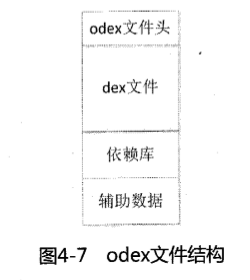

```
struct ODEXFile {
    DexOptHeader            header;     // odex文件头
    DEXFile                 dexfile;    // dex文件
    Dependences             deps;       // 依赖库列表
    ChunkDexClassLookup     lookup;     // 类查询结构
    ChunkRegisterMapPool    mappool;    // 映射池
    ChunkEnd                end;        // 结束标志
};
```
`DexOptHeader` 结构体声明：
```
struct DexOptHeader {
    u1 magic[8];        // odex版本标识
    u4 dexOffset;       // dex文件头偏移
    u4 dexLength;       // dex文件总长度
    u4 depsOffset;      // odex依赖库列表偏移
    u4 depsLength;      // 依赖库列表总长度
    u4 optOffset;       // 辅助数据偏移
    u4 optLength;       // 辅助数据总长度
    u4 flags;           // 标志
    u4 checksum;        // 依赖库与辅助数据的检验和
};
```
`DexFile` 结构体声明：
```
struct DexFile {
    // directly-mapped "opt" header
    const DexOptHeader* pOptHeader;
    
    // pointers to directly-mapped structs and arrays in base DEX
    const DexHeader*    pHeader;
    const DexStringId*  pStringIds;
    const DexTypeId*    pTypeIds;
    const DexFieldId*   pFieldIds;
    const DexMethodId*  pMethodIds;
    const DexProtoId*   pProtoIds;
    const DexClassDef*  pClassDefs;
    const DexLink*      pLinkData;
    
    // These are mapped out of the "auxillary" section, and may not be included in the file
    const DexClassLookup* pClassLookup;
    const void*         pRegisterMapPool;   // RegisterMapClassPool
    
    // points to start of DEX file data
    const u1*           baseAddr;
    
    // track memory overhead for auxillary structures
    int                 overhead;
    
    // additional app-specific data structures associated with the DEX
    // void*            auxData; 
};
```
`Dependences` 结构体声明：
```
struct Dependences {
    u4 modWhen;             // 时间戳
    u4 crc;                 // 校验
    u4 DALVIK_VM_BUILD;     // Dalvik虚拟机版本号
    u4 numDeps;             // 依赖库个数
    struct {
        u4 len;             // name字符串的长度
        u1 name[len];       // 依赖库的名称
        kSHA1DigestLen signatue;    // SHA-1哈希值
    } table[numDeps];
};
```
`ChunkDexClassLookup` 结构体的声明：
```
struct ChunkDexClassLookup {
    Header          header;
    DexClassLookup  lookup;
};

// 其中 header 定义
union {             // save a syscall by grouping these together
    char raw[8];
    struct {
        u4 type;
        u4 size;
    } ts;
} header;

// 其中DexClassLookup结构体声明
struct DexClassLookup {
    int size;                       // total size, including "size"
    int numEntries;                 // size of table[]; always power of 2
    struct {
        u4  classDescriptorHash;    // class descriptor hash code
        int classDescriptorOffset;  // in bytes, from start of DEX
        int classDefOffset;         // in bytes, from start of DEX
    } table[1];
};
```
`ChunkRegisterMapPool` 结构体声明：
```
struct ChunkRegisterMapPool {
    Header      header;
    struct {
        struct RegisterMapClassPool {
            u4  numClasses;
            u4  classDataOffset[1];
        } classpool;
        struct RegisterMapMethodPool {
            u2  methodCount;
            u4  methodData[1];
        };
    } lookup;
};
```
`ChunkEnd` 结构体声明：
```
struct ChunkEnd {
    Header  header;
};
```

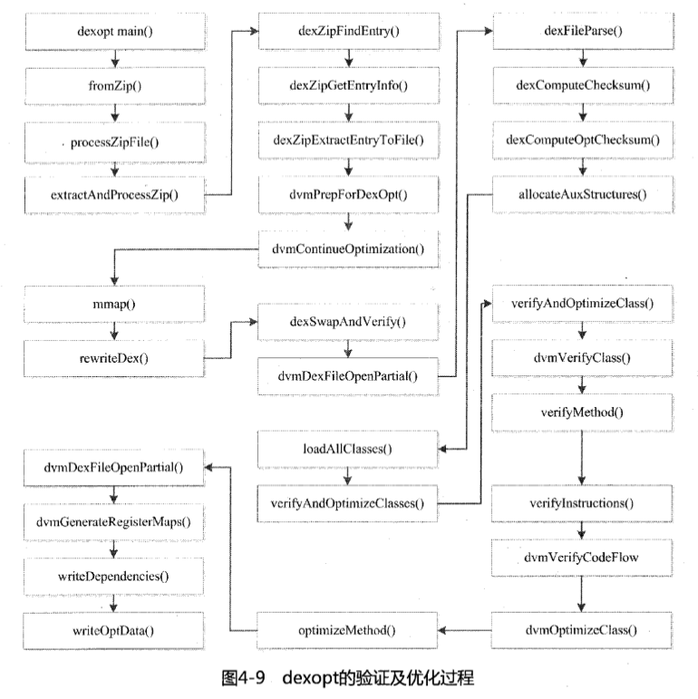


## 第五章 静态分析 Android 程序
#### 快速定位Android程序的关键代码
需重点关注的Application类：

使用 `Application` 时需要在程序中添加一个类继承自 `android.app.Application`，然后重写它的 `OnCreate()` 方法，在该方法中初始化的全局变量可以在 Android 其它组件中访问，一些商业软件将授权验证的代码都转移到该类中。

定位关键代码的六种方法：
- 信息反馈法：先运行目标程序，根据反馈信息作为突破口寻找关键代码。
- 特征函数法：无论程序给出什么反馈信息，终究需要调用 Android SDK 中提供的相关 API 函数。
- 顺序查看法：从软件的启动代码开始，逐行分析，掌握执行流程。
- 代码注入法：手动修改 apk 文件的反汇编代码，加入 Log 输出，配合 LogCat 查看程序执行到特定点时的状态数据。
- 栈跟踪法：输出运行时的栈跟踪信息，然后查看栈上的函数调用序列来理解方法的执行流程。
- Method Profiling（方法剖析）：主要用于热点分析和性能优化。

#### smali文件格式
smali 文件的头3行描述了当前类的信息：
```
.class <访问权限> [修饰关键字] <类名>
.super <父类名>
.source <源文件名>
```
smali 文件中的字段的声明使用 `.field` 指令。字段有静态字段与实例字段两种。

静态字段：
```
# static fields
.field <访问权限> static [修饰关键字] <字段名>:<字段类型>
```
实例字段：
```
# instance fields
.field <访问权限> [修饰关键字] <字段名>:<字段类型>
```
如果一个类中含有方法，那么类中必然会有相关方法的反汇编代码，smali 文件中的方法的声明使用 `.method` 指令。方法有直接方法与虚方法两种。

直接方法：
```
# direct methods
.method <访问权限> [修饰关键字] <方法原型>
    <.locals>
    [.parameter]
    [.prologue]
    [.line]
<代码体>
.end method
```
虚方法：
```
# virtual methods
.method <访问权限> [修饰关键字] <方法原型>
    <.locals>
    [.parameter]
    [.prologue]
    [.line]
<代码体>
.end method
```
如果一个类实现了接口，会在 smali 文件中使用 `.implements` 指令指出。
```
# interfaces
.implements <接口名>
```
如果一个类中使用了注释，会使用 `.annotation` 指令指出。
```
# annotations
.annotation [注释属性] <注释类名>
    [注释字段 = 值]
.end annotation
```
注释的作用范围可以是类、方法或字段。如果注释的作用范围是类，`.annotation` 指令会直接定义在 smali 文件中，如果是方法或字段， `.annotation` 指令则会包含在方法或字段的定义中。

#### Android程序中的类
1. 内部类

内部类分为成员内部类、静态嵌套类、方法内部类、匿名内部类，内部类作为一个独立的类，也会单独生成一个 smali 文件，文件名形式为 `[外部类]$[内部类].smali`。

内部类的初始化分为3个步骤：首先保存外部类的引用到本类的一个 synthetic 字段中，以便内部类的其它方法使用，然后调用内部类的父类的构造函数来初始化父类，最后对内部类自身进行初始化。

2. 监听器

监听器的实质就是接口，在实际编写代码的过程中，多采用匿名内部类的形式来实现。

3. 注解类

Android 系统中设计到注解的包有两个：`dalvik.annotation` 和 `android.annotation`。

4. 自动生成的类

使用 Android SDK 默认生成的工程会自动添加一些类：R类，BuildConfig类，注解类和android-support-v4.jar文件。

#### 阅读反编译的smali代码
1. 循环语句

常见的循环结构有迭代器循环、for循环、while循环、do while循环。

（1）迭代器
```
    Iterator<对象> <对象名> = <方法返回一个对象列表>;
    for(<对象> <对象名> : <对象列表>) {
        [处理单个对象的代码体]
    }
或者：
    Iterator<对象> <迭代器> = <方法返回一个迭代器>;
    while(<迭代器>.hasNext()) {
        <对象> <对象名> = <迭代器>.next();
        [处理单个对象的代码体]
    }
```
特点总结：
- 迭代器循环会调用迭代器的 `hasNext()` 方法检测循环条件是否满足。
- 迭代器循环中调用迭代器的 `next()` 方法获取单个对象。
- 循环中使用 `goto` 指令来控制代码的流程。
- `for` 形式的迭代器循环展开后即为 `while` 形式的迭代器循环。

（2）for循环特点：
- 在进入循环前，需要先初始化循环计数器变量，且它的值需要在循环体中更改。
- 循环条件判断可以是条件跳转指令组成的合法指令。
- 循环中使用 goto 指令来控制代码的流程。

（3）while循环和do-while循环差异不大，其与迭代器循环代码相似。

2. switch分支语句

分为 `packed-switch` 和 `sparse-switch` 两种。

`packed-switch` 指令格式：
```
packed-switch vAA, +BBBBBBBB
```
指令后面的 `+BBBBBBBB` 被指明为一个 `packed-switch-payload` 格式的偏移：
```
struct packed-switch-payload {
    ushort  ident;      // 值固定为0x0100
    ushort  size;       // case数目
    int     first_key;  // 初始case的值
    int[]   targets;    // 每个case相对switch指令处的偏移
};
```
`sparse-switch` 指令格式：
```
sparse-switch vAA, +BBBBBBBB
```
指令后面的 `+BBBBBBBB` 被指明为一个 `sparse-switch-payload` 格式的偏移：
```
struct sparse-switch-payload {
    ushort  ident;      // 值固定为0x0200
    ushort  size;       // case数目
    int[]   keys;       // 每个case的值，顺序从低到高
    int[]   targets;    // 每个case相对switch指令处的偏移
};
```

3. try/catch语句

代码中的 try 语句快使用 `try_start_` 开头的标号注明，以 `try_end_` 开头的标号结束。

使用 `.catch` 指令指定处理到的异常类型和 catch 标号：
```
.catch <异常类型> {<try起始标号> .. <try结束标号>} <catch标号>
```
在处理 Try/Catch 语句时，是通过相关的数据结构来保存异常信息的，在 `DexCode` 结构中有一个 `try_item`，使用 `DexTry` 结构保存了 try 语句的信息：
```
struct DexTry {
    u4  startAddr;      // 起始地址
    u2  insnCount;      // 指令数量
    u2  handlerOff;     // handler的偏移
};
```

## 第六章 基于 Android 的 ARM 汇编语言基础
#### ARM汇编语言程序结构
```
	.arch armv5te                   @处理器架构
	.fpu softvfp                    @协处理器类型
	.eabi_attribute 20, 1           @接口属性
	.eabi_attribute 21, 1
	.eabi_attribute 23, 3
	.eabi_attribute 24, 1
	.eabi_attribute 25, 1
	.eabi_attribute 26, 2
	.eabi_attribute 30, 6
	.eabi_attribute 18, 4
	.file	"hello.c"               @源文件名
	.section	.rodata             @声明只读数据段
	.align	2                       @对齐方式为2^2=4字节
.LC0:                               @标号LC0
	.ascii	"Hello ARM!\000"        @声明字符串
	.text                           @声明代码段
	.align	2                       @对齐方式为2^2=4字节
	.global	main                    @全局符号main
	.type	main, %function         @main类型为函数
main:                               @标号main
	@ args = 0, pretend = 0, frame = 8
	@ frame_needed = 1, uses_anonymous_args = 0
	stmfd	sp!, {fp, lr}           @将fp、lr寄存器压入堆栈
	add	fp, sp, #4                  @初始化fp寄存器，设置栈帧，用于访问局部变量
	sub	sp, sp, #8                  @开辟栈空间
	str	r0, [fp, #-8]               @保存第一个参数
	str	r1, [fp, #-12]              @保存第二个参数
	ldr	r3, .L3                     @取标号.L3处的内容，即"Hello GAS"的偏移地址
.LPIC0:                             @标号.LPIC0
	add	r3, pc, r3                  @计算字符串"Hello GAS"的内存地址
	mov	r0, r3                      @设置参数1
	bl	puts(PLT)                   @调用puts函数
	mov	r3, #0                      @设置r3寄存器的值为0
	mov	r0, r3                      @程序返回结果为0
	sub	sp, fp, #4                  @恢复sp寄存器的值
	ldmfd	sp!, {fp, pc}           @恢复fp寄存器，并将lr寄存器赋值给pc寄存器
.L4:                                @标号.L4
	.align	2                       @对齐方式2^2=4字节
.L3:                                @标号.L3
	.word	.LC0-(.LPIC0+8)         @保存字符串相对"add r3, pc, r3"的偏移量
	.size	main, .-main            @main函数的大小为当前代码行减去main标号
	.ident	"GCC: (GNU) 4.4.3"      @编译器标识
	.section	.note.GNU-stack,"",%progbits    @定义.note.GNU-stack段
```
处理器架构定义：
- `.arch` 指定了ARM处理器架构。
- `.fpu` 指定了协处理器的类型。
- `.eabi_attribute` 指定了一些接口属性。

段定义：`.section` 指令用来定义段，格式为 `.section name [,"flags"[,%type[,flag_specific_arguments]]]`。

两种注释方法：`/*  */` 和 `@`。

标号：`<标号名>:`。

汇编器指令：所有以 `.` 开头的指令都是汇编器指令，汇编器指令是与汇编器相关的，它们不属于 ARM 指令集。

子程序与参数传递：
```
.global     函数名
.type       函数名, %function
函数名:
    <函数体>
```
ARM汇编中规定：R0-R3 这4个寄存器用来传递函数调用的第1到第4个参数，超出的参数通过堆栈来传递。R0 寄存器同时用来存放函数调用的返回值。被调用的函数在返回前无法恢复这些寄存器的内容。

#### ARM处理器寻址方式
ARM 处理器支持9种寻址方式。

1. 立即寻址
```
MOV    R0,    #1234
```

2. 寄存器寻址
```
MOV    R0,    R1
```

3. 寄存器移位寻址

与寄存器寻址类似，但在操作前需要对源寄存器操作数进行移位操作：
- `LSL`：逻辑左移，空出的低位补0。
- `LSR`：逻辑右移，空出的高位补0。
- `ASR`：算术右移，符号位保持不变，如果源操作数为正数，空出的高位补0，否则补1。
- `ROR`：循环右移，移出的低位填入空出的高位。
- `RRX`：带扩展的循环右移，操作数右移一位，空出的高位用C标志的值填充。
```
MOV    R0,    R1,    LSL    #2        @R0=(R1<<2) 即 R0=R1*4
```

4. 寄存器间接寻址

地址码给出的寄存器是操作数的地址指针，所需的操作数保存在寄存器指定地址的存储单元中。
```
LDR    R0,    [R1]        @R1寄存器的数值作为地址，取出地址中的值赋给R0
```

5. 基址寻址

将地址码给出的基址寄存器与偏移量相加，形成操作数的有效地址，所需的操作数保存在有效地址所指向的存储单元中。
```
LDR    R0,    [R1,    #-4]        @R1寄存器的数值减4作为地址，取出地址中的值赋给R0
```

6. 多寄存器寻址

一条指令最多可以完成16个通用寄存器值的传送。
```
LDMIA    R0    {R1,    R2,    R3,    R4}        @R1=[R0], R2=[R0+#4], R3=[R0+#8], R4=[R0+#12]
```

7. 堆栈寻址

堆栈寻址指令有 `LDMFA/STMFA`、`LDMEA/STMEA`、`LDMFD/STMFD`、`LDMED/STMED`。
```
STMFD    SP!,    {R1-R7,    LR}        @将R1~R7，LR入栈
LDMFD    SP!,    {R1-R7,    LR}        @将数据出栈，放入R1~R7，LR寄存器
```
8. 块拷贝寻址

实现连续地址数据从存储器的某一位置拷贝到另一位置。块拷贝指令有 `LDMIA/STMIA`、`LDMDA/STMDA`、`LDMIB/STMIB`、`LDMDB/STMDB`。
```
LDMIA    R0!,    {R1-R3}        @从R0寄存器指向的存储单元中读取3个字到R1~R3寄存器
STMIA    R0!,    {R1-R3}        @存储R1~R3寄存器的内容到R0寄存器指向的存储单元
```

9. 相对寻址

以程序计数器 PC 的当前值为基地址，指令中的地址标号作为偏移量，将两者相加之后得到操作数的有效地址。
```
BL    NEXT
        ......
NEXT:
        ......
```

#### ARM与Thumb指令集
1. 指令格式
```
<opcode>{<cond>}{S}{.W|.N}<Rd>,<Rn>{,<operand2>}
```
- `opcode` 为指令助记符。
- `cond` 为执行条件，取值如下：

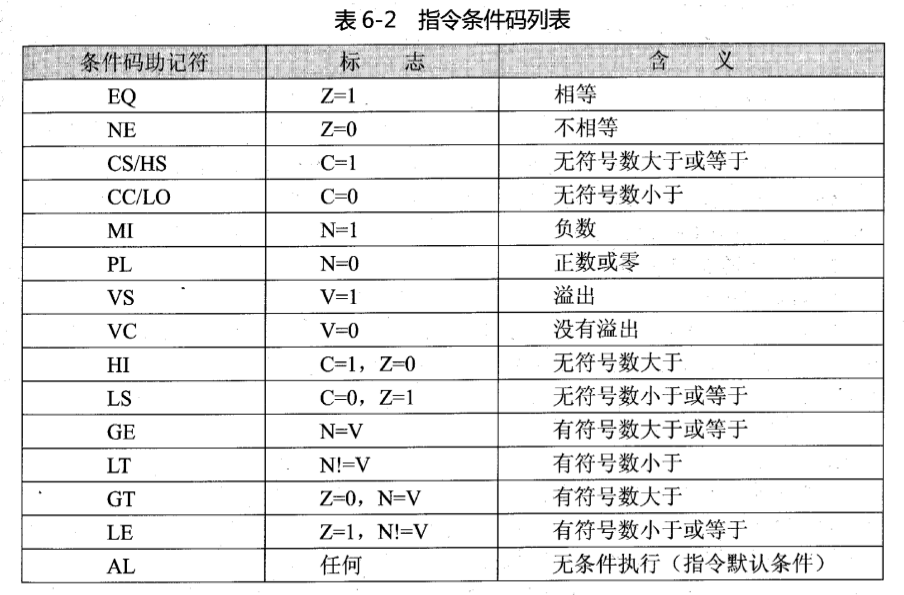

- `S` 指定指令是否影响 CPSR 寄存器的值。
- `.W` 与 `.N` 为指令宽度说明符。
- `Rd` 为目的寄存器。
- `Rn` 为第一个操作数寄存器。
- `operand2` 为第二个操作数。

2. 跳转指令

有两种方式：一种是使用跳转指令直接跳转；另一种是给 PC 寄存器直接赋值实现跳转。

（1）B跳转指令

如果条件 cond 满足，立即跳转到 label 指定的地址处执行。
```
B {cond} label
```
（2）BL带链接的跳转指令

如果条件 cond 满足，首先将当前指令的下一条指令的地址拷贝到R14（即LR）寄存器中，然后跳转到 label 指定的地址处执行。
```
BX {cond} label
```
（3）BX带状态切换的跳转指令

如果条件满足，则处理器会判断 Rm 的位[0]是否为1，如果为1则跳转时自动将 CPSR 寄存器的标志位 T 置位，并将目标地址处的代码解释为 Thumb 代码来执行，即处理器切换至 Thumb 状态；反之，若 Rm 的位[0]为0，则跳转时自动将 CPSR 寄存器的标志 T 复位，并将地址处代码解释为 ARM 代码来执行，即切换到 ARM 状态。

（4）BLX带链接和状态切换的跳转指令

结合了 BL 和 BX 的功能，当条件满足时，除了设置链接寄存器，还根据 Rm 的位[0]来切换处理器状态。
```
BLX {cond} Rm
```

3. 存储器访问指令

（1）LDR：用于从存储器中加载数据到寄存器中。
```
LDR {type} {cond} Rd, label
LDRD {cond} Rd, Rd2, label
```
`type` 指明了操作数数据的大小：

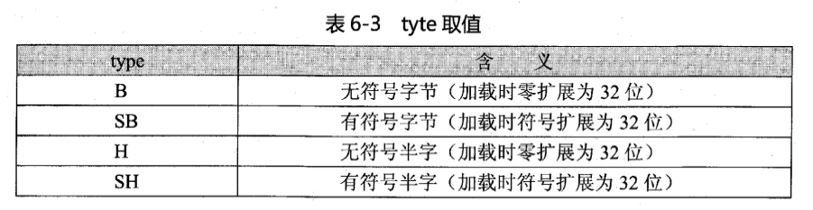

- `cond` 为执行条件。
- `Rd` 为要加载的寄存器。
- `label` 为要读取的内存地址：直接偏移量；寄存器偏移；相对PC。
- `LDRD` 依次加载双字的数据，将数据加载到 Rd 与 Rd2 寄存器中。

（2）STR：用于存储数据到指定地址的存储单元中。
```
STR {type} {cond} Rd, label
STRD {cond} Rd, Rd2, label
```
（3）LDM：从指定的存储单元加载多个数据到一个寄存器列表。
```
LDM {addr_mode} {cond} Rn{!} reglist
```
`addr_mode` 取值如下：

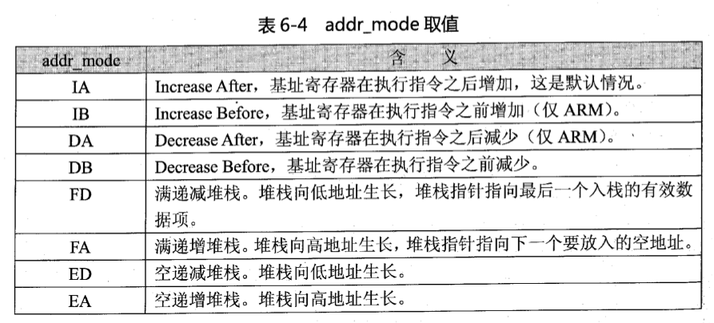

- `cond`为执行条件。
- `Rn` 为基址寄存器，用于存储初始地址。
- `！` 为可选后缀，如果有，则最终地址将写回到Rn寄存器中。
- `reglist` 为用于存储数据的寄存器列表，用大括号括起来。

（4）STM：将一个寄存器列表的数据存储到指定的存储单元。
```
STM {addr_mode} {cond} Rn{!} reglist
```

（5）PUSH：将寄存器推入满递减堆栈。
```
PUSH {cond} reglist
```

（6）POP：从满递减堆栈中弹出数据到寄存器。
```
POP {cond} reglist
```

（7）SWP：用于寄存器与存储器之间的数据交换。
```
SWP {B} {cond} Rd, Rm, [Rn]
```
- `B` 是可选字节，若有，则交互字节，否则交换32位的字。
- `cond` 为执行条件。
- `Rd` 为要从寄存器中加载数据的寄存器。
- `Rm` 为写入数据到存储器的寄存器。
- `Rn` 为需要进行数据交换的存储器地址。

4. 数据处理指令

数据处理指令包括数据传送指令、算术运算指令、逻辑运算指令和比较指令4类。数据处理指令主要对寄存器间的数据进行处理。所有的数据处理指令均可使用 S 后缀，来决定是否影响状态标志，比较指令不需要 S 后缀，它们会直接影响状态标志。

（1）数据传送指令：用于寄存器间的数据传送。

`MOV`：将8位的立即数或寄存器的内容传送到目标寄存器中。
```
MOV {cond} {S} Rd, operand2
```
`MVN`：数据非传送指令。将8位的立即数或寄存器按位取反后传送到目标寄存器中。
```
MVN {cond} {S} Rd, operand2
```
（2）算术运算指令：完成加减乘除等算术运算。

`ADD`：加法指令。将 Rn 寄存器与 operand2 的值相加，结果保存到 Rd 寄存器。
```
ADD {cond} {S} Rn, operand2
```
`ADC`：带进位加法指令。将 Rn 寄存器与 operand2 的值相加，再加上 CPSR 寄存器的 C 条件标志位的值，最后结果保存到 Rd 寄存器。
```
ADC {cond} {S} Rd, Rn, operand2
```
`SUB`：减法指令。用 Rn 寄存器减去 operand2 的值，结果保存到 Rd 寄存器中。
```
SUB {cond} {S} Rd, Rn, operand2
```
`RSB`：逆向减法指令。用 operand2 减去 Rn 寄存器，结果保存到 Rd 寄存器中。
```
RSB {cond} {S} Rd, Rn, operand2
```
`SBC`：带进位减法指令。用 Rn 寄存器减去 operand2 的值，再减去 CPSR 寄存器的 C 条件标志位的值，最后将结果保存到 Rd 寄存器。
```
SBC {cond} {S} Rd, Rn, operand2
```
`RSC`：带进位逆向减法指令。用 operand2 减去 Rn 寄存器，再减去 CPSR 寄存器的 C 条件标志位的值，祖侯将结果保存到 Rd 寄存器。
```
RSC {cond} {S} Rd, Rn, operand2
```
`MUL`：32位乘法指令。将 Rm 寄存器与 Rn 寄存器的值相乘，结果的低32位保存到 Rd 寄存器中。
```
MUL {cond} {S} Rd, Rm, Rn
```
`MLS`：将 Rm 寄存器和 Rn 寄存器中的值相乘，然后从 Ra 寄存器的值中减去乘积，最后将所得结果的低32位存入 Rd 存入 Rd 寄存器中。
```
MLS {cond} {S} Rd, Rm, Rn, Ra
```
`MLA`：将 Rm 寄存器和 Rn 寄存器中的值相乘，然后将乘积与 Ra 寄存器中的值相加，最后将结果的低32位存入 Rd 寄存器中。
```
MLA R0, R1, R2, R3
```
`UMULL`：将 Rm 寄存器和 Rn 寄存器的值作为无符号数相乘，然后将结果的低32位存入 RdLo 寄存器。
```
UMULL R0, R1, R2, R3
```
`UMLAL`：将 Rm 寄存器和 Rn 寄存器的值作为无符号数相乘，然后将64位的结果与 RdHi、RdLo 组成的64位数相乘，结果的低32位存入 RdLo 寄存器，高32位存入 RdHi 寄存器。
```
UMLAL {cond} {S} RdLo, RdHi, Rm, Rn
```
`SMULL`：将 Rm 寄存器和 Rn 寄存器的值作为有符号数相乘，然后将结果的低32位存入 RdLo 寄存器，高32位存入 RdHi 寄存器。
```
SMULL {cond} {S} RdLo, RdHi, Rm, Rn
```
`SMLAL`：将 Rm 寄存器和 Rn 寄存器的值作为有符号数相乘，然后将64位的结果与 RdHi、RdLo 组成的64位数相乘，结果的低32位存入 RdLo 寄存器，高32位存入 RdHi 寄存器。
```
SMLAL R0, R1, R2, R3
```
`SMLAD`：将 Rm 寄存器的低半字和 Rn 寄存器的低半字相乘，然后将 Rm 寄存器的高半字和 Rn 的高半字相乘，最后将两个乘积与 Ra 寄存器的值相加并存入 Rd 寄存器。
```
SMLAD {cond} {S} Rd, Rm, Rn, Ra
```
`SMLSD`：将 Rm 寄存器的低半字和 Rn 寄存器的低半字相乘，然后将 Rm 寄存器的高半字和 Rn 的高半字相乘，接着使用第一个乘积减去第二个乘积，最后将所得的差值与 Ra 寄存器的值相加并存入 Rd 寄存器。
```
SMLAD {cond} {S} Rd, Rm, Rn, Ra
```
`SDIV`：有符号数除法指令。
```
SDIV R0, R1, R2
```
`UDIV`：无符号数除法指令。
```
UDIV R0, R1, R2
```
`ASR`：算术右移指令。将 Rm 寄存器算术右移 operand2 位，并使用符号位填充空位，移位结果保存到 Rd 寄存器中。
```
ASR {cond} {S} Rd, Rm, operand2
```

（3）逻辑运算指令：完成与、或、异或、移位等逻辑运算操作。

`AND`：逻辑与指令。
```
AND R0, R0, #1
```
`ORR`：逻辑或指令。
```
ORR {cond} {S} Rd, Rn, operand2
```
`EOR`：异或指令。
```
EOR {cond} {S} Rd, Rn, operand2
```
`BIC`：位清除指令。将 operand2 的值取反，将结果与 Rn 寄存器的值相“与”并保存到 Rd 寄存器中。
```
BIC {cond} {S} Rd, Rm, operand2
```
`LSL`：逻辑左移指令。将 Rm 寄存器逻辑左移 operand2 位，并将空位清０，移位结果保存到 Rd 寄存器中。
```
LSL {cond} {S} Rd, Rm, operand2
```
`LSR`：逻辑右移指令。将 Rm 寄存器逻辑右移 operand2 位，并将空位清０，移位结果保存到 Rd 寄存器中。
```
LSR {cond} {S} Rd, Rm, operand2
```
`ROR`：循环右移指令。将 Rm 寄存器逻辑右移 operand2 位，寄存器右边移出的位移回到左边，移位结果保存到 Rd 寄存器中。
```
ROR {cond} {S} Rd, Rm, operand2
```
`RRX`：带扩展的循环右移指令。将 Rm 寄存器循环右移１位，寄存器最高位用标志位ｉｄ值填充，移位结果保存到 Rd 寄存器中。
```
RRX {cond} {S} Rd, Rm
```

（4）比较指令：用于比较两个操作数之间的值。

`CMP`：使用 Rn 寄存器减去 operand2 的值，这与 SUBS 指令功能相同，但 CMP 指令不保存技术结果。
```
CMP {cond} {S} Rn, operand2
```
`CMN`：将 operand2 的值加到 Rn 寄存器上，这与 ADDS 指令功能相同，但 CMN 指令不保存计算结果。
```
CMN R0, R1
```
`TST`：位测试指令。将 Rn 寄存器的值和 operand2 的值进行与运算，这与 ANDS 指令功能相同，但 TST 指令不保存计算结果。
```
TST {cond} {S} Rn, operand2
```
`TEQ`：将 Rn 寄存器的值和 operand2 的值进行异或运算，这与 EORS 指令功能相同，但不保存计算结果。
```
TSQ {cond} {S} Rn, operand2
```

5. 其它指令

`SWI`：软中断指令。用于产生软中断，实现从用户模式到管理模式的切换。
```
SWI {cond}, immed_24
```
`NOP`：空操作指令。用于空操作或字节对齐。

`MRS`：读状态寄存器指令。
```
MRS Rd, psr
```
`MSR`：写状态寄存器指令。
```
MSR Rd, psr_fields, operand2
```


## 第七章 Android NDK 程序逆向分析
编译生成原生程序的三种方法：使用 gcc 编译器手动编译；使用 ndk-build 工具手动编译；使用 Eclipse 创建工程并自动编译。

#### 原生程序的启动流程分析
原生程序有静态链接和动态链接两种，其中动态链接又分为动态链接程序和动态链接库。

静态链接需要在 gcc 编译器的命令行参数中指定 `-Bstatic`，在生成可执行程序时会链接 `crtbegin_static.o` 与 `crtend_android.o` 目标文件，`crtbegin_static.o` 文件中定义了静态链接程序的启动函数 `_start`，这个函数是程序启动时执行的第一个函数。

动态链接需要在 gcc 编译器的命令行参数中指定 `-Bdynamic`，在生成可执行程序时会链接 `crtbegin_dynamic.o` 与 `crtend_android.o` 目标文件，并且动态链接时需要通过 `--dynamic-linker` 参数指定程序的加载器，默认为 `/system/bin/linker`。在生成的可执行程序中，每个程序都会包含一个 `.interp` 段来存入程序的加载器。动态链接程序的启动程序 `_start` 位于 `crtbegin_dynamic.o` 文件中。

动态链接还包括动态链接库，在生成动态链接库时会链接 `crtbegin_so.o` 和 `crtend_so.o` 目标文件，并且传入 `armelf_linux_eabi.xsc` 链接脚本。

#### 原生文件格式

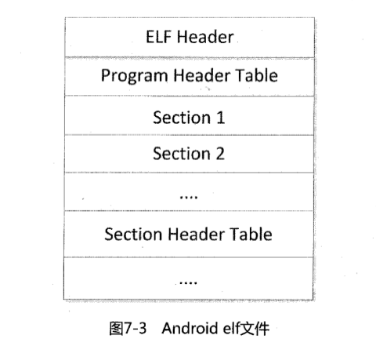

#### 原生C程序逆向分析
1. for循环语句反汇编代码的特点
```
#include <stdio.h>

int nums[5] = {1, 2, 3, 4, 5};

int for1(int n){	//普通for循环
	int i = 0;
	int s = 0;
	for (i = 0; i < n; i++){
		s += i * 2;
	}
	return s;
}

int for2(int n){	//访问全局数组
	int i = 0;
	int s = 0;
	for (i = 0; i < n; i++){
		s += i * i + nums[n-1];
	}
	return s;
}

int main(int argc, char* argv[]){
	printf("for1:%d\n", for1(5));
	printf("for2:%d\n", for2(5));
	return 0;
}
```


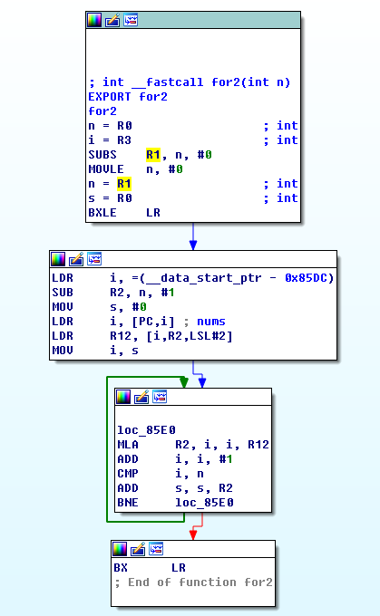


2. if...else分支语句反汇编代码的特点
```
#include <stdio.h>

void if1(int n){	//if else语句
	if(n < 10){
		printf("the number less than 10\n");
	} else {
		printf("the number greater than or equal to 10\n");
	}
}

void if2(int n){		//多重if else语句
	if(n < 16){
		printf("he is a boy\n");
	} else if(n < 30){
		printf("he is a young man\n");
	} else if(n < 45){
		printf("he is a strong man\n");
	} else{
		printf("he is an old man\n");
	}
}

int main(int argc, char* argv[]){
	if1(5);
	if2(35);
	return 0;
}
```

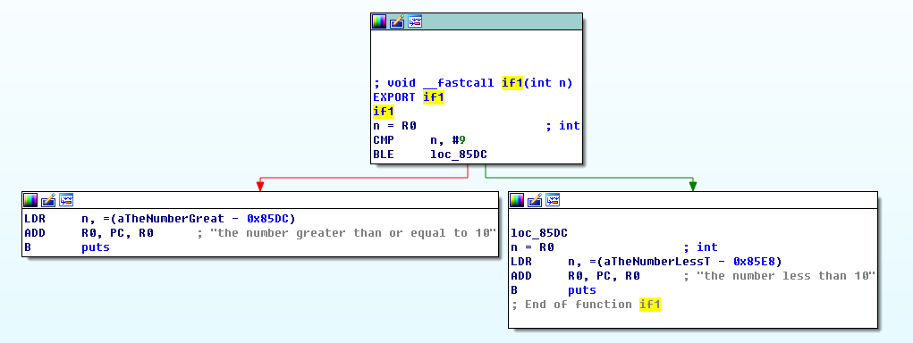

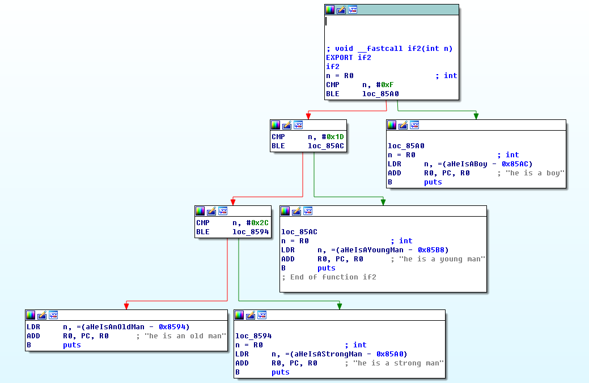

3. while循环语句反汇编代码的特点
```
#include <stdio.h>

int dowhile(int n){
	int i = 1;
	int s = 0;
	do{
		s += i;
	}while(i++ < n);
	return s;
}

int whiledo(int n){
	int i = 1;
	int s = 0;
	while(i <= n){
		s += i++;
	}
	return s;
}

int main(int argc, char* argv[]){
	printf("dowhile:%d\n", dowhile(100));
	printf("while:%d\n", whiledo(100));
	return 0;
}
```

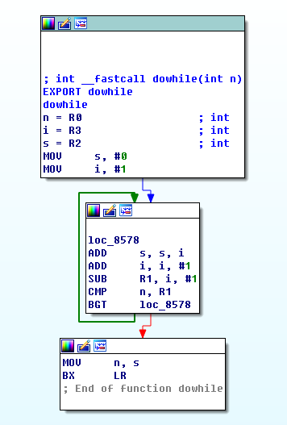

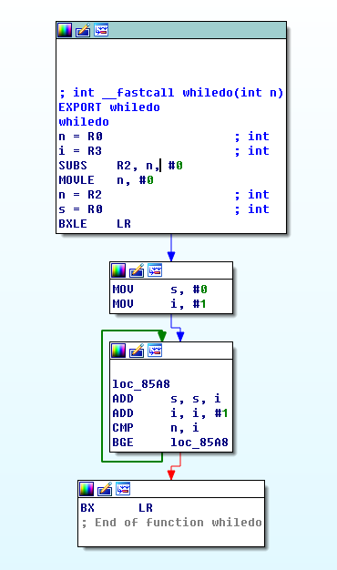

4. switch分支语句反汇编代码的特点
```
#include <stdio.h>

int switch1(int a, int b, int i){
	switch (i){
	case 1:
		return a + b;
		break;
	case 2:
		return a - b;
		break;
	case 3:
		return a * b;
		break;
	case 4:
		return a / b;
		break;
	default:
		return a + b;
		break;
	}
}

int main(int argc, char* argv[]){
	printf("switch1:%d\n", switch1(3, 5, 3));
	return 0;
}
```

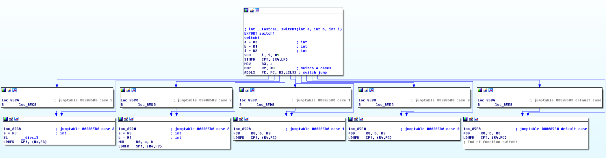

#### 原生C++程序逆向分析
1. C++类的逆向

逆向C++代码主要是逆向C++的类，宏观上，我们可以将C++的类理解为C语言中的结构体，每一个成员变量就是一个结构字段，每一个成员函数的代码都被优化到了类的外部，它们不占据存储空间。

2. Android NDK对C++特性的支持

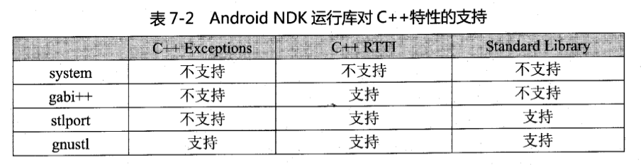


## 第八章 动态调试Android程序
软件调试可分为源码级调试和汇编级调试。

#### DDMS
DDMS全名 Dalvik虚拟机调试监控服务。提供了设备截屏、查看运行的线程信息、文件浏览、LogCat、Method Profiling、广播状态信息、模拟电话呼叫、接收SMS、虚拟地理坐标等功能。

`android.util.Log` 提供了 `Log.v()`、`Log.d()`、`Log.i()`、`Log.w()` 和 `Log.e()` 等5个调试信息输出方法。

#### 定位关键代码
1. 代码注入法

首先反编译 Android 程序，然后在反汇编出的 smali 文件中添加 Log 调用的代码，最后重新打包程序运行来查看输出结果。

2. 栈跟踪法

同样输入代码注入，它主要是手动向反汇编后的 smali 文件中加入栈跟踪信息输出的代码。此方法只需要知道大概的代码注入点，并且反馈信息更详细。

3. Method Profiling

DDMS提供了此调试方法，可在执行程序时记录下每个被调试的 API 名称。

在 `android.os.Debug` 类中，提供了 `startMethodTracing()` 和 `stopMethodTracing()` 两个方法来开启和关闭 Method Profiling。

#### AndBug
使用 AndBug 调试 Android 程序需要先执行被调试的程序，然后使用 AndBug 附加到该程序进程上进行调试。

#### IDA Pro
调试一般的 Android 原生程序可以采用远程运行和远程附加两种方式来调试。

#### gdb和gdbserver
官方自带的 gdb 都是动态编译的，不包含符号信息，而调试时需要设置 Android 系统动态链接库的符号加载路径，所以我们需要手动编译一个静态的 gdb。
