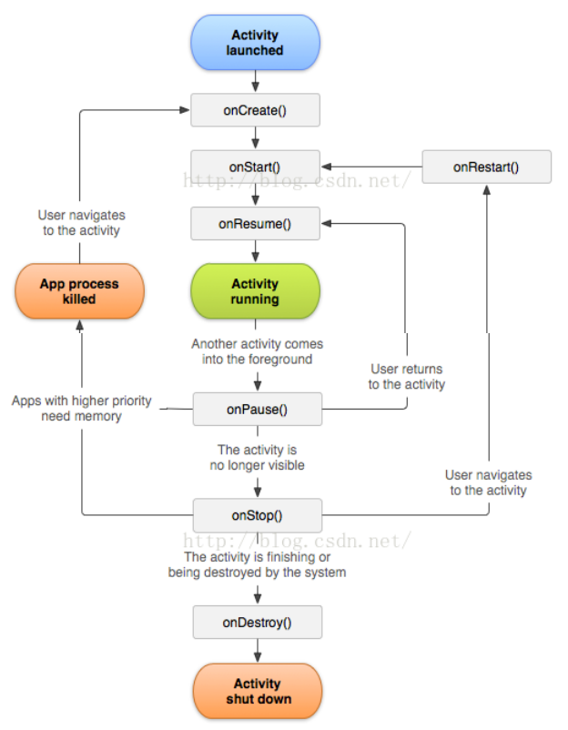
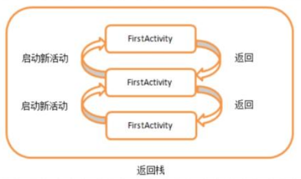
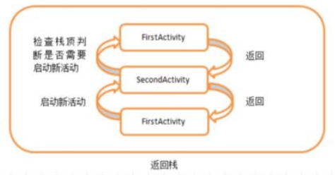
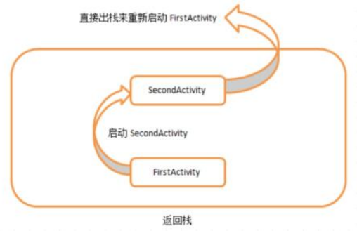
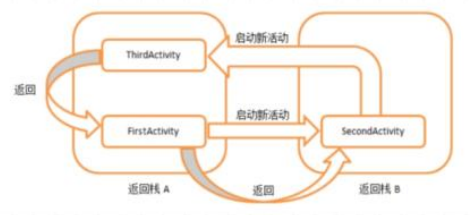
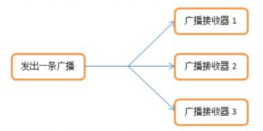
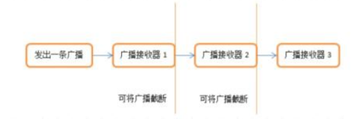
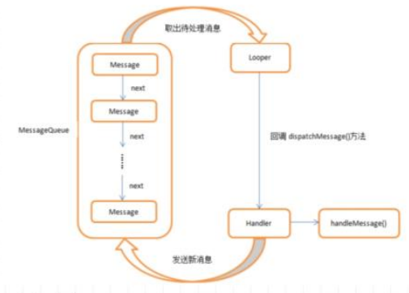
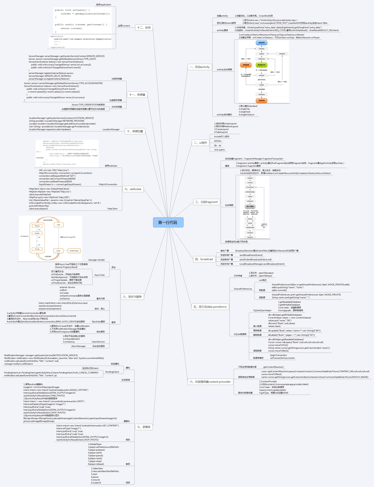

# 第一行代码--Android


## 第一章 Activity
#### 一： 创建 Activity ：

1. 创建活动

任何活动都应该重写 `Activity` 的 `onCreate()` 方法。
```java
@Override
protected void onCreate(Bundle savedInstanceState) {

    super.onCreate(savedInstanceState);
}
```

2. 创建和加载布局
```java
@Override
protected void onCreate(Bundle savedInstanceState) {
    super.onCreate(savedInstanceState);

    requestWindowFeature(Window.FEATURE_NO_TITLE);     //隐藏标题栏，必须在setContentVIEW()之前执行

    setContentView(R.layout.first_layout);
}
```

3. 在 AndroidManifest 文件中注册

注册声明放在 `<application>` 标签内的 `<activity>`中，如果加入下面两句声明，则为主活动：
```java
<activity
    <intent-filter>
        <action android:name="android.intent.action.MAIN" />
        <category android:name="android.intent.category.LAUNCHER" />
    </intent-filter>
</activity>
```

4. 销毁活动
```java
finish();
```

#### 二： 显式/隐式 Intent 使用
1.显式 `Intent`

`Intent` 有多个构造函数重载，其中一个是 `Intent(Context packageContext, Class<?>cls)`。第一个参数 `Content` 要求提供一个启动活动的上下文，第二个参数 `Class` 指定想要启动的目标活动。
```java
Intent intent = new Intent(FirstActivity.this, SecondActivity.class);
startActivity(intent);
```

2.隐式 `Intent`

指定 `action` 和 `category` 等信息，由系统分析去找出合适的活动。
```java
//先配置<intent-filter>的内容
<intent-filter>
    <action android:name="com.example.activitytest.ACTION_START" />
    <category android:name="android.intent.category.DEFAULT"     //默认category />
</intent-filter>
```
```java
//创建Intent
Intent intent = new Intent("com.example.activitytest_ACTION_START");
startActivity(intent);
```
每个 `Intent` 中只能指定一个 `action`，但能指定多个 `category`，
```java
//添加一个category
intent.addCategory("com.example.activitytest.MY_CATEGORY");
//然后在<intent-filter>中声明
<category android:name="com.example.activitytest.MY_CATEGORY" />
```
使用隐式 `Intent` 不仅可以启动程序内的活动，还可以启动其他程序的活动。

#### 三： activity通信

1. 向下一个活动传递数据

`Intent` 可以在启动活动的时候传递数据，`Intent` 中提供了一系列 `putExtra()` 方法的重载，可以把传递的数据暂存在 `Intent` 中，启动了另一个活动后，再把这些数据取出来。
```java
String data = "Hello SecondActivity";
Intent intent = new Intent(FirstActivity.this, SecondActivity.class);
intent.putExtra("extra_data", data);
startActivity(intent);
```

通过 `putExtra()` 方法传递字符串，第一个参数是键，用于后面从 `Intent` 中取值，第二个参数才是真正要传递的数据，通过 `getIntent()` 方法获取到用于启动 `SecondActivity` 的 `Intent`，然后调用 `getStringExtra()` 方法。
```java
Intent intent = getIntent();
String data = intent.getStringExtra("extra_data");
```

2. 返回数据给上一个活动

用 `startActivityForResult()`启动活动，此方法在活动销毁的时候返回一个结果给上一个活动，第一个参数 `Intent`，第二个参数是请求码，用于在之后的回调中判断数据的来源。
```java
//在FirstActivity中
Intent intent = new Intent(FirstActivity.this, SecondActivity.class);
startActivityForResult(intent, 1);
```
```java
//在SecondActivity中
Intent intent = new Intent();
intent.putExtra("data_return", "Hello FirstActivity");
setResult(RESULT_OK, intent);
finish();
```
`setResult()` 第一个参数用于向上一个活动返回处理结果，一般只使用 `RESULT_OK` 或 `RESULT_CANCELED`，第二个参数把带有数据的 `Intent` 传递回去，然后调用 `finish()` 方法来销毁当前活动。由于我们使用 `startActivityForResult()` 方法启动活动，在活动销毁之后会调用上一个活动的 `onActivityResult()` 方法，重写方法：
```java
//在FirstActivity中重写onActivityResult()方法
@Override
protected void onActivityResult(int requestCode, int resultCode, Intent data) {
    switch (requestCode) {
    case 1:
        if (resultCode == RESULT_OK) {
            String returnedData = data.getStringExtra("data_return");
        }
        break;
    default;
    }
}
```
`onActivityResult()` 方法有三个参数，第一个参数 `requestCode`，即请求码，第二个参数 `resultCode`，即我们在返回数据时传入的处理结果，第三个参数 `data`，即携带着返回数据的 `Intent`。

如果用户通过 `Back` 键返回上一个活动，则可以通过重写 `onBackPressed()` 方法来解决。
```java
@Override
public void onBackPressed() {
    Intent intent = new Intent();
    intent.putExtra("data_return", "Hello FirstActivity");
    setResult(RESULT_OK, intent);
    finish();
}
```

#### 四： Activity的生命周期

Android 使用任务 (Task) 来管理活动，也称作返回栈 (Back Stack)。

1. 四种活动状态：

运行状态，暂停状态，停止状态，销毁状态。

2. 七个回调方法：

onCreate()，onStart()，onResume()，onPause()，onStop()，onDestroy()，onRestart()。

可以将活动分为三种生存期：
- 完整生存期：onCreate()和 onDestroy() 之间。
- 可见生存期：onStart() 和 onStop() 之间。
- 前台生存期：onResume() 和 onPause() 之间。



#### 五： Activity防回收

一个进入停止状态的活动，由于系统内存不足，被回收掉了，这时按下 `Back` 键返回这个活动时，不会执行 `onRestart()` 方法，而是执行 `onCreate()` 方法，所以我们要事先保持好活动的临时数据。`onSacedInstanceState()` 回调方法会保证在活动被回收之前调用，该方法携带一个 `Bundle` 类型的参数，`Bundle` 提供了一系列方法用于保存数据，比如 `putString()` 方法保存字符串，第一个参数是键，用于后面从 `Bundle` 中取值，第二个参数是真正要保存的内容。
```java
@Override
protected void onSavedInstanceState(Bundle outState) {
    super.onSavedInstanceState(outState);
    String tempData = "Something you just typed";
    outState.putString("data_key", tempData);
}
```
`onCreate()` 方法也有一个 `Bundle` 类型的参数，可以通过相应的取值方法将数据取出来。
```java
if (savedInstanceState != null) {
    String tempData = savedInstanceState.getString("data_key");
}
```

#### 六： Activity的启动模式

1. standard　（默认模式）

每当启动一个新的活动，它就会在返回栈中入栈，并处于栈顶的位置，系统不会在乎这个活动是否已经在返回栈中存在，每次启动都会创建该活动的一个新的实例。



2. single Top

该模式在启动活动时，如果发现返回栈的栈顶已经是该活动，则认为可以直接使用它，不会再创建新的活动实例。很好地解决了重复创建栈顶活动的问题。



3. single Task

该模式在启动时，系统首先会在返回栈中检查是否存在该活动的实例，如果发现已经存在则直接使用该实例，并把在这个活动之上的所有活动统统出栈，如果没有发现就会创建一个新的活动实例。



4. singleInstance

该模式的活动会启用一个新的返回栈来管理这个活动。可以解决共享活动实例问题。



#### 七： 活动集合

1. 随时随地退出程序

创建一个 `BaseActivity`，放一个活动集合实例，统一管理活动添加和销毁。
```java
//新建一个ActivityCollector类作为活动管理器
Public class ActivityCollector {
    public static List<Activity> activities = new ArrayList<Activity>();
    public static void addActivity(Activity activity) {
        activities.add(activity);
    }
    public static void removeActivity(Activity activity) {
        activities.remove(activity);
    }
    public static void finishAll() {
        for (Activity activity : activities) {
            if (!activity.isFinishing()) {
                activity.finish();
            }
        }
    }
}
```
```java
//修改BaseActivity
public class BaseActivity extends Activity {
    @Override
    protected void onCreate(Bundle savedInstanceState) {
        super.onCreate(savedInstanceState);
        ActivityCollector.addActivity(this);
    }
    @Override
    protected void onDestroy() {
        super.onDestroy();
        ActivityCollector.removeActivity(this);
    }
}
```

2. 启动活动的最佳写法

本例添加一个 `actionStart()` 方法。在实践中养成良好习惯，给每个活动都添加类似的启动方法。
```java
public static void actionStart(Context context, String data1, String data2) {
    Intent intent = new Intent(context, SecondActivity.class);
    intent.putExtra("param1", data1);
    intent.putExtra("param2", data2);
    context.startActivity(intent);
}
```

## 第二章 UI控件

#### 常见控件

- TextView
- Button
- EditText
- ImageView
- ProgressBar
- AlertDialog
- ProgressDialog

#### 四种基本布局

- LinearLayout：控件在线性方向上依次排列。
- RelativeLayout：通过相对定位的方式让控件出现在现在布局的任何位置。
- FrameLayout：没有任何的定位方式，所有控件都摆放在布局的左上角。
- TableLayout：使用表格的方式来排列控件。

#### 自定义控件

所有控件都直接或简介继承自 `View`，所有布局都直接或简介继承自 `ViewGroup`。


#### ListView

数据列表控件。

使用内部类 `ViewHolder` 对控件实例缓存，`convertView` 判断，`setTag()`方法调用。

#### 单位和尺寸

- `dp` 是密度无关像素的意思，和 `px` 相比，它在不同密度的屏幕中的显示比例将保持一致。
- `sp` 是可伸缩像素的意思，解决了文字大小的适配问题。


## 第三章 碎片（Fragment）

#### 动态添加碎片

1. 创建待添加的碎片实例。
2. 获取到 `FragmentManager`，在活动中可以直接调用 `getFragmentManager()` 方法得到。
3. 开启一个事务，通过调用 `beginTransaction()` 方法开启。
4. 向容器内加入碎片，一般使用 `replace()` 方法实现，需要传入容器的 `id` 和待添加的碎片实例。
5. 提交事务，调用 `commit()` 方法来实现。

#### 在碎片中模拟返回栈

`FragmentTransaction` 中提供了一个 `addToBackStack()` 方法，可以将一个事务添加到返回栈中。
```java
AnotherRightFrament fragment = new AnotherRightFragment();
FragmentManager fragmentManager = getFragmentManager();
FragmentTransaction transaction = fragmentManager.beginTransaction();
transaction.replace(R.id.right_layout, fragment);
transaction.addToBackStack(null);        //接收一个名字用于描述返回栈的状态，一般传入null
transaction.commit();
```

#### 碎片和活动之间进行通信

碎片和活动都是各自在于一个独立的类当中，它们之间的通信合一使用 `FragmentManager` 提供的一个类似于 `findViewById()` 的方法，专门用于从布局文件中获取碎片的实例。
```java
RightFragment rightFragment = (RightFragment) getFragmentManager().findFragmentById(R.id.right_fragment);
```
在碎片中可以通过调用 `getActivity()` 方法来得到和当前碎片相关联的活动实例：
```java
MainActivity activity = (MainActivity) getActivity();
```

#### 碎片的生命周期

1. 四种状态

运行状态，暂停状态，停止状态，销毁状态。

2. 附加回调方法
- onAttach()：当碎片和活动建立关联的时候使用。
- onCreateView()：为碎片创建视图（加载布局）时调用。
- onActivityCreated()：确保与碎片相关联的活动一定已经创建完毕的时候调用。
- onDestroyView()：当与碎片关联的视图被移除的时候调用。
- onDetach()：当碎片和活动解除关联的时候调用。


与 `Activity` 的生命周期对比：


## 四： 广播接收器（Broadcast Receiver）

#### 广播机制简介

1. 有序广播（Normal broadcasts）：完全异步执行的广播，在广播发出之后，所有的广播接收器都会在同一时刻接收到这条广播消息，没有任何先后顺序，也无法被截断。



2. 有序广播（Ordered broadcasts）：同步执行的广播，在广播发出后，同一时刻只有一个广播接收器能够收到这条广播消息，当这个广播接收器中的逻辑执行完毕后，广播才会继续传递。此时是有先后顺序的，优先级高的广播接收器先收到，并且前面的广播接收器可以截断正在传播的广播，这样后面的就无法收到。



#### 接受系统广播

两种注册方法：在代码中注册，在 `AndroidManifest.xml` 中注册。

如何创建：新建一个类，让它继承自 `BroadcastReceiver`，并重写父类的 `onReceive()` 方法。

1. 动态注册监听

启动程序才能注册，注意要取消注册。

例子，编写一个监听网络变化的程序：
```java
public class MAinActivity extends Activity {
    private IntentFilter intentFilter;
    private NetworkChangeReceiver networkChangeReceiver;
    @Override
    protected void onCreate(Bundle sacedInstanceState) {
        super.onCreate(savedInstanceState);
        setContentView(R.layout.activity_main);
        intentFilter = new IntentFilter();
        intentFilter.addAction("android.net.conn.CONNECTIVITY_CHANGE");        //在此添加想要监听的广播
        networkChangeReceiver = new NetworkChangeReceiver();
        registerReceiver(networkChangeReceiver, intentFilter);
    }
    @Override
    protected void onDestroy() {
        super.onDestroy();
        unregisterReceiver(networkChangeReceiver);        //动态注册的广播一定要取消注册
    }
    class NetworkChangeReceiver extends BroadcastReceiver {
        @Override
        public void onReceiver(Context context, Intent intent) {
            Toast.makeText(context, "network changes", Toast.LENGTH_SHORT).show();
        }
    }
}
```
特别注意，Android 系统为了保证应用程序的安全性做了规定，如果程序需要访问一些系统的关键性信息，必须在配置文件中声明权限。
```java
//在AndroidManifest.xml中加入权限
<uses-permission android:name="android.permission.ACCESS_NETWORK_STATE" />
```

2. 静态注册实现开机启动

程序未启动就能注册，系统级别，不需要手动取消注册。

这里我们让程序接收一条开机广播，当收到这条广播就可以在 `onReceive()` 方法里执行相应的逻辑，从而实现开机启动的功能。新建一个 `BootCompleteReceiver` 继承自 `BroadcastReceiver`，
```java
public class BootCompleteReceiver extends BroadcastReceiver {
    @Override
    public void onReceive(Context context, Intent intent) {
        Toast.makeText(context, "Boot Complete", Toast.LENGTH_LONG).show();
    }
}
```
可以看到，我们不再使用内部类的方式，然后需要在 `AndroidManifest.xml` 中将这个广播接收器的类名注册进去。
```java
<uses-permission android:name="android.permission.PECEIVE_BOOT_COMPLETED" />        //声明权限
<receiver android:name=".BootCompleteReceiver" >
    <intent-filter>
        <action android:name="android.intent.action.BOOT_COMPLETED" />
    </intent-filter>
</receiver>
```

#### 使用本地广播

这个机制发出的广播只能在应用程序内部传递，并且广播接收器也只能接收来自本应用程序发出的广播。

使用 `LocalBroadcastManager` 进行管理，并提供发送广播和注册广播接收器的方法。

注意，本地广播是无法通过静态注册的方式接收的。


## 第四章 数据持久化

Android 主要提供了三种方式，即文件存储，SharedPreference 存储，数据库存储。

#### 文件存储

1. 写文件

`Context` 类中提供了一个 `openFileOutput()` 方法，用于将数据存储到指定文件中，第一个参数是文件名，不包含路径，，第二个参数是文件的操作模式，主要有 `MODE_PRIVATE` 和 `MODE_APPEND`。`openFileOutput()` 方法返回一个 `FileOutputStream` 对象，然后再借助它构建出一个 `OutputStreamWriter` 对象，接着再使用 `OutputStreamWriter` 构建出一个 `BufferedWriter` 对象，就可以通过 `BufferedWriter` 来将文本内容写入到文件中。
```java
out = openFileOutput("data", Context.MODE_PRIVATE);
writer = new BufferedWriter(new OutputStreamWriter(out));
writer.write(data);
```

2. 读文件

`Context` 类中提供一个 `openFileInput()` 方法，用于从文件中读取数据。接收一个参数，即要读取的文件名，返回一个 `FileInputStream` 对象。`openFileInput()` 方法获取一个 `FileInputStream` 对象，然后借助它构造一个 `InputStreamReader` 对象，再使用 `InputStreamReader` 构造一个 `BufferedReader` 对象，就可以通过 `BufferedReader` 一行行读取，把文件内容读取并存放在 `StringBuilder` 对象。
```java
in = openFileInput("data");
reader = new BufferedReader(new InputStreamReader(in));
String line = "";
while ((line = reader.readLine()) != null) {
    content.append(line);
}
```

#### SharedPreferences存储

`SharedPreferences` 使用键值对的方式来存储数据。（XML格式）

1. 将数据存储到SharedPreferences中

要使用 `SharedPreferences` 来存储数据，首先要获取到 `SharedPreferences` 对象。有三种方式用于得到 `SharedPreferences` 对象。

- Context类中的 `getSharedPreferences()` 方法

接收两个参数，第一个参数用于指定 `SharedPreferences` 文件的名称，如果指定的文件不存在则会创建一个，第二个参数用于指定操作模式，主要有 `MODE_PRIVATE` 和 `MODE_MULTI_PROCESS`。

- Activity类中的 `getPreferences()` 方法

只接收一个操作模式参数，使用这个方法会自动将当前活动的类名作为 `SharedPreferences` 的文件名。

- PreferenceManager类中的 `getDefaultSharedPreferences()` 方法

这是一个静态方法，接收一个 `Context` 参数，并自动使用当前应用程序的包名作为前缀来命名 `SharedPreferences` 文件。

得到 `SharedPreferences` 对象之后，就可以向 `SharedPreferences` 文件中存储数据，分三步：

- 调用 `SharedPreferences` 对象的 `edit()` 方法来获取一个 `SharedPreferences.Editor` 对象。

- 向 `SharedPreferences.Editor` 对象中添加数据。

- 调用 `commit()` 方法将添加的数据提交。

```java
SharedPreferences.Editor e = getSharedPreferences("data", MODE_PRIVATE).edit();
editor.putString("name", "Tome");
editor.commit();
```

2. 从SharedPreferences中读取数据

首先通过 `getSharedPreferences()` 方法得到了 `SharedPreferences` 对象，然后调用 `getString()`，`getInt()`，`getBoolean()`等。
```java
SharedPreferences pref = getSharedPreferences("data", MODE_PRIVATE);
String name = pref.getString("name", "");
```

#### SQLite数据库存储

`SQLiteOpenHelper` 是一个抽象类，使用时需要创建一个自己的帮助类去继承它。

两个抽象方法：`onCreate()` 和 `onUpgrade()`。

两个实例方法：`getReadableDatabase()` 和 `getWritableDatabase()`。

1. 插入数据：
```java
db = dbHelper.getWritableDatabase
ConentValues values = new ContentValues()
values.put("name", "XX")
db.insert("Book", null, values)
values.clear()
```
3. 更新数据：
```java
db.updata("Book", values, "name = ?", new String[]{"XX"})
```
4. 删除数据：
```java
db.delete("Book", "pages > ?", new String[]{"50"})
```
5. 读取数据：
```java
db = dbHelper.getReadableDatabase()
Cursor cursor = db.query("Book", null, null, null, null, null, null)
cursor.moveToFirst()
String name = cursor.getString(cursor.getColumnIndex("name"))
cursor.moveToNext()
```
6. 数据库事务：
```java
beginTransaction
setTransactionSuccessful
```


## 第五章 内容提供器

主要用于在不同的应用程序之间实现数据共享的功能，内容提供器可以选择只对哪一部分数据进行共享。

两种用法：一种是使用现有的内容提供器来读取和操作相应程序中的数据，另一种是创建自己的内容提供器给程序的数据提供外部访问接口。

#### 访问其他程序中的数据

可以通过 `Context` 中的 `getContentResolver()` 方法获取到该类的实例，`ContentResolver` 接收一个 `Uri` 参数，称为内容URI。内容URI给内容提供器中的数据建立唯一标示符，由权限（authority）和路径（path）两部分组成。权限用于对不同的应用程序做区分，路径用于对同一程序中的不同表做区分。

得到内容URI之后，需要把它解析成 `Uri` 对象才可以作为参数传入。

```java
Uri uri = Uri.parse("content://com.example.app.provider/table1")
```
```java
cursor = getContentResolver().query(ContactsContract.CommonDataKinks.Phone.CONTENT_URI, null, null, null, null)
cursor.moveToNext()
name = cursor.getString(cursor.getColumnIndex(ContactsContract.CommonDataKinds.Phone.DISPLAY_NAME))
```

#### 创建自己的内容提供器

1. 创建一个类去继承 `ContentProvider`，有六个抽象方法：
- onCreate()
- query()
- insert()
- update()
- delete()
- getType()

2. URI

如：content://com.example.app.provider/table1

3. onCreate，初始化数据库

4. query，insert，update，delete

5. getType，根据URI设置MIME


## 第五章 服务（Service）

服务是 Android 中实现程序后天运行的解决方案。服务并不是运行在一个独立的进程当中，而是依赖于创建服务时所在的应用程序进程。

#### 异步

1. 异步消息处理机制

四个部分：
- Message：线程之间传递的消息，可以在内部携带少量信息，用于在不同线程间交换数据。
- Handler：处理者，用于发送和处理消息。发送消息使用 `sendMessage()`方法，而消息最终会传递到 `handleMessage()`方法中。
- MessageQueue：消息列队，用于存放所有通过 `Handler` 发送的消息。
- Looper：线程中的 `MessageQueue` 的管家，调用 `Looper` 的 `loop()` 方法后，会进入一个无限循环中。



2. 使用AsyncTask

创建一个子类去继承 `AsyncTask`，可以指定三个泛型参数：
- Params：用于在后台任务中使用。
- Progress：后台任务执行时，如果需要在界面上显示当前进度，则使用这里指定的泛型作为进度单位。
- Result：任务执行完毕后，如果需要对结果进行返回，则使用这里指定的泛型作为返回值类型。

```java
class DownloadTask extends AsyncTask<Void, Integer, Boolean> {
    ......
}
```
四个重写方法：
1. onPreExecute()：开始执行前调用，用于初始化操作。
2. doInBackground(Params...)：子线程执行后台任务。
3. onProgressUpdate(Progress...)：更新下载进程。
4. onPostExecute(Result)：后台任务执行完毕。

#### 服务

1. 基本内容
```java
public class MyService extends Service {
    @Override
    public IBinder onBind(Intent intent) {
        return null;
    }
}
```
`onBind()` 方法是 `Service` 中唯一的一个抽象方法。

重写三个最常用的方法：
- onCreate()：服务创建时调用。
- onStartCommand()：每次服务启动时调用。
- onDestroy()：服务销毁时调用。

2. 启动和停止服务
```java
Intent startIntent = new Intent(this.MyService.class);
startService(startIntent);
stopService(startIntent);
```

3. 活动和服务进行通信
- 创建一个 `ServiceConnection` 的匿名类。
- 重写 `onServiceConnected()` 方法和 `onServiceDisconnected()` 方法。
- 重写的方法中，与 `service` 的 `Binder` 子类交互。
- 通过 `bindService(bindIntent, connection, BIND_AUTO_CREATE)` 启动服务。

4. 使用前台服务

前台服务一直有一个正在运行的图标在系统的状态栏显示，不会由于系统内存不足的原因导致被回收。
- 服务的 `onCreate()` 方法中，设置 `notification`。
- 不采用 `notificationManager` 发送通知。
- 采用 `startForeground` 设置通知。

5. 使用IntentService
- 异步可自动停止的服务。
- onHandleIntent。
- onDestroy。


## 第六章 WebView

#### 使用WebView
```java
webView = (WebView) findViewById(R.id.web_view);
webView.getSettings().setJavaScriptEnabled(true);
webView.setWebViewClient(new WebViewClient() {
    @Override
    public boolean shouldOverrideUrlLoading(WebView view, String url) {
        view.loadUrl(url);        //根据传入的参数再去加载新的网页
        return true;        //表示当前WebView可以处理打开新网页的请求，不用借助系统浏览器
    }
)};
webView.loadUrl("http://www.baidu.com");
```

#### 使用HTTP协议访问网络

1. 使用HttpURLConnection
```java
URL url = new URL("http://xxx");
HttpURLConnection connection = url.openConnection();
connection.setRequestMethod("GET");
connection.setConnectTimeout(8000);
connection.setReadTimeout(8000);
InputStream in = connect.getInputStream();
```

2. 使用HttpClient
```java
HttpClient client = new DefaultHttpClient();
HttpGet httpGet = new HttpGet("http://xxx");
client.execute(httpGet);
HttpPost post = new HttpPost("http://xxx");
List<NameValuePair> params = new ArrayList<NameValuePair>();
UrlEncodedFormEntity entity = new UrlEncodedFormEntity(params, "utf-8");
post.setEntity(entity);
client.execute(post);
```


## 高阶技巧－－全局Context

继承Application。

```java
public void onCreate() {
    context = getApplicationContext();
}
public static Context getContext() {
    return context;
}
```
```java
<application
    android:name="com.example.networktest.MyApplication"
    ...... >
    ......
</application>
```



