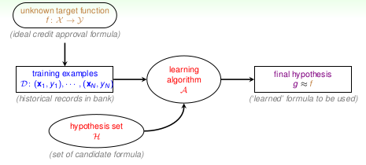

# Lecture 1: The Learning Problem

## 1.Course Introduction -- foundation oriented and story-like

Foundation oriented ML course.

## 2.What is Machine Learning -- use data to approximate target

### Machine learning

### Key essence of machine learning

## 3.Applications of Machine Learning -- almost everywhere

Food, clothing, housing, transportation, education, entertainment, ...

## 4.Components of Machine Learning -- ![A][1] takes ![D][2] and ![H][3] to get ![g][4]

### Basic notations

### The learning model

learning model = ![A][1] and ![H][3]

### Another definition

## 5.Machine Learning and Other Fields -- related to DM, AI and Stats

- `machine learning`: use data to compute hypothesis g that approximates target f.
- `data mining`: use (huge) data to find property that is interesting.
- `artificial intelligence`: compute something that shows intelligent behavior.
- `statistics`: use data to make inference about an unknown process.

### ML and DM

difficult to distinguish ML and DM in reality.

### ML and AI

ML is one possible route to realize AI.

### ML and Stats

statistics: many useful tools for ML.

  [1]: http://chart.apis.google.com/chart?cht=tx&chl=\mathcal{A}
  [2]: http://chart.apis.google.com/chart?cht=tx&chl=\mathcal{D}
  [3]: http://chart.apis.google.com/chart?cht=tx&chl=\mathcal{H}
  [4]: http://chart.apis.google.com/chart?cht=tx&chl=\mathcal{g}
