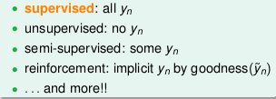

# Lecture 3: Types of Learning

## 1. Learning with Different Output Space ![Y][1] -- [classification], [regression], [structured]

## 2. Learning with Different Data Label ![yn][2] -- [supervised], un/semi-supervised, reinforcement

## 3. Learning with Different Protocol ![f][3] => (![xn][4], ![yn][2]) -- [batch], online, active

## 4. Learning with Different Input Space ![X][5] -- [concrete], raw abstract

  [1]: http://chart.apis.google.com/chart?cht=tx&chl=\mathcal{Y}
  [2]: http://chart.apis.google.com/chart?cht=tx&chl=y_n
  [3]: http://chart.apis.google.com/chart?cht=tx&chl=f
  [4]: http://chart.apis.google.com/chart?cht=tx&chl=x_n
  [5]: http://chart.apis.google.com/chart?cht=tx&chl=\mathcal{X}
