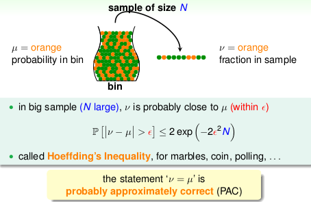
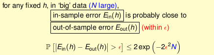
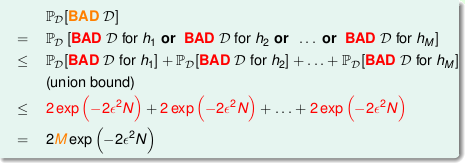

# Lecture 4: Feasibility of Learning

## 1. Learning is Impossible? -- absolutely no free lunch outside ![D][1]

Learning from ![D][1] (to infer something outside ![D][1]) is doomed if any 'unknown' ![f][6] can happen.

## 2. Probability to the Rescue -- probably approximately correct outside ![D][1]

If ![N][14] is large, we can probably infer unknown ![mu][7] by known ![nu][8].

## 3. Connection to Learning -- verification possible if ![Einh][2] small for fixed ![h][3]

So, if ![Einh][2] ![=][9] ![Eouth][10] and ![Einh][2] small ==> ![Eouth][10] small ==> ![h][3] ![=][9] ![f][6] with respect to ![P][11].

Now, we can use 'historical records' (data) to verify 'one candidate formula' ![h][3].

## 4. Connection to Real Learning -- learning possible if ![H][4] finite and ![Eing][5] small

But in real learning, we have to deal with some `BAD` sample: ![Ein][12] and ![Eout][13] far away --can get worse when involving 'choice'.

- if ![H][4] = ![M][15] finite, ![N][14] large enough, for whatever ![g][16] picked by ![A][17], ![Eoutg][18] ![=][9] ![Eing][5].
- if ![A][17] finds one ![g][16] with ![Eing][5] ![=][9] 0, `PAC` guarantee for ![Eoutg][18] ![=][9] 0 ==> learning possible.

  [1]: http://chart.apis.google.com/chart?cht=tx&chl=\mathcal{D}
  [2]: http://chart.apis.google.com/chart?cht=tx&chl=E_{in}(h)
  [3]: http://chart.apis.google.com/chart?cht=tx&chl=h
  [4]: http://chart.apis.google.com/chart?cht=tx&chl=\left|\mathcal{H}\right|
  [5]: http://chart.apis.google.com/chart?cht=tx&chl=E_{in}(g)
  [6]: http://chart.apis.google.com/chart?cht=tx&chl=f
  [7]: http://chart.apis.google.com/chart?cht=tx&chl=\mu
  [8]: http://chart.apis.google.com/chart?cht=tx&chl=\nu
  [9]: http://chart.apis.google.com/chart?cht=tx&chl=\approx
  [10]: http://chart.apis.google.com/chart?cht=tx&chl=E_{out}(h)
  [11]: http://chart.apis.google.com/chart?cht=tx&chl=\mathbb{P}
  [12]: http://chart.apis.google.com/chart?cht=tx&chl=E_{in}
  [13]: http://chart.apis.google.com/chart?cht=tx&chl=E_{out}
  [14]: http://chart.apis.google.com/chart?cht=tx&chl=N
  [15]: http://chart.apis.google.com/chart?cht=tx&chl=M
  [16]: http://chart.apis.google.com/chart?cht=tx&chl=g
  [17]: http://chart.apis.google.com/chart?cht=tx&chl=\mathcal{A}
  [18]: http://chart.apis.google.com/chart?cht=tx&chl=E_{out}(g)
