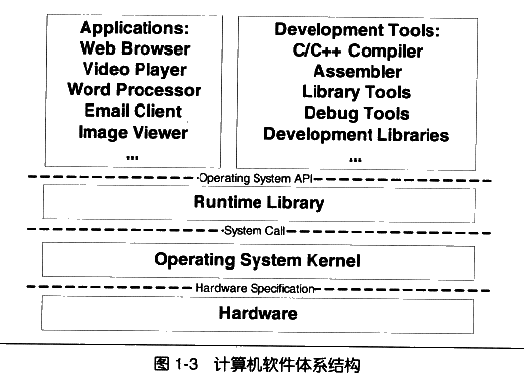
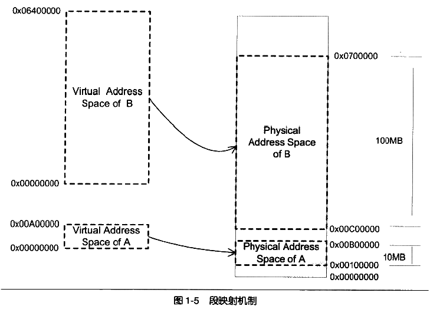
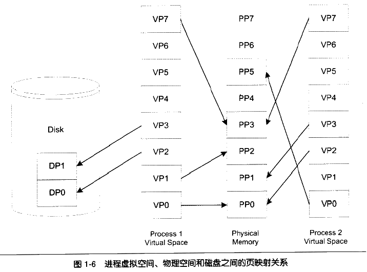
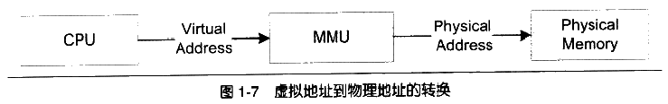
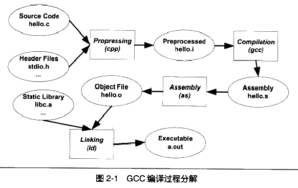

# 程序员的自我修养

## 第一章 温故而知新

- 应用程序编程接口（Application Programming Interface）
- 系统调用接口（System call Interface）
- 软件中断（Software Interrupt）
- 硬件规格（Hardware Specification）

- 分段（Segmentation）

- 分页（Paging）

- MMU（Memory Management Unit）

## 第二章 编译和链接

## 第三章 目标文件里有什么

## 第四章 静态链接

## 第五章 Windows PE/COFF

## 第六章 可执行文件的装载与进程

## 第七章 动态链接

## 第八章 Linux 共享库的组织

## 第九章 Windows 下的动态链接

## 第十章 内存

## 第十一章 运行库

## 第十二章 系统调用与 API

## 第十三章 运行库实现
