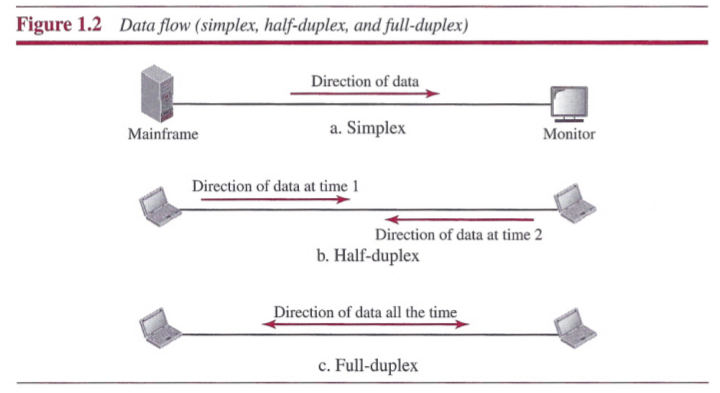
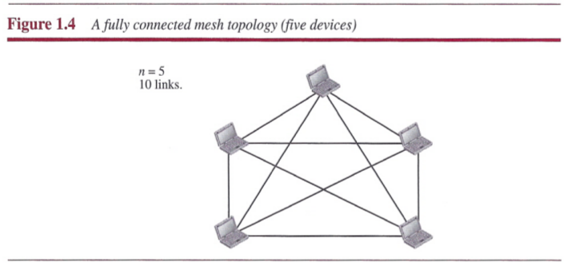
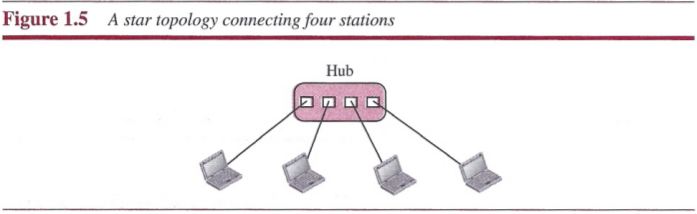
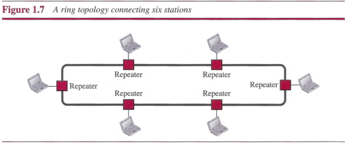
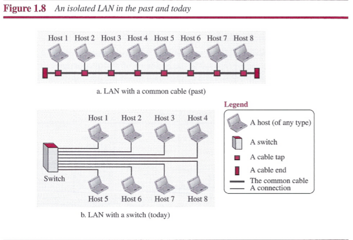
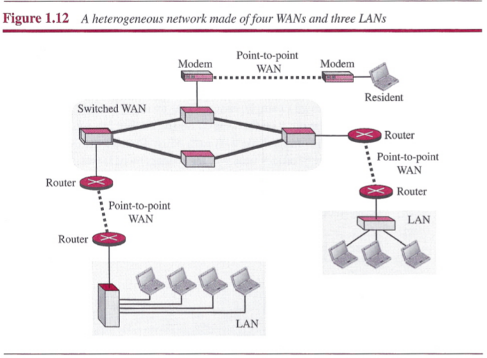
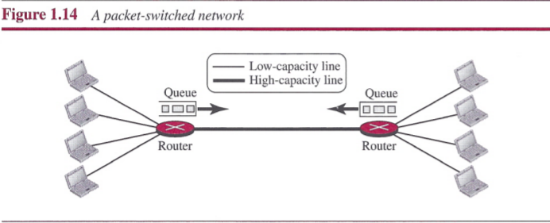
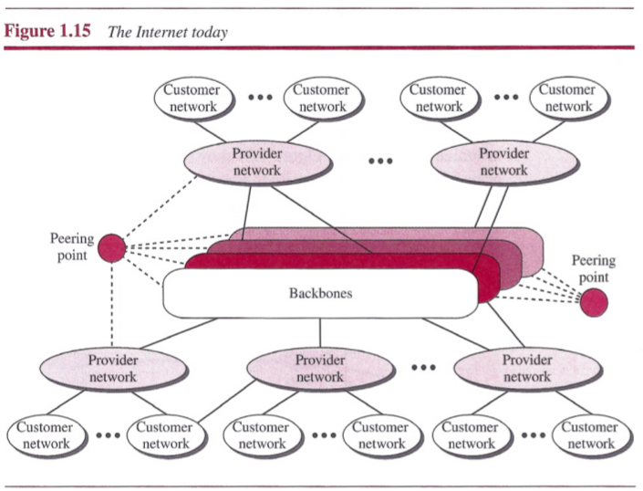

# Chapter 1: Introduction

## Data Communications

The term `telecommunication` means communication at a distance. The word `data` refers to information presented in whatever form is agreed upon by the parties creating and using the data.

`Data communications` are the exchange of data between two devices via some form of transmission medium such as a wire cable.

The effectiveness of a data communications system depends on four fundamental characteristics: delivery, accuracy, timeliness, and jitter.

1. `Delivery`: The system must deliver data to the correct destination.
2. `Accuracy`: The system must deliver the data accurately.
3. `Timeliness`: The system must deliver data in a timely manner.
4. `Jitter`: Jitter refers to the variation in the packet arrival time.

### Components

1. `Message`: The message is the information (data) to be communicated.
2. `Sender`: The sender is the device that sends the data message.
3. `Receiver`: The receiver is the device that receives the message.
4. `Transmission medium`: The transmission medium is the physical path by which a message travels from sender to receiver.
5. `Protocol`: A protocol is a set of rules that govern data communications.

### Data Flow

- `simplex mode`: the communication is unidirectional, only one of the two devices on a link can transmit; the other can only receive.
- `half-duplex mode`: each station can both transmit and receive, but not at the same time. When one device is sending, the other can only receive, and vice versa.
- `full-duplex mode`: both stations can transmit and receive simultaneously.

## Networks

A `network` is the interconnection of a set of devices capable of communication. A device can be a `host` such a computer or `connecting device` such as a router.

### Network Criteria

A network must be able to meet a certain number of criteria. The most important of these are `performance`, `reliability`, and `security`.

### Physical Structures

#### Type of Connection

There are two possible types of connections: point-to-point and multipoint:

- A `point-to-point connection` provides a dedicated link between two devices.
- A `multipoint connection` is one in which more than two specific devices share a single link.

#### Physical Topology

There are four basic topologies possible: mesh, star, bus, and ring.

In a `mesh topology`, every device has a dedicated point-to-point link to every other device.

In a `star topology`, each device has a dedicated point-to-point link only to a central controller, usually called a hub.

A `bus topology`, is multipoint. One long cable acts as a backbone to link all the devices in a network.

In a `ring topology`, each device has a dedicated point-to-point connection with only the two devices on either side of it.

## Network Types

### Local Area Network

A `local area network` (`LAN`) is usually privately owned and connects some hosts in a single office, building, or campus.

Each host in a LAN has an identifier, an address, that uniquely defines the host in the LAN. A packet sent by a host to another host carries both the source host's and the destination host's addresses.

### Wide Area Network

A `wide area network` (`WAN`) is normally created and run by communication companies and has a wider geographical span which connects connecting devices.

#### Point-to-Point WAN

#### Switched WAN

#### Internetwork

When two or more networks are connected, they make an `internetwork`, or `internet`.

### Switching

An internet is a `switched network` in which a switch connects at least two links together. A switch needs to forward data from a network to another network when required. The two most common types of switched networks are circuit-switched and packet-switched networks.

#### Circuit-Switched Network

In a `circuit-switched network`, a dedicated connection, called a circuit, is always available between the two end systems; the switch can only make it active or inactive.

#### Packet-Switched Network

In a computer network, the communication between the two ends is done in blocks of data called `packets`.

A router in a packet-switched network has a queue that can store and forward the
packet.

### The Internet

## Summary

- Data communications are the transfer of data from one device to another via some form of transmission medium.
- A data communications system must transmit data to the correct destination in an accurate and timely manner.
- The five components that make up a data communications system are the message, sender, receiver, medium, and protocol.
- Text, numbers, images, audio, and video are different forms of information.
- Data flow between two devices can occur in one of three ways: simplex, half-duplex, or full-duplex.
- A network is a set of communication devices connected by media links.
- In a point-to-point connection, two and only two devices are connected by a dedicated link.
- In a multipoint connection, three or more devices share a link.
- Topology refers to the physical or logical arrangement of a network. Devices may be arranged in a mesh, star, bus, or ring topology.
- A network can be categorized as a local area network or a wide area network.
- A LAN is a data communication system within a building, plant, or campus, or between nearby buildings.
- A WAN is a data communication system spanning states, countries, or the whole world. An internet is a network of networks.
- The Internet is a collection of many separate networks.
