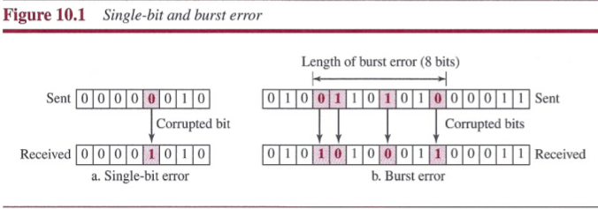
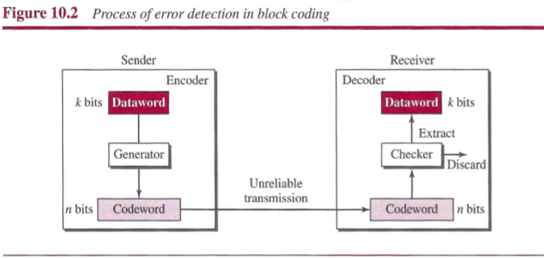
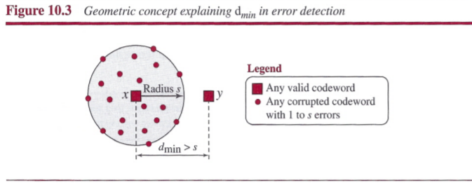
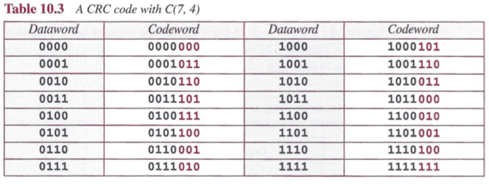
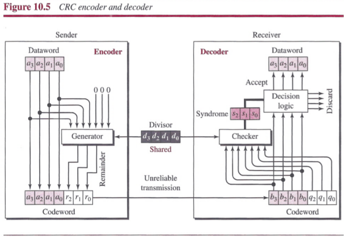
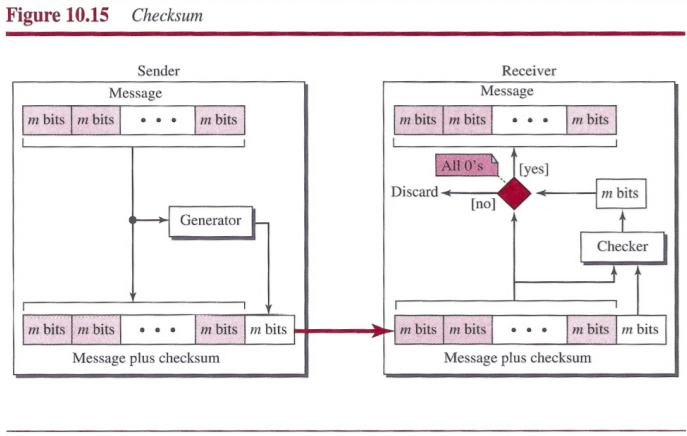
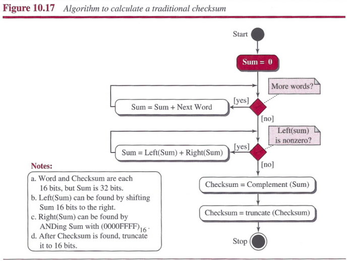
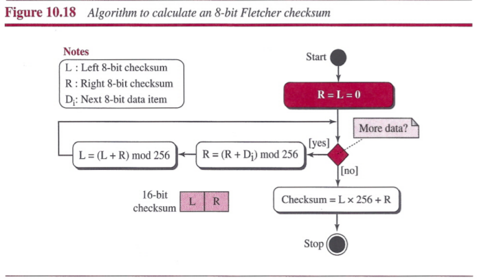
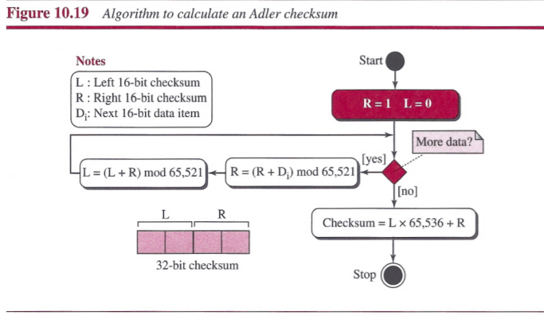
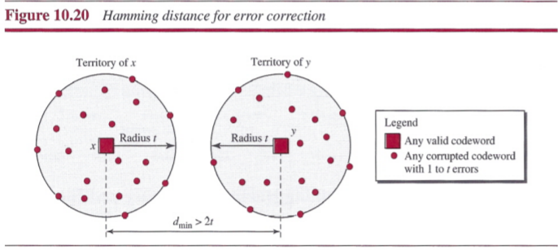

# Chapter 10: Error Detection and Correction
## Introduction
### Types of Errors
Whenever bits flow from one point to another, the interference can change the shape of the signal.
- `single-bit error`: only 1 bit of a given data unit is changed from 1 to 0 or from 0 to 1.
- `burst error`: 2 or more bits in the data unit have changed from 1 to 0 or from 0 to 1.

### Redundancy
The central concept in detecting or correcting errors is redundancy. To be able to detect or correct errors, we need to send some extra bits with our data.

### Detection versus Correction
- `error detection`: only looking to see if any error has occurred.
- `error correction`: need to know the exact number of bits that are corrupted and their location in the message.

### Coding
We can divide codeing schemes into two broad categories: `block coding` and `convolution coding`.

## Block Coding
In block coding, we divide our message into blocks, each of *k* bits, called `datawords`. We add *r* redundant bits to each block to make the length *n = k + r*. The resulting *n*-bit blocks are called codewords.

### Error Detection
If the following two conditions are met, the receiver can detect a change in the original codeword.
1. The receiver has (or can find) a list of valid codewords.
2. The original codeword has changed to an invalid one.

An error-detecting code can detect only the types of errors for which it is designed; other types of errors may remain undetected.

##### Hamming Distance
The Hamming distance between two words is the number of differences between corresponding bits. The Hamming distance can easily be found if we apply the XOR operation on the two words and count the number of Is in the result.

**Minimum Hamming Distance for Error Detection**: the `minimum Hamming distance` is the smallest Hamming distance between all possible pairs of codewords. To guarantee the detection of up to *s* errors in all cases, the minimum Hamming distance in a block code must be *dmin = s + 1*.

##### Linear Block Codes
A linear block code is a code in which the exclusive XOR (addition modulo-2) of two valid codewords creates another valid codeword.

**Minimum Distance for Linear Block Codes**: The minimum Hamming distance is the number of 1s in the nonzero valid codeword with the smallest number of 1s.

**Parity-Cheek Code**: parity-check code is a linear block code. In this code, a *k*-bit dataword is changed to an *n*-bit codeword where *n = k + 1*. The extra bit, called the parity bit, is selected to make the total number of 1s in the codeword even.

- The encoder uses a generator that takes a copy of a 4-bit dataword and generates a parity bit *r0*. , If the number of 1s is even, the result is 0; if the number of 1s is odd, the result is 1. In both cases, the total number of 1s in the codeword is even.
- The checker at the receiver does the same thing as the generator in the sender except the addition is done over all 5 bits.The `syndrome` is 0 when the number of 1s in the received codeword is even; otherwise, it is 1. . If the syndrome is 0, there is no detectable error; if the syndrome is 1, the data portion of the received codeword is discarded.

A parity-check code can detect an odd number of errors.

## Cyclic Codes
Cyclic codes are special linear block codes with one extra property. In a cyclic code, if a codeword is cyclically shifted (rotated), the result is another codeword.

### Cyclic Redundancy Check
The `cyclic redundancy check (CRC)` is used in networks such as LANs and WANs.

- In the encoder, the dataword has *k* bits (4 here); the codeword has *n* bits (7 here). The size of the dataword is augmented by adding *n - k* (3 here) 0s to the right-hand side of the word. The *n*-bit result is fed into the generator. The generator uses a divisor of size *n - k + 1* (4 here), predefined and agreed upon. The generator divides the augmented dataword by the divisor (modulo-2 division). The quotient of the division is discarded; the remainder (*r2r1r0*) is appended to the dataword to create the codeword.
- The decoder receives the codeword. A copy of all *n* bits is fed to the checker, which is a replica of the generator. The remainder produced by the checker is a syndrome of *n - k* (3 here) bits, which is fed to the decision logic analyzer. If the syndrome bits are all 0s, the 4 left-most bits of the codeword are accepted as the dataword; otherwise, the 4 bits are discarded.

##### Encoder
The encoder takes a dataword and augments it with *n - k* number of 0s. It then divides the augmented dataword by the divisor.

##### Decoder
The codeword can change during transmission. The decoder does the same division process as the encoder. The remainder of the division is the syndrome. If the syndrome is all 0s, there is no error with a high probability; the dataword is separated from the received codeword and accepted. Otherwise, everything is discarded.

!]

### Polynomials and Cyclic Code Encoder Using Polynomials
A pattern of 0s and 1s can be represented as a polynomial with coefficients of 0 and 1. The power of each term shows the position of the bit; the coefficient shows the value of the bit.

- The divisor in a cyclic code is normally called the generator polynomial or simply the generator.

### Cyclic Code Analysis
We define the following:
- `f(x)`: polynomial
- `d(x)`: dataword
- `c(x)`: codeword
- `g(x)`: generator
- `s(x)`: syndrome
- `e(x)`: error

In a cyclic code:
- If s(x) ≠ 0, one or more bits is corrupted.
- If s(x) = 0, either
 - No bit is corrupted, or
 - Some bits are corrupted, but the decoder failed to detect them.

We want to find the criteria that must be imposed on the generator, *g(x)* to detect the type of error we especially want to be detected. We know **Received codeword = c(x) + e(x)**, the receiver divides teh received codeword by *g(x)* to get the syndrome: . The first term at the right-hand side of the equality has a remainder of zero, so the syndrome is actually the remainder of the second term on the right-hand side. If this term does not have a remainder (syndrome = 0), either *e(x)* is 0 or *e(x)* is divisible by *g(x)*. Those errors that are divisible by *g(x)* are not caught.

##### Single-Bit Error
A single-bit error is *e(x) = xi*, where *i* is the position of the bit. If a single-bit error is caught, then *xi* is not divisible by *g(x)*. If *g(x)* has at least two terms and the coefficient of *x0* is not zero, then *e(x)* cannot be divided by *g(x)*.

##### Two Isolated Single-Bit Errors
We can show this type of error as *e(x) = xj + xi*. The values of *i* and *j* define the positions of the errors, and the difference *j - i* defines the distance between the two errors.

If a generator cannot divide *xt + 1* (t between 0 and n - 1), then all isolated double errors can be detected.

##### Odd Number of Errors
A generator that contains a factor of *x + 1* can detect all odd-numbered errors.

##### Burst Errors
A burst error is of the form *e(x) = (x j + ... + x i)*.

- All burst errors with *L ≤ r* will be detected.
- All burst errors with *L = r + 1* will be detected with probability *1 - (1/2) r-1*.
- All burst errors with *L > r + 1* will be detected with probability *1 - (1/2) r*.

##### Summary
A good polynomial generator needs to have the following characteristics:
1. It should have at least two terms.
2. The coefficient of the term *x 0* should be 1.
3. It should not divide *x t* + 1, for t between 2 and *n - 1*.
4. It should have the factor *x + 1*.

## Checksum
`Checksum` is an error-detecting technique that can be applied to a message of any length.

- At the source, the message is first divided into m-bit units. The generator then creates an extra m-bit unit called the checksum, which is sent with the message.
- At the destination, the checker creates a new checksum from the combination of the message and sent checksum. If the new checksum is all Os, the message is accepted; otherwise, the message is discarded.

### Concept
##### Internet Checksum
Traditionally, the Internet has used a 16-bit checksum.

##### Algorithm

### Other Approaches to the Checksum

## Forward Error Correction
### Using Hamming Distance
To detect *t* errors, we need to have *dmin = 2t + 1*.

### Using XOR

### Chunk Interleaving

### Compounding High- and Low-Resolution Packets

## Summary
- Data can be corrupted during transmission. Some applications require that errors be detected and corrected.
- In a single-bit error, only one bit in the data unit has changed. A burst error means that two or more bits in the data unit have changed.
- To detect or correct errors, we need to send extra (redundant) bits with data. There are two main methods of error correction: forward error correction and correction by retransmission.
- We can divide coding schemes into two broad categories: block coding and convolution coding.
- In coding, we need to use modulo-2 arithmetic. Operations in this arithmetic are very simple; addition and subtraction give the same results. We use the XOR (exclusive OR) operation for both addition and subtraction.
- In block coding, we divide our message into blocks, each of k bits, called datawords. We add r redundant bits to each block to make the length n = k + r. The resulting n-bit blocks are called codewords.
- In block coding, errors be detected by using the following two conditions:
 - a. The receiver has (or can find) a list of valid codewords.
 - b. The original codeword has changed to an invalid one.
- The Hamming distance between two words is the number of differences between corresponding bits. The minimum Hamming distance is the smallest Hamming distance between all possible pairs in a set of words.
- To guarantee the detection of up to s errors in all cases, the minimum Hamming distance in a block code must be d min = s + 1.
- To guarantee correction of up to t errors in all cases, the minimum Hamming distance in a block code must be d min = 2t + 1.
- In a linear block code, the exclusive OR (XOR) of any two valid codewords creates another valid codeword.
- A simple parity-check code is a single-bit error-detecting code in which n = k + 1 with d min = 2. A simple parity-check code can detect an odd number of errors.
- All Hamming codes discussed in this book have d min = 3. The relationship between m and n in these codes is n = 2m - 1.
- Cyclic codes are special linear block codes with one extra property. In a cyclic code, if a codeword is cyclically shifted (rotated), the result is another codeword.
- A category of cyclic codes called the cyclic redundancy check (CRC) is used in networks such as LANs and WANs.
- A pattern of 0s and 1s can be represented as a polynomial with coefficients of 0 and 1.
- Traditionally, the Internet has been using a 16-bit checksum, which uses one's complement arithmetic. In this arithmetic, we can represent unsigned numbers between 0 and 2n - 1 using only n bits.
