# Chapter 11: Data Link Control (DLC)
## DLC Services
The `data link control (DLC)` deals with procedures for communication between two adjacent nodes-node-to-node communication (no matter whether the link is dedicated or broadcast). Data link control functions include `framing` and `flow and error control`.

### Framing
Framing in the data-link layer separates a message from one source to a destination by adding a sender address and a destination address. The destination address defines where the packet is to go; the sender address helps the recipient acknowledge the receipt.

##### Frame Size
- `fixed-size framing` is no need for defining the boundaries of the frames; the size itself can be used as a delimiter.
- `variable-size framing` needs to define the end of one frame and the beginning of the next. There are two approaches:
 - character-oriented approach
 - bit-oriented approach

**Character-Oriented Framing**: data to be carried are 8-bit characters from a coding system such as ASCII. The header, which normally carries the source and destination addresses and other control information, and the trailer, which carries error detection redundant bits, are also multiples of 8 bits. To separate one frame from the next, an 8-bit `flag` is added at the beginning and the end of a frame.

`Byte stuffing` is the process of adding one extra byte whenever there is a flag or escape character in the text.

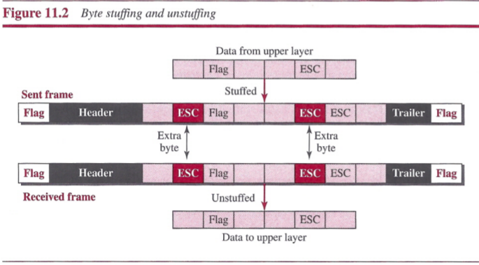

**Bit-Oriented Framing**: the data section of a frame is a sequence of bits to be interpreted by the upper layer. Most protocols use a special 8-bit pattern flag, `01111110`, as the delimiter to define the beginning and the end of the frame.

`Bit stuffing` is the process of adding one extra 0 whenever five consecutive is follow a 0 in the data, so that the receiver does not mistake the pattern 0111110 for a flag.

### Flow and Error Control
##### Flow Control
`Flow control` is to prevent losing the data items at the consumer site.

There are two `buffers`: one at the sending data-link layer and the other at the receiving data-link layer.

##### Error Control
Error control at the data-link layer is implemented using one of the following two methods. In both methods, a CRC is added to the frame header by the sender and checked by the receiver.
- In the first method, if the frame is corrupted, it is silently discarded; if it is not corrupted, the packet is delivered to the network layer. This method is used mostly in wired LANs such as Ethernet.
- In the second method, if the frame is corrupted, it is silently discarded; if it is not corrupted, an acknowledgment is sent to the sender.

##### Combination of Flow and Error Control
Flow and error control can be combined. A frame that carries an acknowledgment is normally called an ACK to distinguish it from the data frame.

### Connectionless and Connection-Oriented
A DLC protocol can be either connectionless or connection-oriented.
- `Connectionless Protocol`: frames are sent from one node to the next without any relationship between the frames; each frame is independent.
- `Connection-Oriented Protocol`: the frames are numbered and sent in order.

## Data-Link Layer Protocols
Traditionally four protocols have been defined for the data-link layer to deal with flow and error control: `Simple`, `Stop-and-Wait`, `Go-Back-N`, and `Selective-Repeat`.

The behavior of a data-link-layer protocol can be better shown as a `finite state machine (FSM)`. An FSM is thought of as a machine with a finite number of states. The machine is always in one of the states until an event occurs. Each event is associated with two reactions: defining the list of actions to be performed and determining the next state. One of the states must be defined as the initial state, the state in which the machine starts when it turns on.

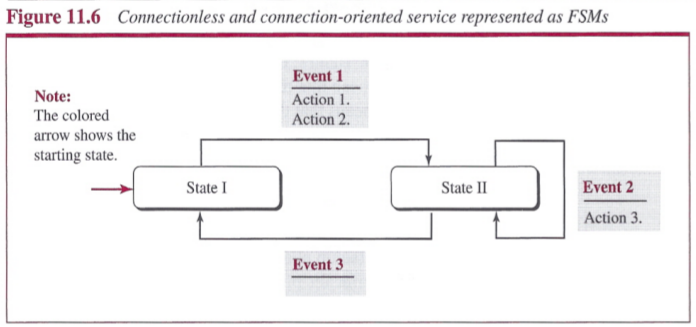

### Simple Protocol
Simple protocol has neither flow nor error control.

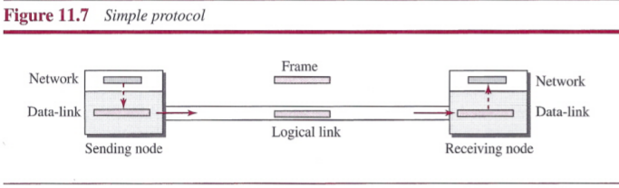

##### FSMs

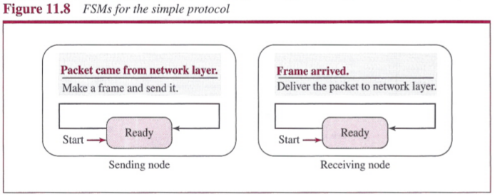

### Stop-and-Wait Protocol
Stop-and-Wait protocol uses both flow and error control. The sender sends one frame at a time and waits for an acknowledgment before sending the next one. Note that only one frame and one acknowledgment can be in the channels at any time.

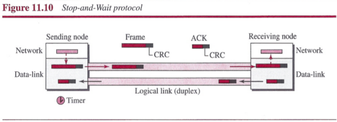

##### FSMs

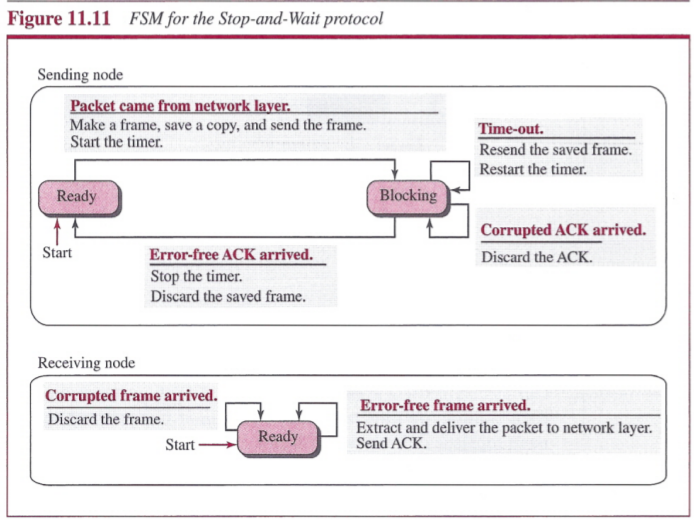

**Sender States**: The sender is initially in the ready state, but it can move between the ready and blocking state.
- `Ready State`: When the sender is in this state, it is only waiting for a packet from the network layer. If a packet comes from the network layer, the sender creates a frame, saves a copy of the frame, starts the only timer and sends the frame. The sender then moves to the blocking state.
- `Blocking State`. When the sender is in this state, three events can occur:
 1. If a time-out occurs, the sender resends the saved copy of the frame and restarts the timer.
 2. If a corrupted ACK arrives, it is discarded.
 3. If an error-free ACK arrives, the sender stops the timer and discards the saved copy of the frame. It then moves to the ready state.

**Receiver**: The receiver is always in the ready state. Two events may occur:
1. If an error-free frame arrives, the message in the frame is delivered to the network layer and an ACK is sent.
2. If a corrupted frame arrives, the frame is discarded.

**Sequence and Acknowledgment Numbers**: We need to add `sequence numbers` to the data frames and `acknowledgment numbers` to the ACK frames.

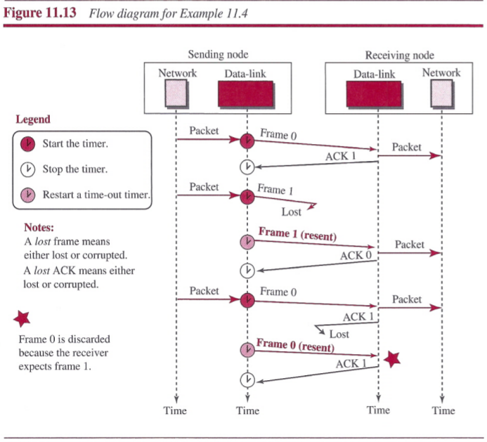

### Piggybacking
To make the communication more efficient, the data in one direction is piggybacked with the acknowledgment in the other direction.

## HDLC
`High-level Data Link Control (HDLC)` is a bit-oriented protocol for communication over point-to-point and multipoint links. It implements the Stop-and-Wait protocol.

### Configuration and Transfer Modes
HDLC provides two common transfer modes that can be used in different configurations: `normal response mode (NRM)` and `asynchronous balanced mode (ABM)`.
- In normal response mode (NRM), the station configuration is unbalanced. We have one primary station and multiple secondary stations. A primary station can send commands; a secondary station can only respond. The NRM is used for both point-to-point and multipoint links.

 

- In ABM, the configuration is balanced. The link is point-to-point, and each station can function as a primary and a secondary (acting as peers),

 

### Framing
HDLC defines three types of frames:
- `information frames (I-frames)`: used to data-link user data and control information.
- `supervisory frames (S-frames)`: used only to transport control information.
- `unnumbered frames (U-frames)`: reserved for system management. Information carried by U-frames is intended for managing the link itself.

Each frame in HDLC may contain up to six fields:
- a beginning flag field
- an address field
- a control field
- an information field
- a frame check sequence (FCS) field
- an ending flag field

- `Flag field`: This field contains synchronization pattern 01111110, which identifies both the beginning and the end of a frame.
- `Address field`: This field contains the address of the secondary station. If a primary station created the frame, it contains a *to* address. If a secondary station creates the frame, it contains a *from* address.
- `Control field`: The control field is one or two bytes used for flow and error control.
- `Information field`: The information field contains the user's data from the network layer or management information.
- `FCS field`: The frame check sequence (FCS) is the HDLC error detection field. It can contain either a 2- or 4-byte CRC.

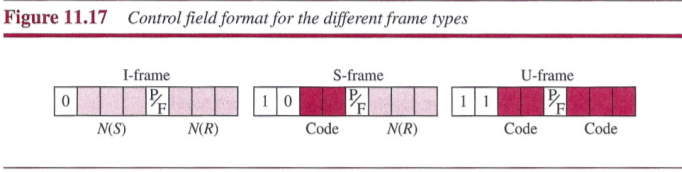

The control field determines the type of frame and defines its functionality.
- `Control Field for I-Frames`: I-frames are designed to carry user data from the network layer. In addition, they can include flow- and error-control information (piggybacking). The subfields in the control field are used to define these functions. The first bit defines the type. If the first bit of the control field is 0, this means the frame is an I-frame. The next 3 bits, called *N(S)*, define the sequence number of the frame. The last 3 bits, called *N(R)*, correspond to the acknowledgment number when piggybacking is used. The single bit between *N(S)* and *N(R)* is called the P/F bit. The P/F field is a single bit with a dual purpose. It has meaning only when it is set (bit = 1) and can mean poll or final. It means poll when the frame is sent by a primary station to a secondary (when the address field contains the address of the receiver). It means final when the frame is sent by a secondary to a primary (when the address field contains the address of the sender).
- `Control Field for S-Frames`: Supervisory frames are used for flow and error control whenever piggybacking is either impossible or inappropriate. S-frames do not have information fields. If the first 2 bits of the control field are 10, this means the frame is an S-frame. The last 3 bits, called *N(R)*, correspond to the acknowledgment number (ACK) or negative acknowledgment number (NAK), depending on the type of S-frame. The 2 bits called code are used to define the type of S-frame itself:
 - `Receive ready (RR)`. If the value of the code subfield is 00, it is an RR S-frame. This kind of frame acknowledges the receipt of a safe and sound frame or group of frames. In this case, the value of the *N(R)* field defines the acknowledgment number.
 - `Receive not ready (RNR)`. If the value of the code subfield is 10, it is an RNR S-frame. This kind of frame is an RR frame with additional functions. It acknowledges the receipt of a frame or group of frames, and it announces that the receiver is busy and cannot receive more frames. It acts as a kind of congestion-control mechanism by asking the sender to slow down. The value of *N(R)* is the acknowledgment number.
 - `Reject (REJ)`. If the value of the code subfield is 01, it is an REJ S-frame. This is a NAK frame, but not like the one used for Selective Repeat ARQ. It is a NAK that can be used in Go-Back-N ARQ to improve the efficiency of the process by informing the sender, before the sender timer expires, that the last frame is lost or damaged. The value of *N(R)* is the negative acknowledgment number.
 - `Selective reject (SREJ)`. If the value of the code subfield is 11, it is an SREJ S-frame. This is a NAK frame used in Selective Repeat ARQ. Note that the HDLC Protocol uses the term selective reject instead of selective repeat. The value of *N(R)* is the negative acknowledgment number.
- `Control Fieldfor U-Frames`: Unnumbered frames are used to exchange session management and control information between connected devices. Unlike S-frames, U-frames contain an information field, but one used for system management information, not user data. As with S-frames, however, much of the information carried by U-frames is contained in codes included in the control field. U-frame codes are divided into two sections: a 2-bit prefix before the P/F bit and a 3-bit suffix after the P/P bit. Together, these two segments (5 bits) can be used to create up to 32 different types of U-frames.

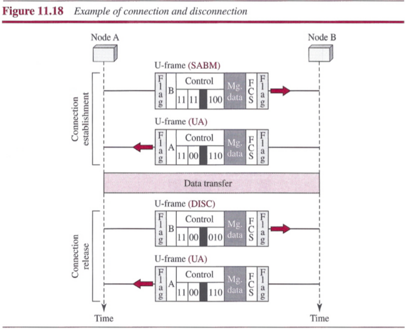

## Point-to-Point Protocol (PPP)
One of the most common protocols for point-to-point access is the `Point-to-Point Protocol (PPP)`.

### Services
##### Services Provided by PPP
- PPP defines the format of the frame to be exchanged between devices.
- It also defines how two devices can negotiate the establishment of the link and the exchange of data.
- PPP is designed to accept payloads from several network layers (not only IP).
- Authentication is also provided in the protocol, but it is optional.
- The new version of PPP, called `Multilink PPP`, provides connections over multiple links.
- One interesting feature of PPP is that it provides network address configuration.

##### Services Not Provided by PPP
- PPP does not provide flow control. A sender can send several frames one after another
with no concern about overwhelming the receiver.
- PPP has a very simple mechanism for error control. A CRC field is used to detect errors. Lack of error control and sequence numbering may cause a packet to be received out of order.
- PPP does not provide a sophisticated addressing mechanism to handle frames in a multipoint configuration.

### Framing
PPP uses a character-oriented (or byte-oriented) frame.
- `Flag`: A PPP frame starts and ends with a l-byte flag with the bit pattern 01111110.
- `Address`: The address field is a constant value and set to 11111111 (broadcast address).
- `Control`: This field is set to the constant value 00000011. PPP does not provide any flow control. Error control is also limited to error detection.
- `Protocol`: The protocol field defines what is being carried in the data field: either user data or other information. This field is by default 2 bytes long, but the two parties can agree to use only 1 byte.
- `Payload field`: This field carries either the user data or other information. The data field is a sequence of bytes with the default of a maximum of 1500 bytes; but this can be changed during negotiation. The data field is byte-stuffed if the flag byte pattern appears in this field. Because there is no field defining the size of the data field, padding is needed if the size is less than the maximum default value or the maximum negotiated value.
- `FCS`: The frame check sequence (FCS) is simply a 2-byte or 4-byte standard CRC.

Since PPP is a character-oriented protocol, the flag in PPP is a byte that need to be escaped whenever it appears in the data section of the frame. The escape byte is 01111101.

### Transition Phases

### Multiplexing
Three sets of protocols are defined to make PPP powerful: the `Link Control Protocol (LCP)`, two `Authentication Protocols (APs)`, and several `Network Control Protocols (NCPs)`.

##### Link Control Protocol
The `Link Control Protocol (LCP)` is responsible for establishing, maintaining, configuring, and terminating links. It also provides negotiation mechanisms to set options between the two endpoints. Both endpoints of the link must reach an agreement about the options before the link can be established.

All LCP packets are carried in the payload field of the PPP frame with the protocol field set to C021 in hexadecimal.

The `code field` defines the type of LCP packet. There are 11 types of packets:

There are three categories of packets.
- The first category, comprising the first four packet types, is used for link configuration during the establish phase.
- The second category, comprising packet types 5 and 6, is used for link termination during the termination phase.
- The last five packets are used for link monitoring and debugging.

The `ID field` holds a value that matches a request with a reply. One endpoint inserts a value in this field, which will be copied into the reply packet.

The `length field` defines the length of the entire LCP packet.

The `information field` contains information, such as options, needed for some LCP packets. There are many options that can be negotiated between the two endpoints. Options are inserted in the information field of the configuration packets. In this case, the information field is divided into three fields: `option type`, `option length`, and `option data`.

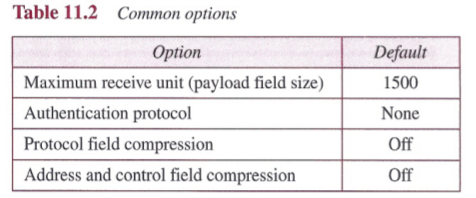

##### Authentication Protocols
PPP has created two protocols for authentication: `Password Authentication Protocol` and `Challenge Handshake Authentication Protocol`. Note that these protocols are used during the authentication phase.

**PAP**: The `Password Authentication Protocol (PAP)` is a simple authentication procedure with a two-step process:
1. The user who wants to access a system sends an authentication identification (usually the user name) and a password.
2. The system checks the validity of the identification and password and either accepts or denies connection.

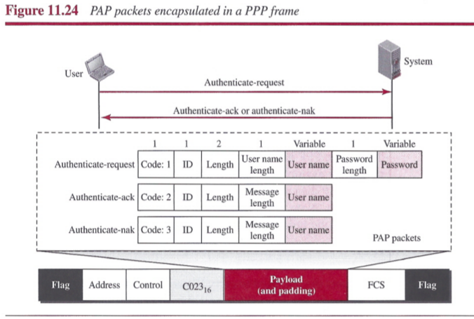

Three types of packets used by PAP. When a PPP frame is carrying any PAP packets, the value of the protocol field is OxC023.
- `authenticate-request`: The first is used by the user to send the user name and password.
- `authenticate-ack`: The second is used by the system to allow access.
- `authenticate-nak`: The third is used by the system to deny access.

**CHAP**: The `Challenge Handshake Authentication Protocol (CHAP)` is a three-way handshaking authentication protocol that provides greater security than PAP. In this method, the password is kept secret; it is never sent online.
1. The system sends the user a challenge packet containing a challenge value, usually a few bytes.
2. The user applies a predefined function that takes the challenge value and the user's own password and creates a result. The user sends the result in the response packet to the system.
3. The system does the same. It applies the same function to the password of the user (known to the system) and the challenge value to create a result. If the result created is the same as the result sent in the response packet, access is granted; otherwise, it is denied.

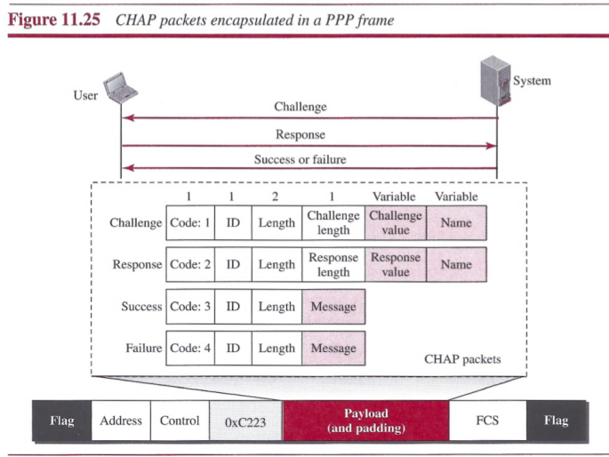

CHAP packets are encapsulated in the PPP frame with the protocol value C223 in hexadecimal. There are four CHAP packets:
- `challenge`: The first packet is used by the system to send the challenge value.
- `response`: The second is used by the user to return the result of the calculation.
- `success`: The third is used by the system to allow access to the system.
- `failure`: The fourth is used by the system to deny access to the system.

##### Network Control Protocols
PPP is a multiple-network-layer protocol. It can carry a network-layer data packet from protocols defined by the Internet. To do this, PPP has defined a specific Network Control Protocol for each network protocol.

**IPCP**: One NCP protocol is the `Internet Protocol Control Protocol (IPCP)`. This protocol configures the link used to carry IP packets in the Internet. Note that the value of the protocol field in hexadecimal is 8021.

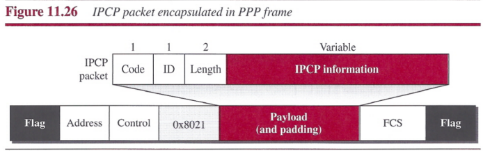

IPCP defines seven packets, distinguished by their code values:

Code | IPCP Packet
---- | -----------
0x01 | Configure-request
0x02 | Configure-ack
0x03 | Configure-nak
0x04 | Configure-reject
0x05 | Terminate-request
0x06 | Terminate-ack
0x07 | Code-reject

##### Data from the Network Layer
After the network-layer configuration is completed by one of the NCP protocols, the users can exchange data packets from the network layer.

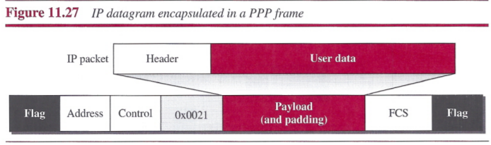

##### Multilink PPP
A logical PPP frame is divided into several actual PPP frames. A segment of the logical frame is carried in the payload of an actual PPP frame.

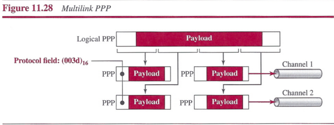

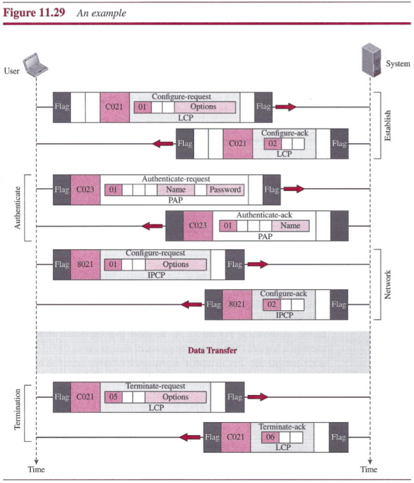

## Summary
- Data link control deals with the design and procedures for communication between two adjacent nodes: node-to-node communication.
- Framing in the data-link layer separates one packet from another.
- In fixed-size framing, there is no need for defining the boundaries of frames; in variable-size framing, we need a delimiter (flag) to define the boundary of two frames.
- Variable-size framing uses two categories of protocols: byte-oriented (or character-oriented) and bit-oriented. In a byte-oriented protocol, the data section of a frame is a sequence of bytes; in a bit-oriented protocol, the data section of a frame is a sequence of bits.
- In byte-oriented protocols, we use byte stuffing; in bit-oriented protocols, we use bit stuffing.
- Another duty of DLC is flow and error control. At the data-link layer, flow control means creating a balance between the frames sent by a node and the frames that can be handled by the next node. Error control at the data-link layer is normally implemented very simply. Corrupted frames are silently discarded; uncorrupted frames are accepted with or without sending acknowledgments to the sender.
- A DLC protocol can be either connectionless or connection-oriented. In a connectionless protocol, frames are sent from one node to the next without any relationship between the frames; each frame is independent. In a connection-oriented protocol, a logical connection should first be established between the two nodes before sending the data frames. After all related frames are transmitted, the logical connection is terminated.
- Data-link protocols have been designed to handle communication between two nodes. We discussed two protocols in this chapter. In the Simple Protocol, there is no flow and error control. In the Stop-and-Wait Protocol, there are both flow and error controls, but communication is a frame at a time.
- High-level Data Link Control (HDLC) is a bit-oriented protocol for communication over point-to-point and multipoint links. It implements the Stop-and-Wait protocol. It is the basis of many protocols in practice today.
- HDLC defines three types of frames: information frames, supervisory frames, and unnumbered frames. The informational frames are used to carry data frames. Supervisory frames are used only to transport control information for flow and error control. Unnumbered frames are reserved for system management and provide connection-oriented service.
- One of the most common protocols for point-to-point access is the Point-to-Point Protocol (PPP). PPP uses only one type of frame, but allows multiplexing of different payloads to achieve a kind of connection-oriented service authentication. Encapsulating different packets in a frame allows PPP to move to different states to provide necessary services.
