# Chapter 12: Media Access Control (MAC)
When nodes or stations are connected and use a common link, called a `multipoint` or `broadcast link`, we need a multiple-access protocol to coordinate access to the link. All of the these protocols belong to a sublayer in the data-link layer called `media access control (MAC)`.

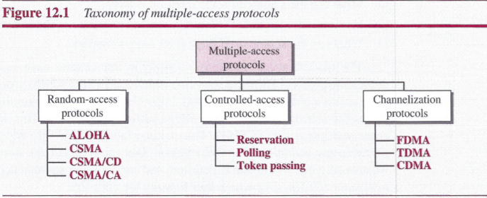

## Random Access
The `random-access` or `contention` methods has two features:
- First, there is no scheduled time for a station to transmit. Transmission is random among the stations. That is why these methods are called `random access`.
- Second, no rules specify which station should send next. Stations compete with one another to access the medium. That is why these methods are also called `contention` methods.

However, if more than one station tries to send, there is an access conflict (collision) and the frames will be either destroyed or modified. To avoid access conflict or to resolve it when it happens, each station follows a procedure that answers the following questions:
- When can the station access the medium?
- What can the station do if the medium is busy?
- How can the station determine the success or failure of the transmission?
- What can the station do if there is an access conflict?

### ALOHA
##### pure ALOHA
The idea is that each station sends a frame whenever it has a frame to send. These is the possibility of collision between frames from different stations.

The pure ALOHA protocol relies on acknowledgments from the receiver. If the acknowledgment does not arrive after a time-out period, the station resends the frame.

A collision involves two or more stations. If all these stations try to resend their frames after the time-out, the frames will collide again. Pure ALOHA dictates that when the time-out period passes, each station waits a random amount of time before resending its frame. The randomness will help avoid more collisions. We call this time the *backoff time TB*. Pure ALOHA has a second method to prevent congesting the channel with retransmitted frames. After a maximum number of retransmission attempts *Kmax* a station must give up and try later.

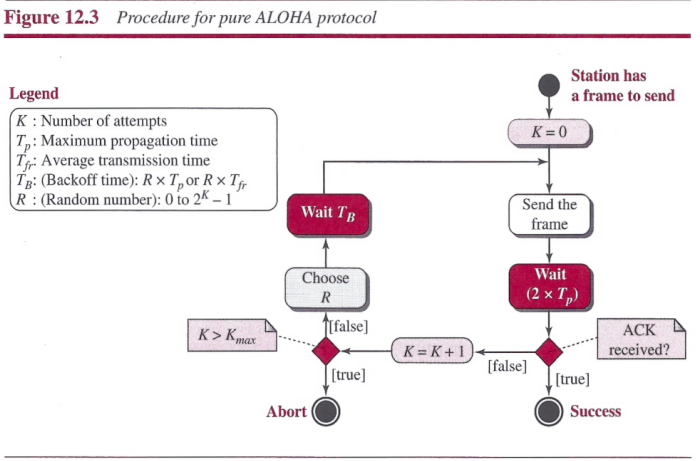

**Vulnerable time**: the length of time in which there is a possibility of collision. The vulnerable time during which a collision may occur in pure ALOHA is 2 times the frame transmission time.

**Throughput**: The throughput for pure ALOHA is *S = G x e-2G*. The maximum throughput *Smax = 1/(2e)* = 0.184 when *G =(1/2)*.

##### Slotted ALOHA
In slotted ALOHA we divide the time into slots of *Tjr* seconds and force the station to send only at the beginning of the time slot.

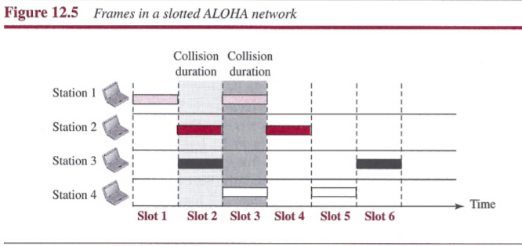

**Vulnerable time**: There is still the possibility of collision if two stations try to send at the beginning of the same time slot. However, the vulnerable time is now reduced to one-half, equal to *Tjr*.

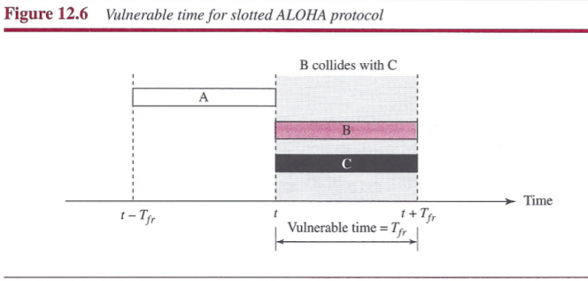

**Throughput**: The throughput for slotted ALOHA is *S = G x e-G*. The maximum throughput *Smax = 0.368* when *G = 1*.

### CSMA
`Carrier sense multiple access (CSMA)` requires that each station first listen to the medium (or check the state of the medium) before sending.

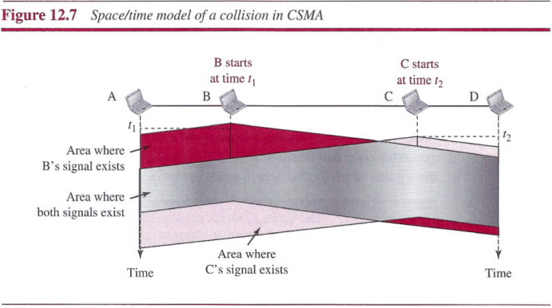

##### Vulnerable Time
The vulnerable time for CSMA is the propagation time *Tp*.

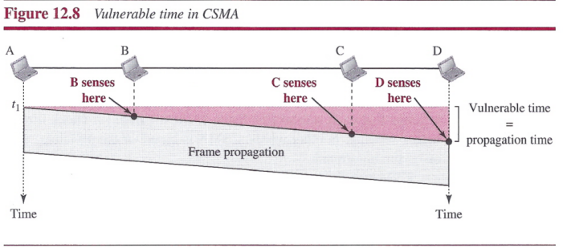

##### Persistence Methods
There are three methods have been devised: the `1-persistent method`, the `nonpersistent method`, and the `p-persistent method`.

- `1-Persistent`: this method, after the station finds the line idle, it sends its frame immediately (with probability 1).
- `Nonpersistent`: In the nonpersistent method, a station that has a frame to send senses the line. If the line is idle, it sends immediately. If the line is not idle, it waits a random amount of time and then senses the line again.
- `p-Persistent`: The p-persistent method is used if the channel has time slots with a slot duration equal to or greater than the maximum propagation time. In this method, after the station finds the line idle it follows these steps:
 1. With probability *p*, the station sends its frame.
 2. With probability *q = 1 - p*, the station waits for the beginning of the next time slot and checks the line again.
   - If the line is idle, it goes to step 1.
   - If the line is busy, it acts as though a collision has occurred and uses the back- off procedure.

### CSMA/CD
`Carrier sense multiple access with collision detection (CSMA/CD)` augments the algorithm to handle the collision. In this method, a station monitors the medium after it sends a frame to see if the transmission was successful. If so, the station is finished. If, however, there is a collision, the frame is sent again.

##### Minimum Frame Size
For CSMA/CD to work, we need a restriction on the frame size. Before sending the last bit of the frame, the sending station must detect a collision, and abort the transmission. This is so because the station, once the entire frame is sent, does not keep a copy of the frame and does not monitor the line for collision detection. Therefore, the frame transmission time *Tfr* must be at least two times the maximum propagation time *Tp*.

##### Procedure

It is similar to the one for the ALOHA protocol, but three differences:
- The first is the addition of the persistence process. We need to sense the channel before we start sending the frame.
- The second is the frame transmission. In ALOHA, we first transmit the entire frame and then wait for an acknowledgment. In CSMA/CD, transmission and collision detection are continuous processes.
- The third is the sending of a short `jamming signal` to make sure that all other stations become aware of the collision.

##### Energy Level
The level of energy in a channel can have three values: zero, normal, and abnormal.

##### Throughput
The maximum throughput occurs at a different value of *G* and is based on the persistence method and the value of *p* in the p-persistent approach.
- For the l-persistent method, the maximum throughput is around 50 percent when *G = 1*.
- For the nonpersistent method, the maximum throughput can go up to 90 percent when *G* is between 3 and 8.

### CSMA/CA
`Carrier sense multiple access with collision avoidance (CSMA/CA)` was invented for wireless networks. Collisions are avoided through the use of CSMA/CA's three strategies: the `interframe space`, the `contention window`, and `acknowledgments`.

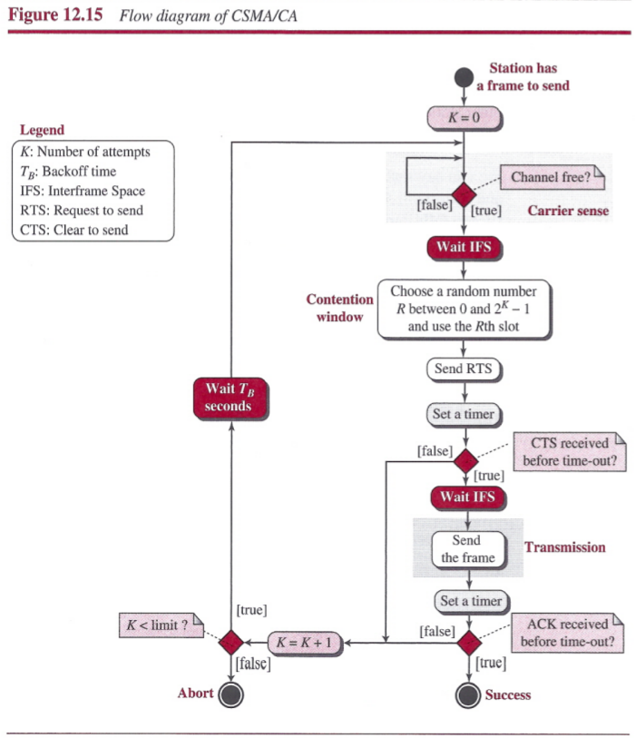

- `Interframe Space (IFS)`: When an idle channel is found, the station waits for a period of time called the `interframe space` or `IFS`. Even through the channel may appear idle when it is sensed, a distant station may have already started transmitting, the distant station's signal has not yet reached this station. The IFS time allows the front of the transmitted signal by the distant station to reach this station. After waiting an IFS time, if the channel is still idle, the station can send, but it still needs to wait a time equal to the contention window. The IFS variable can also be used to prioritize stations or frame types.
- `Contention Window`: The contention window is an amount of time divided into slots. A station that is ready to send chooses a random number of slots as its wait time. The number of slots in the window changes according to the binary exponential backoff strategy. One interesting point about the contention window is that the station needs to sense the channel after each time slot. However, if the station finds the channel busy, it does not restart the process; it just stops the timer and restarts it when the channel is sensed as idle. This gives priority to the station with the longest waiting time.

 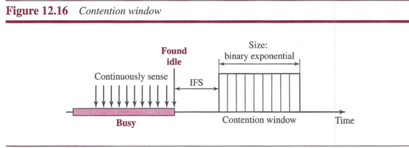

- `Acknowledgment`: The positive acknowledgment and the time-out timer can help guarantee that the receiver has received the frame.

##### Frame Exchange Time Line
The exchange of data and control frames in time:
1. Before sending a frame, the source station senses the medium by checking the energy level at the carrier frequency.
 1. The channel uses a persistence strategy with backoff until the channel is idle.
 2. After the station is found to be idle, the station waits for a period of time called the `DCF interframe space (DIFS)`; then the station sends a control frame called the `request to send (RTS)`.
2. After receiving the RTS and waiting a period of time called the `short interframe space (SIFS)`, the destination station sends a control frame, called the `clear to send (CTS)`, to the source station. This control frame indicates that the destination station is ready to receive data.
3. The source station sends data after waiting an amount of time equal to SIFS.
4. The destination station, after waiting an amount of time equal to SIFS, sends an acknowledgment to show that the frame has been received. Acknowledgment is needed in this protocol because the station does not have any means to check for the successful arrival of its data at the destination. On the other hand, the lack of collision in CSMA/CD is a kind of indication to the source that data have arrived.

##### Network Allocation Vector
When a station sends an RTS frame, it includes the duration of time that it needs to occupy the channel. The stations that are affected by this transmission create a timer called a `network allocation vector (NAV)` that shows how much time must pass before these stations are allowed to check the channel for idleness. Each time a station accesses the system and sends an RTS frame, other stations start their NAV.

## Controlled Access
In `controlled access`, the stations consult one another to find which station has the right to send. There are three controlled-access methods: `reservation`, `polling`, and `token-passing`.

### Reservation
In the `reservation` method, a station needs to make a reservation before sending data. Time is divided into intervals. In each interval, a reservation frame precedes the data frames sent in that interval.

### Polling
`Polling` works with topologies in which one device is designated as a `primary station` and the other devices are `secondary stations`. All data exchanges must be made through the primary device even when the ultimate destination is a secondary device.
- The `select` function is used whenever the primary device has something to send.
- The `poll` function is used by the primary device to solicit transmission from the secondary devices.

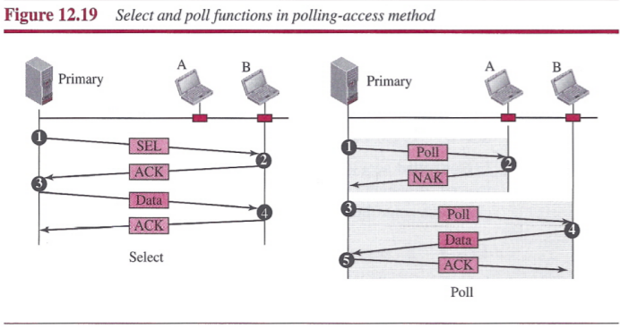

### Token Passing
In the `token-passing` method, the stations in a network are organized in a logical ring. For each station, there is a `predecessor` and a `successor`. A special packet called a `token` circulates through the ring. The possession of the token gives the station the right to access the channel and send its data.

## Channelization
`Channelization` is a multiple-access method in which the available bandwidth of a link is shared in time, frequency, or through code, among different stations. We discuss three channelization protocols: `FDMA`, `TDMA`, and `CDMA`.

### FDMA
In FDMA, the available bandwidth of the common channel is divided into bands that are separated by guard bands.

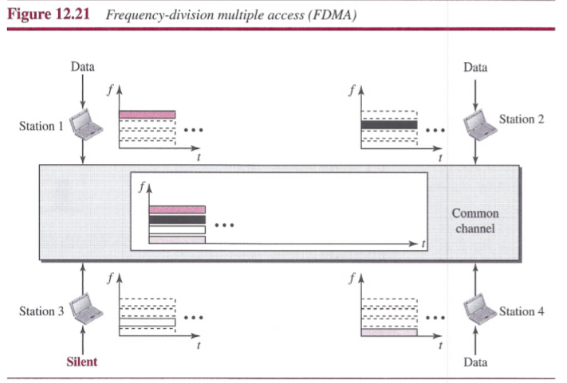

### TDMA
In TDMA, the bandwidth is just one channel that is timeshared between different stations.

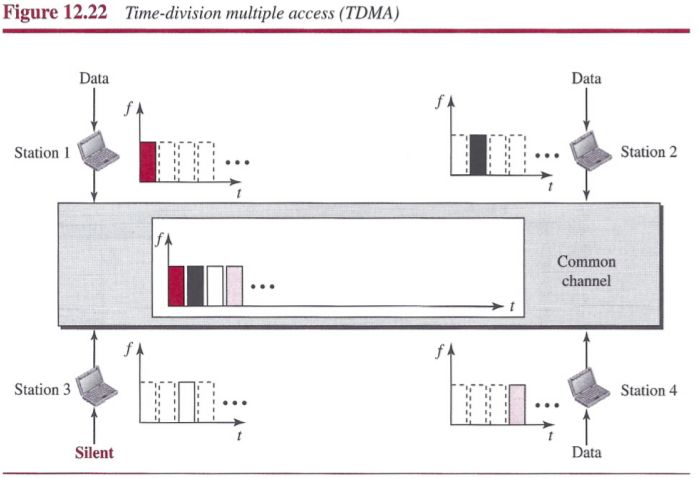

### CDMA
In CDMA, one channel carries all transmissions simultaneously.

##### Data Representation

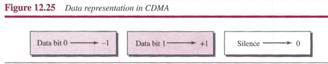

##### Encoding and Decoding

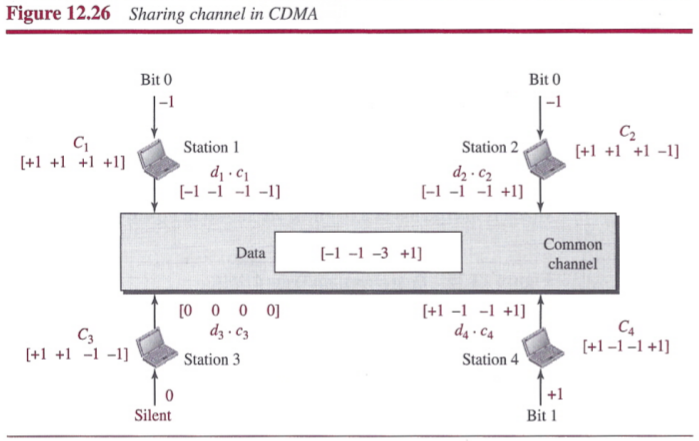

##### Signal Level

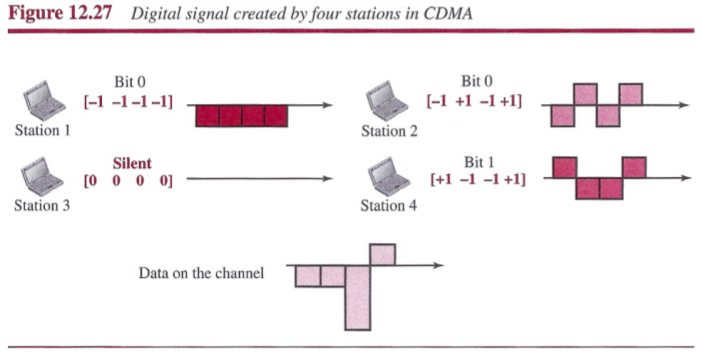

##### Sequence Generation

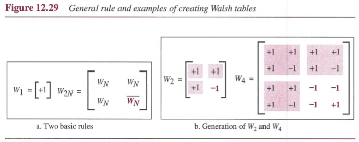

## Summary
- Many formal protocols have been devised to handle access to a shared link. We categorize them into three groups: random access protocols, controlled access protocols, and channelization protocols.
- In random access or contention methods, no station is superior to another station and none is assigned the control over another.
- ALOHA allows multiple access (MA) to the shared medium. There are potential collisions in this arrangement.
- To minimize the chance of collision and, therefore, increase the performance, the CSMA method was developed. The chance of collision can be reduced if a station senses the medium before trying to use it. Carrier sense multiple access (CSMA) requires that each station first listen to the medium before sending.
- Carrier sense multiple access with collision detection (CSMA/CD) augments the CSMA algorithm to handle collision. In this method, a station monitors the medium after it sends a frame to see if the transmission
was successful. If so, the station is finished. If, however, there is a collision, the frame is sent again.
- To avoid collisions on wireless networks, carrier sense multiple access with collision avoidance (CSMA/CA) was invented. Collisions are avoided through the use of three strategies: the interframe space, the contention window, and acknowledgments.
- In controlled access, the stations consult one another to find which station has the right to send. A station cannot send unless it has been authorized by other stations. We discussed three popular controlled-access methods: reservation, polling, and token passing.
- In the reservation access method, a station needs to make a reservation before sending data. Time is divided into intervals. In each interval, a reservation frame precedes the data frames sent in that interval.
- In the polling method, all data exchanges must be made through the primary device even when the ultimate destination is a secondary device. The primary device controls the link; the secondary devices follow its instructions.
- In the token-passing method, the stations in a network are organized in a logical ring. Each station has a predecessor and a successor. A special packet called a token circulates through the ring.
- Channelization is a multiple-access method in which the available bandwidth of a link is shared in time, frequency, or through code, between different stations. We discussed three channelization protocols: FDMA, TDMA, and CDMA.
- In frequency-division multiple access (FDMA), the available bandwidth is divided into frequency bands. Each station is allocated a band to send its data. In other words, each band is reserved for a specific station, and it belongs to the station all the time.
- In time-division multiple access (TDMA), the stations share the bandwidth of the channel in time. Each station is allocated a time slot during which it can send data. Each station transmits its data in its assigned time slot.
- In code-division multiple access (CDMA), the stations use different codes to achieve multiple access. CDMA is based on coding theory and uses sequences of numbers called chips. The sequences are generated using orthogonal codes such as the Walsh tables.
