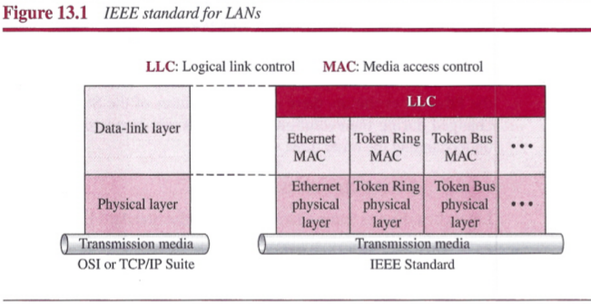
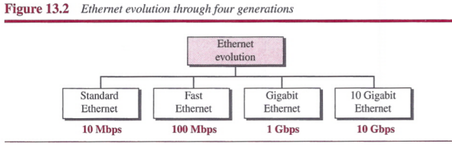
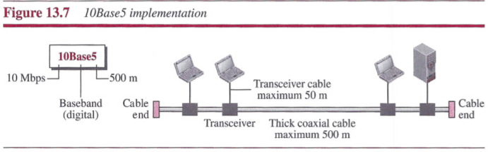
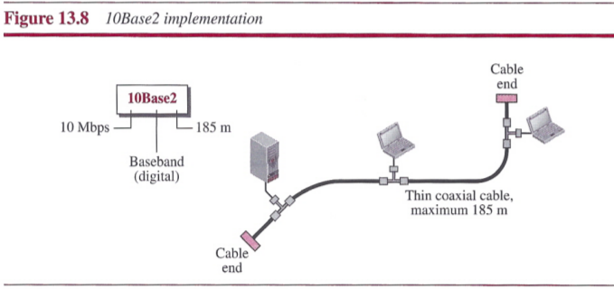
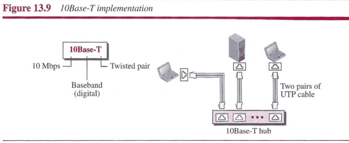
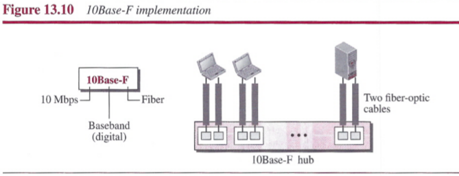
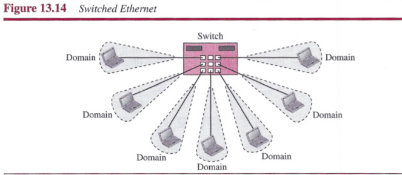
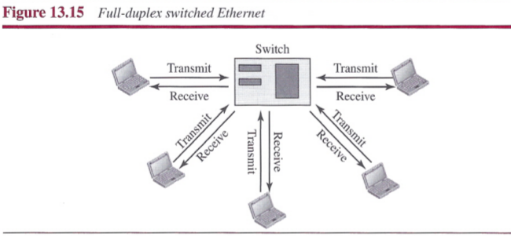

# Chapter 13: Wired LANs: Ethernet

## Ethernet Protocol

### IEEE Project 802

## Standard Ethernet

### Characteristics

#### Connectionless and Unreliable Service

Ethernet provides a connectionless service, which means each frame sent is independent of the previous or next frame.

#### Frame Format

The Ethernet frame contains seven fields:

- `Preamble`. This field contains 7 bytes (56 bits) of alternating Os and Is that alert the receiving system to the coming frame and enable it to synchronize its clock if it's out of synchronization. The pattern provides only an alert and a timing pulse. The `preamble` actually added at the physical layer and is not part of the frame.
- `Start frame delimiter (SFD)`. This filed (1 byte: 10101011) signals the beginning of the frame. The last 2 bits are (11)2 and alert the receiver that the next field is the destination address. The SFD filed is also added at the physical layer.
- `Destination address (DA)`. This field is six bytes (48 bits) and contains the link-layer address of the destination station or stations to receive the packet.
- `Source address (SA)`. This field is also six bytes and contains the link-layer address of the sender of the packet.
- `Type`. This field defines the upper-layer protocol whose packet is encapsulated in the frame.
- `Data`. This field carries data encapsulated from the upper-layer protocols. It is a minimum of 46 and a maximum of 1500 bytes.
- `CRC`. The last field contains error detection information, in this case a CRC-32.

#### Frame Length

- Minimum frame length: 64 bytes
- Maximum frame length: 1518 bytes
- Minimum data length: 46 bytes
- Maximum data length: 1500 bytes

### Addressing

Each station on an Ethernet network has its own `network interface card (NIC)`. The NIC fits inside the station and provides the station with a link-layer address. The Ethernet address is 6 bytes (48 bits), normally written in hexadecimal notation, with a colon between the bytes. For example, **47:20:1B:2E:08:EE**.

#### Transmission of Address Bits

The address is sent left to right, byte by byte; for each byte, it is sent right to left, bit by bit.

#### Unicast, Multicast, and Broadcast Address

If the least significant bit of the first byte in a destination address is 0, the address is unicast; otherwise, it is multicast. The broadcast address is a special case of the multicast address, its address is forty-eight 1s.

#### Distinguish Between Unicast, Multicast, and Broadcast Transmission

Standard Ethernet uses a bus topology or a star topology. Transmission in the standard Ethernet is always broadcast, no matter if the intention is unicast, multicast, or broadcast. The way to distinguish them is whether the frames are kept or not.

- In a unicast transmission, all stations will receive the frame, the intended recipient keeps and handles the frame; the rest discard it.
- In a multicast transmission, all stations will receive the frame, the stations that are members of the group keep and handle it; the rest discard it.
- In a broadcast transmission, all stations will receive the frame and all stations keep and handle it.

### Access Method

The standard Ethernet use CSMA/CD with 1-persistent method.

### Efficiency of Standard Ethernet

The efficiency of the Ethernet is defined as the ratio of the time used by a station to send data to the time the medium is occupied by this station. **Efficiency = 1/(1 + 6.4 x a)**, in which the *a* is the number of frames that can fit on the medium.

### Implementation

The standard Ethernet uses a baseband signal, which means that the bits are changed to a digital signal and directly sent on the line.

### Changes in the Standard

#### Bridged Ethernet

Bridgeds have two effects on an Ethernet LAN: raise the bandwidth and separate collision domains.

- `Raising the Bandwidth`: A bridge divides the network into two or more networks. Bandwidthwise, each network is independent.

 

- `Separate Collision Domains`: The collision domain becomes mush smaller and the probability of collision is reduced tremendously.

 

#### Switched Ethernet

A layer-2 `switch` is an N-port bridge with additional sophistication that allows faster handling of the packets.

#### Full-Duplex Ethernet

## Fast Ethernet (100 Mbps)

The goals of Fast Ethernet can be summarized as follows:

- Upgrade the data rate to 100 Mbps.
- Make it compatible with Standard Ethernet.
- Keep the same 48-bit address.
- Keep the same frame format.

#### Autonegotiation

A new feature added to Fast Ethernet is called `autonegotiation`. Autonegotiation allows two devices to negotiate the mode or data rate of operation.

### Physical Layer

#### Topology

Three or more stations need to be connected in a star topology with a hub or a switch at the center.

#### Encoding

Three different encoding schemes were chosen.

#### Summary

## Gigabit Ethernet

The goals of the Gigabit Ethernet design can be summarized as follows:

- Upgrade the data rate to I Gbps.
- Make it compatible with Standard or Fast Ethernet.
- Use the same 48-bit address.
- Use the same frame format.
- Keep the same minimum and maximum frame lengths.
- Support autonegotiation as defined in Fast Ethernet.

### MAC Sublayer

Gigabit Ethernet has two distinctive approaches for medium access: half-duplex and fullduplex. Almost all implementations of Gigabit Ethernet follow the full-duplex approach. In the full-duplex mode of Gigabit Ethernet, there is-no collision; the maximum length of the cable is determined by the signal attenuation in the cable.

### Physical Layer

#### Encoding

#### Summary

## 10 Gigabit Ethernet

#### Summary

## Summary

- Ethernet is the most widely used local area network protocol.
- The IEEE 802.3 Standard defines 1-persistent CSMA/CD as the access method for first-generation 1O-Mbps Ethernet.
- The data-link layer of Ethernet consists of the LLC sublayer and the MAC sublayer.
- The MAC sublayer is responsible for the operation of the CSMA/CD access method and framing. Each station on an Ethernet network has a unique 48-bit address imprinted on its network interface card (NIC). The minimum frame length for 1O-Mbps Ethernet is 64 bytes; the maximum is 1518 bytes.
- The common implementations of 1O-Mbps Ethernet are 10Base5 (thick Ethernet), 10Base2 (thin Ethernet), 10Base-T (twisted-pair Ethernet), and 10Base-F (fiber Ethernet).
- The 10Base5 implementation of Ethernet uses thick coaxial cable. 10Base2 uses thin coaxial cable. 10Base-T uses four twisted-pair cables that connect each station to a common hub. 10Base-F uses fiber-optic cable.
- A bridge can increase the bandwidth and separate the collision domains on an Ethernet LAN.
- A switch allows each station on an Ethernet LAN to have the entire capacity of the network to itself.
- Full-duplex mode doubles the capacity of each domain and removes the need for the CSMA/CD method.
- Fast Ethernet has a data rate of 100 Mbps.
- In Fast Ethernet, autonegotiation allows two devices to negotiate the mode or data rate of operation.
- The common Fast Ethernet implementations are 100Base-TX (two pairs of twisted-pair cable), 100Base-FX (two fiber-optic cables), and 100Base-T4 (four pairs of voice-grade, or higher, twisted-pair cable).
- Gigabit Ethernet has a data rate of 1000 Mbps.
- Gigabit Ethernet access methods include half-duplex mode using traditional CSMA/CD (not common) and full-duplex mode (most popular method).
- The common Gigabit Ethernet implementations are 1000Base-SX (two optical fibers and a short-wave laser source), 1000Base-LX (two optical fibers and a long-wave laser source), and 1000Base-T (four twisted pairs).
- The latest Ethernet standard is 10 Gigabit Ethernet, which operates at 10 Gbps. The four common implementations are lOGBase-SR, lOGBase-LR, lOGBase-EW, and 10GBase-X4. These implementations use fiber-optic cables in full-duplex mode.
