# Chapter 14: Other Wired Network

## Telephone Networks

### Major Components

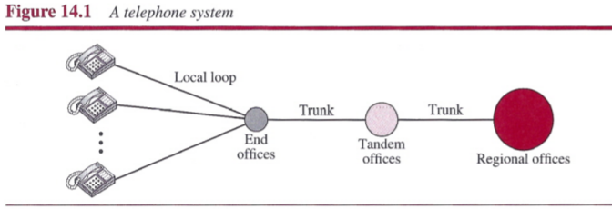

### Signaling

The tasks of data transfer and signaling are separated in modern telephone networks: data transfer is done by one network, signaling by another.

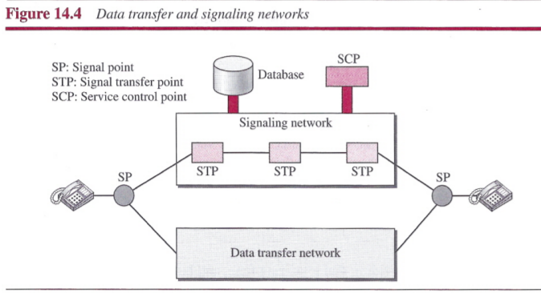

#### Signaling System Seven (SS7)

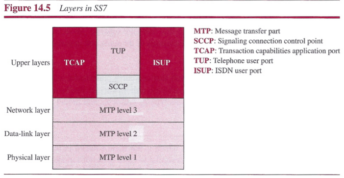

### Services Provided by Telephone Networks

- Analog Services
  - Analog Switched Services
  - Analog Leased Services
- Digital Services
  - Switched/56 Service
  - Digital Data Service

### Dial-Up Service

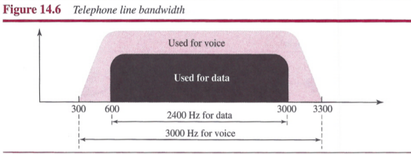

`Modem` stands for modulator/demodulator.

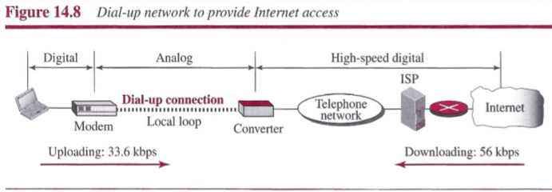

### Digital Subscriber Line (DSL)

`Digital subscriber line (DSL)` technology is one of the most promising for supporting high-speed digital communication over the existing telephone. The first technology in the set is `asymmetric DSL (ADSL)`, it provides higher speed in the downstream direction than in the upstream direction.

## Cable Networks

### Traditional Cable Networks

### Hybrid Fiber-Coaxial (HFC) Network

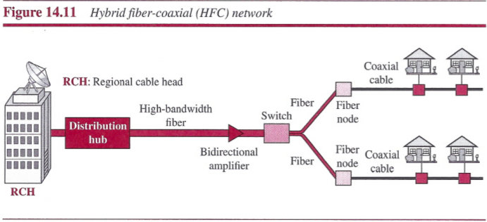

### Cable TV for Data Transfer

#### CM and CMTS

## SONET

SONET is used as a transport network to carry loads from other WANs. SONET (Synchronous Optical Network) was developed by ANSI; SDH (Synchronous Digital Hierarchy) was developed by ITU-T.

### Architecture

The architecture of a SONET: `signals`, `devices`, and `connections`.

#### Signals

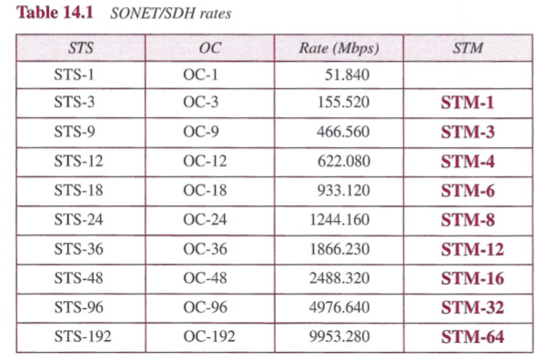

- `STSs`: synchronous transport signals
- `OCs`: optical carriers
- `STM`: synchronous transport module

#### SONET Devices

SONET transmission relies on three basic devices: STS multiplexers/demultiplexers, regenerators, add/drop multiplexers and terminals.

- `STS MultiplexerlDemultiplexer`: STS multiplexers/demultiplexers mark the beginning points and endpoints of a SONET link. They provide the interface between an electrical tributary network and the optical network. An STS multiplexer multiplexes signals from multiple electrical sources and creates the corresponding OC signal. An STS demultiplexer demultiplexes an optical OC signal into corresponding electric signals.
- `Regenerator`: Regenerators extend the length of the links. A regenerator is a repeater that takes a received optical signal (OC-n), demodulates it into the corresponding electric signal (STS-n), regenerates the electric signal, and finally modulates the electric signal into its correspondent OC-n signal. A SONET regenerator replaces some of the existing overhead information (header information) with new information.
- `Add/drop Multiplexer`: Add/drop multiplexers allow insertion and extraction of signals. An add/drop multiplexer (ADM) can add STSs coming from different sources into a given path or can remove a desired signal from a path and redirect it without demultiplexing the entire signal. Instead of relying on timing and bit positions, add/drop multiplexers use header information such as addresses and pointers to identify individual streams.
- `Terminals`: A terminal is a device that uses the services of a SONET network.

#### Connections

- `Sections`: A section is the optical link connecting two neighboring devices: multiplexer to multiplexer, multiplexer to regenerator, or regenerator to regenerator.
- `Lines`: A line is the portion of the network between two multiplexers: STS multiplexer to add/drop multiplexer, two add/drop multiplexers, or two STS multiplexers.
- `Paths`: A path is the end-to-end portion of the network between two STS multiplexers.

### SONET Layers

SONET defines four layers: `path`, `line`, `section`, and `photonic`.

- `Line Layer`: The line layer is responsible for the movement of a signal across a physical line. Line layer overhead is added to the frame at this layer. STS multiplexers and add/drop multiplexers provide line layer functions.
- `Section Layer`: The section layer is responsible for the movement of a signal across a physical section. It handles framing, scrambling, and error control. Section layer overhead is added to the frame at this layer.
- `Photonic Layer`: The photonic layer corresponds to the physical layer of the OSI model. It includes physical specifications for the optical fiber channel, the sensitivity of the receiver, multiplexing functions, and so on. SONET uses NRZ encoding, with the presence of light representing 1 and the absence of light representing 0.

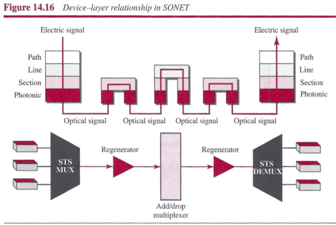

### SONET Frames

Each synchronous transfer signal STS-n is composed of 8000 frames. Each frame is a two-dimensional matrix of bytes with 9 rows by 90 x n columns.

#### Frame, Byte, and Bit Transmission

- A SONET STS-n signal is transmitted at 8000 frames per second.
- Each byte in a SONET frame can carry a digitized voice channel.
- The data rate of an STS-n signal is n times the data rate of an STS-1 signal.

#### STS-1 Frame Format

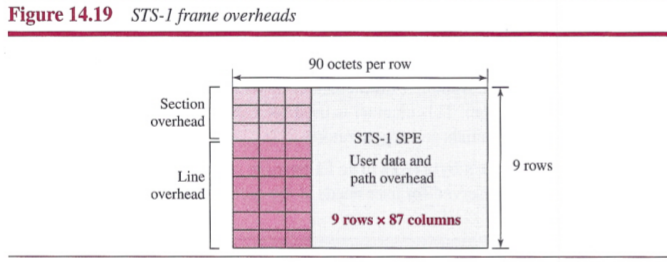

**Section Overhead**: Section overhead is recalculated for each SONET device (regenerators and multiplexers).

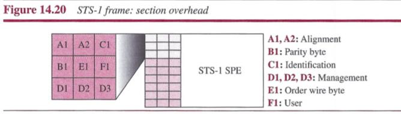

**Line Overhead**

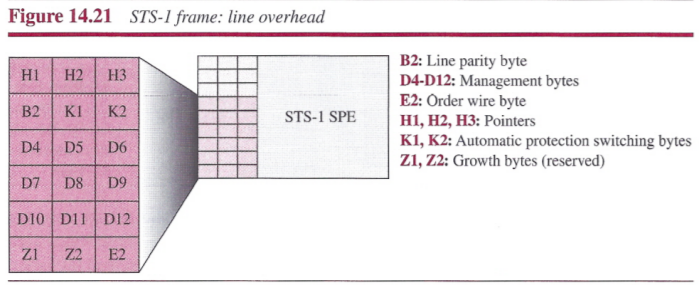

**Synchronous Payload Envelope**: Path overhead is only calculated for end-to-end (at STS multiplexers).

#### Overhead Summary

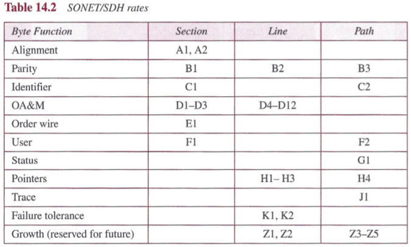

#### Encapsulation

The previous discussion reveals that an SPE needs to be encapsulated in an STS-1 frame. Encapsulation may create two problems that are handled elegantly by SONET using pointers (H1 to H3).

**Offsetting**: SONET allows one SPE to span two frames; part of the SPE is in the first frame and part is in the second. This may happen when one SPE that is to be encapsulated is not aligned timewise with the passing synchronized frames.

To find the beginning of each SPE in a frame, we need two pointers, H1 and H2, in the line overhead.

### STS Multiplexing

In SONET, frames of lower rate can be synchronously time-division multiplexed into a higher-rate frame. In SONET, all clocks in the network are locked to a master clock.

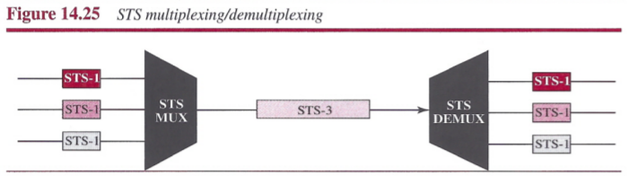

#### Byte Interleaving

Synchronous TDM multiplexing in SONET is achieved by using `byte interleaving`.

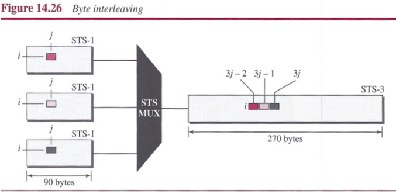

#### Concatenated Signal

SONET allows us to create an STS-n signal that is not considered as n STS-1 signals; it is one STS-n signal (channel) that cannot be demultiplexed into n STS-1 signals.

#### Add/Drop Multiplexer

SONET uses add/drop multiplexers that can replace one signal with another.

### SONET Networks

We can divide SONET networks into three categories: linear, ring, and mesh networks.

#### Linear Networks

**Automatic Protection switching**: To create protection against failure in linear networks, SONET defines automatic protection switching CAPS). APS in linear networks is defined at the line layer, which means the protection is between two ADMs or a pair of STS multiplexer/demultiplexers. The idea is to provide redundancy; a redundant line (fiber) can be used in case of failure in the main one.

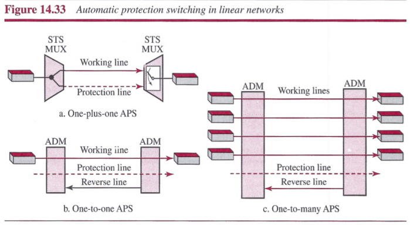

#### Ring Networks

**Unidirectional Path Switching Ring**: A unidirectional path switching ring (UPSR) is a unidirectional network with two rings: one ring used as the working ring and the other as the protection ring. The same signal flows through both rings, one clockwise and the other counterclockwise. It is called UPSR because monitoring is done at the path layer.

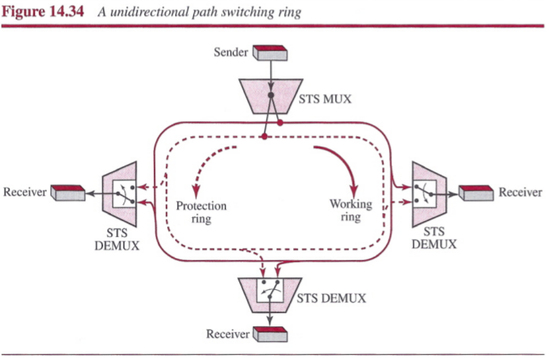

**Bidirectional Line Switching Ring**: A bidirectional line switching ring (BLSR) uses four rings. Two rings for working lines and two rings for protection lines.

#### Mesh Networks

A mesh network with switches give better performance.

### Virtual Tributaries

To make SONET backward-compatible with the current hierarchy, its frame design includes a system of virtual tributaries (VTs). A virtual tributary is a partial payload that can be inserted into an STS-1 and combined with other partial payloads to fill out the frame.

#### Types of VTs

## ATM

`Asynchronous Transfer Mode (ATM)` is a switched wide area network based on the `cell relay` protocol designed by the ATM forum and adopted by the ITU-T.

### Design Goals

Among the challenges faced by the designers of ATM, six stand out.

1. Foremost is the need for a transmission system to optimize the use of high- data-rate transmission media, in particular optical fiber.
2. The system must interface with existing systems and provide wide-area interconnectivity between them without lowering their effectiveness or requiring their replacement.
3. The design must be implemented inexpensively so that cost would not be a barrier to adoption.
4. The new system must be able to work with and support the existing telecommunications hierarchies.
5. The new system must be connection-oriented to ensure accurate and predictable delivery.
6. One objective is to move as many of the functions to hardware as possible and eliminate as many software functions as possible.

### Architecture

ATM is a cell-switched network. The user access devices, called the endpoints, are connected through a `user-to-network interface (UNI)` to the switches inside the network. The switches are connected through `network-to-network interfaces (NNIs)`.

#### Virtual Connection

Connection between two endpoints is accomplished through transmission paths (TP), virtual paths (VP), and virtual circuits (VC).

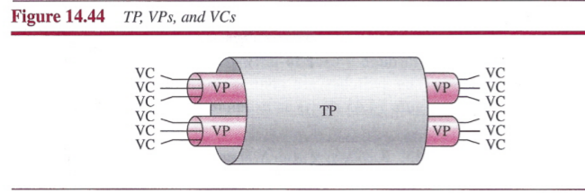

#### Identifiers

ATM uses a hierarchical identifier with two levels: a virtual-path identifier (VPI) and a virtual-circuit identifier (VCI).

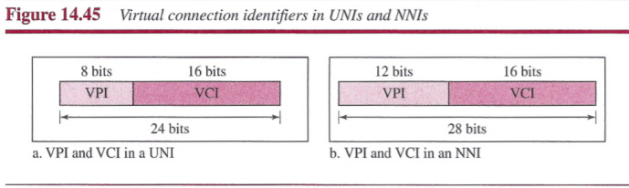

#### Cells

The basic data unit in an ATM network is called a cell.

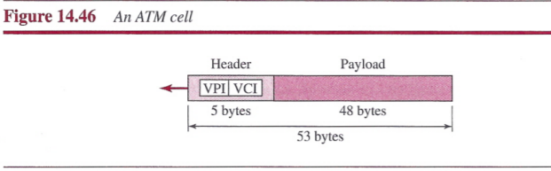

#### Connection Establishment and Release

ATM uses two types of connections: PVC and SVC:

- `PVC`: A permanent virtual-circuit connection (PVC) is established between two endpoints by the network provider.
- `SVC`: In a switched virtual-circuit connection (SVC), each time an endpoint wants to make a connection with another endpoint, a new virtual circuit must be established.

#### Switching

ATM uses switches to route the cell from a source endpoint to the destination endpoint. A switch routes the cell using both the VPIs and the VCIs.

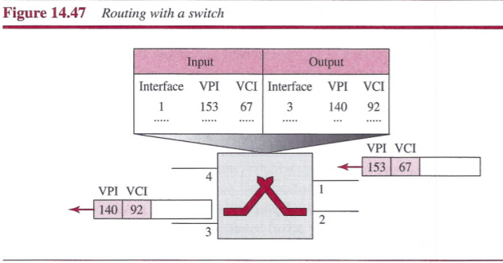

#### ATM Layers

The ATM standard defines three layers. They are, from top to bottom, the application adaptation layer, the ATM layer, and the physical layer. The endpoints use all three layers while the switches use only the two bottom layers.

