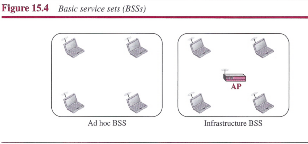
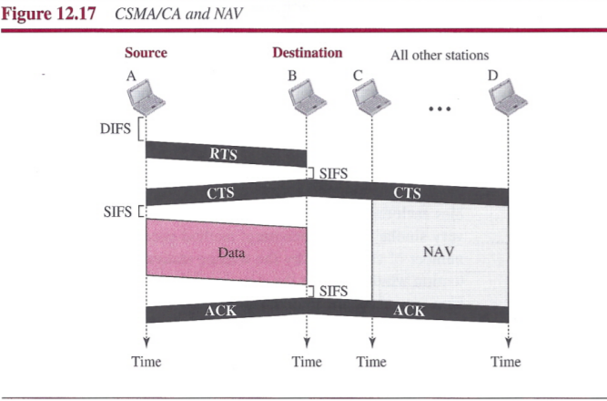
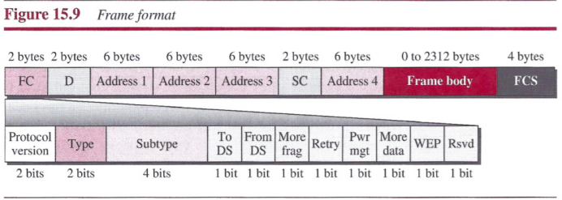
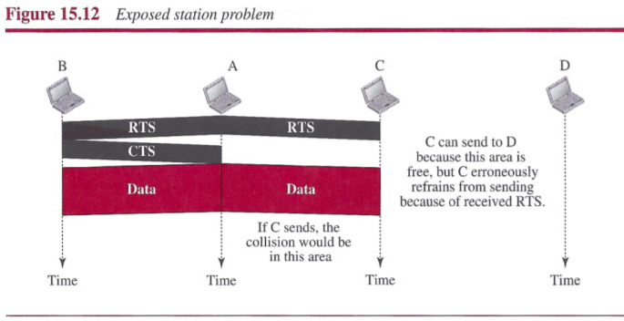
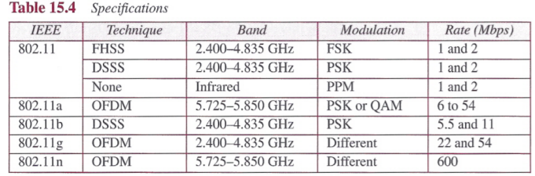
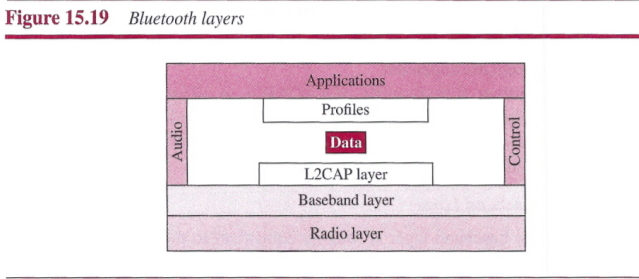
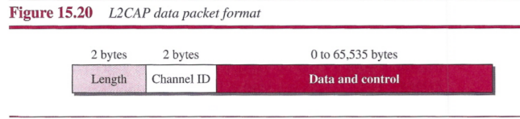
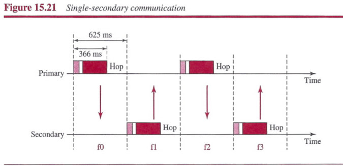
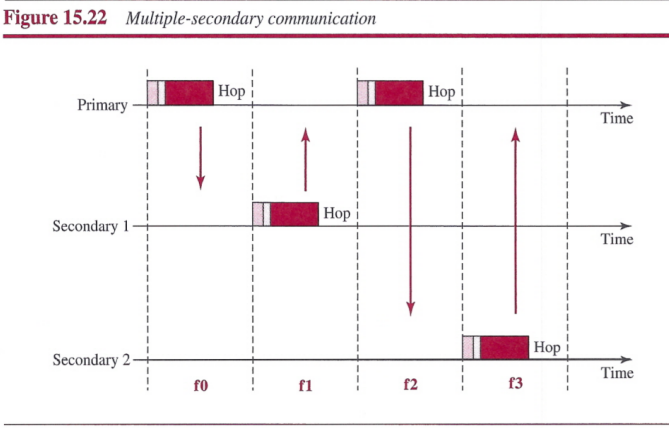
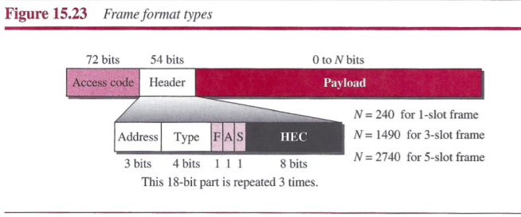

# Chapter 15: Wireless LANs
## IEEE 802.11 Project
IEEE has defined the specifications for a wireless LAN, called IEEE 802.11, which covers the physical and data-link layers.

### Architecture
##### Basic Service Set
IEEE 802.11 defines the `basic service set (BSS)` as the building blocks of a wireless LAN. A basic service set is made of stationary or mobile wireless stations and an optional central base station, known as the `access point (AP)`.
- `Ad hoc architecture`: The BSS without an AP is a stand-alone network and cannot send data to other BSSs.
- `Infrastructure BSS`: A BSS with an AP.

##### Extended Service Set
An `extended service set (ESS)` is made up of two or more BSSs with APs. The BSSs are connected through a distribution system, which is a wired or a wireless network. The distribution system connects the APs in the BSSs.

##### Station Types
IEEE 802.11 defines three types of stations based on their mobility in a wireless LAN: no-transition, BSS-transition, and ESS-transition mobility.

### MAC Sublayer
IEEE 802.11 defines two MAC sublayers: the `distributed coordination function (DCF)` and `point coordination function (PCF)`.

##### Distributed Coordination Function
DCF uses CSMA/CA as the access method. ([Chapter 12](./chapter-12.md#L96))

##### Point Coordination Function (PCF)
The `point coordination function (PCF)` is an optional access method that can be implemented in an infrastructure network. It is implemented on top of the DCF and is used mostly for time-sensitive transmission.

PCF has a centralized, contention-free polling access method. The AP performs polling for stations that are capable of being polled. The stations are polled one after another, sending any data they have to the AP.

To give priority to PCF over DCF, another interframe space, PIFS, has been defined. PIFS (PCF IFS) is shorter than DIFS. This means that if, at the same time, a station wants to use only DCF and an AP wants to use PCF, the AP has priority.

Due to the priority of PCF over DCF, stations that only use DCF may not gain access to the medium. To prevent this, a repetition interval has been designed to cover both contention-free PCF and contention-based DCF traffic. The repetition interval, which is repeated continuously, starts with a special control frame, called a beacon frame. When the stations hear the beacon frame, they start their NAV for the duration of the contention-free period of the repetition interval. At the end of the contention-free period, the PC sends a CF end(contention-free end) frame to allow the contention-based stations to use the medium.

##### Frame Format
The MAC layer frame consists of nine fields.

- `Frame control (FC)`: defines the type of frame and some control information.
- `D`: defines the duration of the transmission that is used to set the value of NAV.
- `Address`: The meaning of each address field depends on the value of the *To DS* and *From DS* subfields.
- `Sequence control`: the first four bits define the fragment number, the last 12 bits define the sequence number.
- `Frame body`: contains information based on the type and the subtype defined in the FC field.
- `FCS`: contains a CRC-32 error-detection sequence.

##### Frame Types
A wireless LAN defined by IEEE 802.11 has three categories of frames:
- `Management Frames`: Management frames are used for the initial communication between stations and access points.
- `Control Frames`: Control frames are used for accessing the channel and acknowledging frames.
 
- `Data Frames`: Data frames are used for carrying data and control information.

### Addressing Mechanism
The IEEE 802.11 addressing mechanism specifies four cases, defined by the value of the two flags in the FC field, *To DS* and *From DS*.

##### Exposed Station Problem
In the exposed station problem, a station refrains from using a channel when it is, in fact, available.

### Physical Layer
All implementations, except the infrared, operate in the `industrial, scientific, and medical (ISM)` band, which defines three unlicensed bands in the three ranges 902-928 MHz, 2.400-4.835 GHz, and 5.725-5.850 GHz.

## Bluetooth
`Bluetooth` is a wireless LAN technology designed to connect devices of different functions. A Bluetooth LAN is an ad hoc network. Bluetooth technology is the implementation of a protocol defined by the IEEE 802.15 standard. The standard defines a wireless personal-area network (PAN).

### Architecture
Bluetooth defines two types of networks: `piconet` and `scatternet`.

##### Piconet
A Bluetooth network is called a `piconet`. A piconet can have up to eight stations.

##### Scatternet
Piconets can be combined to form what is called a `scatternet`.

##### Bluetooth Devices
A Bluetooth devices has a built-in short-range radio transmitter.

### Bluetooth Layers

##### L2CAP
The `Logical Link Control and Adaptation Protocol (L2CAP)` is roughly equivalent to the LLC sublayer in LANs. It is used for data exchange on an ACL lnk; SCO channels do not use L2CAP.

The L2CAP has specific duties: `multiplexing`, `segmentation and reassembly`, `quality of service (QoS)`, and `group management`.

##### Baseband Layer
The baseband layer is roughly equivalent to the MAC sublayer in LANs. The access method is TDMA. The primary and secondary stations communicate with each other using time slots.

**TDMA**: Bluetooth uses a form of TDMA that is called `TDD-TDMA (time-division duplex TDMA)`. TDD-TDMA is a kind of half-duplex communication in which the sender and receiver send and receive data, but not at the same time (half-duplex); however, the communication for each direction uses different hops.

**Links**: Two types of links can be created between a primary and a secondary: SCO links and ACL links.
- `SCO`: A synchronous connection-oriented (SCO) link is used when avoiding latency (delay in data delivery) is more important than integrity (error-free delivery).
- `ACL`: An asynchronous connectionless link (ACL) is used when data integrity is more important than avoiding latency.

**Frame Format**: A frame in the baseband layer can be one of three types: `one-slot`, `three slot`, or `five-slot`.

##### Radio Layer
The radio layer is roughly equivalent to the physical layer of the Internet model. Bluetooth uses the `frequency-hopping spread spectrum (FHSS)` method in the physical layer to avoid interference.

## Summary
- The nature and characteristics of a wireless network are different from those of a wired network. There are some issues in a wireless network that are negligible in a wired network. Access control in a wireless LAN is also different from that in a wired LAN because of some issues such as the hidden station problem.
- Wireless LANs became formalized with the IEEE 802.11 standard, which defines two services: basic service set (BSS) and extended service set (ESS).
- The access method used in the distributed coordination function (DCF) MAC sublayer is CSMA/CA.
- The access method used in the point coordination function (PCF) MAC sublayer is polling.
- A frame in this network carries four addresses to define the original and previous sources and immediate and final destinations. There are other frame types in this network to handle access control and data transfer.
- Bluetooth is a wireless LAN technology that connects devices (called gadgets) in a small area.
- A Bluetooth network is called a piconet. Piconets can be combined to form what is called a scatternet.
- Bluetooth uses several layers that do not exactly match those of the Internet model we have defined in this book. L2CAP is roughly equivalent to the LLC sublayer in LANs. The baseband layer is roughly equivalent to the MAC sublayer in LANs. The access method is TDMA.
