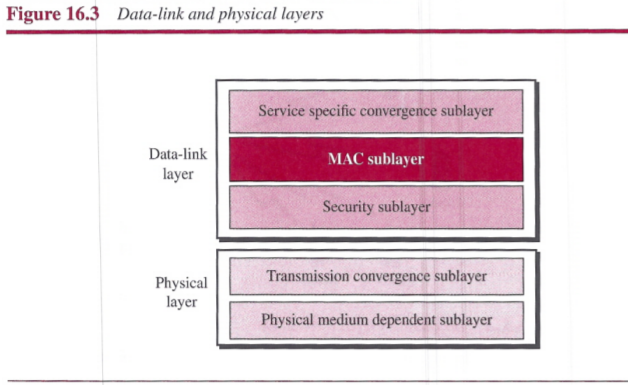
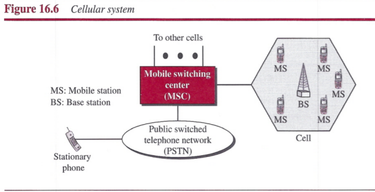
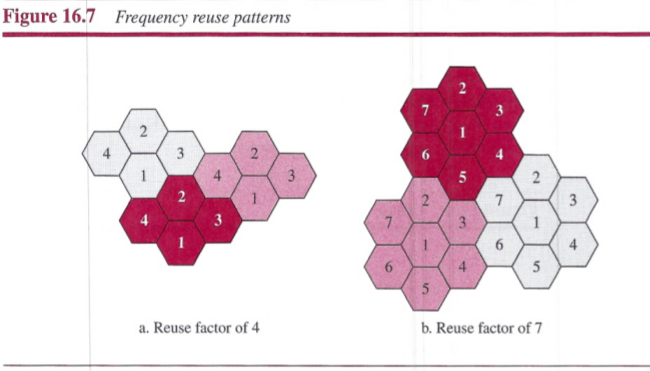

# Chapter 16: Other Wireless Network
## WiMAX
The `Worldwide Interoperability for Microwave Access (WiMAX)` has been designed for the purpose of providing wireless access to the Internet.

### Services
WiMAX provides two types of services to subscribers: `fixed` and `mobile`.

##### Fixed WiMAX

##### Mobile WiMAX

### IEEE Project 802.16
WiMAX is the result of the IEEE 802.16 project.
- `802.11`
 - is a standard for a wireless LAN
 - defines a connectionless communication
- `802.16`
 - is a standard for a wireless WAN
 - defines a connection-oriented service

### Layers in Project 802.16
IEEE has divided the data-link layer into three sublayers and the physical layer into tow sublayers.

##### Service Specific Convergence Sublayer
This is actually the DLC sublayer revised for broadband wireless communication. It has been devised for a connection-oriented service in which each connection may benefit from a specific quality of service (QoS),

##### MAC Sublayer
The MAC sublayer defines the access method and the format of the frame. It is a sublayer designed for connection-oriented service.

**Access Method**: WiMAX uses the reservation access method.

**Frame Format**: We distinguish two types of frames: `generic` and `control`. The first is used to send and receive payload; the second is used only during the connection establishment.

**Addressing**: This protocol is a connection-oriented protocol that uses a connection identifier or virtual connection identifier (VCI). Each frame then uses the same connection identifier for the duration of data transfer.

##### Security Sublayer
Security sublayer provides security for communication using WiMAX.

##### Transmission Convergence Sublayer
The transmission convergence sublayer uses TDD (time-division duplex). The physical layer packs the frames received from the data-link layer into two subframes at the physical layer.

##### Physical Medium Dependent Sublayer
This sublayer is in continuous revision.

## Cellular Telephony
Each cellular service area is divided into small regions called cells. Each cell contains an antenna and is controlled by a `base station (BS)`. Each base station, in turn, is controlled by a switching office, called a `mobile switching center (MSC)`.

### Operation
##### Frequency-Reuse Principle
A frequency reuse pattern is a configuration of *N* cells, *N* being the reuse factor, in which each cell uses a unique set of frequencies.

## Summary
- WiMAX is a wireless version of the wired access networks we discussed in Chapter 14. Two services are provided by WiMAX, fixed and mobile. WiMAX is based on the IEEE Project 802.16, which defines a wireless connection-oriented protocol. In WiMAX, the data-link layer is divided into three sublayers, and the physical layer is divided into two sublayers. WiMAX uses the reservation access method we discussed in Chapter 12.
- Cellular telephony provides communication between two devices. One or both may be mobile. A cellular service area is divided into cells. Advanced Mobile Phone System (AMPS) is a first-generation cellular phone system. Digital AMPS (D-AMPS) is a second-generation cellular phone system that is a digital version of AMPS. Global System for Mo?ile Communication (GSM) is a second-generation cellular phone system used in Europe. Interim Standard 95 (IS-95) is a second-generation cellular phone system based on CDMA and DSSS. The third-generation cellular phone system provides universal personal communication. The fourth generation is the new generation of cellular pho~es that are becoming popular.
- A satelVte network uses satellites to provide communication between any points on Earth. A geostationary Earth orbit (GEO) is at the equatorial plane and revolves in phase with Earth's rotation. Global Positioning System (GPS) satellites are medium-Earth-orbit (MEa) satellites that provide time and location information for vehicles anf ships. Iridium satellites are low-Earth-orbit (LEO) satellites that provide direct 9niversal voice and data communications for handheld terminals. Teledesic satellites are low-Earth-orbit satellites that will provide universal broadband Internet access.
