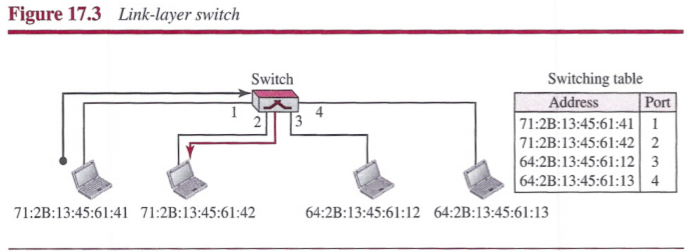

# Chapter 17: Connecting Devices and Virtual LANs
## Connecting Devices
We use `connecting devices` to connect hosts together to make a network or to connect networks together to make an internet.

### Hubs
A hub is a physical-layer device. They do not have a link-layer address and they do not check the link-layer address of the received frame. They just regenerate the corrupted bits and send them out from every port.

### Link-Layer Switches
A link-layer operates in both the physical and the data-link layers.

##### Filtering
A link-layer switch has a table used in filtering decisions. A link-layer switch does not change the link-layer (MAC) addresses in a frame.

##### Transparent Switches
A `transparent switch` is a switch in which the stations are completely unaware of the switch's existence. A system equipped with transparent switches must meet three criteria:
- Frames must be forwarded from one station to another.
- The forwarding table is automatically made by learning frame movements in the network.
- Loops in the system must be prevented.

**Learning**: The switch inspects both the destination and the source addresses in each frame that passes through the switch. The destination address is used for the forwarding decision (table lookup); the source address is used for adding entries to the table and for updating purposes.

##### Adcantages of Switches
- `Collision Elimination`: In a switched LAN, there is no need for carrier sensing and collision detection; each host can transmit at any time.
- `Connecting Heterogenous Devices`: A link-layer switch can connect devices that use different protocols at the physical layer (data rates) and different transmission media.

### Routers
A router is a three-layer (physical, data-link, and network) device. A router connects independent networks to form an network. There are three major differences between a router and a repeater or a switch.
1. A router has a physical and logical (IP) address for each of its interfaces.
2. A router acts only on those packets in which the link-layer destination address matches the address of the interface at which the packet arrives.
3. A router changes the link-layer address of the packet (both source and destination) when it forwards the packet.

A router changes the link-layer addresses in a packet.

## Virtual LANs
We can roughly define a `virtual local area network (VLAN)` as a local area network configured by software, not by physical wiring. A LAN can be divided into several logical LANs, called `VLANs`. VLAN technology even allows the grouping of stations connected to different switches in a VLAN.

### Membership
These characteristics can be used to group stations in a VLAN:
- interface number
- MAC addresses
- IP addresses
- multicast IP addresses
- combination

### Communication between Switches
In a multi-switched backbone, each switch must know not only which station belongs to which VLAN, but also the membership of stations connected to other switches. Three methods have been devised for this purpose: `table maintenance`, `frame tagging`, and `time-division multiplexing`.

### Advantages
- `Cost and Time Reduction`: VLANs can reduce the migration cost of stations going from one group to another.
- `Creating Virtual Work Groups`: VLANs can be used to create virtual work groups.
- `Security`: VLANs provide an extra measure of security.

## Summary
- A repeater is a connecting device that operates in the physical layer of the Internet model. A repeater regenerates a signal, connects segments of a LAN, and has no filtering capability.
- A link-layer switch is a connecting device that operates in the physical and data-link layers of the Internet model.
- A transparent switch can forward and filter frames and automatically build its forwarding table. A switch can use the spanning tree algorithm to create a loopless topology.
- A virtual local area network (VLAN) is configured by software, not by physical wiring.
- Membership in a VLAN can be based on port numbers, MAC addresses, IP addresses, IP multicast addresses, or a combination of these features.
- VLANs are cost- and time-efficient, can reduce network traffic, and provide an extra measure of security.
