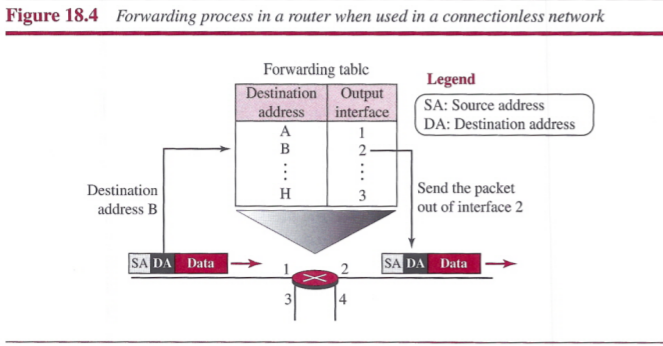
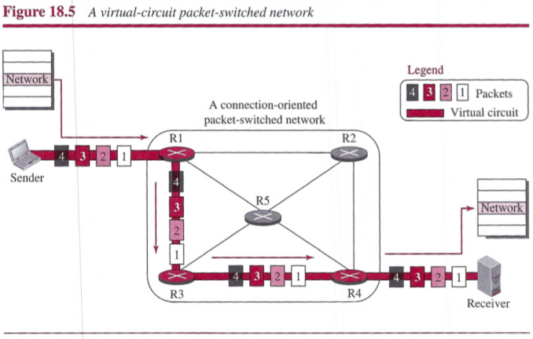
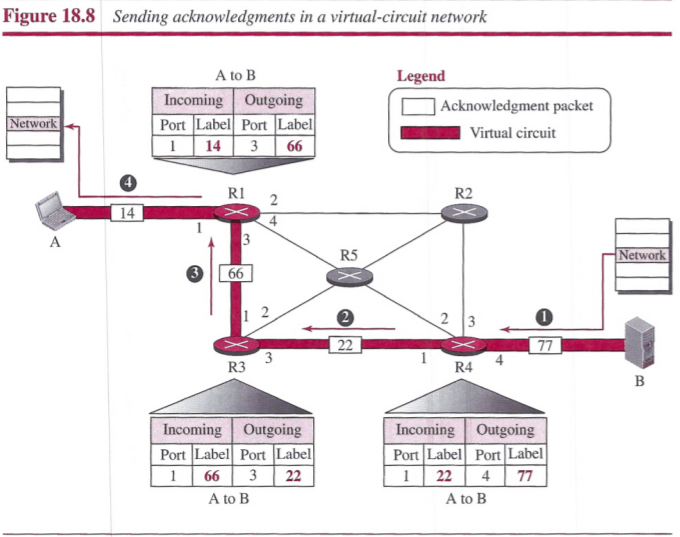
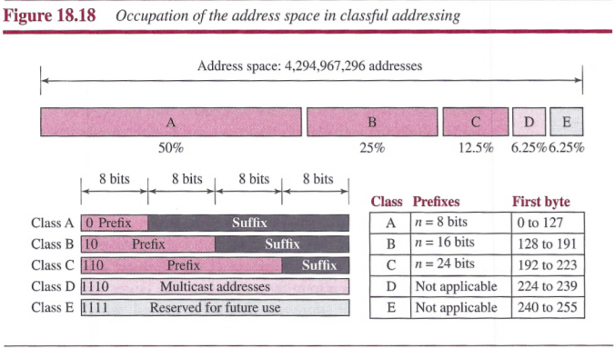
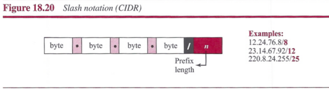
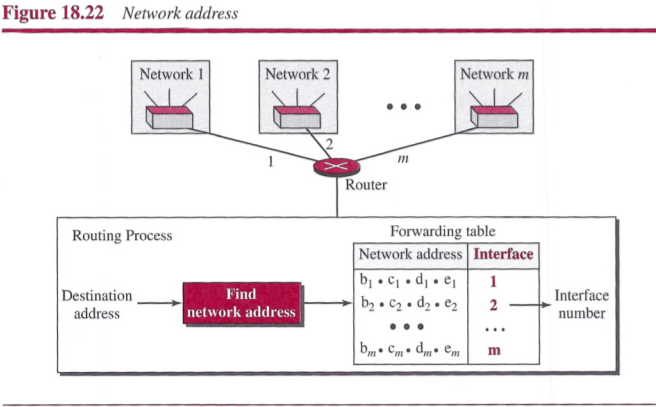
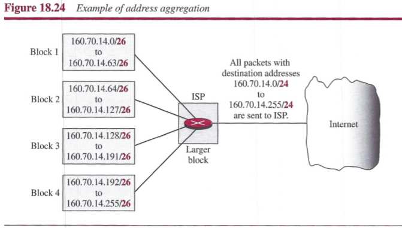

# Chapter 18: Introduction to Network Layer
## Network-Layer Services
### Packetizing
`Packetizing` is encapsulating the payload in a network-layer packet at the source and decapsulating the payload from the network-layer packet at the destination.

### Routing and Forwarding
- `Routing`: routing the packet from its source to the destination with the best route.
- `Forwarding`: the action applied by each router when a packet arrives at one of its interfaces.
 

### Other Services
- `Error Control`: Network layer added a checksum field to the datagram to control any corruption in the header, but not in the whole datagram.
- `Flow Control`: Flow control regulates the amount of data a source can send without overwhelming the receiver. The network-layer does not directly provide any flow control.
- `Congestion Control`: Congestion in the network layer is a situation in which too many datagrams are present in an erea of the Internet.
- `Quality of Service`: As the Internet has allowed new applications such as multimedia communication, the quality of service (QoS) of the communication has become more and more important.
- `Security`: To provide security for a connectionless network layer, we need to have another virtual level that changes the connectionless service to a connection-oriented service.

## Packet Switching
A packet-switched network can use two different approaches to route the packets: `the datagram approach` and the `virtual circuit approach`.

### Datagram Approach: Connectionless Service
When the network layer provides a connectionless service, each packet traveling in the Internet is an independent entity; there is no relationship between packets belonging to the same message. The switches in this type of network are called routers.

Each packet is routed based on the information contained in its header: source and destination addresses. The forwarding decision is based on the destination address of the packet.

### Virtual-Circuit Approach: Connection-Oriented Service
In a connection-oriented service, there is a relationship between all packets belonging to a message. Before all datagrams in a message can be sent, a virtual connection should be set up to define the path for the datagrams. After connection setup, the datagrams can all follow the same path. In this type of service, not only must the packet contain the source and destination addresses, it must also contain a flow label, a virtual circuit identifier that defines the virtual path the packet should follow. Each packet is forwarded based on the label in the packet. To create a connection-oriented service, a three-phase process is used: setup, data transfer, and teardown.

##### Setup Phase
In the setup phase, a router creates an entry for a virtual circuit. Two auxiliary packets need to be exchanged between the sender and the receiver: the request packet and the acknowledgment packet.
- `request packet`: A request packet is sent from the source to the destination. This auxiliary packet carries the source and destination addresses.
- `acknowledgment packet`: A special Packet, called the acknowledgment packet, completes switching tables.

##### Data-Transfer Phase
After all routers have created their forwarding table for a specific virtual circuit, then the network-layer packets belonging to one message can be sent one after another.

##### Teardown Phase
After sending all packets, sender sends a special packet called a teardown packet, receiver responds with a confirmation packet. All routers delete the corresponding entries from their tables.

## Network-Layer Performance
The performance of a network can be measured in terms of `delay`, `throughput`, and `packet loss`. `Congestion control` is an issue that can improve the performance.

### Delay
The delays in a network can be divided into four types:
- `transmission delay`: **Delaytr = (Packet length) / (Transmission rate)**
- `propagation delay`: **Delaypg = (Distance) / (Propagation speed)**
- `processing delay`: **Delaypr = Time required to process a packet in a router or a destination host**
- `queuing delay`: **Delayqu = The time a packet waits in input and output queues in a router**

Total Delay: **Total delay = (n + 1)(Delaytr + Delaypg + Delaypr) + (n)(Delaypu)**

### Throughput
Throughput at any point in a network is defined as the number of bits passing through the point in a second, which is actually the transmission rate of data at that point.

### Packet Loss
A time may come when the buffer is full and the next packet needs to be dropped.

### Congestion Control
Congestion at the network layer is related to two issues, throughput and delay.

##### Congestion Control
We can divide congestion control mechanisms into two broad categories: `open-loop congestion control` (prevention) and `closed-loop congestion control` (removal).

## IPv4 Addresses
An IPv4 address is a 32-bit address that uniquely and universally defines the connection of a host or a router to the Internet.

### Address Space
An address space is the total number of addresses used by the protocol. IPv4 uses 32-bit addresses, which means that the address space is 232.

##### Notation

##### Hierarchy in Addressing
A 32-bit IPv4 address is divided into two parts:
- `prefix`: defines the network
 - fixed length: classful addressing
 - variable length: classless addressing
- `suffix`: defines the node

### Classful Addressing
Three fixed-length prefixes were designed instead of one (n = 8, n = 16, and n = 24). The whole address space was divided into five classes (class A, B, C, D, and E).

### Classless Addressing
In classless addressing, variable-length blocks are used that belong to no classes.

##### Prefix Length: Slash Notation
The prefix length, *n*, is added to the address, separated by a slash. The notation is informally referred to as `slash notation` and formally as `classless interdomain routing or CIDR` strategy.

##### Extracting Information from an Address
We normally like to know three pieces of information about the block to which the address belongs: the number of addresses, the first address in the block, and the last address.
1. The number of addresses in the block is found as *N = 232-n*.
2. To find the first address, we keep the *n* leftmost bits and set the (*32 - n*) rightmost bits all to 0s.
3. To find the last address, we keep the *n* leftmost bits and set the (*32 - n*) rightmost bits all to 1s.

##### Address Mask
The address mask is a 32-bit number in which the *n* leftmost bits are set to 1s and the rest of the bits (*32 - n*) are set to 0s.

It can be used by a computer program to extract the information in a block, using the three bit-wise operations NOT, AND, and OR.
1. The nUfber of addresses in the block N = NOT (mask) + 1.
2. The first address in the block = (Any address in the block) AND (mask).
3. The last address in the block = (Any address in the block) OR [(NOT (mask)].

##### Network Address
The first address, the network address, is particularly important because it is used in routing a packet to its destination network.

##### Block Allocation
The ultimate responsibility of block allocation is given to a global authority called the Internet Corporation for Assigned Names and Numbers (ICANN). It assigns a large block of addresses to an ISP. For the proper operation of the CIDR, two restrictions need to be applied to the allocated block.
1. The number of requested addresses, *N*, needs to be a power of 2. The reason is that *N = 232 - n* or *n = 32 - log2N*.
2. The requested block needs to be allocated where there is an adequate number of contiguous addresses available in the address space. The first address needs to be divisible by the number of addresses in the block. The reason is that the first address needs to be the prefix followed by (32 - n) number of 0s. The decimal value of the first address is then: **first address = (prefix in decimal) x 232 - n = (prefix in decimal) x N**.

##### Subnetting
More levels of hierarchy can be created using subnetting.

- The number of addresses in each subnetwork should be a power of 2.
- The prefix length for each subnetwork should be found using the following formula: *nsub = 32 - log2Nsub*
- The starting address in each subnetwork should be divisible by the number of addresses in that subnetwork. This can be achieved if we first assign addresses to larger subnetworks.

##### Address Aggregation
When blocks of addresses are combined to create a larger block, routing can be done based on the prefix of the larger block.

##### Special Addresses
Five special addresses that are used for special purposes:
- `this-host address`: 0.0.0.0/32 is used whenever a host needs to send an IP datagram but it does not know its own address to use as the source address.
- `limited-broadcast`: 255.255.255.255/32 is used whenever a router or a host needs to send a datagram to all devices in a network.
- `loopback address`: 127.0.0.0/8
- `private addresses`: 10.0.0.0/8, 127.16.0.0/12, 192.168.0.0/16, and 169.254.0.0/16
- `multicast addresses`: 224.0.0.0/4 is reserved for multicast addresses.

### Dynamic Host Configuration Protocol (DHCP)
