# Chapter 18: Introduction to Network Layer

## Network-Layer Services

### Packetizing

`Packetizing` is encapsulating the payload in a network-layer packet at the source and decapsulating the payload from the network-layer packet at the destination.

### Routing and Forwarding

- `Routing`: routing the packet from its source to the destination with the best route.
- `Forwarding`: the action applied by each router when a packet arrives at one of its interfaces.
 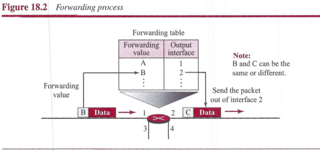

### Other Services

- `Error Control`: Network layer added a checksum field to the datagram to control any corruption in the header, but not in the whole datagram.
- `Flow Control`: Flow control regulates the amount of data a source can send without overwhelming the receiver. The network-layer does not directly provide any flow control.
- `Congestion Control`: Congestion in the network layer is a situation in which too many datagrams are present in an erea of the Internet.
- `Quality of Service`: As the Internet has allowed new applications such as multimedia communication, the quality of service (QoS) of the communication has become more and more important.
- `Security`: To provide security for a connectionless network layer, we need to have another virtual level that changes the connectionless service to a connection-oriented service.

## Packet Switching

A packet-switched network can use two different approaches to route the packets: `the datagram approach` and the `virtual circuit approach`.

### Datagram Approach: Connectionless Service

When the network layer provides a connectionless service, each packet traveling in the Internet is an independent entity; there is no relationship between packets belonging to the same message. The switches in this type of network are called routers.

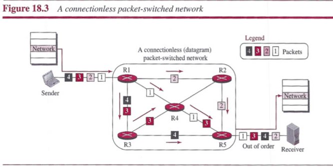

Each packet is routed based on the information contained in its header: source and destination addresses. The forwarding decision is based on the destination address of the packet.

### Virtual-Circuit Approach: Connection-Oriented Service

In a connection-oriented service, there is a relationship between all packets belonging to a message. Before all datagrams in a message can be sent, a virtual connection should be set up to define the path for the datagrams. After connection setup, the datagrams can all follow the same path. In this type of service, not only must the packet contain the source and destination addresses, it must also contain a flow label, a virtual circuit identifier that defines the virtual path the packet should follow. Each packet is forwarded based on the label in the packet. To create a connection-oriented service, a three-phase process is used: setup, data transfer, and teardown.

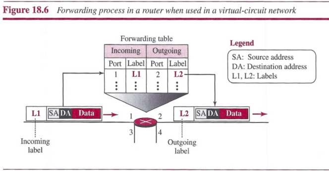

#### Setup Phase

In the setup phase, a router creates an entry for a virtual circuit. Two auxiliary packets need to be exchanged between the sender and the receiver: the request packet and the acknowledgment packet.

- `request packet`: A request packet is sent from the source to the destination. This auxiliary packet carries the source and destination addresses.
- `acknowledgment packet`: A special Packet, called the acknowledgment packet, completes switching tables.

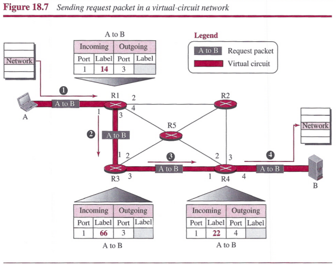

#### Data-Transfer Phase

After all routers have created their forwarding table for a specific virtual circuit, then the network-layer packets belonging to one message can be sent one after another.

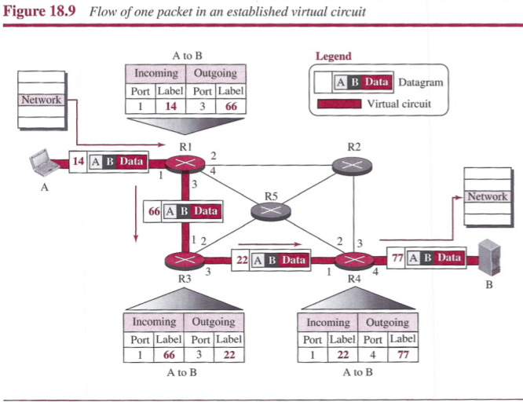

#### Teardown Phase

After sending all packets, sender sends a special packet called a teardown packet, receiver responds with a confirmation packet. All routers delete the corresponding entries from their tables.

## Network-Layer Performance

The performance of a network can be measured in terms of `delay`, `throughput`, and `packet loss`. `Congestion control` is an issue that can improve the performance.

### Delay

The delays in a network can be divided into four types:

- `transmission delay`: **Delaytr = (Packet length) / (Transmission rate)**
- `propagation delay`: **Delaypg = (Distance) / (Propagation speed)**
- `processing delay`: **Delaypr = Time required to process a packet in a router or a destination host**
- `queuing delay`: **Delayqu = The time a packet waits in input and output queues in a router**

Total Delay: **Total delay = (n + 1)(Delaytr + Delaypg + Delaypr) + (n)(Delaypu)**

### Throughput

Throughput at any point in a network is defined as the number of bits passing through the point in a second, which is actually the transmission rate of data at that point.

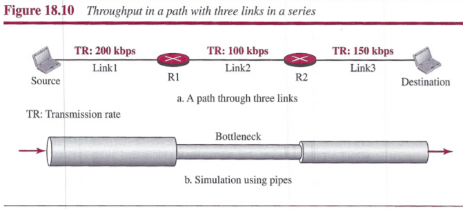

### Packet Loss

A time may come when the buffer is full and the next packet needs to be dropped.

### Congestion Control

Congestion at the network layer is related to two issues, throughput and delay.

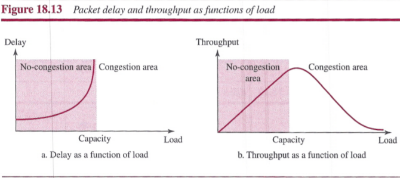

#### Congestion Control

We can divide congestion control mechanisms into two broad categories: `open-loop congestion control` (prevention) and `closed-loop congestion control` (removal).

## IPv4 Addresses

An IPv4 address is a 32-bit address that uniquely and universally defines the connection of a host or a router to the Internet.

### Address Space

An address space is the total number of addresses used by the protocol. IPv4 uses 32-bit addresses, which means that the address space is 232.

#### Notation

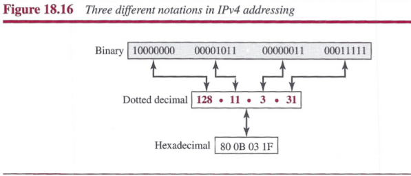

#### Hierarchy in Addressing

A 32-bit IPv4 address is divided into two parts:

- `prefix`: defines the network
  - fixed length: classful addressing
  - variable length: classless addressing
- `suffix`: defines the node

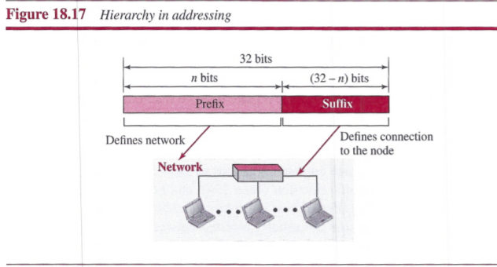

### Classful Addressing

Three fixed-length prefixes were designed instead of one (n = 8, n = 16, and n = 24). The whole address space was divided into five classes (class A, B, C, D, and E).

### Classless Addressing

In classless addressing, variable-length blocks are used that belong to no classes.

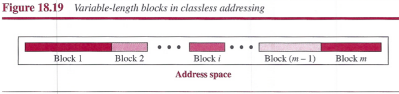

#### Prefix Length: Slash Notation

The prefix length, *n*, is added to the address, separated by a slash. The notation is informally referred to as `slash notation` and formally as `classless interdomain routing or CIDR` strategy.

#### Extracting Information from an Address

We normally like to know three pieces of information about the block to which the address belongs: the number of addresses, the first address in the block, and the last address.

1. The number of addresses in the block is found as *N = 232-n*.
2. To find the first address, we keep the *n* leftmost bits and set the (*32 - n*) rightmost bits all to 0s.
3. To find the last address, we keep the *n* leftmost bits and set the (*32 - n*) rightmost bits all to 1s.

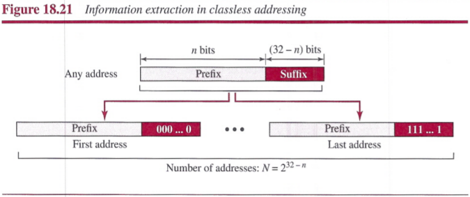

#### Address Mask

The address mask is a 32-bit number in which the *n* leftmost bits are set to 1s and the rest of the bits (*32 - n*) are set to 0s.

It can be used by a computer program to extract the information in a block, using the three bit-wise operations NOT, AND, and OR.

1. The number of addresses in the block N = NOT (mask) + 1.
2. The first address in the block = (Any address in the block) AND (mask).
3. The last address in the block = (Any address in the block) OR [(NOT (mask)].

#### Network Address

The first address, the network address, is particularly important because it is used in routing a packet to its destination network.

#### Block Allocation

The ultimate responsibility of block allocation is given to a global authority called the Internet Corporation for Assigned Names and Numbers (ICANN). It assigns a large block of addresses to an ISP. For the proper operation of the CIDR, two restrictions need to be applied to the allocated block.

1. The number of requested addresses, *N*, needs to be a power of 2. The reason is that *N = 232 - n* or *n = 32 - log2N*.
2. The requested block needs to be allocated where there is an adequate number of contiguous addresses available in the address space. The first address needs to be divisible by the number of addresses in the block. The reason is that the first address needs to be the prefix followed by (32 - n) number of 0s. The decimal value of the first address is then: **first address = (prefix in decimal) x 232 - n = (prefix in decimal) x N**.

#### Subnetting

More levels of hierarchy can be created using subnetting.

- The number of addresses in each subnetwork should be a power of 2.
- The prefix length for each subnetwork should be found using the following formula: *nsub = 32 - log2Nsub*
- The starting address in each subnetwork should be divisible by the number of addresses in that subnetwork. This can be achieved if we first assign addresses to larger subnetworks.

#### Address Aggregation

When blocks of addresses are combined to create a larger block, routing can be done based on the prefix of the larger block.

#### Special Addresses

Five special addresses that are used for special purposes:

- `this-host address`: 0.0.0.0/32 is used whenever a host needs to send an IP datagram but it does not know its own address to use as the source address.
- `limited-broadcast`: 255.255.255.255/32 is used whenever a router or a host needs to send a datagram to all devices in a network.
- `loopback address`: 127.0.0.0/8
- `private addresses`: 10.0.0.0/8, 127.16.0.0/12, 192.168.0.0/16, and 169.254.0.0/16
- `multicast addresses`: 224.0.0.0/4 is reserved for multicast addresses.

### Dynamic Host Configuration Protocol (DHCP)

Address assignment in an organization can be done automatically using the `Dynamic Host Configuration Protocol (DHCP)`. DHCP is an application-layer program, using the client-server paradigm, that actually helps TCP/IP at the network layer.

#### DHCP Message Foramt

DHCP is client-server protocol in which the client sends a request message and the server returns a response message.

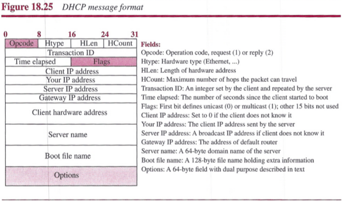

The server uses a number, called a `magic cookie`, in the format of an IP address with the value of 99.130.83.99. When the client finishes reading the message, it looks for this magic cookie. If present, the next 60 bytes are options.

#### DHCP Operation

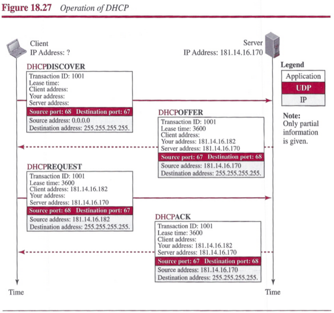

1. The joining host creates a `DHCPDISCOVER` message in which only the transaction ID field is set to a random number. No other field can be set because the host has no knowledge with which to do so. This message is encapsulated in a UDP user datagram with the source port set to 68 and the destination port set to 67. The user datagram is encapsulated in an IP datagram with the source address set to **0.0.0.0** (this host) and the destination address set to **255.255.255.255** (broadcast address). The reason is that the joining host knows neither its own address nor the server address.
2. The DHCP servers respond with a `DHCPOFFER` message in which the your address field defines the offered IP address for the joining host and the server address field includes the IP address of the server. The message also includes the lease time for which the host can keep the IP address. This message is encapsulated in a user datagram with the same port numbers, but in the reverse order. The user datagram in turn is encapsulated in a datagram with the server address as the source IP address, but the destination address is a broadcast address, in which the server allows other DHCP servers to receive the offer and give a better offer if they can.
3. The joining host receives one or more offers and selects the best of them. The joining host then sends a `DHCPREQUEST` message to the server that has given the best offer. The fields with known value are set. The message is encapsulated in a user datagram with port numbers as the first message. The user datagram is encapsulated in an IP datagram with the source address set to the new client address, but the destination address still is set to the broadcast address to let the other servers know that their offer was not accepted.
4. Finally, the selected server responds with a `DHCPACK` message to the client if the offered IP address is valid. If the server cannot keep its offer, the server sends a DHCPNACK message and the client needs to repeat the process. This message is also broadcast to let other servers know that the request is accepted or rejected.

#### Transition States

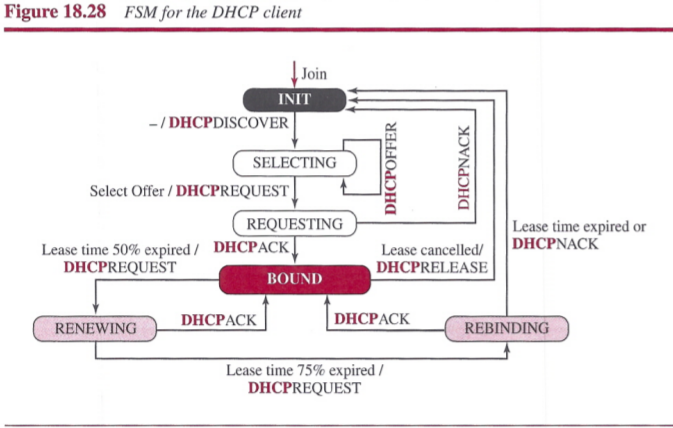

### Network Address Resolution (NAT)

A technology that can provide the mapping between the private and universal addresses, and at the same time support virtual private networks is `Network Address Translation (NAT)`. The technology allows a site to use a set of private addresses for internal communication and a set of global Internet addresses for communication with the rest of the world. The site must have only one connection to the global Internet through a NAT-capable router that runs NAT software.

#### Address Translation

#### Translation Table

The problem how does the NAT router know the destination address for a packet coming from the Internet is solved if the NAT router has a translation table.

**Using One IP Address**: In this strategy, communication must always be initiated by the private network. The NAT mechanism described requires that the private network start the communication.

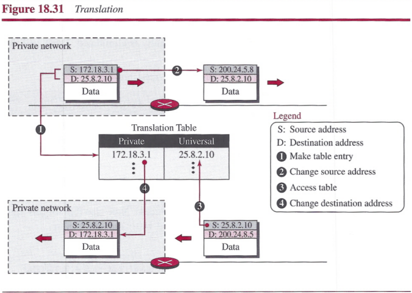

**Using a Pool of IP Addresses**: The use of only one global address by the NAT router allows only one private-network host to access a given external host. To remove this restriction, the NAT router can use a pool of global addresses.

**Using Both IP Addresses and Port Addresses**: To allow a many-to-many relationship between private-network hosts and external server programs, we need more information in the translation table.

## Forwarding of IP Packets

When IP is used as a connectionless protocol, forwarding is based on the destination address of the IP datagram; when the IP is used as a connection-oriented protocol, forwarding is based on the label attached to an IP datagram.

### Forwarding Based on Destination Address

A classless forwarding table needs to include four pieces of information: the mask, the network address, the interface number, and the IP address of the next router. The job of the forwarding module is to search the table, row by row. In each row, the *n* leftmost bits of the destination address (prefix) are kept and the rest of the bits (suffix) are set to 0s. If the resulting address (which we call the network address), matches with the address in the first column, the information in the next two columns is extracted; otherwise the search continues. Normally, the last row has a default value in the first column, which indicates all destination addresses that did not match the previous rows.

#### Address Aggregation

This is called address aggregation because the blocks of addresses for four organizations are aggregated into one larger block.

**Longest Mask Matching**: If one of the organizations in the previous figure is not geographically close to the other three, routing in classless addressing uses `longest mask matching` principle. This principle states that the forwarding table is sorted from the longest mask to the shortest mask.

**Hierarchical Routing**: To solve the problem of gigantic forwarding tables, we can create a sense of hierarchy in the forwarding tables.

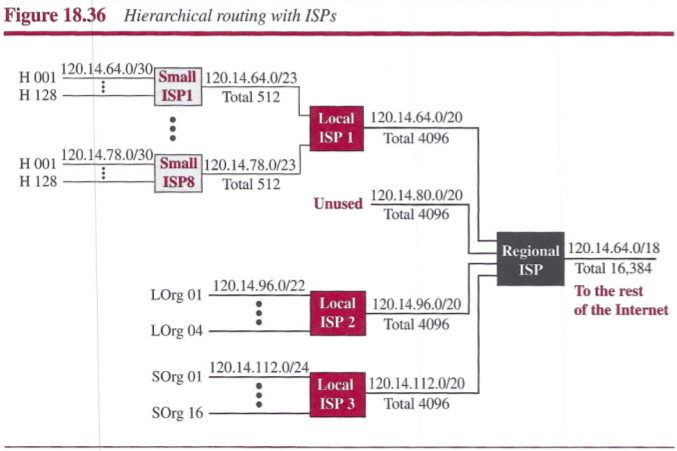

### Forwarding Based on Label

- In a connectionless network (datagram approach), a router forwards a packet based on the destination address in the header of the packet.
  - Routing is normally based on searching the contents of a table.
- In a connection-oriented network (virtual-circuit approach), a switch forwards a packet based on the label attached to the packet.
  - Switching can be done by accessing a table using an index.

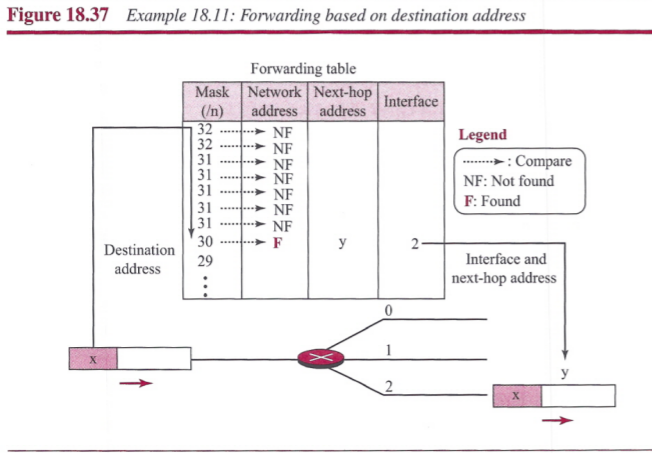

#### Multi-Protocol Label Switching (MPLS)

A MPLS can behave like a router and a switch. When behaving like a router, MPLS can forward the packet based on the destination address; when behaving like a switch, it can forward a packet based on the label.

**A New Header**: To simulate connection-oriented switching using a protocol like IP, the first thing that is needed is to add a field to the packet that carries the label. The IPv4 packet format does not allow this extension. The solution is to encapsulate the IPv4 packet in an MPLS packet. The whole IP packet is encapsulated as the payload in an MPLS packet and an MPLS header is added.

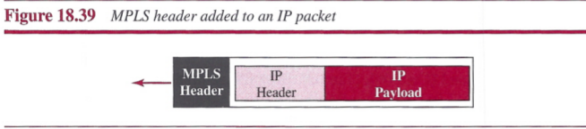

The MPLS header is actually a stack of subheaders that is used for multilevel hierarchical switching.

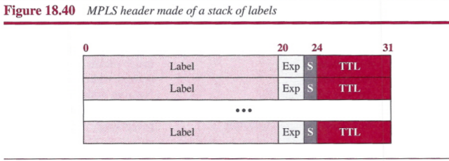

The following is a brief description of each field:

- `Label`: This 20-bit field defines the label that is used to index the forwarding table in the router.
- `Exp`: This 3-bit field is reserved for experimental purposes.
- `S`: The one-bit stack field defines the situation of the subheader in the stack. When the bit is 1, it means that the header is the last one in the stack.
- `TTL`: This 8-bit field is similar to the TTL field in the IP datagram. Each visited router decrements the value of this field. When it reaches zero, the packet is discarded to prevent looping.

## Summary

- The network layer in the Internet provides services to the transport layer and receives services from the network layer.
- The main services provided by the network layer are packetizing and routing the packet from the source to the destination.
- The network layer in the Internet does not seriously address other services such as flow, error, or congestion qontrol.
- One of the main duties of the network layer is to provide packet switching.
- There are two approaches to packet switching: datagram approach and virtual-circuit approach. The first is used in a connectionless network; the second, in a connection-oriented network. Currently, the network layer is using the first approach, but the tendency is to move to the second.
- Performance of the network layer is measured in terms of delay, throughput, and packet loss.
- Congestion control is a mechanism that can be used to improve the performance. Although congestion control is not directly implemented at the network layer, the discussior can help us to understand its indirect implementation and also to understand the congestion control implemented at the transport layer.
- One of the main issues at the network layer is addressing. In this chapter, we discussed addressing in IPv4 (the current version). We explained the address space of the IPv4 and two address distribution mechanisms: classful and classless addressing. Although the first is deprecated, it helps us to understand the second. In classful addressing the whole address space is divided into five fixed-size classes. In classless addressing, the address space is divided into variable-size blocks based on the demand.
- Some problems of address shortage in the current version can be temporarily alleviated using DHCP and NAT protocols.
- The section on forwarding helps to understand how routers forward packets. Two approaches are used for this purpose. The first approach, which is used in a connectionless network such as the current Internet, is based on the destination address of the packet. The second approach, which can be used if the Internet is changed to a connection-oriented network, uses the labels in the packets.
