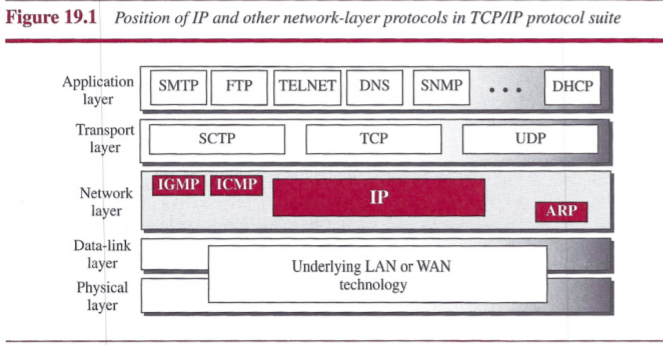
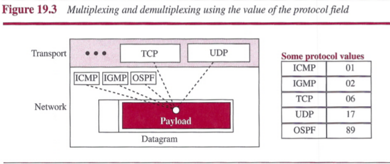
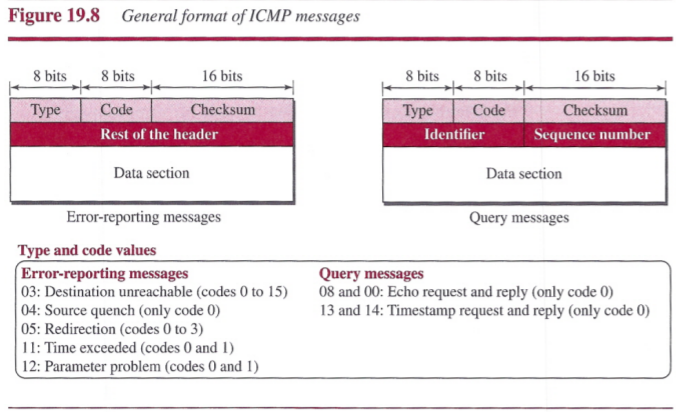
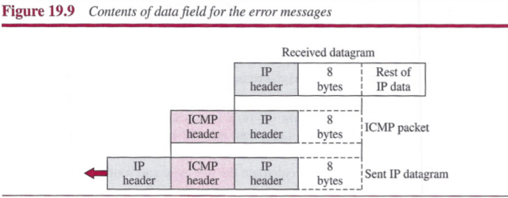
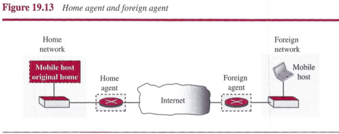
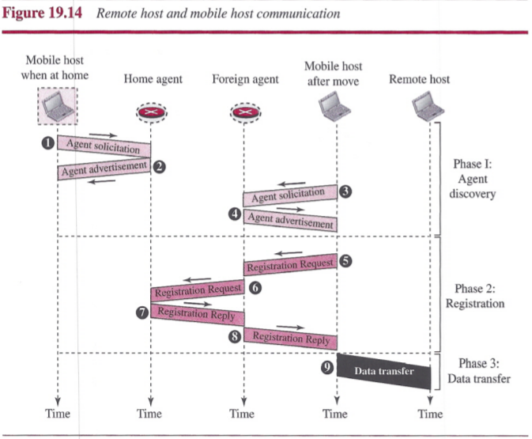

# Chapter 19: Network-Layer Protocols

## Internet Protocol (IP)

The network layer in version 4 can be thought of as one main protocol and three auxiliary ones.

- The main protocol, Internet Protocol version 4 (IPv4), is responsible for packetizing, forwarding, and delivery of a packet at the network layer.
- The Internet Control Message Protocol version 4 (ICMPv4) helps IPv4 to handle some errors that may occur in the network-layer delivery.
- The Internet Group Management Protocol (IGMP) is used to help IPv4 in multicasting.
- The Address Resolution Protocol (ARP) is used to glue the network and data-link layers in mapping network-layer addresses to link-layer addresses.

IPv4 is an unreliable datagram protocol (a best-effort delivery service). IPv4 is also a connectionless protocol that uses the datagram approach.

### Datagram Format

Packets used by the IP are called `datagrams`. A datagram is a variable-length packet consisting of two parts: header and payload (data). The header is 20 to 60 bytes in length and contains information essential to routing and delivery. It is customary in TCP/IP to show the header in 4-byte sections.

- `Version Number`: The 4-bit version number (VER) field defines the version of the IPv4 protocol, which, obviously, has the value of 4.
- `Header Length`: The 4-bit header length (HLEN) field defines the total length of the datagram header in 4-byte words.
- `Service Type`: The 8-bit service type field provides *differentiated services* (DiffServ).
- `Total Length`: This 16-bit field defines the total length (header plus data) of the IP datagram in bytes.
- `Identification, Flags, and Fragmentation Offset`: These three fields are related to the fragmentation of the IP datagram when the size of the datagram is larger than the underlying network can carry.
- `Time-to-live`: The time-to-live (TTL) field is used to control the maximum number of hops (routers) visited by the datagram.
- `Protocol`: In TCP/IP, the data section of a packet, called the payload, carries the whole packet from another protocol. The Internet authority has given any protocol that uses the service of IP a unique 8-bit number which is inserted in the protocol field.

 

- `Header checksum`: IP adds a header checksum field to check the header, but not the payload.
- `Source and Destination Addresses`: These 32-bit source and destination address fields define the IP address of the source and destination respectively.
- `Options`: Options can be used for network testing and debugging.
- `Payload`: Payload is the packet coming from other protocols that use the service of IP.

### Fragmentation

A datagram can travel through different networks. Each router decapsulates the IP datagram from the frame it receives, processes it, and then encapsulates it in another frame.

#### Maximum Transfer Unit (MTU)

When a datagram is encapsulated in a frame, the total size of the datagram must be less than this maximum size, which is defined by the restrictions imposed by the hardware and software used in the network.

#### Field Related to Fragmentation

There are three fields in an IP datagram related to fragmentation: `identification`, `flags`, and `fragmentation offset`.

- The 16-bit `identification field` identifies a datagram originating from the source host. The combination of the identification and source IP address must uniquely define a datagram as it leaves the source host. When a datagram is fragmented, the value in the identification field is copied into all fragments.
- The 3-bit `flags field` defines three flags. The leftmost bit is reserved (not used). The second bit (D bit) is called the *do not fragment bit*. The third bit (M bit) is called the *more fragment bit*.
- The 13-bit `fragmentation offset` field shows the relative position of this fragment with respect to the whole datagram. It is the offset of the data in the original datagram measured in units of 8 bytes.

It is obvious that even if each fragment follows a different path and arrives out of order, the final destination host can reassemble the original datagram from the fragments received using the following strategy:

1. The first fragment has an offset field value of zero.
2. Divide the length of the first fragment by 8. The second fragment has an offset value equal to that result.
3. Divide the total length of the first and second fragment by 8. The third fragment has an offset value equal to that result.
4. Continue the process. The last fragment has its M bit set to 0.

### Options

The header of the IPv4 datagram is made of two parts: a fixed part and a variable part. The variable part comprises the options that can be a maximum of 40 bytes (in multiples of 4-bytes) to preserve the boundary of the header.

#### Single-Byte Options

These are two single-byte options:

- `No Operation`: A *no-operation option* is a 1-byte option used as a filler between options.
- `End of Option`: An *end-of-option option* is a 1-byte option used for padding at the end of the option field. It, however, can only be used as the last option.

#### Multiple-Byte Options

There are four multiple-byte options:

- `Record Route`: A *record route option* is used to record the Internet routers that handle the datagram.
- `Strict Source Route`: A *strict source route option* is used by the source to predetermine a route for the datagram as it travels through the Internet. If a datagram specifies a strict source route, all the routers defined in the option must be visited by the datagram. A router must not be visited if its IPv4 address is not listed in the datagram.
- `Loose Source Route`: A *loose source route option* is similar to the strict source route, but it is less rigid. Each router in the list must be visited, but the datagram can visit other routers as well.
- `Timestamp`: A *timestamp option* is used to record the time of datagram processing by a router.

### Security of IPv4 Datagrams

There are three security issues that are particularly applicable to the IP protocol:

- `packet sniffing`
- `packet modification`
- `IP spoofing`.

`IPSec` protocol is used in conjunction with the IP protocol, creates a connection-oriented service between two entities in which they can exchange IP packets without worrying about the three attacks discussed above.

- `Defining Algorithms and Keys`
- `Packet Encryption`
- `Data Integrity`
- `Origin Authentication`

## ICMPv4

1. The IPv4 has no error-reporting or error-correcting mechanism.
2. The IP protocol also lacks a mechanism for host and management queries.

The `Internet Control Management Protocol version 4 (ICMPv4)` has been designed to compensate for the above two deficiencies. It is a companion to the IP protocol, its messages are first encapsulated inside IP datagrams before going to the lower layer. When an IP datagram encapsulates an ICMP message, the value of the protocol field in the IP datagram is set to 1 to indicate that the IP payroll is an ICMP message.

### Messages

ICMP messages are divided into two broad categories: *error-reporting messages* and *query messages*.

- `error-reporting messages`: report problems that a router or a host may encounter when it processes an IP packet.
- `query messages`: occur in pairs, help a host or a network manager get specific information from a router or another host.

An ICMP message has an 8-byte header and a variable-size data section. Although the general format of the header is different for each message type, the first 4 bytes are common to all.

- The first field, ICMP type, defines the type of the message.
- The code field specifies the reason for the particular message type.
- The last common field is the checksum field.
- The rest of the header is specific for each message type.
- The data section in error messages carries information for finding the original packet that had the error. In query messages, the data section carries extra information based on the type of query.

#### Error Reporting Messages

The following are important points about ICMP error messages:

- No ICMP error message will be generated in response to a datagram carrying an ICMP error message.
- No ICMP error message will be generated for a fragmented datagram that is not the first fragment.
- No ICMP error message will be generated for a datagram having a multicast address.
- No ICMP error message will be generated for a datagram having a special addres1s such as 127.0.0.0 or 0.0.0.0.

Note that all error messages contain a data section that includes the IP header of the original datagram plus the first 8 bytes of data in that datagram.

- The original datagram header is added to give the original source, which receives the error message, information about the datagram itself.
- The 8 bytes of data are included because the they provide information about the port numbers (UDP and TCP) and sequence number (TCP).

### ICMP Checksum

In ICMP the checksum is calculated over the entire message (header and data).

## Mobile IP

### Addressing

#### Stationary Hosts

The IP addresses are designed to work with stationary hosts because part of the address defines the network to which the host is attached.

#### Mobile Hosts

When a host moves from one network to another, the IP addressing structure needs to
be modified.

Mobile IP has two addresses for a mobile host: one home address and one care-of address. The home address is permanent; the care-of address changes as the mobile host moves from one network to another.

### Agents

To make the change of address transparent to the rest of the Internet requires a `home agent` and a `foreign agent`.

- `Home Agent`: The home agent is usually a router attached to the home network of the mobile host. The home agent acts on behalf of the mobile host when a remote host sends a packet to the mobile host. The home agent receives the packet and sends it to the foreign agent.
- `Foreign Agent`: The foreign agent is usually a router attached to the foreign network. The foreign agent receives and delivers packets sent by the home agent to the mobile host.
- When the mobile host and the foreign agent are the same, the care-of address is called a `collocated care-of address`.

### Three Phases

To communicate with a remote host, a mobile host goes through three phases: `agent discovery`, `registration`, and `data transfer`.

