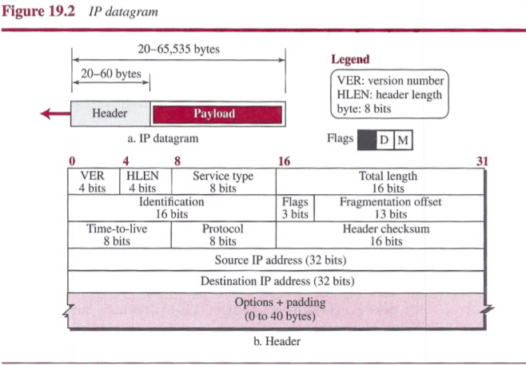
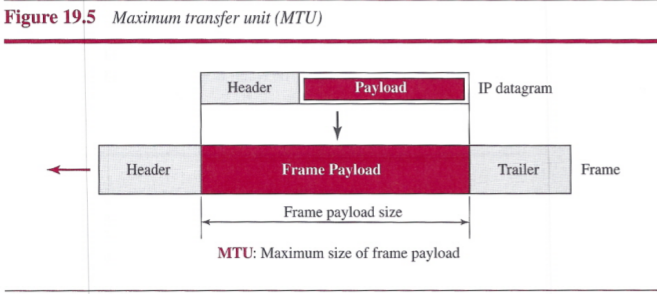

# Chapter 19: Network-Layer Protocols
## Internet Protocol (IP)
The network layer in version 4 can be thought of as one main protocol and three auxiliary ones.
- The main protocol, Internet Protocol version 4 (IPv4), is responsible for packetizing, forwarding, and delivery of a packet at the network layer.
- The Internet Control Message Protocol version 4 (ICMPv4) helps IPv4 to handle some errors that may occur in the network-layer delivery.
- The Internet Group Management Protocol (IGMP) is used to help IPv4 in multicasting.
- The Address Resolution Protocol (ARP) is used to glue the network and data-link layers in mapping network-layer addresses to link-layer addresses.

IPv4 is an unreliable datagram protocol (a best-effort delivery service). IPv4 is also a connectionless protocol that uses the datagram approach.

### Datagram Format
Packets used by the IP are called `datagrams`. A datagram is a variable-length packet consisting of two parts: header and payload (data). The header is 20 to 60 bytes in length and contains information essential to routing and delivery. It is customary in TCP/IP to show the header in 4-byte sections.

- `Version Number`: The 4-bit version number (VER) field defines the version of the IPv4 protocol, which, obviously, has the value of 4.
- `Header Length`: The 4-bit header length (HLEN) field defines the total length of the datagram header in 4-byte words.
- `Service Type`: The 8-bit service type field provides *differentiated services* (DiffServ).
- `Total Length`: This 16-bit field defines the total length (header plus data) of the IP datagram in bytes.
- `Identification, Flags, and Fragmentation Offset`: These three fields are related to the fragmentation of the IP datagram when the size of the datagram is larger than the underlying network can carry.
- `Time-to-live`: The time-to-live (TTL) field is used to control the maximum number of hops (routers) visited by the datagram.
- `Protocol`: In TCP/IP, the data section of a packet, called the payload, carries the whole packet from another protocol. The Internet authority has given any protocol that uses the service of IP a unique 8-bit number which is inserted in the protocol field.

 
- `Header checksum`: IP adds a header checksum field to check the header, but not the payload.
- `Source and Destination Addresses`: These 32-bit source and destination address fields define the IP address of the source and destination respectively.
- `Options`: Options can be used for network testing and debugging.
- `Payload`: Payload is the packet coming from other protocols that use the service of IP.

### Fragmentation
A datagram can travel through different networks. Each router decapsulates the IP datagram from the frame it receives, processes it, and then encapsulates it in another frame.

##### Maximum Transfer Unit (MTU)
When a datagram is encapsulated in a frame, the total size of the datagram must be less than this maximum size, which is defined by the restrictions imposed by the hardware and software used in the network.

##### Field Related to Fragmentation
There are three fields in an IP datagram related to fragmentation: `identification`, `flags`, and `fragmentation offset`.
- The 16-bit `identification field` identifies a datagram originating from the source host. The combination of the identification and source IP address must uniquely define a datagram as it leaves the source host. When a datagram is fragmented, the value in the identification field is copied into all fragments.
- The 3-bit `flags field` defines three flags. The leftmost bit is reserved (not used). The second bit (D bit) is called the *do not fragment bit*. The third bit (M bit) is called the *more fragment bit*.
- The 13-bit `fragmentation offset` field shows the relative position of this fragment with respect to the whole datagram. It is the offset of the data in the original datagram measured in units of 8 bytes.

It is obvious that even if each fragment follows a different path and arrives out of order, the final destination host can reassemble the original datagram from the fragments received using the following strategy:
1. The first fragment has an offset field value of zero.
2. Divide the length of the first fragment by 8. The second fragment has an offset value equal to that result.
3. Divide the total length of the first and second fragment by 8. The third fragment has an offset value equal to that result.
4. Continue the process. The last fragment has its M bit set to 0.

### Options
The header of the IPv4 datagram is made of two parts: a fixed part and a variable part. The variable part comprises the options that can be a maximum of 40 bytes (in multiples of 4-bytes) to preserve the boundary of the header.

##### Single-Byte Options
These are two single-byte options:
- `No Operation`: A *no-operation option* is a 1-byte option used as a filler between options.
- `End of Option`: An *end-of-option option* is a 1-byte option used for padding at the end of the option field. It, however, can only be used as the last option.

##### Multiple-Byte Options
There are four multiple-byte options:
- `Record Route`: A *record route option* is used to record the Internet routers that handle the datagram.
- `Strict Source Route`: A *strict source route option* is used by the source to predetermine a route for the datagram as it travels through the Internet. If a datagram specifies a strict source route, all the routers defined in the option must be visited by the datagram. A router must not be visited if its IPv4 address is not listed in the datagram.
- `Loose Source Route`: A *loose source route option* is similar to the strict source route, but it is less rigid. Each router in the list must be visited, but the datagram can visit other routers as well.
- `Timestamp`: A *timestamp option* is used to record the time of datagram processing by a router.

### Security of IPv4 Datagrams
There are three security issues that are particularly applicable to the IP protocol:
- `packet sniffing`
- `packet modification`
- `IP spoofing`.

`IPSec` protocol is used in conjunction with the IP protocol, creates a connection-oriented service between two entities in which they can exchange IP packets without worrying about the three attacks discussed above.
- `Defining Algorithms and Keys`
- `Packet Encryption`
- `Data Integrity`
- `Origin Authentication`

## ICMPv4
