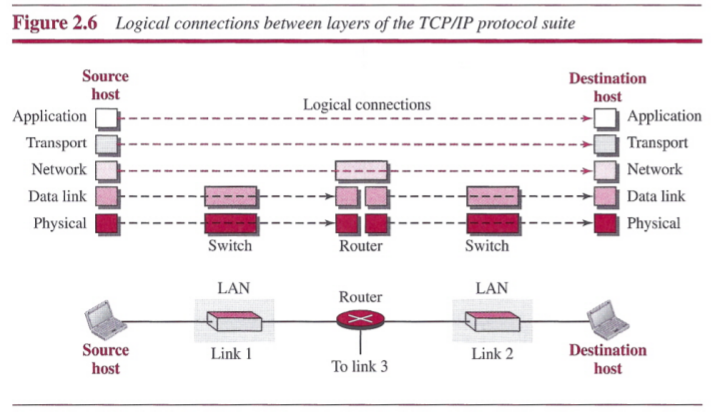
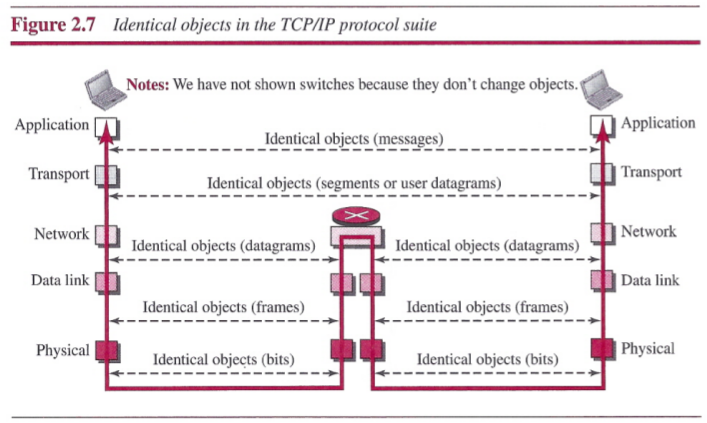
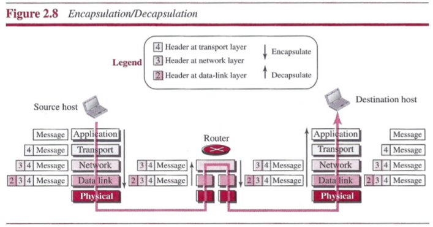
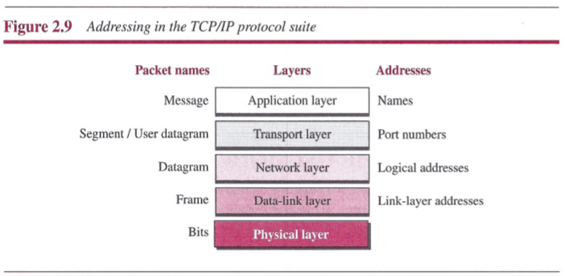
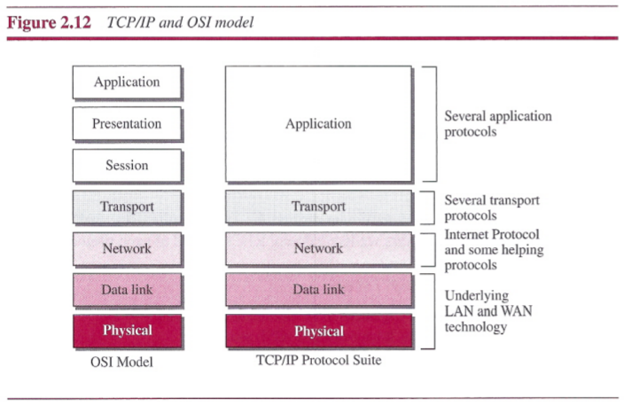

# Chapter 2: Network Models

## Protocol Layering
### Principles of Protocol Layering
- The first principle dictates that if we want bidirectional communication, we need to make each layer so that it is able to perform two opposite tasks, one in each direction.
- The second principle that we need to follow in protocol layering is that the two objects under each layer at both sites should be identical.

## TCP/IP Protocol Suite
TCP/IP is a protocol suite used in the Internet today. It is a hierarchical protocol made up of interactive modules, each of which provides a specific functionality.

### Layered Architecture

As the fingure shows:
- Two hosts are involved in all five layers.
- The router is involved in only three layers. Although a router is always involved in one network layer, it is involved in *n* combinations of link and physical layers in which *n* is the number of links the router is connected to. The reason is that each link may use its own data-link or physical protocol.
- A link-layer switch in a link is involved only in two layers. Unlike a router, a link-layer switch is involved only in one data-link and one physical layer.

### Layers in the TCP/IP Protocol Suite

The duty of the application, transport, and network layers is end-to-end. However, the duty of the data-link and physical layers is hop-to-hop, in which a hop is a host or router. In other words, the domain of duty of the top three layers is the internet, and the domain of duty of the two lower layers is the link.

In the top three layers, the data unit (packets) should not be changed by any router or link-layer switch. In the bottom two layers, the packet created by the host is changed only by the routers, not by the link-layer switches.

Note that, although the logical connection at the network layer is between the two hosts, we can only say that identical objects exist between two hops in this case because a router may fragment the packet at the network layer and send more packets than received.

### Description of Each Layer
##### Physical Layer
The physical layer is responsible for carrying individual bits in a frame across the link. The communication between two devices at the physical layer is still a logical communication because there is a hidden layer, the transmission media, under the physical layer. Two devices are connected by a transmission medium. The transmission medium does not carry bits; it carries electrical or optical signals. So the bits received in a frame from the data-link layer are transformed and sent through the transmission media, but we can think that the logical unit between two physical layers in two devices is a bit.

##### Data-link Layer
An internet is made up of several links (LANs and WANs) connected by routers. There may be several overlapping sets of links that a datagram can travel from the host to the destination. The routers are responsible for choosing the best links. However, when the next link to travel is determined by the router, the data-link layer is responsible for taking the datagram and moving it across the link. In each case, the data-link layer is responsible for moving the packet through the link.

TCP/IP does not define any specific protocol for the data-link layer. It supports all the standard and proprietary protocols. Any protocol that can take the datagram and carry it through the link suffices for the network layer. The data-link layer takes a datagram and encapsulates it in a packet called frame.

##### Network Layer
The network layer is responsible for creating a connection between the source computer and the destination computer. The communication at the network layer is host-to-host. We can say that the network layer is responsible for host-to-host communication and routing the packet through possible routes.

The network layer in the Internet includes the main protocol, Internet Protocol (IP), that defines the format of the packet, called a datagram at the network layer. IP also defines the format and the structure of addresses used in this layer. IP is also responsible for routing a packet from its source to its destination, which is achieved by each router forwarding the datagram to the next router in its path.

IP is a connectionless protocol that provides no flow control, no error control, and no congestion control services. This means that if any of theses services is required for an application, the application should rely only on the transport-layer protocol.

##### Transport Layer
The logical connection at the transport layer is also end-to-end. The transport layer at the source host gets the message from the application layer, encapsulates it in a transport-layer packet and sends it, through the logical connection, to the transport layer at the destination host. In other words, the transport layer is responsible for giving services to the application layer: to get a message from an application program running on the source host and deliver it to the corresponding application program on the destination host.

There are a few transport-layer protocols in the Internet, each designed for some specific task. The main protocol, Transmission Control Protocol (TCP), is a connection-oriented protocol that first establishes a logical connection between transport layers at two hosts before transferring data. It creates a logical pipe between two TCPs for transferring a stream of bytes. TCP provides flow control, error control, and congestion control to reduce the loss of segments due to congestion in the network.

The other common protocol, User Datagram Protocol (UDP), is a connectionless protocol that transmits user datagrams without first creating a logical connection. In UDP, each user datagram is an independent entity without being related to the previous or the next one. UDP is a simple protocol that does not provide flow, error, or congestion control.

##### Application Layer
The logical connection between the two application layers is end-to-end. The two application layers exchange messages between each other as though there were a bridge between the two layers.

Communication at the application layer is between two processes. To communicate, a process sends a request to the other process and receives a response. Process-to-process communication is the duty of the application layer.

The Hypertext Transfer Protocol (HTTP) is a vehicle for accessing the World Wide Web (WWW). The Simple Mail Transfer Protocol (SMTP) is the main protocol used in e-mail service. The File Transfer Protocol (FTP) is used for transferring files from one host to another. The Terminal Network (TELNET) and Secure Shell (SSH) are used for accessing a site remotely. The Simple Network Management Protocol (SNMP) is used by an administrator to manage the Internet at global and local levels. The Domain Name System (DNS) is used by other protocols to find the network-layer address of a computer.

### Encapsulation and Decapsulation

##### Encapsulation at the source Host
1. At the application layer, the data to be exchanged is referred to as a message. The message is passed to the transport layer.
2. The transport layer takes the message as the payload. It adds the transport layer header to the payload, which contains the identifiers of the source and destination application programs that want to communicate plus some more information that is needed for the end-to-end delivery of the message. The result is the transport-layer packet, which is called the segment (in TCP) and the user datagram (in UDP). The transport layer then passes the packet to the network layer.
3. The network layer takes the transport-layer packet as payload and adds its own header to the payload. The header contains the addresses of the source and destination hosts and some more information used for error checking of the header, fragmentation information, and so on. The result is the network-layer packet, called a datagram. The network layer then passes the packet to the data-link layer.
4. The data-link layer takes the network-layer packet as payload and adds its own header, which contains the link-layer addresses of the host or the next hop. The result is the link-layer packet, which is called aframe. The frame is passed to the physical layer for transmission.

##### Decapsulation and Encapsulation at the Router
1. After the set of bits are delivered to the data-link layer, this layer decapsulates the datagram from the frame and passes it to the network layer.
2. The network layer only inspects the source and destination addresses in the datagram header and consults its forwarding table to find the next hop to which the datagram is to be delivered. The contents of the datagram should not be changed by the network layer in the router unless there is a need to fragment the datagram if it is too big to be passed through the next link. The datagram is then passed to the data-link layer of the next link.
3. The data-link layer of the next link encapsulates passes it to the physical layer for transmission.

##### Decapsulation at the Destinatin Host
At the destination host, each layer removes the payload, and delivers the payload to the next-higher layer protocol until the message reaches the application layer. It is necessary to say that decapsulation in the host involves error checking.

### Addressing

### Multiplexing and Demultiplexing

## The OSI Model

- `ISO`: International Organization for Standardization
- `OSI`: Open Systems Interconnection

### OSI versus TCP/IP

## Summary
- A protocol is a set of rules that governs communication.
- In protocol layering, we need to follow two principles to provide bidirectional communication. First, each layer needs to perform two opposite tasks. Second, two objects under each layer at both sides should be identical.
- In a protocol layering, we need to distinguish between a logical connection and a physical connection. Two protocols at the same layer can have a logical connection; a physical connection is only possible through the physical layers.
- TCP/IP is a hierarchical protocol suite made of five layers: physical, data link, network, transport, and application.
- The physical layer coordinates the functions required to transmit a bit stream over a physical medium.
- The data-link layer is responsible for delivering data units from one station to the next without errors.
- The network layer is responsible for the source-to-destination delivery of a packet across multiple network links.
- The transport layer is responsible for the process-to-process delivery of the entire
message.
- The application layer enables the users to access the network.
- Four levels of addresses are used in an internet following the TCP/IP protocols: physical (link) addresses, logical (IP) addresses, port addresses, and specific addresses.
- The physical address, also known as the link address, is the address of a node as defined by its LAN or WAN.
- The IP address uniquely defines a host on the Internet.
- The port address identifies a process on a host.
- A specific address is a user-friendly address.
- Another model that defines protocol layering is the Open Systems Interconnection
(OSI) model.
- Two layers in the OSI model, session and presentation, are missing from the TCP/IP protocol suite. These two layers were not added to the TCP/IP protocol suite after the publication of the OSI model. The application layer in the suite is usually considered to be the combination of three layers in the OSI model.
