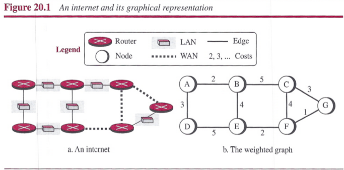
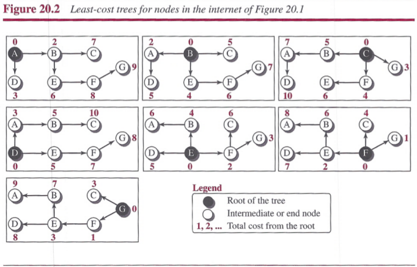
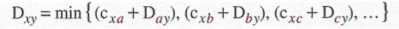
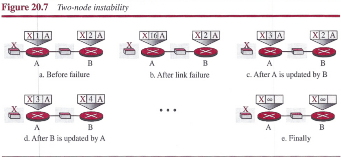
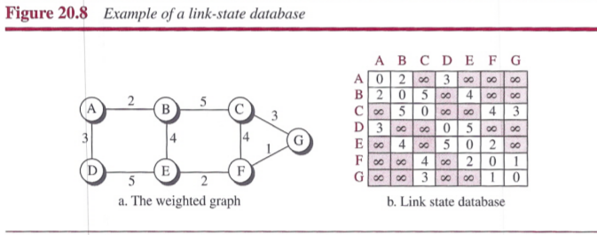
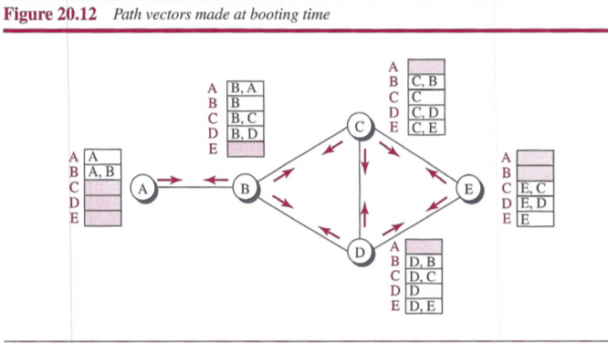
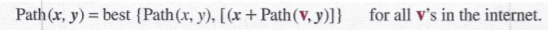
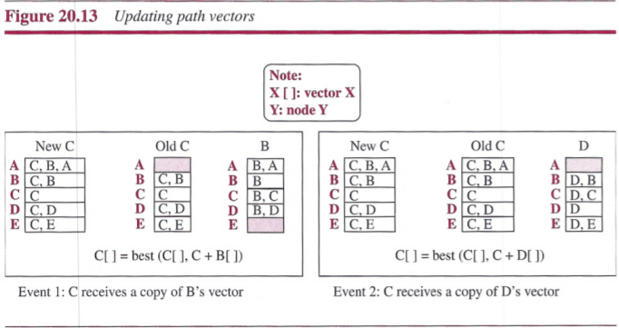

# Chapter 20: Unicast Routing
## Introduction
Unicast routing in the Internet, with a large number of routers and a huge number of hosts, can be done only by using hierarchical routing: routing in several steps using different routing algorithms.

### General Idea
In unicast routing, a packet is routed, hop by hop, from its source to its destination by the help of forwarding tables. There are several routes that a packet can travel from the source to the destination; what must be determined is which route the packet should take.

An internet is modeled as a *weighted graph*, in which each edge is associated with a cost.



### Least-Cost Routing
The source router chooses a route to the destination router in such a way that the total cost for the route is the least cost among all possible routes.

##### Least-Cost Trees
A least-cost tree is a tree with the source router as the root that spans the whole graph (visits all other nodes) and in which the path between the root and any other node is the shortest. In this way, we can have only one shortest-path tree for each node; we have N least-cost trees for the whole internet.




## Routing Algorithms
### Distance-Vector Routing
In `distance-vector (DV) routing`, the first thing each node creates is its own least-cost tree with the rudimentary information it has about its immediate neighbors. The incomplete trees are exchanged between immediate neighbors to make the trees more and more complete and to represent the whole internet.

##### Bellman-Ford Equation
This equation is used to find the least cost between a source node, and a distination node, through some intermediary nodes.




##### Distance Vectors
Distance-vector routing unglues these paths and creates a distance vector, a one-dimensional array to represent the tree.

Each node in an internet, when it is booted, creates a very rudimentary distance vector with the minimum information the node can obtain from its neighborhood.


After each node has created its vector, it sends a copy of the vector to all its immediate neighbors. After a node receives a distance vecter from a neighbor, it updates its distance vector using the Bellman-Ford equation.


We need to remember that after updating a node, it immediately sends its updated vector to all neighbors.

##### Distance-Vector Routing Algorithm
```
Distance_Vector_Routing()
{
    // Initialize (create initial vectors for the node)
    D[myself] = 0
    for (y = 1 to N)
    {
        if (y is a neighbor)
            D[y] = c[myself][y]
        else
            D[y] = ∞
    }
    send vector {D[1], D[2], ..., D[N]} to all neighbors
    // Update (improve the vector with the vector received from a neighbor)
    repeat (forever)
    {
        wait (for a vector Dw from a neighbor w or any change in the link)
        for (y = 1 to N)
        {
            D[y] = min[D[y], (c[myself][w] + Dw[y])]    // Bellman-Ford equation
        }
        if (any change in the vector)
            send vector {D[1], D[2], ..., D[N]} to all neighbors
    }
} // End of Distance Vector
```

**Two-Node Loop**: One example of `count to infinity` is the `two-node loop` problem. The two-node instability can be avoided using `split horizon` combined with `poison reverse`.



### Link-State Routing
`Link-state (LS) routing` uses the term `link-state` to define the characteristic of a link (an edge) that represents a network in the internet. In this algorithm the cost associated with an edge defines the state of the link.

##### Link-State Databases (LSDB)
To create a least-cost tree with this method, each node needs to have a complete map of the networ , which means it needs to know the state of each link. The collection of states for all links is called the `link-state database (LSDB)`.



Each node can send some greeting messages to all its immediate neighbors to collect two pieces of information for each neighboring node: the identity of the node and the cost of the link. The combination of these two pieces of informationlis called the LS packet (LSP); the LSP is sent out of each interface.


##### Formation of Least-Cost Trees
To create a least-cost tree for itself, using the shared LSDB, each node needs to run the famous `Dijkstra Algorithm`.
1. The node chooses itself as the root of the tree, creating a tree with a single node, and sets the total cost of each node based on the information in the LSDB.
2. The node selects one node, among all nodes not in the tree, which is closest to the root, and adds this to the tree. After this node is added to the tree, the cost of all other nodes not in the tree needs to be updated because the paths may have been changed.
3. The node repeats step 2 until all nodes are added to the tree.

```
Dijkstra's Algorithm()
{
    // Initialization
    Tree = {root}               // Tree is made only of the root
    for (y = 1 to N)            // N is the number of nodes
    {
        if (y is the root)
            D[y] = 0            // D[y] is shortest distance from root to node y
        else if (y is a neighbor)
            D[y] = c[root][y]   // c[x][y] is cost between nodes x and y in LSDB
        else
            D[y] = ∞
    }
    // Calculation
    repeat
    {
        find a node w, with D[w] minimum among all nodes not in the Tree
        Tree = Tree ∪ {w}       // Add w to tree
        // Update distances for all neighbors of w
        for (every node x, which is a neighbor of w and not in the Tree)
        {
            D[x] = min{D[x], (D[w] + c[w][x])}
        }
    } until (all nodes included in the Tree)
} // End of Dijkstra
```


### Path-Vector Routing
To provide safety, security, and to allow the packet to reach its destination more efficiently without assigning costs to the route, `path-vector (PV) routing` has been devised. The best route is determined by the source using the policy it imposes on the route.

##### Spanning Trees
In path-vector routing, the path from a source to all destinations is also determined by the best spanning tree.


##### Creation of Spanning Trees
When  a node is booted, it creates a path vector based on the information it can obtain about its immediate neighbor.



Each node, after the creation of the initial path vector, sends it to all its immediate neighbors. Each node, when it receives a path vector from a neighbor, updates its path vector using an equation similar to the Bellman-Ford, but applying its own policy instead of looking for the least cost.





##### Path-Vector Algorithm
```
Path_Vector_Routing()
{
    // Initialization
    for (y = 1 to N)
    {
        if (y is myself)
            Path[y] = myself
        else if (y is a neighbor)
            Path[y] = myself + neighbor node
        else
            Path[y] = empty
    }
    Send vector {Path[1], Path[2], ..., Path[y]} to all neighbors
    // Update
    repeat (forever)
    {
        wait (for a vector Pathw from a neighbor w)
        for (y = 1 to N)
        {
            if (Pathw includes myself)
                discard the path        // Avoid any loop
            else
                Path[y] = best {Path[y], (myself + Pathw[y])}
        }
        If (there is a change in the vector)
            Send vector {Path[1], Path[2], ..., Path[y]} to all neighbors
    }
} // End of Path Vector
```


## Unicast Routing Protocols
