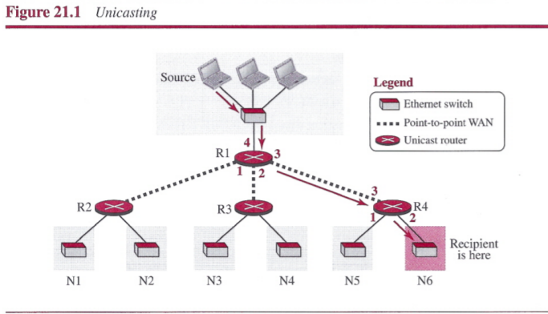
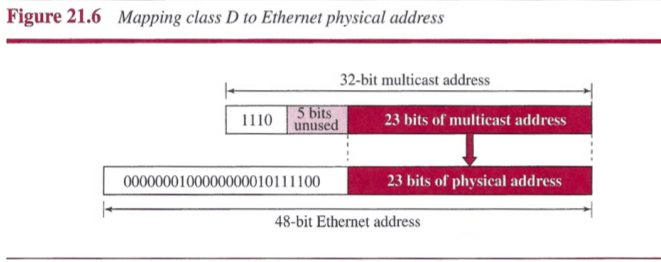
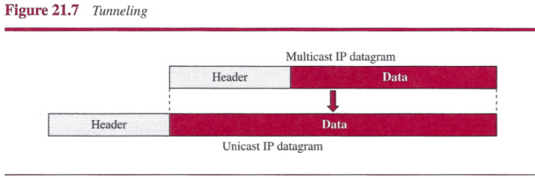
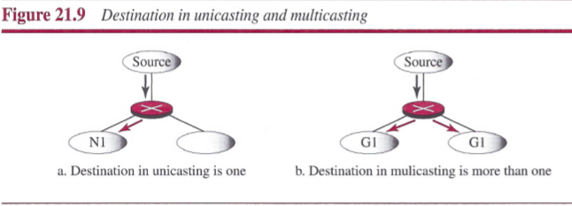
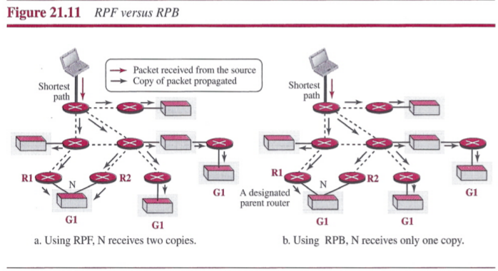
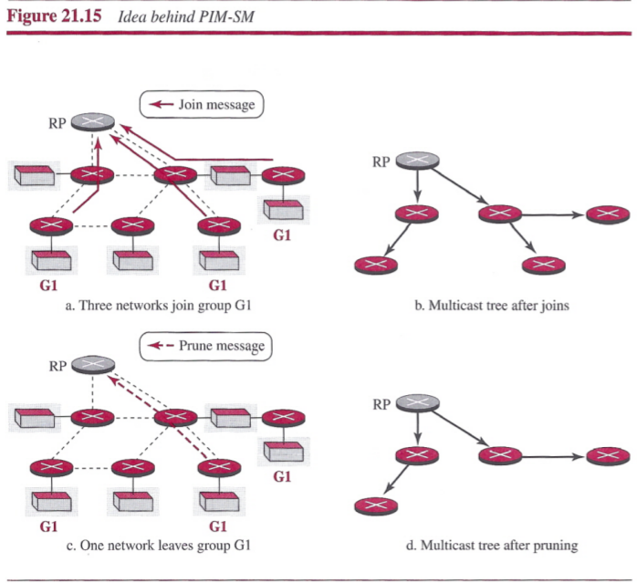
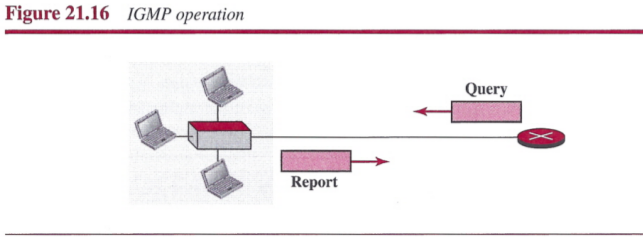

# Chapter 21: Multicast Routing
## Introduction
Communication can be `unicasting`, `multicasting`, and `broadcasting`.

##### Unicasting
In unicasting, there is one source and one destination network. The relationship between the source and the destination network is one to one. Each router in the path of the datagram tries to forward the packet to one and only one of its interfaces.

##### Multicasting
In multicasting, there is one source and a group of destinations. The relationship is one to many. A multicast router may have to send out copies of the same datagram through more than one interface.

**Multicasting versus Multiple Unicasting**:
- Multicasting starts with a single packet from the source that is duplicated by the routers. The destination address in each packet is the same for all duplicates.
- In multiple unicasting, several packets start from the source, each with a different unicast destination address.

- Multicasting is more efficient than multiple unicasting.
- In multiple unicasting, the packets are created by the source with a relative delay between packets.

##### Broadcasting
Broadcasting means one-to-all communication: a host sends a packet to all hosts in an internet.

## Multicasting Basics
### Multicast Addresses
A multicast address is an identifier for a group.

##### Multicast Addresses in IPv4
Multicast addresses in IPv4 belong to a large block of addresses. Four bits define the block; the rest of the bits are used as the identifier for the group.

However, the block is divided into several subblocks, and each subblock is used in a particular multicast application.

### Delivery at Data-Link Layer
In the case of unicasting, this task is done by the ARP protocol, but, because the IP packet has a multicast IP address, the ARP protocol cannot find the corresponding MAC address to forward a multicast packet at the data-link layer.

##### Network with Multicast Support
Most LANs support physical multicast addressing. Ethernet is one of them. An Ethernet physical address (MAC address) is six octets (48 bits) long. If the first 25 bits in an Ethernet address are 00000001 00000000 01011110 0, this identifies a physical multicast address for the TCP/IP protocol. The remaining 23 bits can be used to define a group. An Ethernet multicast physical address is in the range `01:00:5E:00:00:00` to `01:00:5E:7F:FF:FF`.

##### Network with No Multicast Support
Most WANs do not support physical multicast addressing. To send a multicast packet through these networks, a process called `tunneling` is used. In tunneling, the multicast packet is encapsulated in a unicast packet and sent through the network, where it emerges from the other side as a multicast packet.

### Collecting Information about Groups

### Multicast Forwarding
Forwarding in unicast and multicast communication is different in two aspects:
- In unicast communication, the destination address of the packet defines one single destination. In multicast communication, the destination of the packet defines one group, but that group may have more than one member in the internet.

 

- Forwarding decisions in unicast communication depend only on the destination address of the packet. Forwarding decisions in multicast communication depend on both the destination and the source address of the packet.

 

### Two Approaches to Multicasting
Two different approaches in multicast routing have been developed: routing using `source-based trees` and routing using `group-shared trees`.
- In the source-based tree approach to multicasting, each router needs to create a separate tree for each source-group combination.
- In the group-shared tree approach, we designate a router to act as the phony source for each group. The `rendezvouspoint` router, acts as the representative for the group.

## Intradomain Multicast Protocols
### Multicast Distance Vector (DVMRP)
The `Distance Vector Multicast Routing Protocol (DVMRP)` is the extension of the Routing Information Protocol (RIP). It uses the source-based tree approach to multicasting. Each router in this protocol that receives a multicast packet to be forwarded implicitly creates a source-based multicast tree in three steps:
1. The router uses an algorithm called `reverse path forwarding (RPF)` to simulate creating part of the optimal source-based tree between the source and itself.
2. The router uses an algorithm called `reverse path broadcasting (RPB)` to create a broadcast (spanning) tree whose root is the router itself and whose leaves are all networks in the internet.
3. The router uses an algorithm called `reverse path multicasting (RPM)` to create a multicast tree by cutting some branches of the tree that end in networks with no member in the group.

- `Reverse Path Forwarding (RPF)`
- `Reverse Path Broadcasting (RPB)`
- `Reverse Path Multicasting (RPM)`

### Multicast Link State (MOSPF)
The `Multicast Open Shortest Path First (MOSPF)` is the extension of the Open Shortest Path First (OSPF) protocol. It uses the source-based tree approach to multicasting.

### Protocol Independent Multicast (PIM)
`Protocol Independent Multicast (PIM)` is the name given to a common protocol that needs a unicast routing protocol for its operation, but the unicast protocol can be either a distance-vector protocol or a link-state protocol. PIM can work in two different modes: dense (PIM_DM) and sparse (PIM-SM).

##### Protocol Independent Multicast-Dense Mode (PIM-DM)
When the number of routers with attached members is large relative to the number of routers in the internet, PIM works in the dense mode and is called PIM-DM. In this mode, the protocol uses a source-based tree approach and is similar to DVMRP. PIM-DM uses only two strategies described in DVMRP: RPF and RPM. But unlike DVMRP, forwarding of a packet is not suspended awaiting pruning of the first subtree.

##### Protocol Independent Multicast-Sparse Mode (PIM-SM)
When the number of routers with attached members is small relative to the number of routers in the internet, PIM works in the sparse mode and is called PIM-SM. PIM-SM uses a group-shared tree approach to multicasting.

## Interdomain Multicast Protocols
One common protocol for interdomain multicast routing is called `Multicast Border Gateway Protocol (MBOP)`, which is the extension of BOP. MBOP provides two paths between ASs: one for unicasting and one for multicasting. Information about multicasting is exchanged between border routers in different ASs. MBGP is a shared-group multicast routing protocol in which one router in each AS is chosen as the rendezvous point (RP).

## IGMP
The protocol that is used for collecting information about group membership is the `Internet Group Management Protocol (IGMP)`. IGMP is a protocol defined at the network layer and IGMP messages are encapsulated in an IP datagram.

### Messages
There are two types of messages:
- `query`: A query message is periodically sent by a router to all hosts attached to it to ask them to report their interests about membership in groups.
- `report`: A report message is sent by a host as a response to a query message.

The IGMP message is encapsulated in an IP datagram with the value of the protocol field set to 2 and the TTL field set to 1. The destination IP address of the datagram depends on the type of message,

## Summary
- Multicasting is the sending of the same message to more than one receiver simultaneously. Multicasting has many applications including distributed databases, information dissemination, teleconferencing, and distance learning.
- In classless addressing the block 224.0.0.0/4 is used for multicast addressing. This block is sometimes referred to as the multicast address space and is divided into several blocks (smaller blocks) for different purposes.
- In a source-based tree approach to multicast routing, the source/group combination determines the tree. RPF, RPB, and RPM are efficient improvements to source-based trees. MOSPF, DVMRP, and PIM-DM are three protocols that use source-based tree methods to multicast.
- In a group-shared approach to multicasting, one rendezvous router takes the responsibility of distributing multicast messages to their destinations. PIM-DM and PIM-SM are examples of group-shared tree protocols.
- The Internet Group Management Protocol (IGMP) is involved in collecting local membership group information. The last version of IGMP, IGMPv3, uses two types of messages: query and report. The query message takes three formats: general, group-specific, and group-and-source specific. IGMP messages are encapsulated directly in an IP datagram with the TTL value set to 1.
