# Chapter 3: Introduction to Physical Layer
One of the major functions of the physical layer is to move data in the form of electromagnetic signals across a transmission medium. For transmission, data needs to be changed to signals.

## Data and Signals
### Analog and Digital Data
Data can be analog and digital.
- `analog data` refers to information that is continuous and take on continuous values.
- `digital data` refers to information that has discrete states and take on discrete values.

### Analog and Digital Signals
Signals can be analog or digital.
- `analog signals` can have an infinite number of values in a range.
- `digital signals` can have only a limited number of values.

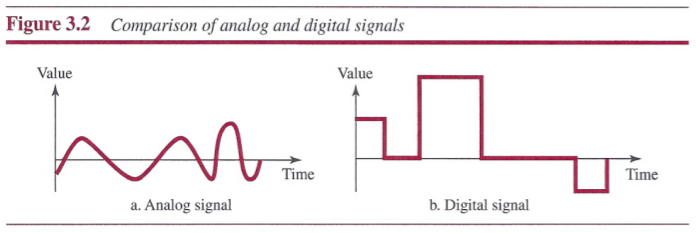

### Periodic and Nonperiodic
In data communicatins, we commonly use periodic analog signals and nonperiodic digital signals.

## Periodic Analog Signals
Periodic analog signals can be classified as simple or composite.

### Sine Wave

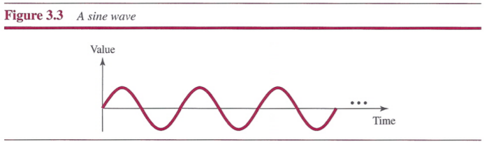

A sine wave can be represented by three parameters: the `peak amplitude`, the `frequency`, and the `phase`.
- The `peak amplitude` of a signal is the absolute value of its highest intensity, proportional to the energy it carries.
- `Frequency` refers to the number of periods in 1s.
 - `Period` refers to the amount of time, in seconds, a signal needs to complete 1 cycle.
 - Frequency and period are the inverse of each other.
 - Frequency is the rate of change with respect to time. Change in a short span of time means high frequency. Change over a long span of time means low frequency.
 - If a signal does not change at all, its frequency is zero. If a signal changes instantaneously, its frequency is infinite.
- `Phase` describes the position of the waveform relative to time O.

### Wavelength
`Wavelength` binds the period or the frequency of a simple sine wave to the `propagation speed` of the medium.

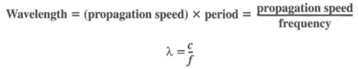

### Time and Frequency Domains
- The `time-domain` plot shows changes in signal amplitude with respect to tiem.
- The `frequency-domain` plot shows the relationship between amplitude and frequency.

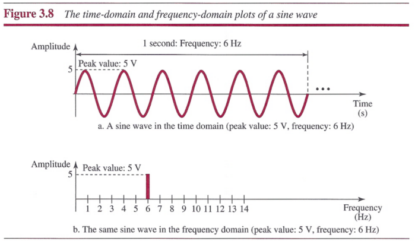

A complete sine wave in the time domain can be represented by one signal spike in the frequency domain.

### Composite Signals
- A single-frequency sine wave is not useful in data communications; we need to send a composite signal, a signal made of many simple sine waves.
- According to Fourier analysis, any composite signal is a combination of simple sine waves with different frequencies, amplitudes, and phases.
- If the composite signal is periodic, the decomposition gives a series of signals with discrete frequencies; if the composite signal is nonperiodic, the decomposition gives a combination of sine waves with continuous frequencies.

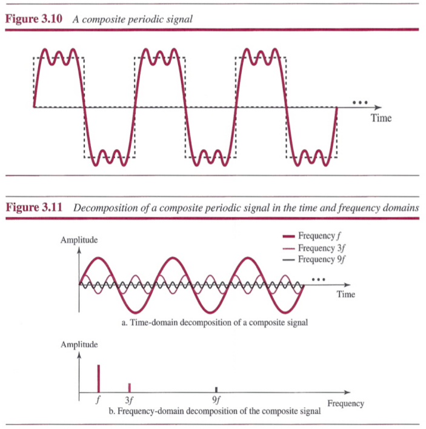

### Bandwidth
The bandwidth of a composite signal is the difference between the highest and the lowest frequencies contained in that signal.

## Digital Signals
Information can also be represented by a digital signal. A digital signal can have more than two levels, in this case, we can send more than 1 bit for each level. If a signal has *L* levels, each level needs log2*L* bits.

### Bit Rate
`Bit rate` is used to describe digital signals, it is the number of bits sent in 1s, expressed in `bits per sencond (bps)`.

### Bit Length
The `bit length` is the distance one bit occupies on the transmission medium.

### Digital Signal as a Composite Analog Signal
Based on Fourier analysis, a digital signal is a composite analog signal.

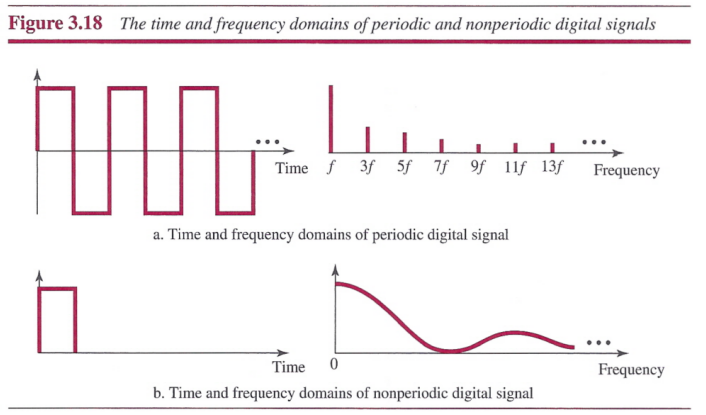

Note that both bandwidths are infinite, but the periodic signal has discrete frequencies while the nonperiodic signal has continuous frequencies.

### Transmission of Digital Signals
A digital signal is a composite analog with an infinite bandwidth. We can transmit a digital signal by using one of two different approaches: baseband transmission or broadband transmission.

##### Baseband Transmission
Baseband transmission means sending a digital signal over a channel without changing the digital signal to an analog signal.

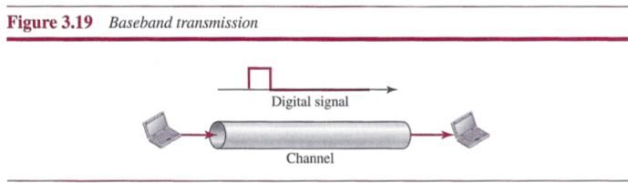

Baseband transmission requires that we have a `low-pass channel`, a channel with a bandwidth that starts from zero.

We need to remember that a low-pass channel with infinite bandwidth is dieal, but we cannot have such a channel in real life. There are two low-pass channels:

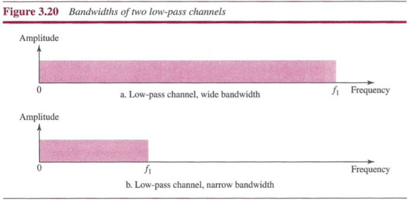

**Case 1: Low-Pass Channel with Wide Bandwidth**

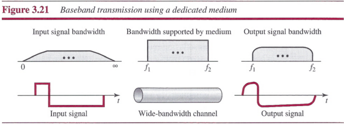

Baseband transmission of a digital signal that preserves the shape of the digital signal is possible only if we have a low-pass channel with an infinite or very wide bandwidth.

**Case 2: Low-Pass Channel with Limited Bandwidth**

In a low-pass channel with limited bandwidth, we approximate the digital signal with an analog signal.

**Rough Approximation**: Consider the worst case, a maximum number of changes in the digital signal (01010101... or 10101010...). We need an analog signal of frequency *f=N/2*, so the maximum frequency is *N/2*. Let us see how a digital with a 3-bit pattern can be simulated by using analog signals:

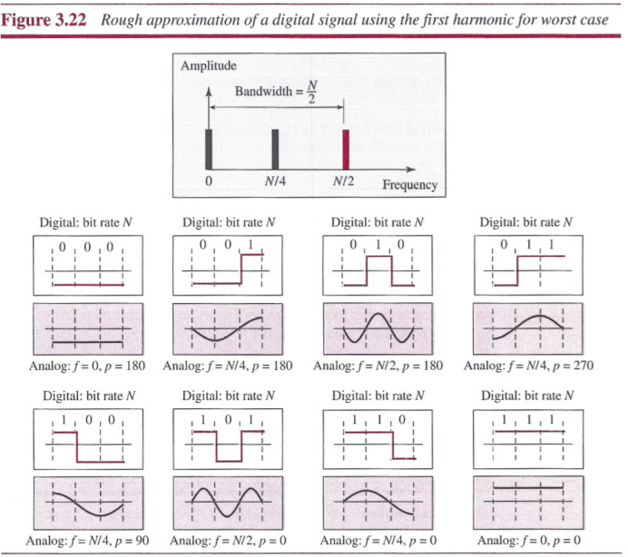

**Better Approximation**: We need to add more harmonics of the frequencies. We need to increase the bandwidth.

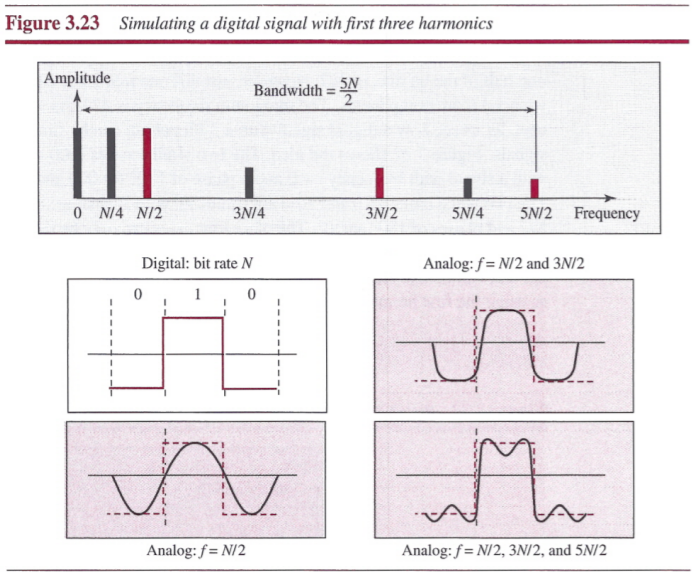

 In baseband transmission, the required bandwidth is proportional to the bit rate; if we need to send bits faster, we need more bandwidth.

##### Broadband Transmission (Using Modulation)
`Broadband transmission` or modulation means changing the digital signal to an analog signal for transmission. Modulation allows us to use a `bandpass channel` (a channel with a bandwidth that does not start from zero).

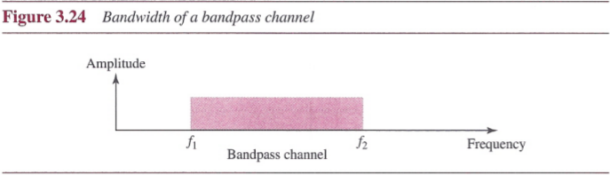

Note that a low-pass channel can be considered a bandpass channel with the lower frequency starting at zero. If the available channel is a bandpass channel, we cannot send the digital signal directly to the channel; we need to convert the digital signal to an analog signal before transmission.

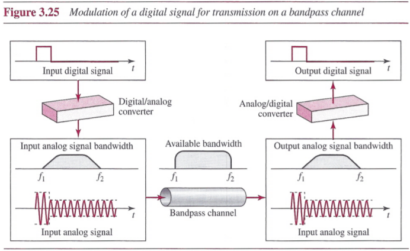

## Transmission Impairment
Three causes of impairment are `attenuation`, `distortion` and `noise`.

### Attenuation
`Attenuation` means a loss of energy. To compensate for this loss, amplifiers are used to amplify the signal.

**Decibel**: The `decibel (dB)` measures the relative strengths of two signals or one signal at two different points. Note that the decibel is negative if a signal is attenuated and positive if a signal is amplified.

Variables P1 and P2 are the powers of a signal at points I and 2, respectively.

### Distortion
`Distortion` means that the signal changes its form or shape.

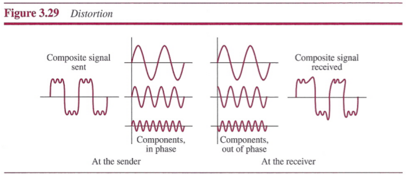

### Noise
`Noise` is another cause of impairment.

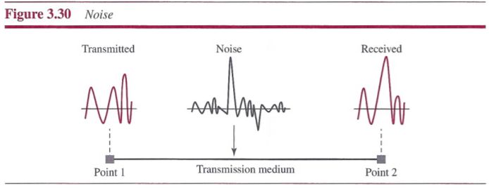

**Signal-to-Noise Ratio (SNR)**: We need to consider the average signal power and the average noise power because these may change with time.

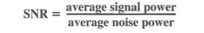

Because SNR is the ratio of two powers, it is often described in decibel units, SNRdB, defined as **SNRdB = 10log10SNR**.

## Data Rate Limits
Data rate depends on three factors:
1. The bandwidth available
2. The level of the signals we use
3. The quality of the channel (the level of noise)

Two theoretical formulas were developed to calculate the data rate:
- Nyquist bit rate: for a noiseless channel
- Shannon capacity: for a noisy channel

### Noiseless Channel: Nyquist Bit Rate
For a noise less channel, the `Nyquist bit rate` formula defines the theoretical maximum bit rate:

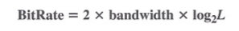

In this formula, bandwidth is the bandwidth of the channel, *L* is the number of signal levels used to represent data, and BitRate is the bit rate in bits per second.

Given a specific bandwidth, we can have any bit rate we want by increasing the number of signal levels. But increasing the levels of a signal may reduce the reliability of the system.

### Noisy Channel: Shannon Capacity
`Shannon capacity`, to determine the theoretical highest data rate for a noisy channel:

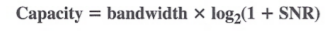

In this formula, bandwidth is the bandwidth of the channel, SNR is the signal-to-noise ratio, and capacity is the capacity of the channel in bits per second. Note that in the Shannon formula there is no indication of the signal level, which means that no matter how many levels we have, we cannot achieve a data rate higher than the capacity of the channel.

### Using Both Limits
The Shannon capacity gives us the upper limit; the Nyquist formula tells us how many signal levels we need.

## Performance
### Bandwidth
One characteristic that measures network performance is bandwidth. In networking, we use the term bandwidth in two contexts.
- The first, `bandwidth in hertz`, refers to the range of frequencies in a composite signal or the range of frequencies that a channel can pass.
- The second, `bandwidth in bits per second`, refers to the speed of bit transmission in channel or link.

### Throughput
The `throughput` is a measure of how fast we can actually send data through a network.

- the bandwidth is a potential measurement of a link;
- the throughput is an actual measurement of how fast we can send data.

### Latency (Delay)
The `latency` or delay defines how long it takes for an entire message to completely arrive at the destination from the time the first bit is sent out from the source. We can say that latency is made of four components: `propagation time`, `transmission time`, `queuing time` and `processing delay`.

**Latency = propagation time + transmission time + queuing time + processing delay**

**Propagation time** measures the time required for a bit to travel from the source to the destination:

**Propagation time = Distance / (Propagation Speed)**

The **transmission time** of a message depends on the size of the message and the bandwidth of the channel:

**Transmission time = (Message size) / Bandwidth**

`Queuing time` is the time needed for each intermediate or end device to hold the message before it can be processed.

### Bandwidth-Delay Product

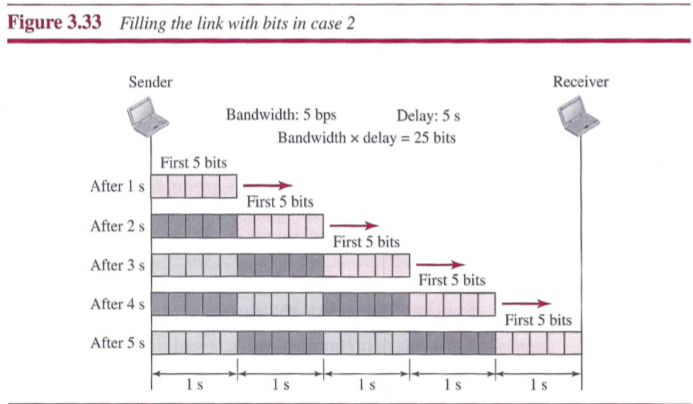

The bandwidth-delay product defines the number of bits that can fill the link.

### Jitter
We can roughly say that jitter is a problem if different packets of data encounter different delays and the application using the data at the receiver site is time-sensitive.

## Summary
- Data must be transformed to electromagnetic signals to be transmitted.
- Data can be analog or digital. Analog data are continuous and take continuous values. Digital data have discrete states and take discrete values.
- Signals can be analog or digital. Analog signals can have an infinite number of values in a range; digital signals can have only a limited number of values.
- In data communications, we commonly use periodic analog signals and nonperiodic digital signals.
- Frequency and period are the inverse of each other.
- Frequency is the rate of change with respect to time.
- Phase describes the position of the waveform relative to time O.
- A complete sine wave in the time domain can be represented by one single spike in the frequency domain.
- A single-frequency sine wave is not useful in data communications; we need to send a composite signal, a signal made of many simple sine waves.
- According to Fourier analysis, any composite signal is a combination of simple sine waves with different frequencies, amplitudes, and phases.
- The bandwidth of a composite signal is the difference between the highest and the lowest frequencies contained in that signal.
- A digital signal is a composite analog signal with an infinite bandwidth.
- Baseband transmission of a digital signal that preserves the shape of the digital signal is possible only if we have a low-pass channel with an infinite or very wide bandwidth.
- If the available channel is a bandpass channel, we cannot send a digital signal directly to the channel; we need to convert the digital signal to an analog signal before transmission.
- For a noiseless channel, the Nyquist bit rate formula defines the theoretical maximum bit rate. For a noisy channel, we need to use the Shannon capacity to find the maximum bit rate.
- Attenuation, distortion, and noise can impair a signal.
- Attenuation is the loss of a signal's energy due to the resistance of the medium.
- Distortion is the alteration of a signal due to the differing propagation speeds of each of the frequencies that make up a signal.
- Noise is the external energy that corrupts a signal.
- The bandwidth-delay product defines the number of bits that can fill the link.
