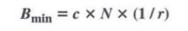
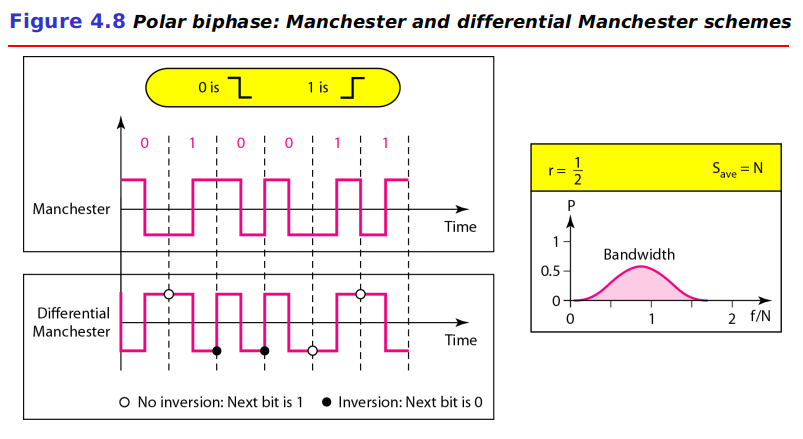
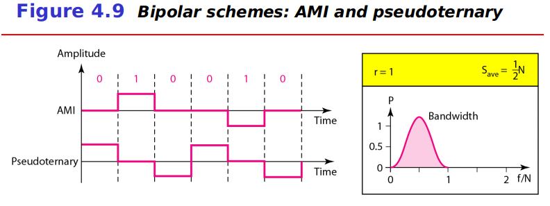
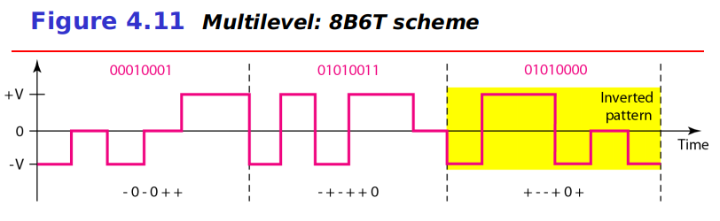
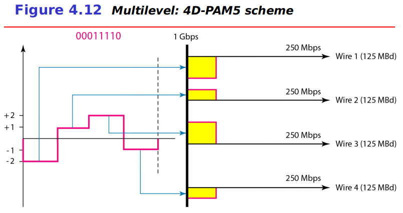

# Chapter 4: Digital Transmission
## Digital-to-Digital Conversion
The conversion involves three techniques: `line coding`, `block coding`, and `scrambling`.

### Line Coding
`Line coding` is the process of converting digital data to digital signals.

##### Characteristics
**Signal Element Versus Data Element**:
- `data element`: In data communications, our goal is to send data element. A data element is the smallest entity that can represent a piece of information: this is a bit.
- `signal element`: In digital data communications, a signal element carries data element. A signal element is the shortest unit of a digital signal.

We difined a ratio *r* which is the number of data elements carried by each signal element.

**Data Rate Versus Signal Rate**:
- `data rate`: defines the number of data element sent in 1s. The unit is bits per second (bps).
- `signal rate`: defines the number of signal element sent in 1s. The unit is the baud.

One goal in data communications is to increase the data rate while decreasing the signal rate. Increasing the data rate increase the speed of transmission; decreasing the signal rate decreases the bandwidth requirement.

There are three cases: the worst, best and average. The worst case is when we need the maximum signal rate; the best case is when we need the minimum. In data communications, we are usually interested in the average case. The relatonship between data rate and signal rate:

where *N* is the data rate (bps); *c* is the case factor, which varies for each case; *S* is the number of signal element per second; and *r* is the previously defined factor.

**Bandwidth**:
Although the actual bandwidth of a digital signal is infinite, the effective bandwidth is finite. The baud rate, not the bit rate, determines the required bandwidth for a digital signal.

The minimum bandwidth can be given as:

The maximum data rate if the bandwidth of the channel is given:

**Baseline Wandering**:
In decoding a digital signal, the receiver calculates a running average of the received signal power. This average is called the `baseline`. The incoming signal power is evaluated against this baseline to determine the value of the data element. A long string of 0s or 1s can cause a drift in the baseline (`baseline wandering`) and make it difficult for the receiver to decode correctly.

**DC Components**:
When the voltage level in a digital signal is constant for a while, the spectrum creates very low frequencies. These frequencies around zero, called DC components, present problems for a system that cannot pass low frequencies or a system that uses electrical coupling.

**Self-synchronization**:
The receiver's bit intervals must correspond exactly to the sender's bit intervals. A `self-synchronization` digital signal includes timing information in the data being transmitted.

### Line Coding Schemes

##### Unipolar Scheme
In a `unipolar scheme`, all the signal levels are on one side of the time axis, either above or below.

**NRZ (Non-Return-to-Zero)**: a unipolar scheme was designed as a `non-return-to-zero` scheme in which the positive voltage defines bit 1 and the zero voltage defines bit 0. It is called NRZ because the signal does not return to zero at the middle of the bit.

##### Polar Schemes
In `polar` schemes, the voltages are on the both sides of the time axis.

**Non-Return-to-Zero (NRZ)**: In `polar NRZ` encoding, we use two levels of voltage amplitude. We can have two versions of polar NRZ: NRZ-L and NRZ-I.
- In NRZ-L the level of the voltage determines the value of the bit. In NRZ-I the inversion or the lack of inversion determines the value of the bit.
- NRZ-L and NRZ-I both have an average signal rate of *N*/2 Bd.
- NRZ-L and NRZ-I both have a DC component problem.

**Return-to-Zero (RZ)**: The main problem with NRZ encoding occurs when the sender and receiver clocks are not synchronized. One solution is the `return-to-zero` scheme, which uses three values: positive, negative, and zero. In RZ, the signal changes not between bits but during the bit.

**Biphase: Manchester and Differential Manchester**: The idea of RZ and the idea of NRZ-L are combined into the `Manchester` scheme. `Differential Manchester` combines the idea of RZ and NRZ-I.
- In Manchester and differential Manchester encoding, the transition at the middle of the bit is used for synchronization.
- The minimum bandwidth of Manchester and differential Manchester is 2 times that of NRZ.

##### Bipolar Schemes
In `bipolar` encoding, we use three levels: positive, zero, and negative.

**AMI and Pseudoternary**: alternate mark inversion (AMI) means alternate 1 inversion. A neutral zero voltage represents binary 0. Binary 1s are represented by alternating positive and negative voltages. A variation of AMI encoding is called `pseudoternary` in which the 1 bit is encoded as a zero voltage and the 0 bit is encoded as alternating positive and negative voltages.

##### Multilevel Schemes
In *mBnL* schemes, a pattern of *m* data element is encoded as a pattern of *n* signal elements in which 2m ≤ Ln. (A letter is often used in place of *L*: *B*(binary) for *L* = 2, *T*(ternary) for *L* = 3, and *Q*(quaternary) for *L* = 4)

**2B1Q**: `two binary, one quaternary (2B1Q)` used data patterns of size 2 and encoded the 2-bit patterns as one signal element belonging to a four-level signal.

**8B6T**: `eight binary, six ternary (8B6T)`.

**4D-PAM5**: `four-dimensional five-level pulse amplitude modulation (4D-PAM5)`.

##### Multitransition: MLT-3
The `multiline transmission, three-level (MLT-3)` scheme uses three levels (+V, 0, and -V) and three transition rules to move between the levels.
1. If the next bit is 0, there is no transition.
2. If the next bit is 1 and the current level is not 0, the next level is 0.
3. If the next bit is 1 and the current level is 0, the next level is the opposite of the last nonzero level.

##### Summary of Line Coding Schemes

### Block Coding
