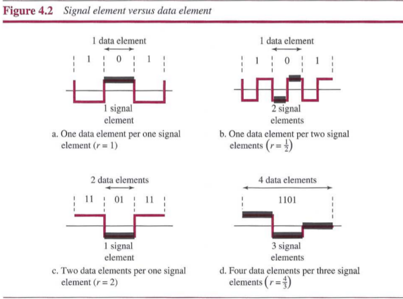
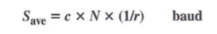

# Chapter 4: Digital Transmission
## Digital-to-Digital Conversion
The conversion involves three techniques: `line coding`, `block coding`, and `scrambling`.

### Line Coding
`Line coding` is the process of converting digital data to digital signals.

##### Characteristics
**Signal Element Versus Data Element**:
- `data element`: In data communications, our goal is to send data element. A data element is the smallest entity that can represent a piece of information: this is a bit.
- `signal element`: In digital data communications, a signal element carries data element. A signal element is the shortest unit of a digital signal.

We difined a ratio *r* which is the number of data elements carried by each signal element.

**Data Rate Versus Signal Rate**:
- `data rate`: defines the number of data element sent in 1s. The unit is bits per second (bps).
- `signal rate`: defines the number of signal element sent in 1s. The unit is the baud.

One goal in data communications is to increase the data rate while decreasing the signal rate. Increasing the data rate increase the speed of transmission; decreasing the signal rate decreases the bandwidth requirement.

There are three cases: the worst, best and average. The worst case is when we need the maximum signal rate; the best case is when we need the minimum. In data communications, we are usually interested in the average case. The relatonship between data rate and signal rate:

where *N* is the data rate (bps); *c* is the case factor, which varies for each case; *S* is the number of signal elemens per second; and *r* is the previously defined factor.

**Bandwidth**:
