# Chapter 4: Digital Transmission
## Digital-to-Digital Conversion
The conversion involves three techniques: `line coding`, `block coding`, and `scrambling`.

### Line Coding
`Line coding` is the process of converting digital data to digital signals.

##### Characteristics
**Signal Element Versus Data Element**:
- `data element`: In data communications, our goal is to send data element. A data element is the smallest entity that can represent a piece of information: this is a bit.
- `signal element`: In digital data communications, a signal element carries data element. A signal element is the shortest unit of a digital signal.

We difined a ratio *r* which is the number of data elements carried by each signal element.

**Data Rate Versus Signal Rate**:
- `data rate`: defines the number of data element sent in 1s. The unit is bits per second (bps).
- `signal rate`: defines the number of signal element sent in 1s. The unit is the baud.

One goal in data communications is to increase the data rate while decreasing the signal rate. Increasing the data rate increase the speed of transmission; decreasing the signal rate decreases the bandwidth requirement.

There are three cases: the worst, best and average. The worst case is when we need the maximum signal rate; the best case is when we need the minimum. In data communications, we are usually interested in the average case. The relatonship between data rate and signal rate:

where *N* is the data rate (bps); *c* is the case factor, which varies for each case; *S* is the number of signal element per second; and *r* is the previously defined factor.

**Bandwidth**:
Although the actual bandwidth of a digital signal is infinite, the effective bandwidth is finite. The baud rate, not the bit rate, determines the required bandwidth for a digital signal.

The minimum bandwidth can be given as:

The maximum data rate if the bandwidth of the channel is given:
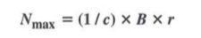

**Baseline Wandering**:
In decoding a digital signal, the receiver calculates a running average of the received signal power. This average is called the `baseline`. The incoming signal power is evaluated against this baseline to determine the value of the data element. A long string of 0s or 1s can cause a drift in the baseline (`baseline wandering`) and make it difficult for the receiver to decode correctly.

**DC Components**:
When the voltage level in a digital signal is constant for a while, the spectrum creates very low frequencies. These frequencies around zero, called DC components, present problems for a system that cannot pass low frequencies or a system that uses electrical coupling.

**Self-synchronization**:
The receiver's bit intervals must correspond exactly to the sender's bit intervals. A `self-synchronization` digital signal includes timing information in the data being transmitted.

### Line Coding Schemes

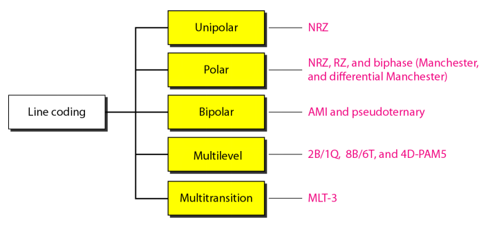

##### Unipolar Scheme
In a `unipolar scheme`, all the signal levels are on one side of the time axis, either above or below.

**NRZ (Non-Return-to-Zero)**: a unipolar scheme was designed as a `non-return-to-zero` scheme in which the positive voltage defines bit 1 and the zero voltage defines bit 0. It is called NRZ because the signal does not return to zero at the middle of the bit.

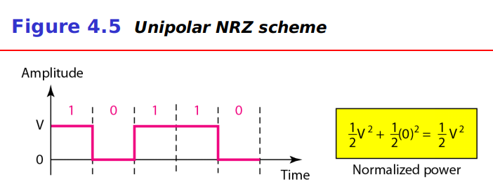

##### Polar Schemes
In `polar` schemes, the voltages are on the both sides of the time axis.

**Non-Return-to-Zero (NRZ)**: In `polar NRZ` encoding, we use two levels of voltage amplitude. We can have two versions of polar NRZ: NRZ-L and NRZ-I.
- In NRZ-L the level of the voltage determines the value of the bit. In NRZ-I the inversion or the lack of inversion determines the value of the bit.
- NRZ-L and NRZ-I both have an average signal rate of *N*/2 Bd.
- NRZ-L and NRZ-I both have a DC component problem.

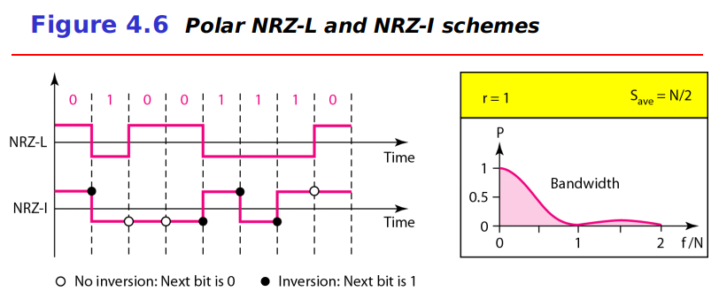

**Return-to-Zero (RZ)**: The main problem with NRZ encoding occurs when the sender and receiver clocks are not synchronized. One solution is the `return-to-zero` scheme, which uses three values: positive, negative, and zero. In RZ, the signal changes not between bits but during the bit.

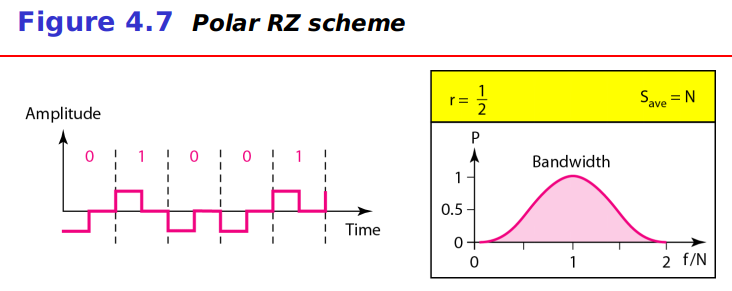

**Biphase: Manchester and Differential Manchester**: The idea of RZ and the idea of NRZ-L are combined into the `Manchester` scheme. `Differential Manchester` combines the idea of RZ and NRZ-I.
- In Manchester and differential Manchester encoding, the transition at the middle of the bit is used for synchronization.
- The minimum bandwidth of Manchester and differential Manchester is 2 times that of NRZ.

##### Bipolar Schemes
In `bipolar` encoding, we use three levels: positive, zero, and negative.

**AMI and Pseudoternary**: alternate mark inversion (AMI) means alternate 1 inversion. A neutral zero voltage represents binary 0. Binary 1s are represented by alternating positive and negative voltages. A variation of AMI encoding is called `pseudoternary` in which the 1 bit is encoded as a zero voltage and the 0 bit is encoded as alternating positive and negative voltages.

##### Multilevel Schemes
In *mBnL* schemes, a pattern of *m* data element is encoded as a pattern of *n* signal elements in which 2m ≤ Ln. (A letter is often used in place of *L*: *B*(binary) for *L* = 2, *T*(ternary) for *L* = 3, and *Q*(quaternary) for *L* = 4)

**2B1Q**: `two binary, one quaternary (2B1Q)` used data patterns of size 2 and encoded the 2-bit patterns as one signal element belonging to a four-level signal.

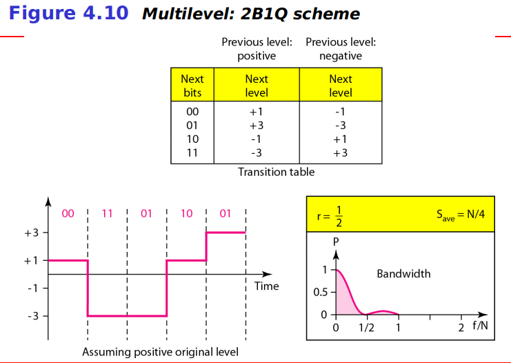

**8B6T**: `eight binary, six ternary (8B6T)`.

**4D-PAM5**: `four-dimensional five-level pulse amplitude modulation (4D-PAM5)`.

##### Multitransition: MLT-3
The `multiline transmission, three-level (MLT-3)` scheme uses three levels (+V, 0, and -V) and three transition rules to move between the levels.
1. If the next bit is 0, there is no transition.
2. If the next bit is 1 and the current level is not 0, the next level is 0.
3. If the next bit is 1 and the current level is 0, the next level is the opposite of the last nonzero level.

##### Summary of Line Coding Schemes

### Block Coding
Block coding is normally referred to as *mB/nB* coding; it replaces each *m*-bit group with *n*-bit group. Block coding normally involves three steps: division, substitution, and combination.

##### 4B/5B
The `four binary/five binary (4B/5B)` coding scheme was changed to be used in combination with NRZ-I.
- A long sequence of 0s can make the receiver clock lose synchronization in NRZ-I.
- 4B/5B solves the problem, the 5-bit output that replaces the 4-bit input has no more than one leading zero and no more than two trailing zero.

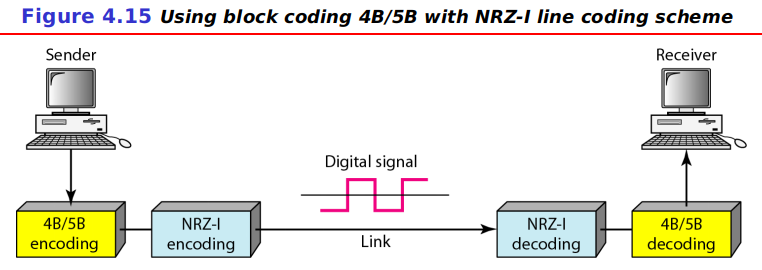

##### 8B/10B
The `eight binary/ten binary (8B/10B)` provides greater error detection capability than 4B/5B. The 8B/10B block coding is actually a combination of 5B/6B and 3B/4B encoding.

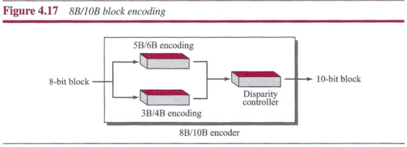

### Scrambling
`Scrambling` is one solution that does not increase the number of bits and does provide synchronization, and one solution that substitutes long zero-level pulses with a combination of other levels to provide synchronization.

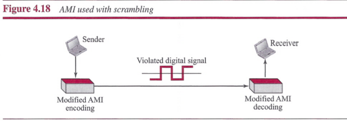

##### B8ZS
`Bipolar with 8-zero substitution (B8ZS)` substitutes eight consecutive zeros with `000VB0VB`. HDB3 substitutes four consecutive zeros with OOOVor BOOV depending on the number of nonzero pulses after the last substitution.

1. If the number of nonzero pulses after the last substitution is odd, the substitution pattern will be `OOOV`, which makes the total number of nonzero pulses even.
2. If the number of nonzero pulses after the last substitution is even, the substitution pattern will be `BOOV`, which makes the total number of nonzero pulses even.

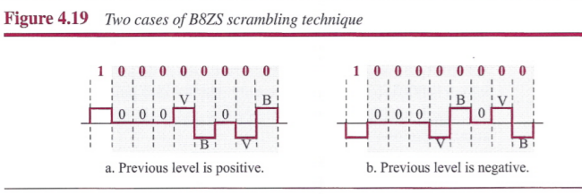

## Analog-to-Digital Conversion
### Pulse Code Modulation (PCM)
The most common technique to change an analog signal to digital data is called `pulse code modulation (PCM)`. A PCM encoder has three processes:
1. The analog signal is sampled.
2. The sampled signal is quantized.
3. The quantized values are encoded as streams of bits.

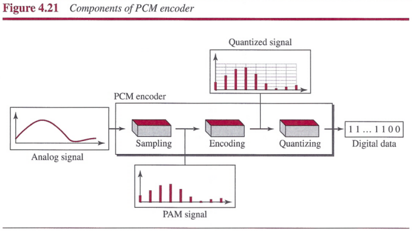

##### Sampling
The first step in PCM is `sampling`. The analog signal is sampled every *Ts* s, where *Ts* is the sample interval or period. The inverse of the sampling interval is called the `sampling rate` or `sampling frequency` and denoted by *fs* where *fs* = 1/*Ts*. There are three sampling methods: `ideal`, `natural`, and `flat-top`. The sampling process is sometimes referred to as `pulse amplitude modulation (PAM)`.

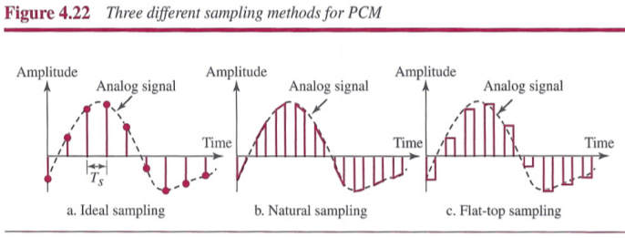

**Sampling Rate**: According to the Nyquist theorem, the sampling rate must be at least 2 times the highest frequency contained in the signal.

##### Quantization
1. We assume that the original analog signal has instantaneous amplitudes between Vmin and Vmax.
2. We divide the range into *L* zones, each of height delta. 
3. We assign quantized values of 0 to *L* - 1 to the midpoint of each zone.
4. We approximate the value of the sample amplitude to the quantized values.

**Quantization Levels**: The choice of *L*, the number of levels, depends on the range of the amplitudes of the analog signal and how accurately we need to recover the signal.

**Quantization Error**: The contributon of the `quantization error` to the SNRdB of the signal depends on the number of quantization levels *L*, or the bits per sample *nb*: 

##### Encoding
If the number of quantization levels is *L*, the number of bits is *nb* = log2 *L*. The bit rate can be found from the formula: 

##### Original Signal Recovery

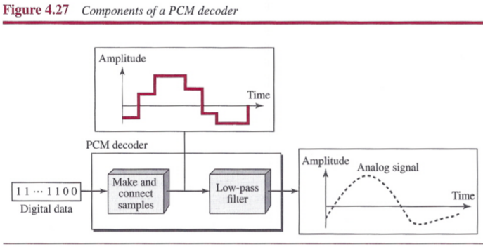

##### PCM Bandwidth
Suppose we are given the bandwidth of a low-pass analog signal. If we then digitize the signal, what is the new minimum bandwidth of the channel that can pass this digitized signal?

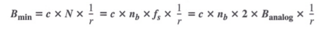

When 1/r = 1 (for a NRZ or bipolar signal) and c = (1/2) (the average situation), the
minimum bandwidth is: **Bmin = nb &times; Banalog**

### Delta Modulation (DM)
PCM finds the value of the signal amplitude for each sample; DM finds the change from the previous sample.

##### Modulator
The modulator is used at the sender site to create a stream of bits from an analog signal.

##### Demodulator
The demodulator takes the digital data and, using the staircase maker and the delay unit, creates the analog signal.

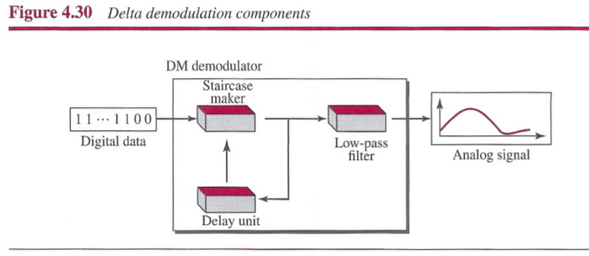

## Transmission Modes

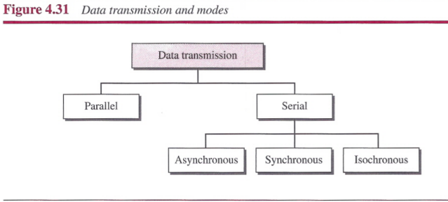

### Parallel Transmission

### Serial Transmission

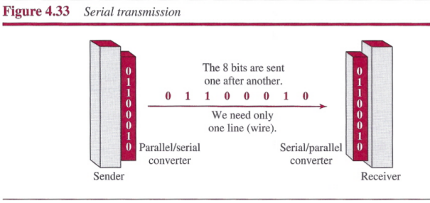

Serial transmission occurs in one of three ways: `asynchronous`, `synchronous`, and `isochronous`.

##### Asynchronous Transmission
Asynchronous transmission is so named because the timing of a signal is unimportant. Instead, information is received and translated by agreed upon patterns. patterns are based on grouping the bit stream into bytes.

- In asynchronous transmission, we send 1 start bit (0) at the beginning and 1 or more stop bits (1s) at the end of each byte. There may be a gap between bytes.
- Asynchronous here means "asynchronous at the byte level; but the bits are still synchronized; their durations are the same.

##### Synchronous Transmission
In synchronous transmission, the bit stream is combined into longer "frames," which may contain multiple bytes. Each byte, however, is introduced onto the transmission link without a gap between it and the next one.

- In synchronous transmission, we send bits one after another without start or stop bits or gaps. It is the responsibility of the receiver to group the bits.

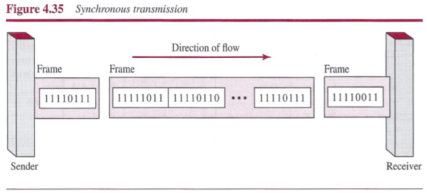

##### Isochronous
The isochronous transmission guarantees that the data arrive at a fixed rate.

## Summary
- Digital-to-digital conversion involves three techniques: line coding, block coding, and scrambling.
- Line coding is the process of converting digital data to a digital signal.
- We can roughly divide line coding schemes into five broad categories: unipolar, polar, bipolar, multilevel, and multitransition.
- Block coding provides redundancy to ensure synchronization and inherent error detection. Block coding is normally referred to as roB/nB coding; it replaces each m-bit group with an n-bit group.
- Scrambling provides synchronization without increasing the number of bits. Two common scrambling techniques are B8ZS and HDB3.
- The most common technique to change an analog signal to digital data (digitization) is called pulse code modulation (PCM).
- The first step in PCM is sampling. The analog signal is sampled every Ts second, where Ts is the sample interval or period. The inverse of the sampling interval is called the sampling rate or sampling frequency and denoted by fs, where fs = 1/Ts. There are three sampling methods-ideal, natural, and
flat-top.
- According to the Nyquist theorem, to reproduce the original analog signal, one necessary condition is that the sampling rate be at least twice the highest frequency in the original signal.
- Other sampling techniques have been developed to reduce the complexity of PCM. The simplest is delta modulation. PCM finds the value of the signal amplitude for each sample; DM finds the change from the previous sample.
- While there is only one way to send parallel data, there are three subclasses of serial transmission: asynchronous, synchronous, and isochronous.
- In asynchronous transmission, we send 1 start bit (0) at the beginning and 1 or more stop bits (1s) at the end of each byte.
- In synchronous transmission, we send bits one after another without start or stop bits or gaps. It is the responsibility of the receiver to group the bits.
- The isochronous mode provides synchronization for the entire stream of bits. In other words, it guarantees that the data arrive at a fixed rate.
