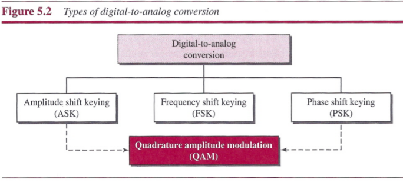
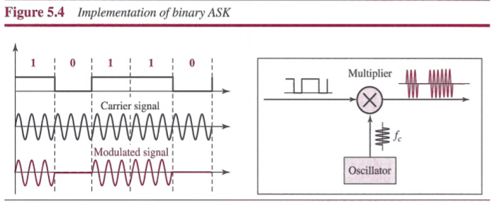
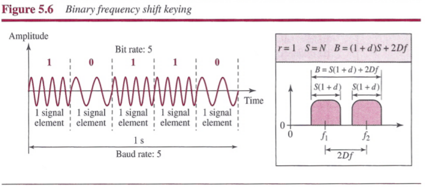
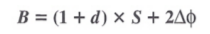
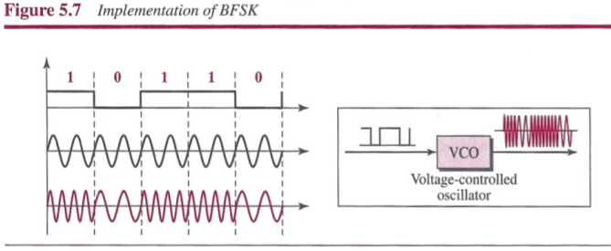
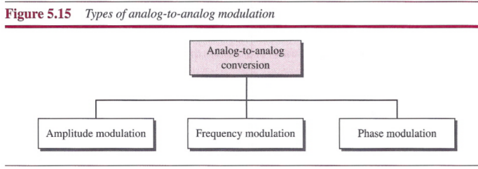
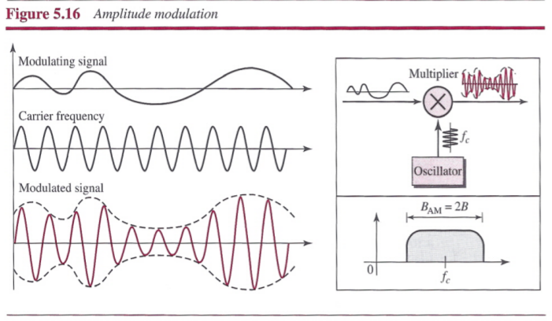
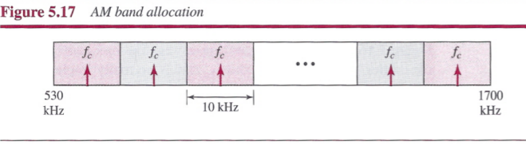
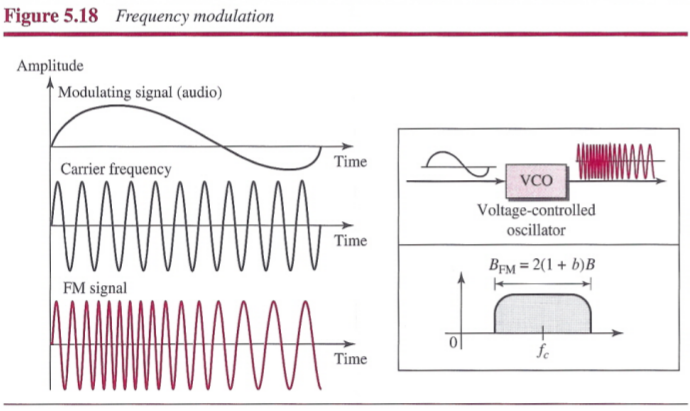

# Analog Transmission

## Digital-to-Analog Conversion

`Digital-to-analog conversion` is the process of changing one of the characteristics of an analog based on the information in digital data.

At least three mechanisms for modulating digital data into an analog signal: `amplitude shift keying (ASK)`, `frequency shift keying (FSK)`, and `phase shift keying (PSK)`. In addition, there is a fourth mechanism that combines changing both the amplitude and phase, called `quadrature amplitude modulation (QAM)`.

### Aspects of Digital-to-Analog Conversion

The relationship between data rate (bit rate) and the signal rate (baud rate) is: . *N* is the data rate (bps) and *r* is the number of data elements carried in one signal element. The value of *r* in analog transmission is *r* = log2 *L* is the number of different signal elements.

Bit rate is the number of bits per second. Baud rate is the number of signal elements per second. In the analog transmission of digital data, the baud rate is less than or equal to the bit rate.

In analog transmission, the sending device produces a high-frequency signal that acts as a base for the information signal. This base signal is called the `carrier signal`.

### Amplitude Shift Keying

In amplitude shift keying, the amplitude of the carrier signal is varied to create signal elements. Both frequency and phase remain constant while the amplitude changes.

#### Binary ASK (BASK)

`Binary amplitude shift keying` is implemented using only two levels. The peak amplitude of one signal level is 0; the other is the same as the amplitude of the carrier frequency.

**Bandwidth for ASK**: the bandwidth (*B*) is proportional to the signal rate (*S*). The factor *d* depends on the modulation and filtering process. The value of *d* is between 0 and 1. 

### Frequency Shift Keying

In frequency shift keying, the frequency of the carrier signal is varied to represent data. The frequency of the modulated signal is constant for the duration of one signal element, but changes for the next signal element if the data element changes. Both peak amplitude and phase remain constant for all signal elements.

#### Binary FSK (BFSK)

We have selected two frequencies, we use the first carrier if the data element is 0 and use the second if the data is 1.

**Bandwidth for BFSK**: 

### Phase Shift Keying

In phase shift keying, the phase of the carrier is varied to represent two or more different signal elements. Both peak amplitude and frequency remain constant as the phase changes.

#### Binary PSK (BPSK)

Binary PSK has only two signal elements, one with a phase of 0°, and the other with a phase of 180°.

#### Quadrature PSK (QPSK)

To use 2 bits at a time in each signal element, thereby decreasing the baud rate and eventually the required bandwidth. The scheme is called quadrature PSK because it uses two separate BPSK modulations; one is in-phase, the other quadrature (out-of-phase). The incoming bits are first passed through a serial-to-parallel conversion that sends one bit to one modulator and the next bit to the other modulator.

The two composite signals created by each multiplier are sine waves with the same frequency, but different phases. When they are added, the result is another sine wave, with one of four possible phases: 45°, -45°, 135°, and -135°. There are four kinds of signal elements in the output signal (L = 4), so we can send 2 bits per signal element (r = 2).

### Constellation Diagram

A constellation diagram can help us define the amplitude and phase of a signal element. In a constellation diagram, a signal element type is represented as a dot. The bit or combination of bits it can carry is often written next to it.

### Quadrature Amplitude Modulation

Quadrature amplitude modulation is a combination of ASK and PSK.

## Analog-to-Analog Conversion

Analog-to-analog conversion, or analog modulation, is the representation of analog information by an analog signal.

Analog-to-analog conversion can be accomplished in three ways: `amplitude modulation (AM)`, `frequency modulation (FM)`, and `phase modulation (PM)`.

### Amplitude Modulation (AM)

In AM transmission, the carrier signal is modulated so that its amplitude varies with the changing amplitudes of the modulating signal.

**AM Bandwidth**: The total bandwidth required for AM can be determined from the bandwidth of the audio signal: BAM = 2B.

**Standard Bandwidth Allocation for AM Radio**

### Frequency Modulation (FM)

In FM transmission, the frequency of the carrier signal is modulated to follow the changing voltage level (amplitude) of the modulating signal.

**FM Bandwidth**: The total bandwidth required for FM can be determined from the bandwidth of the audio signal: BFM = 2(1 x b)B.

**Standard Bandwidth Allocation for FM Radio**:

### Phase Modulation (PM)

In PM transmission, the phase of the carrier signal is modulated to follow the changing voltage level (amplitude) of the modulating signal.

**PM Bandwidth**: The total bandwidth required for PM can be determined from the bandwidth and maximum amplitude of the modulating signal: BPM = 2(1 + b)B.

## Summary

- Digital-to-analog conversion is the process of changing one of the characteristics of an analog signal based on the information in the digital data.
- Digital-to-analog conversion can be accomplished in several ways: amplitude shift keying (ASK), frequency shift keying (FSK), and phase shift keying (PSK). Quadrature amplitude modulation (QAM) combines ASK and PSK.
- In amplitude shift keying, the amplitude of the carrier signal is varied to create signal elements. Both frequency and phase remain constant while the amplitude changes.
- In frequency shift keying, the frequency of the carrier signal is varied to represent data. The frequency of the modulated signal is constant for the duration of one signal element, but changes for the next signal element if the data element changes. Both peak amplitude and phase remain constant for all signal elements.
- In phase shift keying, the phase of the carrier is varied to represent two or more different signal elements. Both peak amplitude and frequency remain constant as the phase changes.
- A constellation diagram shows us the amplitude and phase of a signal element, particularly when we are using two carriers (one in-phase and one quadrature).
- Quadrature amplitude modulation (QAM) is a combination of ASK and PSK. QAM uses two carriers, one in-phase and the other quadrature, with different amplitude levels for each carrier.
- Analog-to-analog conversion is the representation of analog information by an analog signal. Conversion is needed if the medium is bandpass in nature or if only a bandpass bandwidth is available to us.
- Analog-to-analog conversion can be accomplished in three ways: amplitude modulation (AM), frequency modulation (FM), and phase modulation (PM).
- In AM transmission, the carrier signal is modulated so that its amplitude varies with the changing amplitudes of the modulating signal. The frequency and phase of the carrier remain the same; only the amplitude changes to follow variations in the information.
- In FM transmission, the frequency of the carrier signal is modulated to follow the changing voltage level (amplitude) of the modulating signal. The peak amplitude and phase of the carrier signal remain constant, but as the amplitude of the information signal changes, the frequency of the carrier changes correspondingly.
- In PM transmission, the phase of the carrier signal is modulated to follow the changing voltage level (amplitude) of the modulating signal. The peak amplitude and frequency of the carrier signal remain constant, but as the amplitude of the information signal changes, the phase of the carrier changes correspondingly.
