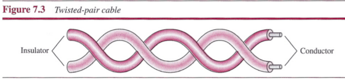
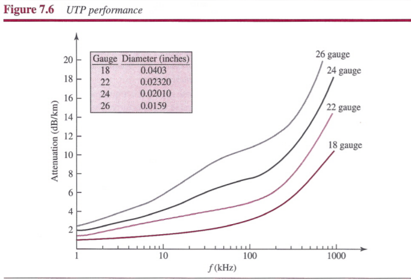
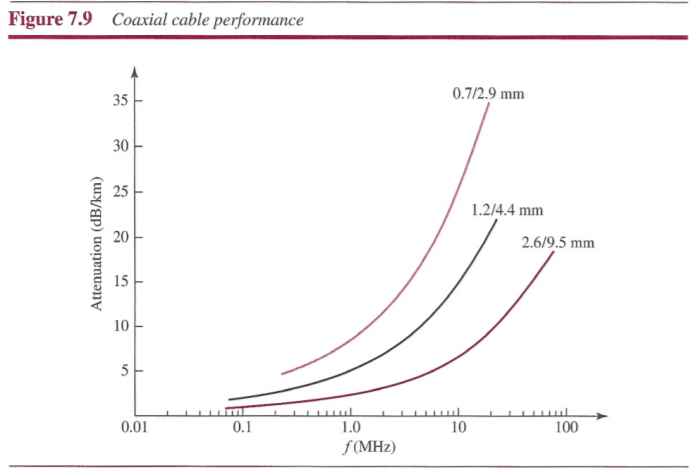

# Chapter 7: Transmission Media
## Introduction
Transmission media are actually located below the physical layer and are directly controlled by the physical layer.

In telecommunications, transmission media can be divided into two broad categories: guided and unguided. Guided media include twisted-pair cable, coaxial cable, and fiber-optic cable. Unguided medium is free space.

## Guided Media
Guided media, which are those that provide a conduit from one device to another, include twisted-pair cable, coaxial cable, and fiber-optic cable. A signal traveling along any of these media is directed and contained by the physical limits of the medium.
- `Twisted-pair` and `coaxial cable`: use metallic (copper) conductors that accept and transport signals in the form of electric current.
- `Optical fiber`: is a cable that accepts and transports signals in the form of light.

### Twisted-Pair Cable

### Coaxial Cable

### Fiber-Optic Cable

## Unguided Media: Wireless
Unguided medium transport electromagnetic waves without using a physical conductor.

## Summary
- Transmission media are actually located below the physical layer and are directly controlled by the physical layer. We could say that transmission media belong to layer zero.
- A guided medium provides a physical conduit from one device to another.
- Twisted-pair cable consists of two insulated copper wires twisted together. Twisted-pair cable is used for voice and data communications.
- Coaxial cable consists of a central conductor and a shield. Coaxial cable is used in cable TV networks and traditional Ethernet LANs.
- Fiber-optic cables are composed of a glass or plastic inner core surrounded by cladding, all encased in an outside jacket. Fiber-optic transmission is becoming increasingly popular due to its noise resistance, low attenuation, and high-bandwidth capabilities. Fiber-optic cable is used in backbone networks, cable TV networks, and Fast Ethernet networks.
- Unguided media (free space) transport electromagnetic waves without the use of a physical conductor.
- Wireless data are transmitted through ground propagation, sky propagation, and line-of-sight propagation. Wireless waves can be classified as radio waves, microwaves, or infrared waves. Radio waves are omnidirectional; microwaves are unidirectional. Microwaves are used for cellular phone, satellite, and wireless LAN communications. Infrared waves are used for short-range communications such as those between a PC and a peripheral device. They can also be used for indoor LANs.
