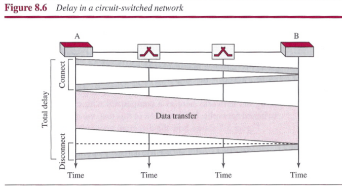
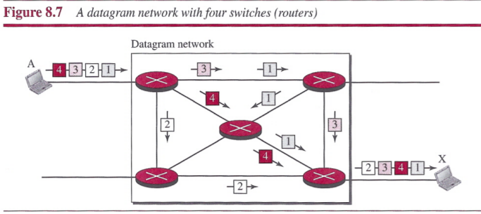
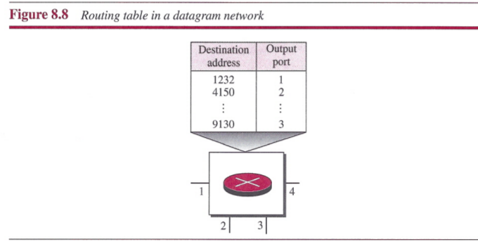
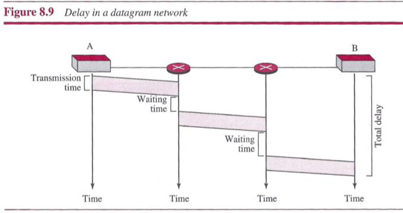
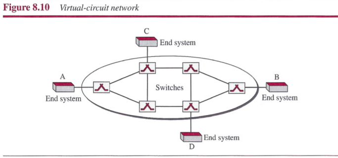
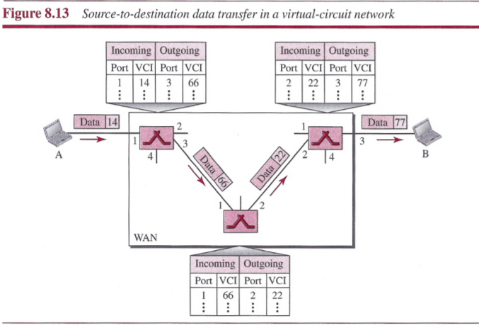
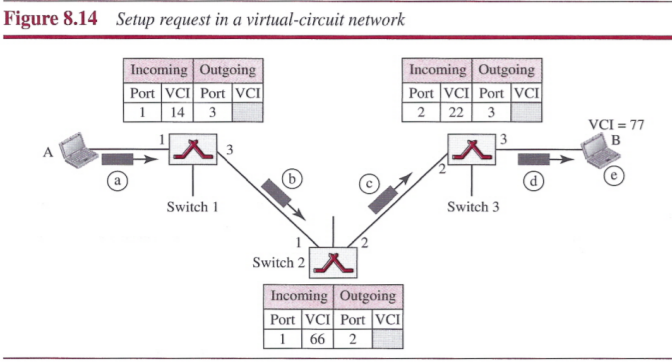
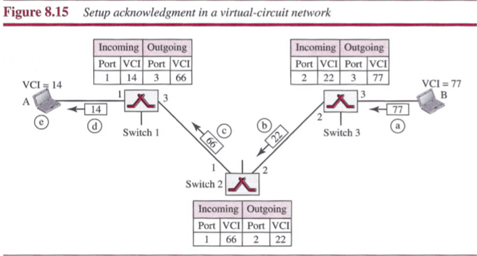
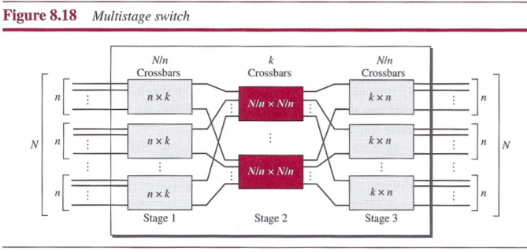
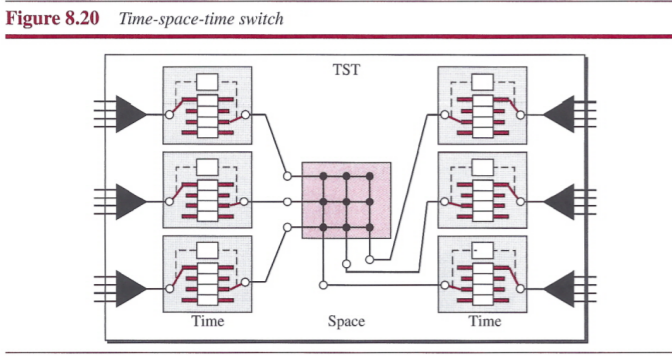

# Chapter 8: Switching

## Introduction

A switched network consists of a series of interlinked nodes, called `switches`. Switches are devices capable of creating temporary connections between two or more devices linked to the switch.

### Three Methods of Switching

There are three methods of switching have been discussed: `circuit switching`, `packet switching`, and `message switching`.

### Switching and TCP/IP Layers

- `Switching at Physical Layer`: only circuit switching. There are no packets exchanged at the Physical layer.
- `Switching at Data-Link Layer`: packet switching. normally done using a virtual-circuit approach.
- `Switching at Network Layer`: packet switching. eicher a virtual-circuit approach or a datagram approach can be used.
- `Switching at Application Layer`: message switching. exchanging messages.

## Circuit-Switching Networks

A circuit-switched network is made of a set of switches connected by physical links, in which each link is divided into *n* channels.

In circuit switching, the resources need to be reserved during the setup phase; the resources remain dedicated for the entire duration of data transfer until the teardown phase.

### Three Phase

The actual communication in a circuit-switched network requires three phases: `connection setup`, `data transfer`, and `connection teardown`.

#### Setup Phase

Before the two parties can communicate, a dedicated circuit needs to be established. Connection setup means creating dedicated channels between the switches.

Note that end-to-end addressing is required for creating a connection between the two end systems.

#### Data-Transfer Phase

After the establishment of the dedicated circuit (channels), the two parties can transfer data.

#### Teardown Phase

When one of the parties needs to disconnect, a signal is sent to each switch to release the resources.

### Efficiency

It can be argued that circuit-switched networks are not as efficient as the other two types of networks because resources are allocated during the entire duration of the connection.

### Delay

The delay in this type os network is minimal. During data transfer the data are not delayed at each switch; the resources are allocated for the duration of the connection.

## Packet Switching

If the messages is going to pass through a `packet-switched network`, it needs to be divided into packets of fixed or variable size.

- In a packet-switched network, there is no resource reservation; resources are allocated on demand.

There are two types of packet-switched networks: `datagram networks` and `virtual-circuit networks`.

### Datagram Networks

In a `datagram network`, each packet is treated independently of all others. Packets in this approach are referred to as `datagrams`. Datagram switching is normally done at the network layer.

This approach can cause the datagrams of a transmission to arrive at their destination out of order with different delays between the packets. Packets may also be lost or dropped because of a lack of resources.

#### Routing Table

A switch in a datagram network uses a routing table that is based on the destination address. The routing tables are dynamic and are updated periodically.

**Destination Address**: The destination address in the header of a packet in a datagram network remains the same during the entire journey of the packet.

**Efficiency**: The efficiency of a datagram network is better than that of a circuit-switched network; resources are allocated only when there are packets to be transferred.

**Delay**: There may be greater delay in a datagram network than in a virtual-circuit network.

### Virtual-Circuit Networks

A virtual-circuit network is a cross between a circuit-switched network and a datagram network.

1. As in a circuit-switched network, there are setup and teardown phases in addition to the data transfer phase.
2. Resources can be allocated during the setup phase, as in a circuit-switched network, or on demand, as in a datagram network.
3. As in a datagram network, data are packetized and each packet carries an address in the header. However, the address in the header has local jurisdiction (it defines what the next switch should be and the channel on which the packet is being carried), not end-to-end jurisdiction.
4. As in a circuit-switched network, all packets follow the same path established during the connection.
5. A virtual-circuit network is normally implemented in the data-link layer, while a circuit-switched network is implemented in the physical layer and a datagram network in the network layer.

#### Addressing

In a virtual-circuit network, two types of addressing are involved: `global` and `local`.

**Global Addressing**: A source or a destination needs to have a global address, it is used only to create a virtual-circuit identifier.

**Virtual-Circuit Identifier**: The identifier that is actually used for data transfer is called the `virtual-circuit identifier (VCI)`. It is used by a frame between two switches.

#### Three Phases

As in a circuit-switched network, a source and destination need to go through three phases in a virtual-circuit network: `setup`, `data transfer`, and `teardown`. In the setup phase, the source and destination use their global addresses to help switches make table entries for the connection. In the teardown phase, the source and destination inform the switches to delete the corresponding entry.

**Data-Transfer Phase**:
To transfer a frame from a source to its destination, all switches need to have a table entry for this virtual circuit. The data-transfer phase is active until the source sends all its frames to the destination.

**Setup Phase**: In the setup phase, a switch creates an entry for a virtual circuit. Two steps are required: the setup request and the acknowledgment.

- `Setup Phase`: A setup request frame is sent from the source to the destination.

 

- `Acknowledgment`: A special frame, called the `acknowledgment frame`, completes the entries in the switching tables.

 

**Teardowm Phase**: In this phase, source A, after sending all frames to B, sends a special frame called a teardown request. Destination B responds with a teardown confirmation frame. All switches delete the corresponding entry from their tables.

**Efficiency**: In virtual-circuit switching, all packets belonging to the same source and destination travel the same path, but the packets may arrive at the destination with different delays if resource allocation is on demand.

**Delay in Virtual-Circuit Networks**:

**Circuit-Switched Technology in WANs**: Switching at the data-link layer in a switched WAN is normally implemented by using virtual-circuit techniques.

## Structure of A Switch

### Structure of Circuit Switches

Circuit switching today can use either of two technologies: the `space-division switch` or the `time-division switch`.

#### Space-Division Switch

In space-division switching, the paths in the circuit are separated from one another spatially.

**Crossbar Switch**: A crossbar switch connects *n* inputs to *m* outputs in a grid, using electronic microswitches at each crosspoint. It requires *n x m* crosspoints.

**Multistage Switch**: multistage switch combines crossbar switches in several stages.

To design a three-stage switch, we follow these steps:

1. We divide the *N* input lines into groups, each of *n* lines. For each group, we use one crossbar of size *n x k*, where *k* is the number of crossbars in the middle stage.
2. We use *k* crossbars, each of size *(N/n) x (N/n)* in the middle stage.
3. We use *N/n* crossbars, each of size *k x n* at the third stage.

#### Time-Division Switch

`Time-division switching` uses time-division multiplexing (TDM) inside a switch. The most popular technology is called the `time-slot interchange (TSI)`.

**Time-Slot Interchange**: The figure combines a TDM multiplexer, a TDM demultiplexer, and a TSI consisting of random access memory (RAM) with several memory locations.

#### Time- and Space-Division Switch Combinations

- The advantage of `space-division switching` is that it is instantaneous. Its disadvantage is the number of cross points required to make space-division switching acceptable in terms of blocking.
- The advantage of `time-division switching` is that it needs no crosspoints. Its disadvantage, in the case of TSI, is that processing each connection creates delays. Each time slot must be stored by the RAM, then retrieved and passed on.

The `time-space-time (TST) switches` combine space-division and time-division technologies to take advantage of the best of both.

### Structure of Packet Switches

A packet switch has four components: `input ports`, `output ports`, the `routing processor`, and the `switching fabric`.

#### Input Ports

An `input port` performs the physical and data-link functions of the packet switch.

- The bits are constructed from the received signal.
- The packet is decapsulated from the frame.
- Errors are detected and corrected.
- The packet is now ready to be routed by the network layer.
- In addition to a physical-layer processor and a data-link processor, the input port has buffers (queues) to hold the packet before it is directed to the switching fabric.

##### Output Ports

The `output port` performs the same functions as the input port, but in the reverse order.

- First the outgoing packets are queued
- then the packet is encapsulated in a frame
- and finally the physical-layer functions are applied to the frame to create the signal to be sent on the line.

#### Routing Processor

The `routing processor` performs the functions of the network layer. The destination address is used to find the address of the next hop and, at the same time, the output port number from which the packet is sent out. This activity is sometimes referred to as `table lookup` because the routing processor searches the routing table.

#### Switching Fabrics

The most difficult task in a packet switch is to move the packet from the input queue to the output queue. The speed with which this is done affects the size of the input/output queue and the overall delay in packet delivery.

**Crossbar Switch**: The simplest type of switching fabric is the crossbar switch, discussed in the previous section.

**Banyan Switch**: A banyan switch is a multistage switch with microswitches at each stage that route the packets based on the output port represented as a binary string. For *n* inputs and *n* outputs, we have log2*n* stages with n/2 micros witches at each stage. The first stage routes the packet based on the high-order bit of the binary string. The second stage routes the packet based on the second high-order bit, and so on.

## Summary

- A switched network consists of a series of interlinked nodes, called switches. Traditionally, three methods of switching have been important: circuit switching, packet switching, and message switching.
- We can divide today's networks into three broad categories: circuit-switched networks, packet-switched networks, and message-switched networks. Packet-switched networks can also be divided into two subcategories: virtual-circuit networks and datagram networks.
- A circuit-switched network is made of a set of switches connected by physical links, in which each link is divided into n channels. Circuit switching takes place at the physical layer. In circuit switching, the resources need to be reserved during the setup phase; the resources remain dedicated for the entire duration of the datatransfer phase until the teardown phase.
- In packet switching, there is no resource allocation for a packet. This means that there is no reserved bandwidth on the links, and there is no scheduled processing time for each packet. Resources are allocated on demand.
- In a datagram network, each packet is treated independently of all others. Packets in this approach are referred to as datagrams. There are no setup or teardown phases.
- A virtual-circuit network is a cross between a circuit-switched network and a datagram network. It has some characteristics of both.
- Circuit switching uses either of two technologies: the space-division switch or the time-division switch.
- A switch in a packet-switched network has a different structure from a switch used in a circuit-switched network. We can say that a packet switch has four types of components: input ports, output ports, a routing processor, and switching fabric.
