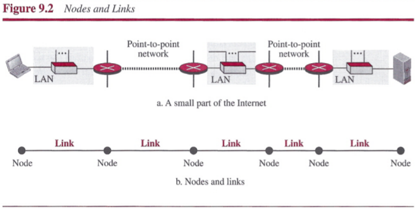
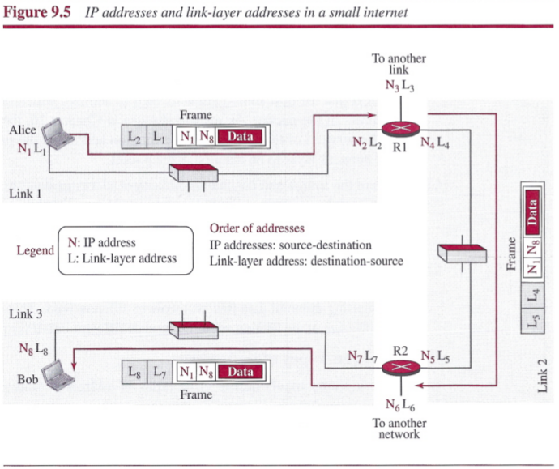
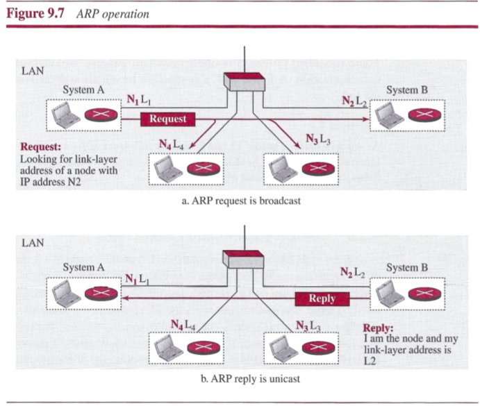
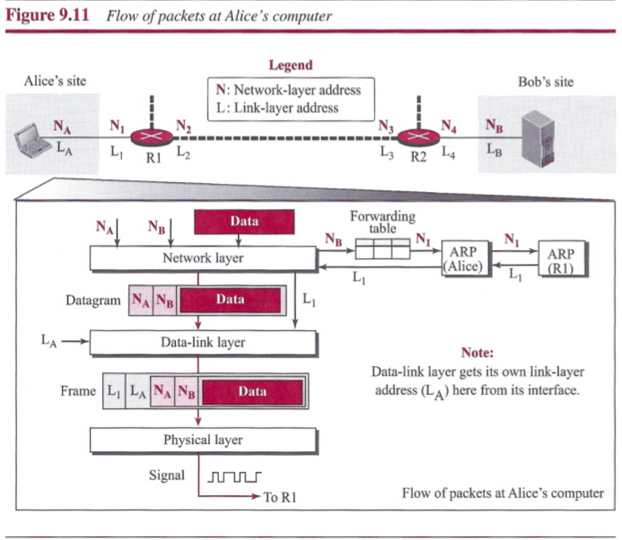
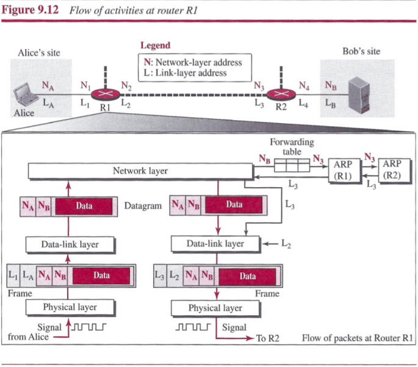
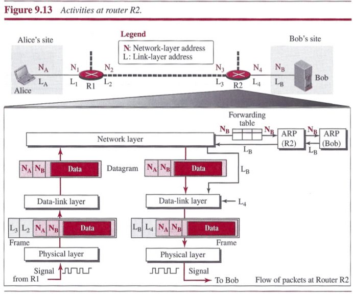
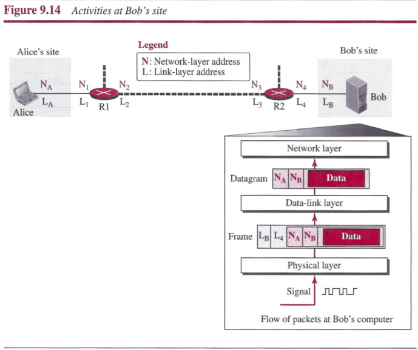

# Chapter 9: Introduction to Data-Link Layer
## Introduction
### Nodes and Links
Communication at the data-link layer is node-to-node. A data unit from one point in the Internet needs to pass through many networks (LANs and WANs) to reach another point. Theses LANs and WANs are connected by routers. It is customary to refer to the two end hosts and the routers as `nodes` and the networks in between as `links`.

### Services
When a packet is travelling in the Internet, the data-link layer of a node (host or router) is responsible for delivering a datagram to the next node in the path. For this purpose, the data-link layer of the sending node needs to encapsulate the datagram received from the network in a frame, and the data-link layer of the receiving node needs to decapsulate the datagram fromthe frame.

One may ask why we need encapsulation and decapsulation at each intermediate node. The reason is that each link may be using a different protocol with a different frame format. Even if one link and the next are using the same protocol, encapsulation and decapsulation are needed because the link-layer addresses are normally different.

##### Framing
A packet at the data-link layer is normally called a `frame`. The data-link layer at each node needs to encapsulate the datagram in a frame before sending it to the next node. The node also needs to decapsulate the datagram from the frame received on the logical channel.

##### Flow Control
If the rate of produced frames is higher than the rate of consumed frames, frames at the receiving end need to be buffered while waiting to be consumed. Definitely, we cannot have an unlimited buffer size at the receiving side.
- The first choice is to let the receiving data-link layer drop the frames if its buffer is full.
- The second choice is to let the receiving data-link layer send a feedback to the sending data-link layer to ask it to stop or slow down.

##### Error Control
The error needs first to be detected, then it needs to be either corrected at the receiver node or discarded and retransmitted by the sending node.

##### Congestion Control
Although a link may be congested with frames, which may result in frame loss, most data-link-layer protocols do not directly use a congestion control to alleviate congestion, although some wide-area networks do.

### Two Categories of Links
We can have a `point-to-point link` or a `broadcast link`.
- In a point-to-point link, the link is dedicated to the two devices
- in a broadcast link, the link is shared between several pairs of devices.

### Two Sublayers
We can divide the data-link layer into two sublayers: `data link control (DLC)` and `media access control (MAC)`. The data link control sublayer deals with all issues common to both point-to-point and broadcast links; the media access control sublayer deals only with issues specific to broadcast links.

## Link-Layer Addressing
We need another addressing mechanism in a connectionless internetwork: the link-layer addresses of the two nodes. A `link-layer address` is sometimes called a `link address`, sometimes a `physical address`, and sometimes a `MAC address`.

When a datagram passes from the network layer to the data-link layer, the datagram will be encapsulated in a frame and two data-link addresses are added to the frame header. These two addresses are changed every time the frame moves from one link to another.

### Three Types of addresses
Some link-layer protocols define three types of addresses: `unicast`, `multicast`, and `broadcast`.

##### Unicast Address
Each host or each interface of a router is assigned a unicast address. Unicasting means one-to-one communication. A frame with a unicast address destination is destined only for one entity in the link.

##### Multicast Address
Some link-layer protocols define multicast addresses. Multicasting means one-to-many communication. However, the jurisdiction is local (inside the link).

##### Broadcast Address
Some link-layer protocols define a broadcast address. Broadcasting means one-to-aU communication. A frame with a destination broadcast address is sent to all entities in the link.

### Address Resolution Protocol (ARP)
The `Address Resolution Protocol (ARP)` is defined in the network layer. ARP accepts an IP address from the IP protocol, maps the address to the corresponding link-layer address, and passes it to the data-link layer.

- Anytime a host or a router needs to find the link-layer address of another host or router in its network, it sends an ARP request packet. The packet includes the link-layer and IP addresses of the sender and the IP address of the receiver. The query is broadcast over the link using the link-layer broadcast address.
- Every host or router on the network receives and processes the ARP request packet, but only the intended recipient recognizes its IP address and sends back an ARP response packet. The response packet contains the recipient'S IP and link-layer addresses. The packet is unicast directly to the node that sent the request packet.

##### Packet Format

- The `hardware type` field defines the type of the link-layer protocol; Ethernet is given the type 1.
- The `protocol type` field defines the network-layer protocol: IPv4 protocol is (0800)16.
- The `source hardware` and `source protocol addresses` are variable-length fields defining the link-layer and network-layer addresses of the sender.
- The `destination hardware address` and `destination protocol address` fields define the receiver link-layer and network-layer addresses.

An ARP packet is encapsulated directly into a data-link frame. The frame needs to have a field to show that the payload belongs to the ARP and not to the network-layer datagram.

### An Example of Communication

## Summary
- The Internet is made of many hosts, networks, and connecting devices such as routers.
- The hosts and connecting devices are referred to as nodes; the networks are referred to as links.
- A path in the Internet from a source host to a destination host is a set of nodes and links through which a packet should travel.
- The data-link layer is responsible for the creation and delivery of a frame to another node, along the link. It is responsible for packetizing (framing), flow control, error control, and congestion control along the link.
- Two data-link layers at the two ends of a link coordinate to deliver a frame from one node to the next. As with any delivery between a source and destination in which there are many paths, we need two types of addressing. The end-to-end addressing defines the source and destination; the link-layer addressing defines the addresses of the nodes that the packet should pass through.
- To avoid including the link-layer addresses of all of these nodes in the frame, the Address Resolution Protocol (ARP) was devised to map an IP address to its corresponding link-layer address. When a packet is at one node ready to be sent to the next, the forwarding table finds the IP address of the next node and ARP find its link-layer address.
