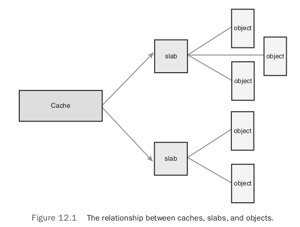

# Chapter 12: Memory Management

## Pages

The kernel treats physical pages as the basic unit of memory management. Most 32-bit architectures have 4KB pages, whereas most 64-bit architectures have 8KB pages.

The kernel represents every physical page on the system with a `struct page` structure. This structure is defined in `<linux/mm_types.h>`. The following is a simplified the definition:

```c
struct page {
    unsigned long flags;
    atomic_t _count;
    atomic_t _mapcount;
    unsigned long private;
    struct address_space *mapping;
    pgoff_t index;
    struct list_head lru;
    void *virtual;
};
```

The `flags` field stores the status of the page. Bit flags represent the various values, so at least 32 different flags are simultaneously available. The flag values are defined in `<linux/page-flags.h>`.

The `_count` field stores the usage count of the page. When this count reaches negative one, no one is using the page, and it becomes available for use in a new allocation. Kernel check this field with `page_count()`, it returns zero to indicate free and a positive nonzero integer when the page is in use.

The `virtual` field is the page's virtual address.

The important point to understand is that the `page` structure is associated with physical pages, not virtual pages. The data structure's goal is to describe physical memory, not the data contained therein.

An instance of this structure is allocated for each physical page in the system.

## Zones

The kernel divides pages into different zones and use the zones to group pages of similar properties.

Linux has to deal with two shortcomings of hardware with respect to memory addressing:

- Some hardware devices can perform DMA (direct memory access) to only certain memory addresses.
- Some architectures can physically addressing larger amounts of memory than they can virtually address. Consequently, some memory is not permanently mapped into the kernel address space.

Due to these contraints, Linux has four primary memory zones defined in `<linux/mmzone.h>`:

- `ZONE_DMA`: This zone contains pages that can undergo DMA.
- `ZONE_DMA32`: Like ZOME_DMA, this zone contains pages that can undergo DMA. Unlike ZONE_DMA, these pages are accessible only by 32-bit devices. On some architectures, this zone is a larger subset of memory.
- `ZONE_NORMAL`: This zone contains normal, regularly mapped, pages.
- `ZONE_HIGHMEM`: This zone contains "high memory", which are pages not permanently mapped into the kernel’s address space.

The layout of the memory zones is architecture-dependent. The following table is a listing of each zone and its consumed pages on x86-32:

Zone | Description | Physical Memory
---- | ----------- | ---------------
ZONE_DMA | DMA-able pages | < 16MB
ZONE_NORMAL | Normally addressable pages | 16–896MB
ZONE_HIGHMEM | Dynamically mapped pages | > 896MB

But Intel’s x86-64 can fully map and handle 64-bits of memory. Thus, x86-64 has no `ZONE_HIGHMEM` and all physical memory is contained within `ZONE_DMA` and `ZONE_NORMAL`.

Each zone is represented by `struct zone`, which is defined in `<linux/mmzone.h>`:

```c
struct zone {
    unsigned long watermark[NR_WMARK];
    unsigned long lowmem_reserve[MAX_NR_ZONES];
    struct per_cpu_pageset pageset[NR_CPUS];
    spinlock_t lock;
    struct free_area free_area[MAX_ORDER]
    spinlock_t lru_lock;
    struct zone_lru {
        struct list_head list;
        unsigned long nr_saved_scan;
    } lru[NR_LRU_LISTS];
    struct zone_reclaim_stat reclaim_stat;
    unsigned long pages_scanned;
    unsigned long flags;
    atomic_long_t vm_stat[NR_VM_ZONE_STAT_ITEMS];
    int prev_priority;
    unsigned int inactive_ratio;
    wait_queue_head_t *wait_table;
    unsigned long wait_table_hash_nr_entries;
    unsigned long wait_table_bits;
    struct pglist_data *zone_pgdat;
    unsigned long zone_start_pfn;
    unsigned long spanned_pages;
    unsigned long present_pages;
    const char *name;
};
```

The `lock` field is a spin lock that protects the structure from concurrent access. It protects just the structure and not all the pages that reside in the zone. A specific lock does not protect individual pages.

The `watermark` array holds the minimum, low, and high watermarks for this zone. The kernel uses watermarks to set benchmarks for suitable per-zone memory consumption.

The name `field` is a NULL-terminated string representing the name of this zone. The kernel initializes this value during boot in `mm/page_alloc.c`, and the three zones are given the names `DMA`, `Normal`, and `HighMem`.

## Getting Pages

The kernel provides one low-level mechanism for requesting memory, along with several interfaces to access it. All these interfaces allocate memory with page-sized granularity and are declared in `<linux/gfp.h>`. The core function is:

```c
struct page * alloc_pages(gfp_t gfp_mask, unsigned int order)
```

This allocates 2<sup>order</sup> (`1 << order`) contiguous physical pages and returns a pointer to the first page's `page` structure; on error it returns `NULL`.

You can convert a given page to its logical address with the function:

```c
void * page_address(struct page *page)
```

This returns a pointer to the logical address where the given physical page currently resides.

If you have no need for the actual `struct page`, you can call:

```c
unsigned long __get_free_pages(gfp_t gfp_mask, unsigned int order)
```

This function works the same as `alloc_pages()`, except that it directly returns the logical address of the first requested page. Because the pages are contiguous, the other pages simply follow from the first.

If you need only one page, two functions are implemented as wrappers:

```c
struct page * alloc_page(gfp_t gfp_mask)
unsigned long __get_free_page(gfp_t gfp_mask)
```

These functions work the same but pass zero for the order (2<sup>0</sup> = one page).

### Getting Zeroed Pages

If you need the returned page filled with zeros, use the function:

```c
unsigned long get_zeroed_page(unsigned int gfp_mask)
```

This function works the same as `__get_free_page()`, except that the allocated page is then zero-filled (every bit of every byte is unset).

A listing of all the low-level page allocation methods:

Flag | Description
---- | -----------
alloc_page(gfp_mask) | Allocates a single page and returns a pointer to its first page’s `page` structure
alloc_pages(gfp_mask, order) | Allocates 2<sup>order</sup> pages and returns a pointer to the first page’s `page` structure
__get_free_page(gfp_mask) | Allocates a single page and returns a pointer to its logical address
__get_free_pages(gfp_mask, order) | Allocates 2<sup>order</sup> pages and returns a pointer to the first page’s logical address
get_zeroed_page(gfp_mask) | Allocates a single page, zero its contents and returns a pointer to its logical address

### Freeing Pages

A family of functions enables you to free allocated pages when you no longer need them:

```c
void __free_pages(struct page *page, unsigned int order)
void free_pages(unsigned long addr, unsigned int order)
void free_page(unsigned long addr)
```

Be careful to free only pages you allocate. Passing the wrong struct page or address, or the incorrect order, can result in corruption.

## kmalloc()

The `kmalloc()` function obtaines kernel memory in byte-sized chunks. The function declared in `<linux/slab.h>`:

```c
void * kmalloc(size_t size, gfp_t flags)
```

The function returns a pointer to a region of memory that is at least `size` bytes in length. The region of memory allocated is physically contiguous. On error, it returns `NULL`.

### gfp_mask Flags

Flags are represented by the `gfp_t` type, which is defined in `<linux/types.h>` as an `unsigned int`. `gfp` stands for `__get_free_pages()`.

The flags are broken up into three categories:

- `action modifiers`: specify how the kernel is supposed to allocate the requested memory.
- `zone modifiers`: specify from where to allocate memory.
- `type`: specify a combination of action and zone modifiers for a certain type of memory alocation.

All the flags are declared in `<linux/gfp.h>`. The file `<linux/slab.h>` includes this header.

#### Action Modifiers

Flag | Description
---- | -----------
__GFP_WAIT | The allocator can sleep.
__GFP_HIGH | The allocator can access emergency pools.
__GFP_IO | The allocator can start disk I/O.
__GFP_FS | The allocator can start filesystem I/O.
__GFP_COLD | The allocator should use cache cold pages.
__GFP_NOWARN | The allocator does not print failure warnings.
__GFP_REPEAT | The allocator repeats the allocation if it fails, but the allocation can potentially fail.
__GFP_NOFAIL | The allocator indefinitely repeats the allocation. The allocation cannot fail.
__GFP_NORETRY | The allocator never retries if the allocation fails.
__GFP_NOMEMALLOC | The allocator does not fall back on reserves.
__GFP_HARDWALL | The allocator enforces "hardwall" cpuset boundaries.
__GFP_RECLAIMABLE | The allocator marks the pages reclaimable.
__GFP_COMP | The allocator adds compound.

#### Zone Modifiers

There are only three zone modifiers because there are only three zones other than `ZONE_NORMAL`, as in the following table:

Flag | Description
---- | -----------
__GFP_DMA | Allocates only from `ZONE_DMA`
__GFP_DMA32 | Allocates only from `ZONE_DMA32`
__GFP_HIGHMEM | Allocates from `ZONE_HIGHMEM` or `ZONE_NORMAL`

#### Type Flags

The table below is a list of the type flags:

Flag | Description
---- | -----------
GFP_ATOMIC | The allocation is high priority and must not sleep. This is the flag to use in interrupt handlers, in bottom halves, while holding a spinlock, and in other situations where you cannot sleep.
GFP_NOWAIT | Like `GFP_ATOMIC`, except that the call will not fallback on emergency memory pools. This increases the liklihood of the memory allocation failing.
GFP_NOIO | This allocation can block, but must not initiate disk I/O. This is the flag to use in block I/O code when you cannot cause more disk I/O, which might lead to some unpleasant recursion.
GFP_NOFS | This allocation can block and can initiate disk I/O, if it must, but it will not initiate a filesystem operation. This is the flag to use in filesystem code when you cannot start another filesystem operation.
GFP_KERNEL | This is a normal allocation and might block. This is the flag to use in process context code when it is safe to sleep. The kernel will do whatever it has to do to obtain the memory requested by the caller. This flag should be your default choice.
GFP_USER | This is a normal allocation and might block. This flag is used to allocate memory for user-space processes.
GFP_HIGHUSER | This is an allocation from `ZONE_HIGHMEM` and might block. This flag is used to allocate memory for user-space processes.
GFP_DMA | This is an allocation from `ZONE_DMA`. Device drivers that need DMA-able memory use this flag, usually in combination with one of the preceding flags.

The following table shows which modifiers are associated with each type flag:

Flag | Modifier Flags
---- | --------------
GFP_ATOMIC |  <code>__GFP_HIGH</code>
GFP_NOWAIT | <code>0<code>
GFP_NOIO | <code>__GFP_WAIT<code>
GFP_NOFS | <code>(&#95;&#95;GFP_WAIT &#124; &#95;&#95;GFP_IO)</code>
GFP_KERNEL | <code>(&#95;&#95;GFP_WAIT &#124; &#95;&#95;GFP_IO &#124; &#95;&#95;GFP_FS)</code>
GFP_USER | <code>(&#95;&#95;GFP_WAIT &#124; &#95;&#95;GFP_IO &#124; &#95;&#95;GFP_FS)</code>
GFP_HIGHUSER | <code>(&#95;&#95;GFP_WAIT &#124; &#95;&#95;GFP_IO &#124; &#95;&#95;GFP_FS &#124; &#95;&#95;GFP_HIGHMEM)</code>
GFP_DMA | <code>__GFP_DMA</code>

Below is a list of the common situations and the flags to use.

Situation | Solution
--------- | --------
Process context, can sleep | Use `GFP_KERNEL`.
Process context, cannot sleep | Use `GFP_ATOMIC`, or perform your allocations with `GFP_KERNEL` at an earlier or later point when you can sleep.
Interrupt handler | Use `GFP_ATOMIC`.
Softirq | Use `GFP_ATOMIC`.
Tasklet | Use `GFP_ATOMIC`.
Need DMA-able memory, can sleep | Use <code>(GFP_DMA  &#124; GFP_KERNEL)</code>.
Need DMA-able memory, cannot sleep | Use <code>(GFP_DMA &#124; GFP_ATOMIC)</code>, or perform your allocation at an earlier point when you can sleep.

### kfree()

The counterpart to `kmalloc()` is `kfree()`, declared in `<linux/slab.h>`:

```c
void kfree(const void *ptr)
```

The `kfree()` method frees a block of memory previously allocated with `kmalloc()`.

## vmalloc()

The `vmalloc()` function works in a similar fashion to `kmalloc()`, except `vmalloc()` allocates memory that is only virtually contiguous and not necessarily physically contiguous. This is similar to user-space `malloc()`.

Most kernel code uses `knalloc()` and not `vmalloc()` to obtain memory for performance. `vmalloc()` is used only when absolutely necessary to obtain large regions of memory.

The `vmalloc()` function is declared in <linux/vmalloc.h> and defined in `mm/vmalloc.c`:

```c
void * vmalloc(unsigned long size)
```

The function returns a pointer to at least `size` bytes of virtually contiguous memory. On error, the function returns `NULL`.

To free an allocation obtained via `vmalloc()`:

```c
void vfree(const void *addr)
```

## Slab Layer

To facilitate frequent allocations and deallocations of data, programmers often introduce `free lists`. A free list contains a block of available, already allocated, data structures:

- When code requires a new instance of a data structure, it can grab one of the structures off the free list rather than allocate the sufficient amount of memory and set it up for the data structure.
- When the data structure is no longer needed, it is returned to the free list instead of deallocated.

In this sense, the free list acts as an object cache, caching a frequently used type of object.

A main problem with free lists in the kernel is that there exists no global control. When available memory is low, there is no way for the kernel to communicate to every free list that it should shrink the sizes of its cache to free up memory. So, the Linux kernel provides the `slab layer`, which acts as generic data structure-caching layer.

The slab layer attempts to leverage several basic tenets:

- Frequently used data structures tend to be allocated and freed often, so cache them.
- Frequent allocation and deallocation can result in memory fragmentation. To prevent this, the cached free lists are arranged contiguously. Because freed data structures return to the free list, there is no resulting fragmentation.
- The free list provides improved performance during frequent allocation and deallocation because a freed object can be immediately returned to the next allocation.
- If the allocator is aware of concepts such as object size, page size, and total cache size, it can make more intelligent decisions.
- If part of the cache is made per-processor, allocations and frees can be performed without an SMP lock.
- If the allocator is NUMA-aware, it can fulfill allocations from the same memory node as the requestor.
- Stored objects can be colored to prevent multiple objects from mapping to the same cache lines.

### Design of the Slab Layer

- `cache`: The slab layer divides different objects into groups called `caches`, each of which stores a different type of object. There is one cache per object type.
- `slab`: The caches are then divided into `slabs`. The slabs are composed of one or more physical contiguous pages. Each cache may consist of multiple slabs.
- `object`: Each cache contains some number of `objects`, which are the data structures being called. Each slab is in one of three states: full, partial, or empty.



Each cache is represented by a `kmem_cache` structure, which contains three lists, `slabs_full`, `slabs_partial` and `slabs_empty` (stored inside a `kmem_list3` structure, which is defined in `mm/slab.c`). These lists contain all the slabs associated with the cache.

A slab descriptor, `struct slab`, represents each slab:

```c
struct slab {
        struct list_head list;    /* full, partial, or empty list */
        unsigned long colouroff;  /* offset for the slab coloring */
        void *s_mem;              /* first object in the slab */
        unsigned int inuse;       /* allocated objects in the slab */
        kmem_bufctl_t free;       /* first free object, if any */
};
```

Slab descriptors are allocated either outside the slab in a general cache or inside the slab itself, at the beginning. The descriptor is stored inside the slab if the total size of the slab is sufficiently small, or if internal slack space is sufficient to hold the descriptor.

The slab allocator creates new slabs by interfacing with the low-level kernel page allocator via `__get_free_pages()`:

```c
static void *kmem_getpages(struct kmem_cache *cachep, gfp_t flags, int nodeid)
{
        struct page *page;
        void *addr;
        int i;

        flags |= cachep->gfpflags;
        if (likely(nodeid == -1)) {
                addr = (void*)__get_free_pages(flags, cachep->gfporder);
                if (!addr)
                    return NULL;
                page = virt_to_page(addr);
        } else {
                page = alloc_pages_node(nodeid, flags, cachep->gfporder);
                if (!page)
                    return NULL;
                addr = page_address(page);
        }

        i = (1 << cachep->gfporder);
        if (cachep->flags & SLAB_RECLAIM_ACCOUNT)
                atomic_add(i, &slab_reclaim_pages);
        add_page_state(nr_slab, i);
        while (i--) {
                SetPageSlab(page);
                page++;
        }
        return addr;
}
```

This function uses `__get_free_pages()` to allocate memory sufficient to hold the cache. The first parameter points to the specific cache that needs more pages. The second parameter points to the flags given to `__get_free_pages()`. It adds default flags that the cache requires to the `flags` parameter. The third parameter `nodeid` makes the allocator `NUMA`-aware. When `nodeid` is not negative one, the allocator attempts to fulfill the allocation from the same memory node that requested the allocation.

Memory is then freed by `kmem_freepages()`, which calls `free_pages()` on the given cache's pages. The freeing function is called only when avaliable memory grows low and the system is attempting to free memory, or when a cache is explicitly destroyed.

### Slab Allocator Interface

A new cache is created via `kmem_cache_create()`:

```c
struct kmem_cache * kmem_cache_create(const char *name,
                                      size_t size,
                                      size_t align,
                                      unsigned long flags,
                                      void (*ctor)(void *));
```

- The first parameter `name` is a string storing the name of the cache.
- The second parameter `size` is the size of each element in the cache.
- The third parameter `align` is the offset of the first object within a slab, which ensures a particular alignment within the page. A value of zero results in the standard alignment.
- The `flags` parameter specifies optional settings controlling the cache’s behavior. It can be zero, specifying no special behavior, or one or more of the following flags OR’ed together:
  - `SLAB_HWCACHE_ALIGN` instructs the slab layer to align each object within a slab to a cache line, which prevents "false sharing" (two or more objects mapping to the same cache line despite existing at different addresses in memory). This improves performance but comes at a cost of increased memory footprint. For frequently used caches in performance-critical code, setting this option is a good idea.
  - `SLAB_POISON` causes the slab layer to fill the slab with a known value (a5a5a5a5). This is called poisoning and is useful for catching access to uninitialized memory.
  - `SLAB_RED_ZONE` causes the slab layer to insert "red zones" around the allocated memory to help detect buffer overruns.
  - `SLAB_PANIC` causes the slab layer to panic if the allocation fails. This flag is useful when the allocation must not fail.
  - `SLAB_CACHE_DMA` instructs the slab layer to allocate each slab in DMA-able memory. This is needed if the allocated object is used for DMA and must reside in ZONE_DMA.
- The final parameter `ctor` is a constructor for the cache. The constructor is called whenever new pages are added to the cache.

To destroy a cache:

```c
int kmem_cache_destroy(struct kmem_cache *cachep)
```

The caller of this function must ensure two conditions before invoking this function:

- All slabs in the cache are empty.
- No one accesses the cache during and after a call to `kmem_cache_destroy()`. The caller must ensure this synchronization.

#### Allocating from the Cache

After a cache is created, an object is obtained from the cache via:

```c
void * kmem_cache_alloc(struct kmem_cache *cachep, gfp_t flags)
```

This function returns a pointer to an object from the given cache `cachep`. If no free objects are in any slabs in the cache, and the slab layer must obtain new pages via `kmem_getpages()`, the value of flags is passed to `__get_free_pages()`. You probably want `GFP_KERNEL` or `GFP_ATOMIC`.

To later free an object and return it to its originating slab:

```c
void kmem_cache_free(struct kmem_cache *cachep, void *objp)
```

This marks the object `objp` in `cachep` as free.

## Statically Allocating on the Stack

This is usually 8KB for 32-bit architectures and 16KB for 64-bit architectures because they usually have 4KB and 8KB pages.

### Single-Page Kernel Stacks

When enabled the single-page kernel stacks option, each process is given only a single page. This was done for two reasons:

- It results in a page with less memory consumption per process.
- As uptime increases, it becomes increasingly hard to find two physically contiguous unallocated pages. Physical memory becomes fragmented, and the resulting VM pressure from allocating a single new process is expensive.

There is one more complication. Each process’s entire call chain has to fit in its kernel stack. Historically, interrupt handlers also used the kernel stack of the process they interrupted, thus they too had to fit. This was efficient and simple, but it placed even tighter constraints on the already meager kernel stack. When the stack moved to only a single page, interrupt handlers no longer fit. The kernel developers implemented `interrupt stacks`, which provide a single per-processor stack used for interrupt handlers.

### Playing Fair on the Stack

Performing a large static allocation on the stack is dangerous. Therefore, it is wise to use a dynamic allocation scheme.

## Hign Memory Mappings

By definition, pages in high memory might not be permanently mapped into the kernel’s address space. Thus, pages obtained via `alloc_pages()` with the `__GFP_HIGHMEM` flag might not have a logical address.

### Permanent Mappings

To map a given page structure into the kernel’s address space, use this function, declared in `<linux/highmem.h>`:

```c
void *kmap(struct page *page)
```

This function works on either high or low memory. If the page structure belongs to a page in low memory, the page’s virtual address is simply returned. If the page resides in high memory, a permanent mapping is created and the address is returned. The function may sleep, so `kmap()` works only in process context.

Because the number of permanent mappings are limited, high memory should be unmapped when no longer needed. This is done via the following function, which unmaps the given `page`:

```c
void kunmap(struct page *page)
```

### Temporary Mappings

When a mapping must be created but the current context cannot sleep, the kernel provides `temporary mappings`. The kernel can atomically map a high memory page into one of the reserved mappings. Consequently, a temporary mapping can be used in places that cannot sleep, such as interrupt handlers, because obtaining the mapping never blocks.

Setting up a temporary mapping is done via:

```c
void *kmap_atomic(struct page *page, enum km_type type)
```

The `type` parameter is one of the following enumerations defined in `<asm-generic/kmap_types.h>`, which describe the purpose of the temporary mapping.

```c
enum km_type {
        KM_BOUNCE_READ,
        KM_SKB_SUNRPC_DATA,
        KM_SKB_DATA_SOFTIRQ,
        KM_USER0,
        KM_USER1,
        KM_BIO_SRC_IRQ,
        KM_BIO_DST_IRQ,
        KM_PTE0,
        KM_PTE1,
        KM_PTE2,
        KM_IRQ0,
        KM_IRQ1,
        KM_SOFTIRQ0,
        KM_SOFTIRQ1,
        KM_SYNC_ICACHE,
        KM_SYNC_DCACHE,
        KM_UML_USERCOPY,
        KM_IRQ_PTE,
        KM_NMI,
        KM_NMI_PTE,
        KM_TYPE_NR
};
```

The mapping is undone via:

```c
void kunmap_atomic(void *kvaddr, enum km_type type)
```

This function also does not block. In many architectures it does not do anything at all except enable kernel preemption, because a temporary mapping is valid only until the next temporary mapping.

## Per-CPU Allocations

Modern SMP-capable operating systems use per-CPU data (data that is unique to a given processor). Typically, per-CPU data is stored in an array. Each item in the array corresponds to a possible processor on the system. The current processor number indexes this array. You declare the data as:

```c
unsigned long my_percpu[NR_CPUS];
```

Then you can access it as:

```c
int cpu;

cpu = get_cpu();  /* get current processor and disable kernel preemption */
my_percpu[cpu]++; /* ... or whatever */
printk("my_percpu on cpu=%d is %lu\n", cpu, my_percpu[cpu]);
put_cpu();        /* enable kernel preemption */
```

There is no concurrency concerns exist and current processor can safely access the data without lock. And the call `get_cpu()` disables kernel preemption, where the corresponding call to `put_cpu()` enables kernel premption.

## The New percpu Interface

The 2.6 kernel introduced a new interface, `percpu`, for creating and manipulating per-CPU data. The header `<linux/percpu.h>` declares all the routines. You can find the actual definitions there, in `mm/slab.c`, and in `<asm/percpu.h>`.

### Per-CPU Data at Compile-Time

Define a per-CPU variable at compile time:

```c
DEFINE_PER_CPU(type, name);
```

This creates an instance of a variable of type `type`, named `name`, for each processor on the system. If you need a declaration of the variable elsewhere, to avoid compile warnings, use the following macro:

```c
DECLARE_PER_CPU(type, name);
```

You can manipulate the variables with the `get_cpu_var()` and `put_cpu_var()` routines. A call to `get_cpu_var()` returns an lvalue for the given variable on the current processor. It also disables preemption, which `put_cpu_var()` correspondingly enables.

```c
get_cpu_var(name)++; /* increment name on this processor */
put_cpu_var(name); /* done; enable kernel preemption */
```

You can obtain the value of another processor’s per-CPU data, too:

```c
per_cpu(name, cpu)++; /* increment name on the given processor */
```

You need to be careful with this approach because `per_cpu()` neither disables kernel preemption nor provides any sort of locking mechanism. The lockless nature of per-CPU data exists only if the current processor is the only manipulator of the data. If other processors touch other processors’ data, you need locks.

### Per-CPU Data at Runtime

The kernel implements a dynamic allocator, similar to `kmalloc()`, for creating per-CPU data. This routine creates an instance of the requested memory for each processor on the systems. The prototypes are in `<linux/percpu.h>`:

```c
void *alloc_percpu(type); /* a macro */
void *__alloc_percpu(size_t size, size_t align);
void free_percpu(const void *);
```

The `alloc_percpu()` macro allocates one instance of an object of the given type for every processor on the system. It is a wrapper around `__alloc_percpu()`, which takes the actual number of bytes to allocate as a parameter and the number of bytes on which to align the allocation. The `alloc_percpu()` macro aligns the allocation on a byte boundary that is the natural alignment of the given type. Such alignment is the usual behavior.

A corresponding call to `free_percpu()` frees the given data on all processors.

A call to `alloc_percpu()` or `__alloc_percpu()` returns a pointer, which is used to indirectly reference the dynamically created per-CPU data. The kernel provides two macros to make this easy:

```c
get_cpu_var(ptr);   /* return a void pointer to this processor’s copy of ptr */
put_cpu_var(ptr);   /* done; enable kernel preemption */
```

The `get_cpu_var()` macro returns a pointer to the specific instance of the current processor’s data. It also disables kernel preemption, which a call to `put_cpu_var()` then enables.

## Reasons for Using Per-CPU Data

- The first is the reduction in locking requirements. Depending on the semantics by which processors access the per-CPU data, you might not need any locking at all.
- The second is per-CPU data greatly reduces cache invalidation. Because processors ideally access only their own data.

The only safety requirement for the use of per-CPU data is disabling kernel preemption.

## Picking an Allocation Method

- `kmalloc()`: If you need contiguous physical pages.
- `alloc_pages()`: If you want to allocate from high memory.
- `vmalloc()`: If you do not need physically contiguous pages, only virtually contiguous.
- `slab`: If you are creating and destroying many large data structures.
