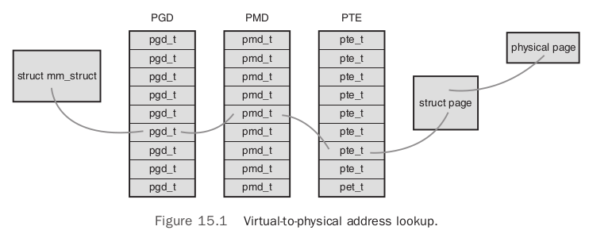

# Chapter 15: The Process Address Space

The kernel also has to manage the memory of user-space process. This memory is called the `process address space`, which is the representation of memory given to each user-space process on the system. Linux is a virtual memory operating system, and thus the resource of memory is virtualized among the processes on the system.

## Address Space

The process address space consists of the virtual memory addressable by a process and the addresses within the virtual memory that the process is allowed to use. Each process is given a `flat` address space that is unique to each process. A memory address in another process's address space. Both processes can have different data at the same address space in their respective address space. Alternatively, processes can elect to share their address space with other processes. We know these processes as `threads`.

A memory address is a given value within the address space. Intervals of legal address are called `memory areas`. The process, through the kernel, can dynamically add and remove memory areas to its address space.

The process can access a memory address only in a valid memory area. Memory areas have associated permissions, such as readable, writable, and executable, that the associated process must respect.

Memory areas can contain all sorts of goodies:

- A memory map of the executable file's code, called the `text section`.
- A memory map of the executable file's initialized global variables, called the `data section`.
- A memory map of the zero page containing uninitialized global variables, called the `bss section`.
- A memory map of the zero page used for the process's user-space stack.
- An additional text, data, and bss section for each shared library, such as the C library and dynamic linker, loaded into the process's address space.
- Any memory mapped files.
- Any shared memory segments.
- Any anonymous memory mappings, such as those associated with `malloc()`.

All valid addresses in the process address space exist in exactly one area; memory areas do not overlap.

## The Memory Descriptor

The kernel represents a process's address space with a data structure called the `memory descriptor`. This structure contains all the information related to the process address space.

The memory descriptor is represented by `struct mm_struct` and defined in `<linux/mm_types.h>`:

```c
struct mm_struct {
    struct vm_area_struct     *mmap;            /* list of memory areas */
    struct rb_root            mm_rb;            /* red-black tree of VMAs */
    struct vm_area_struct     *mmap_cache;      /* last used memory area */
    unsigned long             free_area_cache;  /* 1st address space hole */
    pgd_t                     *pgd;             /* page global directory */
    atomic_t                  mm_users;         /* address space users */
    atomic_t                  mm_count;         /* primary usage counter */
    int                       map_count;        /* number of memory areas */
    struct rw_semaphore       mmap_sem;         /* memory area semaphore */
    spinlock_t                page_table_lock;  /* page table lock */
    struct list_head          mmlist;           /* list of all mm_structs */
    unsigned long             start_code;       /* start address of code */
    unsigned long             end_code;         /* final address of code */
    unsigned long             start_data;       /* start address of data */
    unsigned long             end_data;         /* final address of data */
    unsigned long             start_brk;        /* start address of heap */
    unsigned long             brk;              /* final address of heap */
    unsigned long             start_stack;      /* start address of stack */
    unsigned long             arg_start;        /* start of arguments */
    unsigned long             arg_end;          /* end of arguments */
    unsigned long             env_start;        /* start of environment */
    unsigned long             env_end;          /* end of environment */
    unsigned long             rss;              /* pages allocated */
    unsigned long             total_vm;         /* total number of pages */
    unsigned long             locked_vm;        /* number of locked pages */
    unsigned long             saved_auxv[AT_VECTOR_SIZE]; /* saved auxv */
    cpumask_t                 cpu_vm_mask;      /* lazy TLB switch mask */
    mm_context_t              context;          /* arch-specific data */
    unsigned long             flags;            /* status flags */
    int                       core_waiters;     /* thread core dump waiters */
    struct core_state         *core_state;      /* core dump support */
    spinlock_t                ioctx_lock;       /* AIO I/O list lock */
    struct hlist_head         ioctx_list;       /* AIO I/O list */
};
```

### Allocating a Memory Descriptor

The memory descriptor associated with a given task is stored in the `mm` field of the task's process descriptor. Thus, `current->mm` is the current process's memory descriptor. The `copy_mm()` function copies a parent's memory descriptor to its child during `fork()`. The `mm_struct` structure is allocated from the `mm_cachep` slab cache via the `allocate_mm()` macro in `kernel/fork.c`. Normally, each process receives a unique `mm_struct` and thus a unique process address space.

Processes may share their address spaces with their children via the `CLONE_VM` flag to `clone()`. The process is then called a `thread`. This is essentially the only difference between normal processes and so-called threads in Linux; the Linux kernel does not otherwise differentiate between them. Threads are regular processes to the kernel that merely share certain resources. When `CLONE_VM` is specified, `allocate_mm()` is not called, and the process's `mm` field is set to point to the memory descriptor of its parent.

### Destroying a Memory Descriptor

When the process associated with a specific address space exits, `exit_mm()`, defined in `kernel/exit.c`, is invoked. This function performs some housekeeping and updates some statistics. It then calls `mmput()`, which decrements the memory descriptor's `mm_users` user counter. If the user count reaches zero, `mmdrop()` is called to decrement the `mm_count` usage counter. If that counter is finally zero, the `free_mm()` macro is invoked to return the `mm_struct` to the `mm_cachep` slab cache via `kmem_cache_free()`, because the memory descriptor does not have any users.

### The `mm_struct` and Kernel Threads

Kernel threads do not have a process address space and therefore do not have an associated memory descriptor. Thus, the `mm` field of a kernel thread's process descriptor is `NULL`. This is the definition of a kernel thread: processes that have no user context.

Kernel threads do not ever access any user-space memory and do not have any pages in user-space, they do not deserve their own memory descriptor and page tables. Despite this, kernel threads need some of the data, such as the page tables, even to access kernel memory. To provide kernel threads the needed data, without wasting memory on a memory descriptor and page tables, or wasting processor cycles to switch to a new address space whenever a kernel thread begins running, kernel threads use the memory descriptor of whatever task ran previously.

Whenever a process is scheduled, the process address space referenced by the process’s `mm` field is loaded. The `active_mm` field in the process descriptor is then updated to refer to the new address space. Kernel threads do not have an address space and mm is `NULL`. Therefore, when a kernel thread is scheduled, the kernel notices that `mm` is `NULL` and keeps the previous process’s address space loaded. The kernel then updates the `active_mm` field of the kernel thread’s process descriptor to refer to the previous process’s memory descriptor. The kernel thread can then use the previous process’s page tables as needed. Because kernel threads do not access user-space memory, they make use of only the information in the address space pertaining to kernel memory, which is the same for all processes.

## Virtual Memory Areas

The memory area structure, `vm_area_struct`, represents memory areas. It is defined in `<linux/mm_types.h>`. In the Linux kernel, memory areas are often called `virtual memory areas` (VMAs).

The `vm_area_struct` structure describes a single memory area over a contiguous interval in a given address space. The kernel treats each memory area as a unique memory object. Each memory area prossesses certain properties. In this manner, each VMA structure can represent different types of memory areas.

```c
struct vm_area_struct {
    struct mm_struct        *vm_mm;         /* associated mm_struct */
    unsigned                long vm_start;  /* VMA start, inclusive */
    unsigned long           vm_end;         /* VMA end , exclusive */
    struct vm_area_struct   *vm_next;       /* list of VMA's */
    pgprot_t                vm_page_prot;   /* access permissions */
    unsigned long           vm_flags;       /* flags */
    struct rb_node          vm_rb;          /* VMA's node in the tree */
    union { /* links to address_space->i_mmap or i_mmap_nonlinear */
    struct {
            struct list_head        list;
            void                    *parent;
            struct vm_area_struct   *head;
        } vm_set;
        struct prio_tree_node prio_tree_node;
    } shared;
    struct list_head              anon_vma_node;    /* anon_vma entry */
    struct anon_vma               *anon_vma;        /* anonymous VMA object */
    struct vm_operations_struct   *vm_ops;          /* associated ops */
    unsigned long                 vm_pgoff;         /* offset within file */
    struct file                   *vm_file;         /* mapped file, if any */
    void                          *vm_private_data; /* private data */
};
```

Each memory descriptor is associated with a unique interval in the process's address space. Intervals in different memory areas in the same address space cannot overlap. The `vm_mm` field points to this VMA's associated `mm_struct`.

### VMA Flags

The `vm_flags` field contains bit flags, defined in `<linux/mm.h>`, that specify the behavior of and provide information about the pages contained in the memory area. `vm_flags` contains information that relates to the memory area as a whole (each page), not specific individual pages.

Flag | Effect on the VMA and Its Pages
---- | -------------------------------
VM_READ | Pages can be read from.
VM_WRITE | Pages can be written to.
VM_EXEC | Pages can be executed.
VM_SHARED | Pages are shared.
VM_MAYREAD | The `VM_READ` flag can be set.
VM_MAYWRITE | The `VM_WRITE` flag can be set.
VM_MAYEXEC | The `VM_EXEC` flag can be set.
VM_MAYSHARE | The `VM_SHARE` flag can be set.
VM_GROWSDOWN | The area can grow downward.
VM_GROWSUP | The area can grow upward.
VM_SHM | The area is used for shared memory.
VM_DENYWRITE | The area maps an unwritable file.
VM_EXECUTABLE | The area maps an executable file.
VM_LOCKED | The pages in this area are locked.
VM_IO | The area maps a device's I/O space.
VM_SEQ_READ | The pages seem to be accessed sequentially.
VM_RAND_READ | The pages seem to be accessed randomly.
VM_DONTCOPY | This area must not be copied on `fork()`.
VM_DONTEXPAND | This area cannot grow via `mremap()`.
VM_RESERVED | This area must not be swapped out.
VM_ACCOUNT | This area is an accounted VM object.
VM_HUGETLB | This area uses hugetlb pages.
VM_NONLINEAR | This area is a nonlinear mapping.

### VMA Operations

The `vm_ops` field in the `vm_area_struct` structure points to the table of operations associated with a given memory area, which the kernel can invoke to manipulate the VMA. The `vm_area_struct` acts as a generic object for representing any type of memory area, and the operations table describes the specific methods that can operate on this particular instance of the object.

The operations table is represented by struct `vm_operations_struct` and is defined in `<linux/mm.h>`:

```c
struct vm_operations_struct {
    void (*open) (struct vm_area_struct *);
    void (*close) (struct vm_area_struct *);
    int (*fault) (struct vm_area_struct *, struct vm_fault *);
    int (*page_mkwrite) (struct vm_area_struct *vma, struct vm_fault *vmf);
    int (*access) (struct vm_area_struct *, unsigned long ,
    void *, int, int);
};
```

- `void open(struct vm_area_struct *area)`
  - This function is invoked when the given memory area is added to an address space.
- `void close(struct vm_area_struct *area)`
  - This function is invoked when the given memory area is removed from an address space.
- `int fault(struct vm_area_sruct *area, struct vm_fault *vmf)`
  - This function is invoked by the page fault handler when a page that is not present in physical memory is accessed.
- `int page_mkwrite(struct vm_area_sruct *area, struct vm_fault *vmf)`
  - This function is invoked by the page fault handler when a page that was read-only is being made writable.
- `int access(struct vm_area_struct *vma, unsigned long address, void *buf, int len, int write)`
  - This function is invoked by `access_process_vm()` when `get_user_pages()` fails.

### Lists and Trees of Memory Areas

Memory areas are accessed via both the `mmap` and the `mm_rb` field of the memory descriptor. These two data structures independently point to all the memory area objects associated with the memory descriptor. In fact, they both contain pointers to the same `vm_area_struct` structures, merely represented in different ways.

- `mmap`: links together all the memory area objects in a single linked list. Each `vm_area_struct` structure is linked into the list via its `vm_next` field. The areas are sorted by ascending address. The first memory area is the `vm_area_struct` structure to which `mmap` points.The last structure points to `NULL`.
- `mm_rb`: links together all the memory area objects in a red-black tree. The root of the red-black tree is `mm_rb`, and each `vm_area_struct` structure in this address space is linked to the tree via its `vm_rb` field.

The linked list is used when every node needs to be traversed. The red-black tree is used when locating a specific memory area in the address space.

## Manipulating Memory Areas

The kernel often has to perform operations on a memory area, these operations are frequent and form the basis of the `mmap()` routine. Helper function are defined to assist these jobs. These functions are all declared in `<linux/mm.h>`.

### find_vma()

The kernel provides a function `find_vma()` for searching for the VMA in which a given memory address resides. It is defined in `mm/mmap.c`:

```c
struct vm_area_struct * find_vma(struct mm_struct *mm, unsigned long addr)
```

This function searches the given address space for the first memory area whose `vm_end` field is greater than `addr`. The result of the `find_vma` function is cached in the `mmap_cache` field of the memory descriptor.

If the given address is not in the cache, you must search the memory areas associated with this memory descriptor for a match. This is done via the red-black tree:

```c
struct vm_area_struct *find_vma(struct mm_struct *mm, unsigned long addr)
{
	struct vm_area_struct *vma = NULL;

	if (mm) {
		/* Check the cache first. */
		/* (Cache hit rate is typically around 35%.) */
		vma = mm->mmap_cache;
		if (!(vma && vma->vm_end > addr && vma->vm_start <= addr)) {
			struct rb_node * rb_node;

			rb_node = mm->mm_rb.rb_node;
			vma = NULL;

			while (rb_node) {
				struct vm_area_struct * vma_tmp;

				vma_tmp = rb_entry(rb_node,
						struct vm_area_struct, vm_rb);

				if (vma_tmp->vm_end > addr) {
					vma = vma_tmp;
					if (vma_tmp->vm_start <= addr)
						break;
					rb_node = rb_node->rb_left;
				} else
					rb_node = rb_node->rb_right;
			}
			if (vma)
				mm->mmap_cache = vma;
		}
	}
	return vma;
```

### find_vma_prev()

The `find_vma_prev()` function works the same as `find_vma()`, but it also returns the last VMA before addr. The function is also defined in `mm/mmap.c` and declared in `<linux/mm.h>`:

```c
struct vm_area_struct * find_vma_prev(struct mm_struct *mm, unsigned long addr,
                                      struct vm_area_struct **pprev)
```

The `pprev` argument stores a pointer to the VMA preceding `addr`.

### find_vma_intersection()

The `find_vma_intersection()` function returns the first VMA that overlaps a given address interval. The function is defined in `<linux/mm.h>` because it is inline:

```c
static inline struct vm_area_struct *
find_vma_intersection(struct mm_struct *mm,
                      unsigned long start_addr,
                      unsigned long end_addr)
{
    struct vm_area_struct *vma;

    vma = find_vma(mm, start_addr);
    if (vma && end_addr <= vma->vm_start)
    vma = NULL;
    return vma;
}
```

The first parameter is the address space to search, `start_addr` is the start of the interval, and `end_addr` is the end of the interval.

### mmap() and do_mmap(): Creating an Address Interval

`do_mmap()` is the function used to add an address interval to a process's address space, whether that means expanding an existing memory area or creating a new one.

The `do_mmap()` function is defined in `<linux/mm.h>`:

```c
unsigned long do_mmap(struct file *file, unsigned long addr,
                      unsigned long len, unsigned long prot,
                      unsigned long flag, unsigned long offset)
```

This function maps the file specified by `file` at offset `offset` for length `len`. The `file` parameter can be `NULL` and `offset` can be zero, in which case the mapping will not be backed by a file. In that case, this is called an `anonymous mapping`. If a `file` and `offset` are provided, the mapping is called a `file-backed mapping`.

The `addr` function optionally specifies the initial address from which to start the search for a free interval.

The `prot` parameter specifies the access permissions for pages in the memory area. The possible permission flags are defined in `<asm/mman.h>` and are unique to each supported architecture, although in practice each architecture defines the flags listed in the following table:

Flag | Effect on the Pages in the New Interval
---- | ---------------------------------------
PROT_READ | Corresponds to `VM_READ`
PROT_WRITE | Corresponds to `VM_WRITE`
PROT_EXEC | Corresponds to `VM_EXEC`
PROT_NONE | Cannot access page

The `flags` parameter specifies flags that correspond to the remaining VMA flags. These flags specify the type and change the behavior of the mapping. They are also defined in `<asm/mman.h>`:

Flag | Effect on the New Interval
---- | --------------------------
MAP_SHARED | The mapping can be shared.
MAP_PRIVATE | The mapping cannot be shared.
MAP_FIXED | The new interval must start at the given address `addr`.
MAP_ANONYMOUS | The mapping is not file-backed, but is anonymous.
MAP_GROWSDOWN | Corresponds to `VM_GROWSDOWN`.
MAP_DENYWRITE | Corresponds to `VM_DENYWRITE`.
MAP_EXECUTABLE | Corresponds to `VM_EXECUTABLE`.
MAP_LOCKED | Corresponds to `VM_LOCKED`.
MAP_NORESERVE | No need to reserve space for the mapping.
MAP_POPULATE | Populate (prefault) page tables.
MAP_NONBLOCK | Do not block on I/O.

If any of the parameters are invalid, `do_mmap()` returns a negative value. Otherwise, a suitable interval in virtual memory is located. If possible, the interval is merged with an adjacent memory area. Otherwise, a new `vm_area_struct` structure is allocated from the `vm_area_cachep` slab cache, and the new memory area is added to the address space's linked list and red-black tree of memory areas via the `vma_link()` function. Next, the `total_vm` field in the memory descriptor is updated. Finally, the function returns the initial address of the newly created address interval.

The `do_mmap()` functionality is exported to user-space via the `mmap()` system call, defined as:

```c
void * mmap2(void *start,
             size_t length,
             int prot,
             int flags,
             int fd,
             off_t pgoff)
```

### munmap() and do_munmap(): Removing an Address Interval

The `do_munmap()` function removes an address interval from a specified process address space. The function is declared in `<linux/mm.h>`:

```c
int do_munmap(struct mm_struct *mm, unsigned long start, size_t len)
```

The first parameter `mm` specifies the address space from which the interval starting at address `start` of length `len` bytes is removed. On success, zero is returned. Otherwise, a negative error code is returned.

As the complement of the `mmap()`, the `munmap()` system call is exported to user-space as a means to enable processes to remove address intervals from their address space:

```c
int munmap(void *start, size_t length)
```

The system call is defined in mm/mmap.c and acts as a simple wrapper to `do_munmap()`:

```c
asmlinkage long sys_munmap(unsigned long addr, size_t len)
{
    int ret;
    struct mm_struct *mm;
    mm = current->mm;
    down_write(&mm->mmap_sem);
    ret = do_munmap(mm, addr, len);
    up_write(&mm->mmap_sem);
    return ret;
}
```

## Page Tables

In Linux, the page tables consist of three levels.

- The top-level page table is the page global directory (PGD), which consists of an array of `pgd_t` types. On most architectures, the `pgd_t` type is an unsigned long. The entries in the PGD point to entries in the second-level directory, the PMD.
- The second-level page table is the page middle directory (PMD), which is an array of `pmd_t` types. The entries in the PMD point to entries in the PTE.
- The final level is called simply the page table and consists of page table entries of type `pte_t`. Page table entries point to physical pages.



Each process has its own page tables (threads share them). The `pgd` field of the memory descriptor points to the process's page global directory. Manipulating and traversing page tables requires the `page_table_lock`, which is located inside the associated memory descriptor.

Page table data structures are quite architecture-dependent and thus are defined in `<asm/page.h>`.

Most processors implement a translation lookaside buffer (TLB), which acts as a hardware cache of virtual-to-physical mappings. When accessing a virtual address, the processor first checks whether the mapping is cached in the TLB. If there is a hit, the physical address is immediately returned. If there is a miss, the page tables are consulted for the corresponding physical address.
