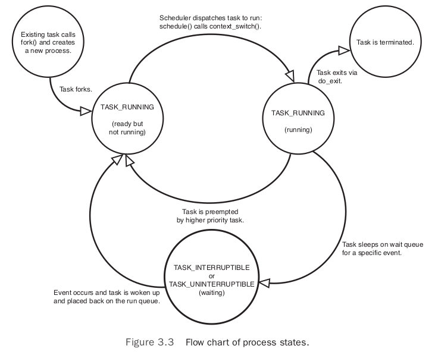

# Process Management

`process` is one of the fundamental abstractions in Unix operating systems, the process management is a crucial part of any operating system kernel, including Linux.

## The Process

A `process` is a program (object code stored on some media) in the midst of execution. They also include a set of resources such as open files and pending signals, internal kernel data, processor state, a memory address space with one or more memory mappings, one or more `threads of execution`, and a `data section` containing global variables.

Threads of execution, often shortened to `threads`, are the objects of activity within the process. Each thread includes a unique program counter, process stack, and set of processor registers. The kernel schedules individual threads, not processes. Linux does not differentiate between threads and processes, a thread is just a special kind of process.

`virtualized processor`: The virtual processor gives the process the illusion that it alone menopolizes the system, despite possibly sharing the processor among hundreds of other processes.

`virtual memory`: It lets the process allocate and manage memory as if it alone owned all the memory in the system.

Note that threads share the virtual memory abstraction, whereas each receives its own virtualized process.

A program itself is not a process; a process is an `active` program and related resources.
Indeed, two or more processes can exist that are executing the same program. In fact, two
or more processes can exist that share various resources, such as open files or an address
space.

`fork()` system call creates a new process by duplicating an existing one. The process that calls `fork()` is the `parent`, whereas the new process is the `child`. The parent resumes execution and the child starts execution at the same place: where the call to `fork()` returns. The `fork()` system call returns from the kernel twice: once in the parent process and again in the newborn child.

The `exec()` family of function calls creates a new address space and loads a new program into it.

The `exit()` system call exits a program. This function terminates the process and free all its resources. When a process exits, it is placed into a special zombie state that represents terminated processes until the parent call `wait()` or `waitpid()`.

## Process Descriptor and the Task Structure

The kernel stores the list of processes in a circular doubly linked list called the `task list`. Each element in the task list is a `process descriptor` of the type `struct task_struct`, which is defined in `<linux/sched.h>`. The process descriptor contains all teh information about a specific process.


### Allocating the Process Descriptor

The `task_struct` is allocated via the `slab allocator` to provide object reuse and cache coloring. The new structure, `struct thread_info`, lives at the bottom of the stack (for stacks that grow down) and at the top of the stack (for stacks that grow up).

The `thread_info` structure is defined on  x86 in `<asm/thread_info.h>`:

```c
struct thread_info {
    struct task_struct    *task;
    struct exec_domain    *exec_domain;
    __u32                 flags;
    __u32                 status;
    __u32                 cpu;
    int                   preempt_count;
    mm_segment_t          addr_limit;
    struct restart_block  restart_block;
    void                  *sysenter_return;
    int                   uaccess_err;
};
```


Each task's `thread_info` structure is allocated at the end of its stack. The task element of the structure is a pointer to the task's actual `task_struct`.

### Storing the Process Descriptor

The system identifies processes by a unique `process identification` value or (PID). The PID is a numerical value represented by the opaque type `pid_t`, which is typically an `int`, and the default maximum value is only 32768.(controlled in `<linux/threads.h>`)

Inside the kernel, tasks are typically referenced directly by a pointer to their `task_struct` structure. Consequently, it is useful to be able to quickly look up the process descriptor of the currently executing task, which is done via the `current` macro.

On x86, `current` is calculated by masking out the 13 least-significant bits of the stack pointer to obtain the `thread_info` structure. This is done by the `current_thread_info()` function. The assembly is shown here:

```c
movl $-8192, %eax
andl %esp, %eax
```

This assumes that the stack size is 8KB. When 4KB stacks are enabled, 4096 is used in lieu of 8192.

Finally, `current` dereferences the `task` member of `thread_info` to return the `task_struct`:

```c
current_thread_info()->task;
```

### Process State

The `state` field of the process descriptor describes the current condition of the process.

Each process on the system is in exactly one of five different states. This value is represented by one of five flags:

- `TASK_RUNNING`: The process is runnable; it is either currently running or on a runqueue waiting to run. This is the only possible state for a process executing in user-space; it can also apply to a process in kernel-space that is actively running.
- `TASK_INTERRUPTIBLE`: The process is sleeping (blocked), waiting for some condition to exist. The process also awakes prematurely and becomes runnable if it receives a signal.
- `TASK_UNINTERRUPTIBLE`: This state is identical to `TASK_INTERRUPTIBLE` except that it does not wake up and become runnable if it receives a signal. This is used in situations where the process must wait without interruption or when the event is expected to occur quite quickly. Because the task does not respond to signals in this state, `TASK_UNINTERRUPTIBLE` is less often used than `TASK_INTERRUPTIBLE`.
- `__TASK_TRACED`: The process is being traced by another process, such as a debugger, via `ptrace`.
- `__TASK_STOPPED`: Process execution has stopped; the task is not running nor is it eligible to run. This occurs if the task receives the `SIGSTOP`, `SIGTSTP`, `SIGTTIN`, or `SIGTTOU` signal or if it receives any signal while it is being debugged.



### Manipulating the Current Process State

Kernel code often needs to change a process's state.

```c
set_task_state(task, state);      /* set task 'task' to state 'state' */
```

The method `set_current_state(state)` is synonymous to `set_task_state(current, state)`.

### Process Context

The code is read in from `executable file` and executed within the program's address space. Normal program execution occurs in `user-space`. When a program executes a system call or triggers an exception, it enters `kernel-space`. At this point, the kernel is said to be “executing on behalf of the process” and is in `process context`.

### The Process Family Tree

All processes are descendants of the `init` process, whose PID is one. The kernel starts init in the last step of the boot process. The init process reads the system `initscripts` and executes more programs, eventually completing the boot process.

- `parent`: Every process on the system has exactly one parent.
- `children`: Every process has zero or more children.
- `siblings`: Processes that are all direct children of the same parent are called siblings.

The relationship between processes is stored in the process descriptor. Each `task_struct` has a pointer to the parent's `task_struct`, named `parent`, and a list of children, named `children`.

To obtain the process descriptor of current process's parent:

```c
struct task_struct *my_parent = current->parent
```

To iterate over a process's children:

```c
struct task_struct *task;
struct list_head *list;

list_for_each(list, &current->children) {
    task = list_entry(list, struct task_struct, sibling);
    /* task now points to one of current's children */
}
```

The `init` task's process descriptor is statically allocated as `init_task`.

```c
struct task_struct *task;

for (task = current; task != &init_task; task = task->parent)
;
/* task now points to init */
```

Because of the task list is a circular doubly linked list, we can obtain the next task easily:

```c
list_entry(task->tasks.next, struct task_struct, tasks)
```

And obtain the previous task works the same way:

```c
list_entry(task->tasks.prev, struct task_struct, tasks)
```

These two routines are provided by the macros `next_task(task)` and `prev_task(task)`. The macro `for_each_process(task)` iterates over the entire task list. On each iteration, `task` points to the next task in the list:

```c
struct task_struct *task;

for_each_process(task) {
    /* this pointlessly prints the name and PID of each task */
    printk("%s[%d]\n", task->comm, task->pid);
}
```

## Process Creation

Unix separates it into two distinct function: `fork()` and `exec()`.

- `fork()`: Creates a child process that is a copy of the current task.
- `exec()`: Loads a new executable into the address space and begins executing it.

### Copy-on-Write

In Linux, `fork()` is implemented through the use of `cpoy-on-write` pages. Copy-on-write (COW) is a technique to delay or altogether prevent copying of the data. Rather than duplicate the process address space, the parent and the child share a single copy.

The duplication of resources occurs only when they are written.

The only overhead incurred by `fork()` is the duplication of the parent's page tables and the creation of a unique process descriptor for the child.

### Forking

Linux implements `fork()` via the `clone()` system call which takes a series of flags that specify which resources the parent and child process should share.

The `clone()` system call calls `do_fork()`.

The bulk of the work in forking is handled by `do_fork()`, which is defined in `kernel/fork.c`. `do_fork()` function calls `copy_process` and then starts the process running:

The interesting work is done by `copy_process()`:

1. It calls `dup_task_struct()`, which creates a new kernel stack, `thread_info` structure, and `task_struct` for the new process. The new values are identical to those of the current task.
2. It then checks that the new child will not exceed the resource limits on the number of processes for the current user.
3. Various members of the process descriptor are cleared or set to initial values, to differentiate the child from its parent.
4. The child's state is set to `TASK_UNINTERRUPTIBLE` to ensure that it does not yet run.
5. `copy_process()` calls `copy_flags()` to update the `flags` member of the `task_struct`. The `PF_SUPERPRIV` flag, which denotes whether a task used superuser privileges, is cleared. The `PF_FORKNOEXEC` flag, which denotes a process that has not called `exec()`, is set.
6. It calls `alloc_pid()` to assign an available PID to the new task.
7. Depending on the flags passed to `clone()`, `copy_process()` either duplicates or shares open files, filesystem information, signal handlers, process address space, and namespace.
8. Finally, `copy_process()` cleans up and returns to the caller a pointer to the new child.

Back in `do_fork()`, if `copy_process()` returns successfully, the new child is woken up and run. Deliberately, the kernel runs the child process first.

### vfork()

The `vfork()` system call has the same effect as `fork()`, except that the page table entries of the parent process are not copied. The child executes as the sole thread in the parent's address space, and the parent is blocked until the child either calls `exec()` or exits. The child is not allowed to write to the address space.

The `vfork()` system call is implemented via a special flag to the `clone()` system call:

1. In `copy_process()`, the `task_struct` member `vfork_done` is set to NULL.
2. In `do_fork()`, if the special flag was given, `vfork_done` is pointed at a specific address.
3. After the child is first run, the parent (instead of returning) waits for the child to signal it through the `vfork_done` pointer.
4. In the `mm_release()` function, which is used when a task exits a memory address space, `vfork_done` is checked to see whether it is NULL. If it is not, the parent is signaled.
5. Back in `do_fork()`, the parent wakes up and returns.

If this all goes as planned, the child is now executing in a new address space, and the parent is again executing in its original address space.

## The Linux Implementation of Threads

Linux implements all threads as standard processes. A thread is merely a process that shares certain resources with other process. Each thread has a unique `task_struct` and appears to the kernel as a normal process. Threads just happen to share resources, such as an address space, with other processes.

The name "lightweight process" sums up the difference in philosophies between  Linux and other systems.

### Creating Threads

Threads are created the same as normal tasks, with the exception that the `clone()` system call is passed flags corresponding to the specific resources to be shared:

```c
clone(CLONE_VM | CLONE_FS | CLONE_FILES | CLONE_SIGHAND, 0);
```

The previous code results in behavior identical to a normal `fork()`, except that the address space, filesystem resources, file descriptors, and signal handlers are shared.

In contract, a normal `fork()` can be implemented as:

```c
clone(SIGCHLD, 0);
```

`vfork()` can be implemented as:

```c
clone(CLONE_VFORK | CLONE_VM | SIGCHLD, 0);
```

The flags provided to `clone()` are defined in `<linux/sched.h>`:

Flag | Meaning
---- | -------
CLONE_FILES | Parent and child share open files.
CLONE_FS | Parent and child share filesystem information.
CLONE_IDLETASK | Set PID to zero (used only by the idle tasks).
CLONE_NEWNS | Create a new namespace for the child.
CLONE_PARENT | Child is to have same parent as its parent.
CLONE_PTRACE | Continue tracing child.
CLONE_SETTID | Write the TID back to user-space.
CLONE_SETTLS | Create a new TLS (thread-local storage) for the child.
CLONE_SIGHAND | Parent and child share signal handlers and blocked signals.
CLONE_SYSVSEM | Parent and child share System V SEM_UNDO semantics.
CLONE_THREAD | Parent and child are in the same thread group.
CLONE_VFORK | vfork() was used and the parent will sleep until the child wakes it.
CLONE_UNTRACED | Do not let the tracing process force CLONE_PTRACE on the child.
CLONE_STOP | Start process in the TASK_STOPPED state.
CLONE_CHILD_CLEARTID | Clear the TID in the child.
CLONE_CHILD_SETTID | Set the TID in the child.
CLONE_PARENT_SETTID | Set the TID in the parent.
CLONE_VM | Parent and child share address space.

### Kernel Threads

`kernel threads`: Standard processes that exist solely in kernel-space.

Kernel threads do not have an address space, they operate only in kernel-space and do not context switch into user-space.

Linux delegates several tasks to kernel threads, most notably the `flush` tasks and the `ksoftirqd` task. Kernel threads are created on system boot by other kernel threads. Indeed, a kernel thread can be created only by another kernel thread. The interfaces, declared in `<linux/kthread.h>`, for spawning a new kernel thread from an existing one is:

```c
struct task_struct *kthread_create(int (*threadfn)(void *data),
                                   void *data,
                                   const char namefmt[],
                                   ...)
```

The above process is created in an unrunnable state, it will not start running until explicitly woken up via``wake_up_process()`.

A process can be created and made runnable with a single function, `kthread_run()`:

```c
struct task_struct *kthread_run(int (*threadfn)(void *data),
                                void *data,
                                const char namefmt[],
                                ...)
```

This routine, implemented as a macro, simply calls both `kthread_create()` and `wake_up_process()`:

```c
#define kthread_run(threadfn, data, namefmt, ...)                 \
({                                                                \
    struct task_struct *k;                                        \
                                                                  \
    k = kthread_create(threadfn, data, namefmt, ## __VA_ARGS__);  \
    if (!IS_ERR(k))                                               \
        wake_up_process(k);                                       \
    k;                                                            \
})
```

When started, a kernel thread continues to exist until it calls `do_exit()` or another part of the kernel calls `kthread_stop()`, passing in the address of the `task_struct` structure returned by `kthread_create()`:

```c
int kthread_stop(struct task_struct *k)
```

## Process Termination

Generally, process destruction is self-induced. It occurs when the process calls the `exit()` system call, either explicitly when it is ready to terminate or implicitly on return from the main subroutine of any program. A process can also terminate involuntarily when receiving a signal or exception it cannot handle or ignore.

The bulk of the work is handled by `do_exit()` system call, defined in `kernel/exit.c`:

1. It set the `PF_EXITING` flag in the `flags` member of the `task_struct`.
2. It calls `del_timer_sync()` to remove any kernel timers. Upon return, it is guaranteed that no timer is queued and that no timer handler is running.
3. If BSD process accounting is enabled, `do_exit()` calls `acct_update_integrals()` to write out accounting information.
4. It calls `exit_mm()` to release the `mm_struct` held by this process. If no other process is using this address space (if the address space is not shared) the kernel then destroys it.
5. It calls `exit_sem()`. If the process is queued waiting for an IPC semaphore, it is dequeued here.
6. It then calls `exit_files()` and `exit_fs()` to decrement the usage count of objects related to file descriptors and filesystem data, respectively.
7. It sets the task's exit code (stored in the `exit_code` member of the `task_struct)` to that provided by `exit()` or whatever kernel mechanism forced the termination. The exit code is stored here for optional retrieval by the parent.
8. It calls `exit_notify()` to send signals to the task’s parent, reparents any of the task’s children to another thread in their thread group or the init process, and sets the
task’s exit state, stored in `exit_state` in the `task_struct` structure, to `EXIT_ZOMBIE`.
9. `do_exit()` calls `schedule()` to switch to a new process. This is the last code the task will ever execute. `do_exit()` never returns.

At this point, the task is not runnable and is in the `EXIT_ZOMBIE` exit state. The only memory it occupies is its kernel stack, the `thread_info` structure, and the `task_struct` structure. The task exits solely to provide information to its parent.

### Removing the Process Descriptor

Cleaning up after a process and removing its process descriptor are separate steps. This enables the system to obtain information about a child process after it has terminated.

After the parent has obtained information on its terminated child, or signified to the kernel that it does not care, the child’s `task_struct` is deallocated.

The `wait()` family of functions are implemented via a system call `wait4()`.

When it is time to finally deallocate the process descriptor, `release_task()` is invoked:

1. It calls `__exit_signal()`, which calls `__unhash_process()`, which in turns calls `detach_pid()` to remove the process from the pidhash and remove the process from the task list.
2. `__exit_signal()` releases any remaining resources used by the now dead process and finalizes statistics and bookkeeping.
3. If the task was the last member of a thread group, and the leader is a zombie, then `release_task()` notifies the zombie leader's parent.
4. `release_task()` calls `put_task_struct()` to free the pages containing the process's kernel stack and `thread_info` structure and deallocate the slab cache containing the `task_struct`.

### The Dilemma of the Parentless Task

If a parent exits before its children, any of its child tasks must be reparented to a new process. The solution is to reparent a task's children on exit to either another process in the current thread group or, if that fails, the `init` process.

`do_exit()` calls `exit_notify()`, which calls `forget_original_parent()`, which calls `find_new_reaper()` to perform the reparenting:

```c
static struct task_struct *find_new_reaper(struct task_struct *father)
{
    struct pid_namespace *pid_ns = task_active_pid_ns(father);
    struct task_struct *thread;

    thread = father;
    while_each_thread(father, thread) {
      if (thread->flags & PF_EXITING)
          continue;
      if (unlikely(pid_ns->child_reaper == father))
          pid_ns->child_reaper = thread;
      return thread;
    }

    if (unlikely(pid_ns->child_reaper == father)) {
        write_unlock_irq(&tasklist_lock);
        if (unlikely(pid_ns == &init_pid_ns))
        panic("Attempted to kill init!");

        zap_pid_ns_processes(pid_ns);
        write_lock_irq(&tasklist_lock);

        /*
        * We can not clear ->child_reaper or leave it alone.
        * There may by stealth EXIT_DEAD tasks on ->children,
        * forget_original_parent() must move them somewhere.
        */
        pid_ns->child_reaper = init_pid_ns.child_reaper;
    }

    return pid_ns->child_reaper;
}
```

The code attempts to find and return another task in the process's thread group. If another task is not in the thread group, it finds and returns the `init` process.

Now that a suitable new parent for the children is found, each child needs to be located and reparented to `reaper`:

```c
reaper = find_new_reaper(father);
list_for_each_entry_safe(p, n, &father->children, sibling) {
    p->real_parent = reaper;
    if (p->parent == father) {
        BUG_ON(p->ptrace);
        p->parent = p->real_parent;
    }
    reparent_thread(p, father);
}
```

`ptrace_exit_finish()` is then called to do the same reparenting but to a list of `ptraced` children:

```c
void exit_ptrace(struct task_struct *tracer)
{
    struct task_struct *p, *n;
    LIST_HEAD(ptrace_dead);

    write_lock_irq(&tasklist_lock);
    list_for_each_entry_safe(p, n, &tracer->ptraced, ptrace_entry) {
        if (__ptrace_detach(tracer, p))
        list_add(&p->ptrace_entry, &ptrace_dead);
    }
    write_unlock_irq(&tasklist_lock);

    BUG_ON(!list_empty(&tracer->ptraced));

    list_for_each_entry_safe(p, n, &ptrace_dead, ptrace_entry) {
    list_del_init(&p->ptrace_entry);
    release_task(p);
    }
}
```

When a task is `ptraced`, it is temporarily reparented to the debugging process. When the task's parent exits, however, it must be reparented along with its other siblings.

The `init` process routinely calls `wait()` on its children, cleaning up any zombies assigned to it.
