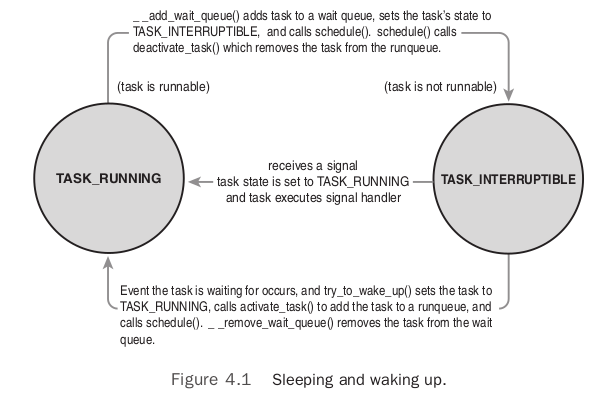

# Chapter 4: Process Scheduling

`process scheduler`: Divides the finite resource of processor time between the runnable processes on a system. The scheduler is responsible for best utilizing the system and giving users the impression that multiple processes are executing simultaneously.

## Multitasking

A `multitasking` operating system is one that can simultaneously interleave execution of more than one process.

Multitasking operating systems come in two flavors: `cooperative multitasking`and `preemptive multitasking`. Linux implements preemptive multitasking.

`preemption`: the act of involuntarily suspending a running process.

`timeslice` of a process: the time the process runs before it is preempted is usually predetermined.

## Linux's Process Scheduler

Beginning in the 2.6 kernel series, developers introduced new process schedulers aimed at improving the interactive performance of the `O(1)` scheduler. The most notable of these was the `Rotating Staircase Deadline scheduler`, which introduced the concept of fair scheduling, borrowed from queuing theory, to Linux's process scheduler. This concept was the inspiration for the O(1) scheduler's eventual replacement in kernel version 2.6.23, the `Completely Fair Scheduler (CFS)`.

## Policy

Policy is the behavior of the scheduler that determines what runs when.

### I/O-Bound Versus Processor-Bound Processes

Processes can be classified as either `I/O-bound` or `processor-bound`.

- `I/O-bound processes`: spend much of its time submitting and waiting on I/O requests.(eg. GUI)
- `processor-bound processes`:  spend much of their time executing code.(eg. MATLAB)

The scheduling policy in a system must attempt to satisfy two conflicting goals: fast process response time (low latency) and maximal system utilization (high throughput). Linux, aiming to provide good interactive response and desktop performance, optimizes for process response (low latency), thus favoring I/O-bound processes over processor-bound processes.

### Process Priority

A common type of scheduling algorithm is `priority-based` scheduling.

The Linux kernel implements two separate priority ranges:

- `nise value`: a number from -20 to +19 with a default of 0. Larger nice values correspond to a lower priority. In Linux, it is a control over the `proportion` of timeslice.
- `real-time priority`: configurable values that by default range from 0 to 99. Higher real-time priority values correspond to a greater priority.

### Timeslice

The timeslice is the numeric value that represents how long a task can run until it is preempted.

Linux's CFS scheduler does not directly assign timeslices to processes, but assigns processes a `proportion` of the processor. Under the new CFS scheduler, the decision is a function of how much of a proportion of the processor the newly runnable processor has consumed. If it has consumed a smaller proportion of the processor than the currently executing process, it runs immediately, preempting the current process. If not, it is scheduled to run at a later time.

## The Linux Scheduling Algorithm

### Scheduler Classes

The Linux scheduler is modular, enabling different algorithms to schedule different types of processes. This modularity is called `scheduler classes`. The base scheduler code, which is defined in `kernel/sched.c`, iterates over each scheduler class in order of priority.The highest priority scheduler class that has a runnable process wins, selecting who runs next.

The Completely Fair Scheduler (CFS) is the registered scheduler class for normal processes, called `SCHED_NORMAL` in Linux. CFS is defined in `kernel/sched_fair.c`.

### Fair Scheduling

CFS is based on a simple concept: Model process scheduling as if the system had an ideal, perfectly multitasking processor.

Put generally, the proportion of processor time that any process receives is determined only by the relative difference in niceness between it and the other runnable processes. The nice values, instead of yielding additive increases to timeslices, yield geometric differences.The absolute timeslice allotted any nice value is not an absolute number, but a given proportion of the processor. CFS is called a fair scheduler because it gives each process a fair share (a proportion) of the processor’s time.

## The Linux Scheduling Implementation

CFS's actual implementation lives in `kernel/sched_fair.c`. Specifically, this sections discusses four components of CFS:

- Time Accounting
- Process Selection
- The Scheduler Entry Point
- Sleeping and Waking Up

### Time Accounting

All process schedulers must account for the time that a process runs.

#### The Scheduler Entity Structure

CFS uses the `scheduler entity structure`, `struct sched_entity`, defined in `<linux/sched.h>`, to keep track of process accounting:

```c
struct sched_entity {
    struct load_weight load;
    struct rb_node run_node;
    struct list_head group_node;
    unsigned int on_rq;
    u64 exec_start;
    u64 sum_exec_runtime;
    u64 vruntime;
    u64 prev_sum_exec_runtime;
    u64 last_wakeup;
    u64 avg_overlap;
    u64 nr_migrations;
    u64 start_runtime;
    u64 avg_wakeup;

/* many stat variables elided, enabled only if CONFIG_SCHEDSTATS is set */
};
```

The scheduler entity structure is embedded in the `process descriptor`, `struct task_stuct`, as a member variable named `se`.

#### The Virtual Runtime

The `vruntime` variable stores the `virtual runtime` of a process, which is the actual runtime (the amount of time spent running) normalized (or weighted) by the number of runnable processes. The virtual runtime's units are nanoseconds and therefore `vruntime` is decoupled from the timer tick.

The function `update_curr()`, defined in `kernel/sched_fair.c`, manages this accounting:

```c
static void update_curr(struct cfs_rq *cfs_rq)
{
	struct sched_entity *curr = cfs_rq->curr;
	u64 now = rq_of(cfs_rq)->clock;
	unsigned long delta_exec;

	if (unlikely(!curr))
		return;

	/*
	 * Get the amount of time the current task was running
	 * since the last time we changed load (this cannot
	 * overflow on 32 bits):
	 */
	delta_exec = (unsigned long)(now - curr->exec_start);
	if (!delta_exec)
		return;

	__update_curr(cfs_rq, curr, delta_exec);
	curr->exec_start = now;

	if (entity_is_task(curr)) {
		struct task_struct *curtask = task_of(curr);

		trace_sched_stat_runtime(curtask, delta_exec, curr->vruntime);
		cpuacct_charge(curtask, delta_exec);
		account_group_exec_runtime(curtask, delta_exec);
	}
}
```

`update_curr()` calculates the execution time of the current process and stores that value in `delta_exec`. It then passes that runtime to `__update_curr()`, which weights the time by the number of runnable processes. The current process's `vruntime` is then incremented by the weighted value:

```c
/*
 * Update the current task's runtime statistics. Skip current tasks that
 * are not in our scheduling class.
 */
static inline void
__update_curr(struct cfs_rq *cfs_rq, struct sched_entity *curr,
	      unsigned long delta_exec)
{
	unsigned long delta_exec_weighted;

	schedstat_set(curr->exec_max, max((u64)delta_exec, curr->exec_max));

	curr->sum_exec_runtime += delta_exec;
	schedstat_add(cfs_rq, exec_clock, delta_exec);
	delta_exec_weighted = calc_delta_fair(delta_exec, curr);

	curr->vruntime += delta_exec_weighted;
	update_min_vruntime(cfs_rq);
}
```

`update_curr()` is invoked periodically by the system timer and also whenever a process becomes runnable or blocks, becoming unrunnable. In this manner, `vruntime` is an accurate measure of the runtime of a given process and an indicator of what process should run next.

### Process Selection

The core of CFS’s scheduling algorithm: Pick the task with the smallest `vruntime`.

CFS uses a `red-black` tree to manage the list of runnable processes and efficiently find the process with the smallest `vruntime`. A red-black tree, called an `rbtree` in Linux, is a type of `self-balancing binary search tree`.

#### Picking the Next Task

The process that CFS wants to run next, which is the process with the smallest `vruntime`, is the leftmost node in the tree. CFS's process selection algorithm is thus summed up as "run the process represented by the leftmost node in the rbtree."

The function that performs this selection is `__pick_next_entity()`, defined in `kernel/sched_fair.c`:

```c
static struct sched_entity *__pick_next_entity(struct cfs_rq *cfs_rq)
{
	struct rb_node *left = cfs_rq->rb_leftmost;

	if (!left)
		return NULL;

	return rb_entry(left, struct sched_entity, run_node);
}
```

#### Adding Processes to the Tree

CFS adds processes to the rbtree and caches the leftmost node, when a process becomes runnable (wakes up) or is first created via `fork()`. Adding processes to the tree is performed by `enqueue_entity()`:

```c
static void
enqueue_entity(struct cfs_rq *cfs_rq, struct sched_entity *se, int flags)
{
	/*
	 * Update the normalized vruntime before updating min_vruntime
	 * through callig update_curr().
	 */
	if (!(flags & ENQUEUE_WAKEUP) || (flags & ENQUEUE_MIGRATE))
		se->vruntime += cfs_rq->min_vruntime;

	/*
	 * Update run-time statistics of the 'current'.
	 */
	update_curr(cfs_rq);
	account_entity_enqueue(cfs_rq, se);

	if (flags & ENQUEUE_WAKEUP) {
		place_entity(cfs_rq, se, 0);
		enqueue_sleeper(cfs_rq, se);
	}

	update_stats_enqueue(cfs_rq, se);
	check_spread(cfs_rq, se);
	if (se != cfs_rq->curr)
		__enqueue_entity(cfs_rq, se);
}
```

This function updates the runtime and other statistics and then invokes `__enqueue_entity()` to perform the actual heavy lifting of inserting the entry into the red-black tree.

```c
/*
 * Enqueue an entity into the rb-tree:
 */
static void __enqueue_entity(struct cfs_rq *cfs_rq, struct sched_entity *se)
{
	struct rb_node **link = &cfs_rq->tasks_timeline.rb_node;
	struct rb_node *parent = NULL;
	struct sched_entity *entry;
	s64 key = entity_key(cfs_rq, se);
	int leftmost = 1;

	/*
	 * Find the right place in the rbtree:
	 */
	while (*link) {
		parent = *link;
		entry = rb_entry(parent, struct sched_entity, run_node);
		/*
		 * We dont care about collisions. Nodes with
		 * the same key stay together.
		 */
		if (key < entity_key(cfs_rq, entry)) {
			link = &parent->rb_left;
		} else {
			link = &parent->rb_right;
			leftmost = 0;
		}
	}

	/*
	 * Maintain a cache of leftmost tree entries (it is frequently
	 * used):
	 */
	if (leftmost)
		cfs_rq->rb_leftmost = &se->run_node;

	rb_link_node(&se->run_node, parent, link);
	rb_insert_color(&se->run_node, &cfs_rq->tasks_timeline);
}
```

This function traverses the tree in the `while()` loop to search for a matching key (inserted process's `vruntime`). It moves to the left child if the key is smaller than the current node's key and to the right child if the key is larger. If it ever moves to the right, even once, it knows the inserted process cannot be the new leftmost node, and it sets `leftmost` to zero. If it moves only to the left, `leftmost` remains one, and we have a new leftmost node and can update the cache by setting `rb_leftmost` to the inserted process. When out of the loop, the function calls `rb_link_node()` on the parent node, making the inserted process the new child. The function `rb_insert_color()` updates the self-balancing properties of the tree.

#### Removing Processes from the Tree

CFS removes processes from the red-black tree when a process blocks (becomes unrunnable) or terminates (ceases to exist):

```c
static void
dequeue_entity(struct cfs_rq *cfs_rq, struct sched_entity *se, int sleep)
{
	/*
	 * Update run-time statistics of the 'current'.
	 */
	update_curr(cfs_rq);

	update_stats_dequeue(cfs_rq, se);
	clear_buddies(cfs_rq, se);

	if (se != cfs_rq->curr)
		__dequeue_entity(cfs_rq, se);
	account_entity_dequeue(cfs_rq, se);
	update_min_vruntime(cfs_rq);

	/*
	 * Normalize the entity after updating the min_vruntime because the
	 * update can refer to the ->curr item and we need to reflect this
	 * movement in our normalized position.
	 */
	if (!sleep)
		se->vruntime -= cfs_rq->min_vruntime;
}
```

Similarly, the real work is performed by a helper function, `__dequeue_entity()`:

```c
static void __dequeue_entity(struct cfs_rq *cfs_rq, struct sched_entity *se)
{
	if (cfs_rq->rb_leftmost == &se->run_node) {
		struct rb_node *next_node;

		next_node = rb_next(&se->run_node);
		cfs_rq->rb_leftmost = next_node;
	}

	rb_erase(&se->run_node, &cfs_rq->tasks_timeline);
}
```

Removing a process from the tree is much simpler because the rbtree implementation provides the `rb_erase()` function that performs all the work. The rest of this function updates the `rb_leftmost` cache.

### The Scheduler Entry Point

The main entry point into the process schedule is the function `schedule()`, defined in `kernel/sched.c`. `schedule()` is generic to scheduler classes. It finds the highest priority scheduler class with a runnable process and asks it what to run next. The only important part of the function is its invocation of `pick_next_task()`, defined in `kernel/sched.c`, which goes through each scheduler class, starting with the highest priority, and selects the highest priority process in the highest priority class:

```c
/*
 * Pick up the highest-prio task:
 */
static inline struct task_struct *
pick_next_task(struct rq *rq)
{
	const struct sched_class *class;
	struct task_struct *p;

	/*
	 * Optimization: we know that if all tasks are in
	 * the fair class we can call that function directly:
	 */
	if (likely(rq->nr_running == rq->cfs.nr_running)) {
		p = fair_sched_class.pick_next_task(rq);
		if (likely(p))
			return p;
	}

	class = sched_class_highest;
	for ( ; ; ) {
		p = class->pick_next_task(rq);
		if (p)
			return p;
		/*
		 * Will never be NULL as the idle class always
		 * returns a non-NULL p:
		 */
		class = class->next;
	}
}
```

### Sleeping and Waking Up

`Sleeping`: The task marks itself as sleeping, puts itself on a wait queue, removes itself from the red-black tree of runnable, and calls `schedule()` to select a new process to execute.

`Waking up`: The task is set as runnable, removed from the wait queue, and added back to the red-black tree.

#### Wait Queues

A wait queue is a simple list of processes waiting for an event to occur.

Wait queues are represented in the kernel by `wake_queue_head_t`. They are created statically via `DECLARE_WAITQUEUE()` or dynamically via `init_waitqueue_head()`. Processes put themselves on a wait queue and mark themselves not runnable. When the event associated with the wait queue occurs, the processes on the queue are awakened.

```c
/* `q' is the wait queue we wish to sleep on */
DEFINE_WAIT(wait);

add_wait_queue(q, &wait);
while (!condition) { /* condition is the event that we are waiting for */
    prepare_to_wait(&q, &wait, TASK_INTERRUPTIBLE);
    if (signal_pending(current))
        /* handle signal */
    schedule();
}
finish_wait(&q, &wait);
```

The task performs the following steps to add itself to a wait queue:

1. Creates a wait queue entry via the macro `DEFINE_WAIT()`.
2. Adds itself to a wait queue via `add_wait_queue()`. This wait queue awakens the process when the condition for which it is waiting occurs.
3. Calls `prepare_to_wait()` to change the process state to either `TASK_INTERRUPTIBLE` or `TASK_UNINTERRUPTIBLE`.
4. If the state is set to `TASK_INTERRUPTIBLE`, a signal wakes the process up. This is called a spurious wake up (a wake-up not caused by the occurrence of the event). So check and handle signals.
5. When the task awakens, it again checks whether the condition is true. If it is, it exits the loop. Otherwise, it again calls `schedule()` and repeats.
6. After the condition is true, the task sets itself to `TASK_RUNNING` and removes itself from the wait queue via `finish_wait()`.

The function `inotify_read()` in `fs/notify/inotify/inotify_user.c`, which handles reading from the inotify file descriptor, is a straightforward example of using wait queues:

```c
static ssize_t inotify_read(struct file *file, char __user *buf,
			    size_t count, loff_t *pos)
{
	struct fsnotify_group *group;
	struct fsnotify_event *kevent;
	char __user *start;
	int ret;
	DEFINE_WAIT(wait);

	start = buf;
	group = file->private_data;

	while (1) {
		prepare_to_wait(&group->notification_waitq, &wait, TASK_INTERRUPTIBLE);

		mutex_lock(&group->notification_mutex);
		kevent = get_one_event(group, count);
		mutex_unlock(&group->notification_mutex);

		if (kevent) {
			ret = PTR_ERR(kevent);
			if (IS_ERR(kevent))
				break;
			ret = copy_event_to_user(group, kevent, buf);
			fsnotify_put_event(kevent);
			if (ret < 0)
				break;
			buf += ret;
			count -= ret;
			continue;
		}

		ret = -EAGAIN;
		if (file->f_flags & O_NONBLOCK)
			break;
		ret = -EINTR;
		if (signal_pending(current))
			break;

		if (start != buf)
			break;

		schedule();
	}

	finish_wait(&group->notification_waitq, &wait);
	if (start != buf && ret != -EFAULT)
		ret = buf - start;
	return ret;
}
```

#### Waking Up

Waking is handled via `wake_up()`, which wakes up all the tasks waiting on the given wait queue. It calls `try_to_wake_up()`, which sets the task's state to `TASK_RUNNING`, calls `enqueue_task()` to add the task to the red-black tree, and set `need_reached` if the awakened task's priority is higher than the priority of the current task.



## Preemption and Context Switching

Context switching, the switching from one runnable task to another, is handled by the `context_switch()` function defined in `kernel/sched.c`. It is called by `schedule()` when a new process has been selected to run. It does two basic jobs:

- Calls `switch_mm()`, declared in `<asm/mmu_context.h>`, to switch the virtual memory mapping from the previous process's to that of the new process.
- Calls `switch_to()`, declared in `<asm/system.h>`, to switch the processor state from the previous process's to the current's.

the kernel provides the `need_resched` flag to signify whether a reschedule should be performed. This flag is set by `scheduler_tick()` when a process should be preempted, and
by `try_to_wake_up()` when a process that has a higher priority than the currently running process is awakened. The kernel checks the flag, sees that it is set, and calls `schedule()` to switch to a new process.

The table below lists functions for accessing and manipulating `need_resched`:

Function | Purpose
-------- | -------
set_tsk_need_resched() | Set the `need_resched` flag in the given process.
clear_tsk_need_resched() | Clear the `need_resched` flag in the given process.
need_resched() | Test the value of the `need_resched` flag; return true if set and false otherwise.

Upon returning to user-space or returning from an interrupt, the `need_resched` flag is checked. If it is set, the kernel invokes the scheduler before continuing.

The flag is per-process, and not simply global, because it is faster to access a value in the process descriptor (because of the speed of `current` and high probability of it being cache hot) than a global variable.

### User Preemption

User preemption can occur:

- When returning to user-space from a system call
- When returning to user-space from an interrupt handler

### Kernel Preemption

The Linux kernel is a fully preemptive kernel. It can preempt a task running in the kernel
so long as it does not hold a lock.

To support kernel preemption, `preempt_count` was added to each process's `thread_info`. This counter begins at zero and increments once for each lock that is acquired and decrements once for each lock that is released. When the counter is zero, the kernel is preemptible.

kernel preemption can occur:

- When an interrupt handler exits, before returning to kernel-space
- When kernel code becomes preemptible again
- If a task in the kernel explicitly calls `schedule()`
- If a task in the kernel blocks (which results in a call to `schedule()`)

## Real-Time Scheduling Policies

Linux provides two real-time scheduling policies: `SCHED_FIFO` and `SCHED_RR`. The normal, not real-time scheduling policy is `SCHED_NORMAL`.

Via the `scheduling classes` framework, these real-time policies are managed not by the Completely Fair Scheduler, but by a special real-time scheduler, defined in `kernel/sched_rt.c`.

`SCHED_FIFO` implements a simple first-in, first-out scheduling algorithm without timeslices.

- A runnable `SCHED_FIFO` task is always scheduled over any `SCHED_NORMAL` tasks.
- When a `SCHED_FIFO` task becomes runnable, it continues to run until it blocks or explicitly yields the processor; it has no timeslice and can run indefinitely
- Only a higher priority `SCHED_FIFO` or `SCHED_RR` task can preempt a `SCHED_FIFO` task.
- Two or more `SCHED_FIFO` tasks at the same priority run round-robin, but only yielding the processor when they explicitly choose to do so.
- If a `SCHED_FIFO` task is runnable, all other tasks at a lower priority cannot run until the `SCHED_FIFO` task becomes unrunnable.

`SCHED_RR` is `SCHED_FIFO` with timeslices. It is a real-time, round-robin scheduling algorithm.

- When a `SCHED_RR` task exhausts its timeslice, any other real-time processes at its priority are scheduled round-robin. The timeslice is used to allow only rescheduling of same-priority processes.
- As with `SCHED_FIFO`, a higher-priority process always immediately preempts a lower-priority one, and a lower-priority process can never preempt a `SCHED_RR` task, even if its timeslice is exhausted.

Both real-time scheduling policies implement static priorities.

The real-time scheduling policies in Linux provide soft real-time behavior. `Soft real-time` refers to the notion that the kernel tries to schedule applications within timing deadlines, but the kernel does not promise to always achieve these goals.

Real-time priorities range inclusively from zero to `MAX_RT_PRIO` minus 1. By default, this range is 0 to 99, since `MAX_RT_PRIO` is 100. This priority space is shared with the nice values of `SCHED_NORMAL` tasks: They use the space from `MAX_RT_PRIO` to (`MAX_RT_PRIO + 40`). By default, this means the –20 to +19 nice range maps directly onto the priority space from 100 to 139.

## Scheduler-Related System Calls

Linux provides a family of system calls for the management of scheduler parameters, which allow manipulation of process priority, scheduling policy, and processor affinity, yielding the processor to other tasks.

System Call | Description
----------- | -----------
nice() | Sets a process's nice value
sched_setscheduler() | Sets a process's scheduling policy
sched_getscheduler() | Gets a process's scheduling policy
sched_setparam() | Sets a process's real-time priority
sched_getparam() | Gets a process's real-time priority
sched_get_priority_max() | Gets the maximum real-time priority
sched_get_priority_min() | Gets the minimum real-time priority
sched_rr_get_interval() | Gets a process's timeslice value
sched_setaffinity() | Sets a process's processor affinity
sched_getaffinity() | Gets a process's processor affinity
sched_yield() | Temporarily yields the processor
