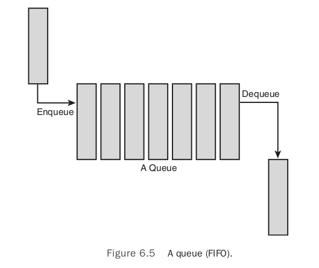

# Chapter 6: Kernel Data Structures

## Linked Lists
a linked list is a data structure that allows the storage and manipulation of a variable number of elements, called the nodes of the list.

### Circular Doubly Linked Lists
The Linux kernel's linked list implementation is fundamentally a circular doubly linked list.


### The Linux Kernel's Implementation
The Linux kernel approach is different. Instead of turning the structure into a linked list, the Linux approach is to "embed a linked list node in the structure".

##### The Linked List Structure
The linked-list code is declared in the header file `<linux/list.h>`:
```
struct list_head {
    struct list_head *next
    struct list_head *prev;
};
```

The utility is in how the list_head structure is used:
```
struct fox {
    unsigned long tail_length; /* length in centimeters of tail */
    unsigned long weight; /* weight in kilograms */
    bool is_fantastic; /* is this fox fantastic? */
    struct list_head list; /* list of all fox structures */
};
```

The kernel provides a family of routines to manipulate linked lists (for example, the `list_add()` method adds a new node to an existing linked list). These methods accept only `list_head` structures. Using the macro `container_of()`, we can easily find the parent structure containing any given member variable. In C, the offset of a given variable into a structure is fixed by the ABI at compile time.
```
#define container_of(ptr, type, member) ({ \
        const typeof( ((type *)0)->member ) *__mptr = (ptr); \
        (type *)( (char *)__mptr - offsetof(type,member) );})
```
Using `container_of()`, we can define a simple function to return the parent structure containing any `list_head`:
```
#define list_entry(ptr, type, member) \
        container_of(ptr, type, member)
```
With `list_entry()`, the kernel provides routines manipulate linked lists without knowing anything about the structures that the `list_head` resides within.

##### Defining a Linked List
A `list_head` is normally embedded inside your own structure:
```
struct fox {
    unsigned long tail_length; /* length in centimeters of tail */
    unsigned long weight; /* weight in kilograms */
    bool is_fantastic; /* is this fox fantastic? */
    struct list_head list; /* list of all fox structures */
};
```
The list needs to be initialized before it can be used. Because most of the elements of the linked list are created dynamically, the most common way of initializing the linked list is at runtime using `INIT_LIST_HEAD`:
```
struct fox *red_fox;
red_fox = kmalloc(sizeof(*red_fox), GFP_KERNEL);
red_fox->tail_length = 40;
red_fox->weight = 6;
red_fox->is_fantastic = false;
INIT_LIST_HEAD(&red_fox->list);
```

##### List Heads
But before we can use kernel's linked list routines to manage our structure, we need a canonical pointer to refer to the list as a whole: a head pointer.

Since each contains a `list_head`, and we can iterate from any one node to the next. We need a special pointer that refers to your linked list, without being a list node itself. This special node is in fact a normal list_head:
```
static LIST_HEAD(fox_list);
```
This defines and initializes a `list_head` named `fox_list`. The majority of the linked list routines accept one or two parameters: the `head` node or the `head` node plus an actual list node.

### Manipulating Linked Lists
The kernel provides a family of functions to manipulate linked lists. They all take pointers to one or more `list_head` structures. The functions are implemented as inline functions in generic C and can be found in `<linux/list.h>`.

All these functions are `O(1)`. This means they execute in constant time, regardless of the size of the list or any other inputs.

##### Adding a Node to a Linked List
```
list_add(struct list_head *new, struct list_head *head)
```
This function adds the new node to the given list immediately after the `head` node. Because the list is circular and generally has no concept of first or last nodes, you can pass any element for head. If you pass the "last" element as `head`, this function can be used to implement a stack.

##### Deleting a Node from a Linked List
```
list_del(struct list_head *entry)
```
This function removes the element entry from the list. Note that `list_del` does not free any memory belonging to `entry` or the data structure in which it is embedded; this function merely removes the element from the list. After calling this, you would typically destroy your data structure and the `list_head` inside it.
```
static inline void __list_del(struct list_head *prev, struct list_head *next)
{
    next->prev = prev;
    prev->next = next;
}

static inline void list_del(struct list_head *entry)
{
    __list_del(entry->prev, entry->next);
}
```
To delete a node from a linked list and reinitialize it, the kernel provides `list_del_init()`:
```
list_del_init(struct list_head *entry)
```
This function behaves the same as `list_del()`, except it also reinitializes the given `list_head` with the rationale that you no longer want the entry in the list, but you can reuse the data structure itself.

##### Moving and Splicing Linked List Nodes
```
list_move(struct list_head *list, struct list_head *head)
```
This function removes the list entry from its linked list and adds it to the given list after the head element.

To move a node from one list to the end of another:
```
list_move_tail(struct list_head *list, struct list_head *head)
```
This function does the same as `list_move()`, but inserts the list element before the head entry.

To check whether a list is empty:
```
list_empty(struct list_head *head)
```
This returns nonzero if the given list is empty; otherwise, it returns zero.

To splice two unconnected lists together:
```
list_splice(struct list_head *list, struct list_head *head)
```
This function splices together two lists by inserting the list pointed to by list to the given list after the element head.

To splice two unconnected lists together and reinitialize the old list:
```
list_splice_init(struct list_head *list, struct list_head *head)
```
This function works the same as `list_splice()`, except that the emptied list pointed to by list is reinitialized.

### Traversing Linked Lists
##### The Basic Approach
The most basic way to iterate over a list is with the `list_for_each()` macro. The macro takes two parameters, both list_head structures. The first is a pointer used to point to the current entry; it is a temporary variable that you must provide. The second is the `list_head` acting as the head node of the list you want to traverse. On each iteration of the loop, the first parameter points to the next entry in the list, until each entry has been visited.
```
struct list_head *p;
list_for_each(p, fox_list) {
/* p points to an entry in the list */
}
```

##### The Usable Approach
Most kernel code uses the `list_for_each_entry()` macro to iterate over a linked list. This macro handles the work performed by `list_entry()`, making list iteration simple:
```
list_for_each_entry(pos, head, member)
```
Here, `pos` is a pointer to the object containing the `list_head nodes`. Think of it as the return value from `list_entry()`. `head` is a pointer to the `list_head` head node from which you want to start iterating.

##### Iterating Through a List Backward
The macro `list_for_each_entry_reverse()` works just like `list_for_each_entry()`, except that it moves through the list in reverse.
```
list_for_each_entry_reverse(pos, head, member)
```

##### Iterating While Removing
Programmers stores the next (or previous) pointer in a temporary variable prior to a potential removal operation.
```
list_for_each_entry_safe(pos, next, head, member)
```
You use this version in the same manner as `list_for_each_entry()`, except that the `next` pointer, which is of the same type as `pos`. The next pointer is used by the `list_for_each_entry_safe()` macro to store the next entry in the list, making it safe to remove the current entry.

If you need to iterate over a linked list in reverse and potentially remove elements, the kernel provides `list_for_each_entry_safe_reverse()`:
```
list_for_each_entry_safe_reverse(pos, n, head, member)
```

##### Other Linked List Methods
Linux provides myriad other list methods are defined in the header file `<linux/list.h>`.


## Queues
Queues are also called FIFOs, short for `first-in, first-out`. The Linux kernel's generic queue implementation is called `kfifo` and is implemented in `kernel/kfifo.c` and declared in `<linux/kfifo.h>`.



### kfifo
Linux's kfifo providing two primary operations:
- `enqueue`: The enqueue (in) operation copies data into the queue, starting at the in offset. When complete, the in offset is incremented by the amount of data enqueued.
- `dequeue`: The dequeue (out) operation copies data out of the queue, starting from the out offset. When complete, the out offset is incremented by the amount of data enqueued.

Linux kfifo objuect maintains two offsets into the queue:
- `in offset`: the location in the queue to which the next enqueue will occur.
- `out offset`: the location in the queue from which the next dequeue will occur.

### Creating a Queue
To use a kfifo, you must first define and initialize it. The most common method is dynamic:
```
int kfifo_alloc(struct kfifo *fifo, unsigned int size, gfp_t gfp_mask);
```
This function creates and initializes a kfifo with a queue of `size` bytes. The kernel uses the gfp mask `gfp_mask` to allocate the queue. Upon success, `kfifo_alloc()` returns zero; on error it returns a negative error code.

If you want to allocate the buffer yourself:
```
void kfifo_init(struct kfifo *fifo, void *buffer, unsigned int size);
```
This function creates and initializes a kfifo that will use the `size` bytes of memory pointed at by `buffer` for its queue. With both `kfifo_alloc()` and `kfifo_init()`, `size` must be a power of two.

Statically declaring a kfifo is simpler, but less common:
```
DECLARE_KFIFO(name, size);
INIT_KFIFO(name);
```
This creates a static kfifo named `name` with a queue of `size` bytes. As before, `size` must be a power of 2.

### Enqueuing Data
```
unsigned int kfifo_in(struct kfifo *fifo, const void *from, unsigned int len);
```
This function copies the `len` bytes starting at from into the queue represented by success it returns the number of bytes enqueued. If less than `len` bytes are free in the queue, the function copies only up to the amount of available bytes. Thus the return value can be less than len or even zero, if nothing was copied.

### Dequeuing Data
```
unsigned int kfifo_out(struct kfifo *fifo, void *to, unsigned int len);
```
This function copies at most `len` bytes from the queue pointed at by `fifo` to the buffer pointed at by `to`. On success the function returns the number of bytes copied. If less than `len` bytes are in the queue, the function copies less than requested.

If you want to “peek” at data within the queue without removing it:
```
unsigned int kfifo_out_peek(struct kfifo *fifo, void *to, unsigned int len, unsigned offset);
```
This works the same as `kfifo_out()`, except that the out offset is not incremented, and thus the dequeued data is available to read on a subsequent call to `kfifo_out()`. The parameter `offset` specifies an index into the queue; specify zero to read from the head of the queue, as `kfifo_out()` does.

### Obtaining the Size of a Queue
To obtain the total size in bytes of the buffer used to store a kfifo’s queue, call `kfifo_size()`:
```
static inline unsigned int kfifo_size(struct kfifo *fifo);
```

Use `kfifo_len()` to obtain the number of bytes enqueued in a kfifo:
```
static inline unsigned int kfifo_len(struct kfifo *fifo);
```

To find out the number of bytes available to write into a kfifo, call `kfifo_avail()`:
```
static inline unsigned int kfifo_avail(struct kfifo *fifo);
```

Finally, `kfifo_is_empty()` and `kfifo_is_full()` return nonzero if the given kfifo is empty or full, respectively, and zero if not:
```
static inline int kfifo_is_empty(struct kfifo *fifo);
static inline int kfifo_is_full(struct kfifo *fifo);
```

### Resetting and Destroying the Queue
To reset a kfifo, jettisoning all the contents of the queue, call `kfifo_reset()`:
```
static inline void kfifo_reset(struct kfifo *fifo);
```

To destroy a kfifo allocated with `kfifo_alloc()`, call `kfifo_free()`:
```
void kfifo_free(struct kfifo *fifo);
```


## Maps
The relationship between a key and its value is called a `mapping`. Maps support at least three operations:
- Add (key, value)
- Remove (key)
- value = Lookup (key)

The Linux kernel's map is designed for one specify use case: mapping a unique identification number (UID) to a pointer.

Linux's implementation also piggybacks an `allocate` operation on top of the `add` operation. This allocate operation not only adds a UID/value pair to the map but also generates the UID.

The idr data structure is used for mapping user-space UIDs.

### Initializing an idr
Setting up an idr is easy. First you statically define or dynamically allocate an `idr` structure. Then you call `idr_init()`:
```
void idr_init(struct idr *idp);
```

### Allocating a New UID
1. Tell he idr that you want to allocate a new UID, allowing it to resize the backing tree as necessary.
2. Actually request the new UID.

This complication exists to allow you to perform the initial resizing, which may require a memory allocation, without a lock.

The first function, to resize the backing tree, is `idr_pre_get()`:
```
int idr_pre_get(struct idr *idp, gfp_t gfp_mask);
```
This function will, if needed to fulfill a new UID allocation, resize the idr pointed at by `idp`. If a resize is needed, the memory allocation will use the gfp flags `gfp_mask`. You do not need to synchronize concurrent access to this call. `idr_pre_get()` returns one on success and zero on error.

The second function, to actually obtain a new UID and add it to the idr, is `idr_get_new()`:
```
int idr_get_new(struct idr *idp, void *ptr, int *id);
```
This function uses the idr pointed at by idp to allocate a new UID and associate it with the pointer `ptr`. On success, the function returns zero and stores the new UID in `id`. On error, it returns a nonzero error code: `-EAGAIN` if you need to (again) call `idr_pre_get()` and `-ENOSPC` if the idr is full.

The function `idr_get_new_above()` enables the caller to specify a minimum UID value to return:
```
int idr_get_new_above(struct idr *idp, void *ptr, int starting_id, int *id);
```
This works the same as `idr_get_new()`, except that the new UID is guaranteed to be equal to or greater than `starting_id`. Using this variant of the function allows idr users to ensure that a UID is never reused, allowing the value to be unique not only among currently allocated IDs but across the entirety of a system’s uptime.

### Looking Up a UID
The caller provides the UID, and the idr returns the associated pointer:
```
void *idr_find(struct idr *idp, int id);
```
A successful call to this function returns the pointer associated with the UID `id` in the idr pointed at by `idp`. On error, the function returns `NULL`.

### Removing a UID
```
void idr_remove(struct idr *idp, int id);
```
A successful call to `idr_remove()` removes the UID `id` from the idr pointed at by `idp`. Unfortunately, `idr_remove()` has no way to signify error.

### Destroying an idr
```
void idr_destroy(struct idr *idp);
```
A successful call to `idr_destroy()` deallocates only unused memory associated with the idr pointed at by `idp`. It does not free any memory currently in use by allocated UIDs. Generally, kernel code wouldn’t destroy its idr facility until it was shutting down or unloading, and it wouldn’t unload until it had no more users, but to force the removal of all UIDs, you can call `idr_remove_all()`:
```
void idr_remove_all(struct idr *idp);
```
You would call `idr_remove_all()` on the idr pointed at by `idp` before calling `idr_destroy()`, ensuring that all idr memory was freed.


## Binary Trees
### Self-Balancing Binary Search Trees
A `balanced binary search tree` is a binary search tree in which the depth of all leaves differs by at most one. A `self-balancing binary search tree` is a binary search tree that attempts,as part of its normal operations,to remain (semi) balanced.

##### Red-Black Trees
A red-black tree is a type of self-balancing binary search tree. Linux’s primary binary tree data structure is the red-black tree. Red-black trees have a special color attribute, which is
either red or black. Red-black trees remain semi-balanced by enforcing that the following six properties remain true:
1. All nodes are either red or black.
2. Leaf nodes are black.
3. Leaf nodes do not contain data.
4. All non-leaf nodes have two children.
5. If a node is red, both of its children are black.
6. The path from a node to one of its leaves contains the same number of black nodes as the shortest path to any of its other leaves.

##### rbtrees
The Linux implementation of red-black trees is called `rbtrees`. They are defined in `lib/rbtree.c` and declared in `<linux/rbtree.h>`.

The root of an rbtree is represented by the `rb_root` structure. To create a new tree, we allocate a new `rb_root` and initialize it to the special value `RB_ROOT`:
```
struct rb_root root = RB_ROOT;
```
Individual nodes in an rbtree are represented by the `rb_node` structure. Given an `rb_node`, we can move to its left or right child by following pointers off the node of the same name. The rbtree implementation does not provide search and insert routines.


## What Data Structure to Use, When
- `linked-list`: If your primary access method is iterating over all your data.
- `queue`: If your code follows the producer/consumer pattern, use a queue, particularly if you want (or can cope with) a fixed-size buffer.
- `map`: If you need to map a UID to an object.
- `red-black tree`: If you need to store a large amount of data and look it up efficiently.
