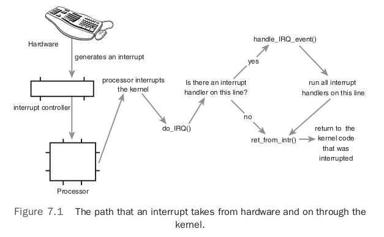

# Chapter 7: Interrupts and Interrupt Handlers

## Interrupts

Interrupts enable hardware to signal to the processor. Hardware devices generate Interrupts asynchronously. Different devices can be associated with different interrupts by means of a unique value associated with each interrupt. These interrupt values are often called `interrupt request (IRQ)` lines. Each IRQ line is assigned a numeric value.

Simple definitions of the interrupts and exceptions:

- `Interrupts`: asynchronous interrupts generated by hardware.
- `Exceptions`: synchronous interrupts generated by the processor.

## Interrupt Handlers

The function the kernel runs in response to a specific interrupt is called an `interrupt handler` or `interrupt service routine (ISR)`. Each device that generates interrupts has an associated interrupt handler. The interrupt handler for a device is part of the device’s driver.

What differentiates interrupt handlers from other kernel functions is that the kernel invokes them in response to interrupts and that they run in a special context called `interrupt context`.

## Top Halves Versus Bottom Halves

The processing of interrupts is split into two halves:

- `top half`: The interrupt handler is the `top half`. The top half is run immediately upon receipt of the interrupt and performs only the work that is time-critical.
- `bottom half`: Work that can be performed later is deferred until the `bottom half`. The bottom half runs in the future, at a more convenient time, with all interrupts enabled.

## Registering an Interrupt Handler

Drivers can register an interrupt handler and enable a given interrupt line for handling with the function `request_irq()`, which is declared in `<linux/interrupt.h>`:

```c
/* request_irq: allocate a given interrupt line */
int request_irq(unsigned int irq,
                irq_handler_t handler,
                unsigned long flags,
                const char *name,
                void *dev)
```

The first parameter, `irq`, specifies the interrupt number to allocate. The second parameter, `handler`, is a function pointer to the actual interrupt handler that services this interrupt. This function is invoked whenever the operating system receives the interrupt.

```c
typedef irqreturn_t (*irq_handler_t)(int, void *);
```

Note the specific prototype of the handler function: It takes two parameters and has a return value of `irqreturn_t`.

### Interrupt Handler Flags

The third parameter, `flags`, can be either zero or a bit mask of one or more of the flags defined in `<linux/interrupt.h>`. The most important of these flags are:

- `IRQF_DISABLED`: When set, this flag instructs the kernel to disable all interrupts when executing this interrupt handler. When unset, interrupt handlers run with all interrupts except their own enabled. Most interrupt handlers do not set this flag, as disabling all interrupts is bad form. Its use is reserved for performance-sensitive interrupts that execute quickly. This flag is the current manifestation of the `SA_INTERRUPT` flag, which in the past distinguished between "fast" and "slow" interrupts.
- `IRQF_SAMPLE_RANDOM`: This flag specifies that interrupts generated by this device should contribute to the kernel entropy pool. The kernel entropy pool provides truly random numbers derived from various random events. If this flag is specified, the timing of interrupts from this device are fed to the pool as entropy. Do not set this if your device issues interrupts at a predictable rate (e.g. the system timer) or can be influenced by external attackers (e.g. a networking device). On the other hand, most other hardware generates interrupts at nondeterministic times and is therefore a good source of entropy.
- `IRQF_TIMER`: This flag specifies that this handler processes interrupts for the system timer.
- `IRQF_SHARED`: This flag specifies that the interrupt line can be shared among multiple interrupt handlers. Each handler registered on a given line must specify this flag; otherwise, only one handler can exist per line.

The fourth parameter, `name`, is name of the device associated with the interrupt. These text names are used by `/proc/irq` and `/proc/interrupts`.

The fifth parameter, `dev`, is used for shared interrupt lines. When an interrupt handler is freed, `dev` provides a unique cookie to enable the removal of only the desired interrupt handler from the interrupt line. Without this parameter, it would be impossible for the kernel to know which handler to remove on a given interrupt line. You can pass `NULL` here if the line is not shared, but you must pass a unique cookie if your interrupt line is shared. This pointer is also passed into the interrupt handler on each invocation. A common practice is to pass the driver's device structure. This pointer is unique and might be useful to have within the handlers.

`request_irq()` returns zero on success and nonzero value indicates an error, in which case the specified interrupt handler was not registered. A common error is `-EBUSY`, which denotes that the given interrupt line is already in use.

Note that `request_irq()` can sleep and therefore cannot be called from interrupt context or other situations where code cannot block. On registration, an entry corresponding to the interrupt is created in `/proc/irq`.The function `proc_mkdir()` creates new procfs entries.This function calls `proc_create()` to set up the new procfs entries, which in turn calls `kmalloc()` to allocate memory.

### Freeing an Interrupt Handler

When your driver unloads, you need to unregister your interrupt handler and potentially disable the interrupt line.

```c
void free_irq(unsigned int irq, void *dev)
```

If the specified interrupt line is not shared, this function removes the handler and disables the line. If the interrupt line is shared, the handler identified via dev is removed, but the interrupt line is disabled only when the last handler is removed. With shared interrupt lines, a unique cookie is required to differentiate between the multiple handlers that can exist on a single line and enable `free_irq()` to remove only the correct handler. In either case, if dev is non-NULL, it must match the desired handler. A call to `free_irq()` must be made from process context.

Function | Description
-------- | -----------
request_irq() | Register a given interrupt handler on a given interrupt line.
free_irq() | Unregister a given interrupt handler; if no handlers remain on the line, the given interrupt line is disabled.

## Writing an Interrupt Handler

```c
static irqreturn_t intr_handler(int irq, void *dev)
```

Note that this declaration matches the prototype of the handler argument given to `request_irq()`. The first parameter, `irq`, is the numeric value of the interrupt line the handler is servicing. The second parameter, `dev`, is a generic pointer to the same `dev` that was given to `request_irq()` when the interrupt handler was registered. If this value is unique, it can act as a cookie to differentiate between multiple devices potentially using the same interrupt handler.

The return value of an interrupt handler is the special type `irqreturn_t`, which has two special values:

- `IRQ_NONE`: returned when the interrupt handler detects an interrupt for which its device was not the originator.
- `IRQ_HANDLED`: returned if the interrupt handler was correctly invoked, and its device caused the interrupt.

Alternatively, `IRQ_RETVAL(val)` may be used. If `val` is nonzero, this macro returns `IRQ_HANDLED`. Otherwise, the macro returns `IRQ_NONE`.

These special values are used to let the kernel know whether devices are issuing spurious (unrequested) interrupts. If all the interrupt handlers on a given interrupt line return `IRQ_NONE`, then the kernel can detect the problem.

The return type `irqreturn_t` which is simply an `int`. The interrupt handler is normally `static` because it is never called directly from another file.

### Shared Handlers

A shared handler is similar to a nonshared handler, but has three main differences:

- The `IRQF_SHARED` flag must be set in the flags argument to `request_irq()`.
- The `dev` argument must be unique to each registered handler. A pointer to any per-device structure is sufficient; a common choice is the `device` structure as it is both unique and potentially useful to the handler. It cannot be `NULL` for a shared handler.
- The interrupt handler must be capable of distinguishing whether its device actually generated an interrupt, which requires both hardware support and associated logic in the interrupt handler; otherwise the interrupt handler would not know whether its associated device or some other device sharing the line caused the interrupt.

The call to `request_irq()` with `IRQF_SHARED` specified can succeed only if:

- The interrupt line is currently not registered.
- or, All registered handlers on the line also specified `IRQF_SHARED`. Shared handlers, however, can mix usage of `IRQF_DISABLED`.

When the kernel receives an interrupt, it invokes sequentially each registered handler on the line. Therefore, it is important that the handler be capable of distinguishing whether it generated a given interrupt. The handler must quickly exit if its associated device did not generate the interrupt. This requires the hardware device to have a status register (or similar mechanism) that the handler can check.

## Interrupt Context

When executing an interrupt handler, the kernel is in `interrupt context`. Interrupt context cannot sleep, and you cannot call certain functions from interrupt context.

The interrupt handler has interrupted other code, so interrupt context is time-critical.

The setup of an interrupt handler’s stacks is a configuration option.

## Implementing Interrupt Handlers



A device issues an interrupt by sending an electric signal over its bus to the interrupt controller. If the interrupt line is enabled, the interrupt controller sends the interrupt to the processor. Unless interrupts are disabled in the processor, the processor immediately stops what it is doing, disables the interrupt system, and jumps to a predefined location in memory and executes the code located there. This predefined point is set up by the kernel and is the entry point for interrupt handlers.

The interrupt’s journey in the kernel begins at this predefined entry point. For each interrupt line, the processor jumps to a unique location in memory and executes the code located there. In this manner, the kernel knows the IRQ number of the incoming interrupt. The initial entry point simply saves this value and stores the current register values on the stack; then the kernel calls `do_IRQ()`.

The `do_IRQ()` function is declared as:

```c
unsigned int do_IRQ(struct pt_regs regs)
```

After the interrupt line is calculated, `do_IRQ()` acknowledges the receipt of the interrupt and disables interrupt delivery on the line. These operations are handled by `mask_and_ack_8259A()`. Next, `do_IRQ()` ensures that a valid handler is registered on the line and that it is enabled and not currently executing. If so, it calls `handle_IRQ_event()`, defined in `kernel/irq/handler.c`, to run the installed interrupt handlers for the line.

```c
/**
 * handle_IRQ_event - irq action chain handler
 * @irq:	the interrupt number
 * @action:	the interrupt action chain for this irq
 *
 * Handles the action chain of an irq event
 */
irqreturn_t handle_IRQ_event(unsigned int irq, struct irqaction *action)
{
	irqreturn_t ret, retval = IRQ_NONE;
	unsigned int status = 0;

	if (!(action->flags & IRQF_DISABLED))
		local_irq_enable_in_hardirq();

	do {
		trace_irq_handler_entry(irq, action);
		ret = action->handler(irq, action->dev_id);
		trace_irq_handler_exit(irq, action, ret);

		switch (ret) {
		case IRQ_WAKE_THREAD:
			/*
			 * Set result to handled so the spurious check
			 * does not trigger.
			 */
			ret = IRQ_HANDLED;

			/*
			 * Catch drivers which return WAKE_THREAD but
			 * did not set up a thread function
			 */
			if (unlikely(!action->thread_fn)) {
				warn_no_thread(irq, action);
				break;
			}

			/*
			 * Wake up the handler thread for this
			 * action. In case the thread crashed and was
			 * killed we just pretend that we handled the
			 * interrupt. The hardirq handler above has
			 * disabled the device interrupt, so no irq
			 * storm is lurking.
			 */
			if (likely(!test_bit(IRQTF_DIED,
					     &action->thread_flags))) {
				set_bit(IRQTF_RUNTHREAD, &action->thread_flags);
				wake_up_process(action->thread);
			}

			/* Fall through to add to randomness */
		case IRQ_HANDLED:
			status |= action->flags;
			break;

		default:
			break;
		}

		retval |= ret;
		action = action->next;
	} while (action);

	if (status & IRQF_SAMPLE_RANDOM)
		add_interrupt_randomness(irq);
	local_irq_disable();

	return retval;
}
```

1. Since the processor disabled interrupts, they are turned back on if `IRQF_DISABLED` was not specified during the handler's registration.
2. Each potential handler is executed in a loop. If this line is not shared, the loop terminates after the first iteration. Otherwise, all handlers are executed.
3. `add_interrupt_randomness()` is called if `IRQF_SAMPLE_RANDOM` was specified during registration. This function uses the timing of the interrupt to generate entropy for the random number generator.
4. Interrupts are again disabled (`do_IRQ()` expects them still to be disabled) and the function returns.

Back in `do_IRQ()`, the function cleans up and returns to the initial entry point, which then jumps to `ret_from_intr()`.

The routine `ret_from_intr()` is written in assembly. This routine checks whether a reschedule is pending. If a reschedule is pending, and the kernel is returning to user-space, `schedule()` is called. If the kernel is returning to kernel-space, `schedule()` is called only if the `preempt_count` is zero. Otherwise it is not safe to preempt the kernel. After `schedule()` returns, or if there is no work pending, the initial registers are restored and the kernel resumes whatever was interrupted.

## /proc/interrupts

Procfs is a virtual filesystem that exists only in kernel memory and is typically mounted at `/proc`. Reading or writing files in procfs invokes kernel functions that simulate reading or writing from a real file. The `/proc/interrupts` file is populated with statistics related to interrupts on the system.

```text
CPU0
0:    3602371  XT-PIC  timer
1:    3048     XT-PIC  i8042
2:    0        XT-PIC  cascade
4:    2689466  XT-PIC  uhci-hcd,  eth0
5:    0        XT-PIC  EMU10K1
12:   85077    XT-PIC  uhci-hcd
15:   24571    XT-PIC  aic7xxx
NMI:  0
LOC:  3602236
ERR:  0
```

The first column is the interrupt line. The second column is a counter of the number of interrupts received. The third column is the interrupt controller handling this interrupt. The last column is the device associated with this interrupt.

## Interrupt Control

Reasons to control the interrupt system generally boil down to needing to provide synchronization. By disabling interrupts, you can guarantee that an interrupt handler will not preempt your current code or disables kernel preemption. since it can't provide any protection from concurrent access from another processor, kernel code more generally needs to obtain some sort of lock to prevent another processor from accessing shared data simultaneously. These locks are often obtained in conjunction with disabling local interrupts.

### Disabling and Enabling Interrupts

```c
local_irq_disable();
/* interrupts are disabled .. */
local_irq_enable();
```

However, a common concern is a to restore interrupts to a previous state. It is much safer to save the state of the interrupt system before disabling it. Then, when you are ready to reenable interrupts, you simply restore them to their original state:

```c
unsigned long flags;
local_irq_save(flags); /* interrupts are now disabled */
/* ... */
local_irq_restore(flags); /* interrupts are restored to their previous state */
```

### Disabling a Specific Interrupt Line

In some cases, it is useful to disable only a specific interrupt line for the entire system. This is called masking out an interrupt line.

To disable delivery of a devices' interrupts before manipulating its state, Linux provides four interfaces for this task:

```c
void disable_irq(unsigned int irq);
void disable_irq_nosync(unsigned int irq);
void enable_irq(unsigned int irq);
void synchronize_irq(unsigned int irq);
```

The first two functions disable a given interrupt line in the interrupt controller. This disables delivery of the given interrupt to all processors in the system. Additionally, the `disable_irq()` function does not return until any currently executing handler completes. Thus, callers are assured not only that new interrupts will not be delivered on the given line, but also that any already executing handlers have exited. The function `disable_irq_nosync()` does not wait for current handlers to complete.

The function `synchronize_irq()` waits for a specific interrupt handler to exit, if it is executing, before returning.

For each call to `disable_irq()` or `disable_irq_nosync()` on a given interrupt line, a corresponding call to `enable_irq()` is required. Only on the last call to `enable_irq()` is the interrupt line actually enabled.

### Status of the Interrupt System

The macro `irqs_disabled()`, defined in `<asm/system.h>`, returns nonzero if the interrupt system on the local processor is disabled. Otherwise, it returns zero.

Two macros, defined in `<linux/hardirq.h>`, provide an interface to check the kernel’s current context:

```c
in_interrupt()
in_irq()
```

The first function `in_interrupt()` returns nonzero if the kernel is performing any type of interrupt handling, including either executing an interrupt handler or a bottom half handler. The macro `in_irq()` returns nonzero only if the kernel is specifically executing an interrupt handler.

Function | Description
-------- | -----------
local_irq_disable() | Disables local interrupt delivery
local_irq_enable() | Enables local interrupt delivery
local_irq_save() | Saves the current state of local interrupt delivery and then disables it
local_irq_restore() | Restores local interrupt delivery to the given state
disable_irq() | Disables the given interrupt line and ensures no handler on the line is executing before returning
disable_irq_nosync() | Disables the given interrupt line
enable_irq() | Enables the given interrupt line
irqs_disabled() | Returns nonzero if local interrupt delivery is disabled; otherwise returns zero
in_interrupt() | Returns nonzero if in interrupt context and zero if in process context
in_irq() | Returns nonzero if currently executing an interrupt handler and zero otherwise
