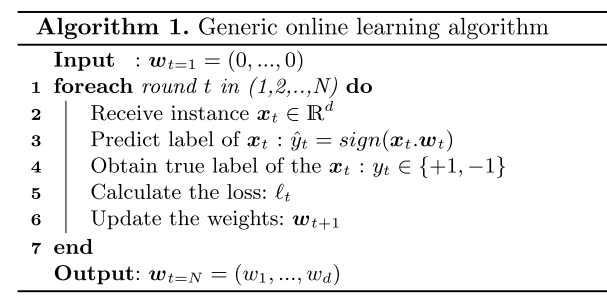
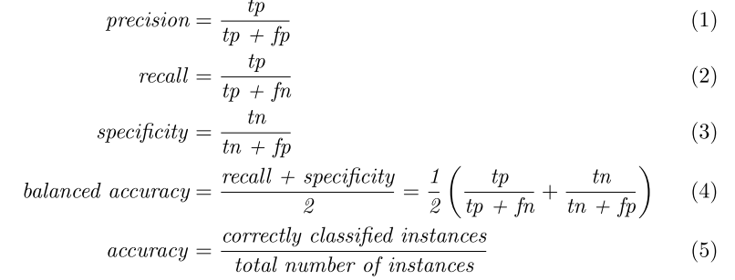
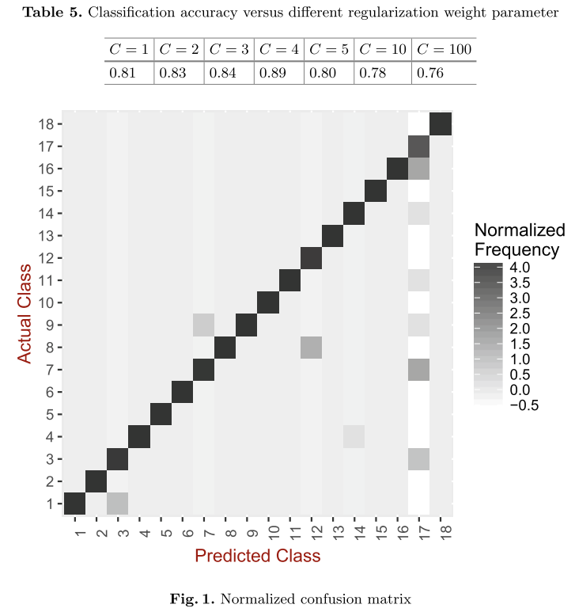

# Android Malware Classification by Applying Online Machine Learning

[Pektaş A, Çavdar M, Acarman T. Android Malware Classification by Applying Online Machine Learning[C]//International Symposium on Computer and Information Sciences. Springer International Publishing, 2016: 72-80.](https://link.springer.com/chapter/10.1007/978-3-319-47217-1_8/fulltext.html)

## What is your take-away message from this paper?
The results of this study indicate that runtime behavior modeling is a useful approach for classifying an android malware.

## What are motivations for this work?
### Malware
Malware authors deliver this large variety and volume of malicious software by using advanced obfuscation techniques. A malware may evolve and continue to hide its malicious activies against security systems.

### Idea
Knowing malware features a priori and classification of a malware plays a crucial role at defending the safety and liability critical user’s information.

## What is the proposed solution?
> In this paper, we study android malware activities, features and apply online machine learning algorithm to classify a new android malware. We extract a fairly adequate set of malware features and we evaluate a machine learning based classificationmethod. The run- time model is built and it can be implemented to detect variants of an android malware.

### Prepare
The authors obtained malwares from [VirusShare](https://virusshare.com/) and labeled malware samples using [Virustotal](https://virustotal.com/). Then they extracted the most significant and distinguishing behavioral features form the [Cuckoo](https://www.cuckoosandbox.org/)'s analysis report.

### Algorithm

## What is the work's evaluation of the proposed solution?
The analysis with 5 guest machines took 5 days to analyze approximately 2000 samples.

The following class-specific metrics are used:

The accuracy of testing is computed subject to different value of regularization weight parameter. To analyze how well the classifier can recognize instance of different classes,
we created the confusion matrix:

## What is your analysis of the identified problem, idea and evaluation?
The model becomes more dependent to the training set and more susceptible to noise data.

## What are the contributons?
This paper addresses the challenge of classifying android malware samples by using runtime artifacts while being robust to obfuscation.

## What are future directions for this research?
## What questions are you left with?
How to select more sutible testing dataset?
