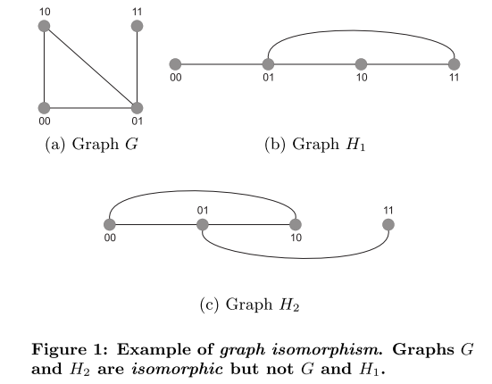
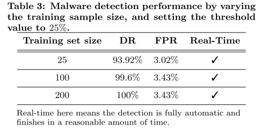

# MAIL: Malware Analysis Intermediate Language: a step towards automating and optimizing malware detection

[Alam S, Horspool R N, Traore I. MAIL: Malware Analysis Intermediate Language: a step towards automating and optimizing malware detection[C]//Proceedings of the 6th International Conference on Security of Information and Networks. ACM, 2013: 233-240.](http://www.uvic.ca/engineering/ece/isot/assets/docs/alam-paper-sin-2013.pdf)

## What are motivations for this work?
### Malware
Dynamic binary obfuscation or metamorphism is a technique where a malware never keeps the same sequence of opcodes in the memory. (such as *instruction reordering*, *deadcode insertion*, and *register renaming*) Such malware are very difficult to analyse and detect manually even with the help of tools.

### Methods
To analyzer the behavior of a program and make a better detection decision with few false positives. One approach consists of translating the program into an intermediate language that provides an platform-unrelated abstract format.

## What is the proposed solution?
>We propose, in this paper, a new intermediate language named MAIL (Malware Analysis Intermediate Language) for malware analysis that can enhance the detection ofmetamorphic malware.

### MAIL
The basic purpose of MAIL is to represent structural and behavioral information of an assembly program. Details about the language are given in [MAIL ](http://web.uvic.ca/~salam/PhD/TR-MAIL.pdf).

### Malware Analysis Using MAIL
we expalin in detail with examples of translating a x86 and an ARM assembly program into a MAIL program. The MAIL program is then annotated with patterns. We then build a CFG of the annotated MAIL program. This annotated CFG becomes part of the signature of the program and is matched against a database of known malware samples to see if the program contains a malware or not.

## What is the work's evaluation of the proposed solution?
### Dataset
>The dataset used for the experiments consisted of total 1387 sample Windows programs collected from two different resources. Out of the 1387 programs, 250 are metamorphic malware samples, and the other 1137 are benign programs.

The evaluation was carried out using 10-fold cross validation, and prototype implementation of our detector named MARD.

## What is your analysis of the identified problem, idea and evaluation?
- MAIL is designed to perform static binary analysis and is not suitable for performing dynamic binary analysis.
- If the patterns are used alone, it may not produce the desired results.

## What are the contributons?
1. Providing platform independence and automation for malware analysis and detection  tools, as is shown by its use in the tool MARD.
2. Optimizing the creation of a behavioral signature of a program, as is shown by creating a ACFG, a CFG with patterns, of a binary program. We have shown how this ACFG is used for reliable malware analysis and detection in real-time.

## What are future directions for this research?
Optimizing the tool to increase its accuracy and efficiency for detecting unknown metamorphic malware.

## What questions are you left with?
## What is your take-away message from this paper?
The paper developed MAIL as a new intermediate language, and shown through experimental evaluation its effectiveness in malware analysis and detection.
