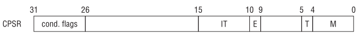
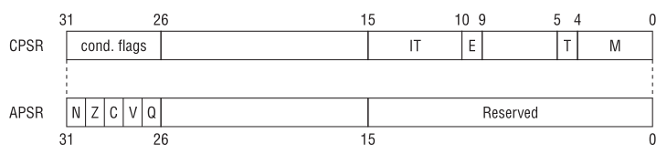
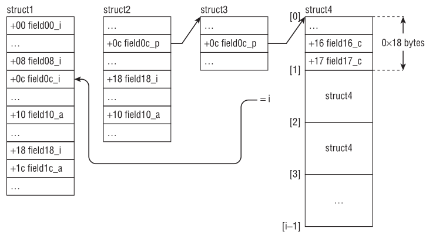
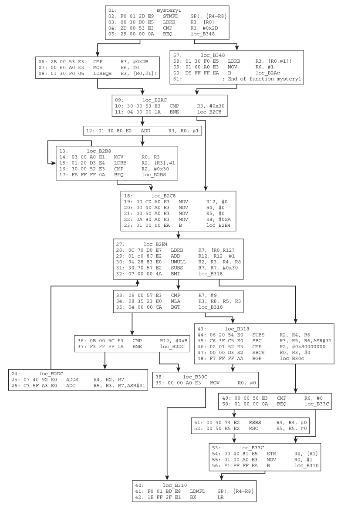
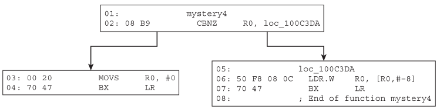
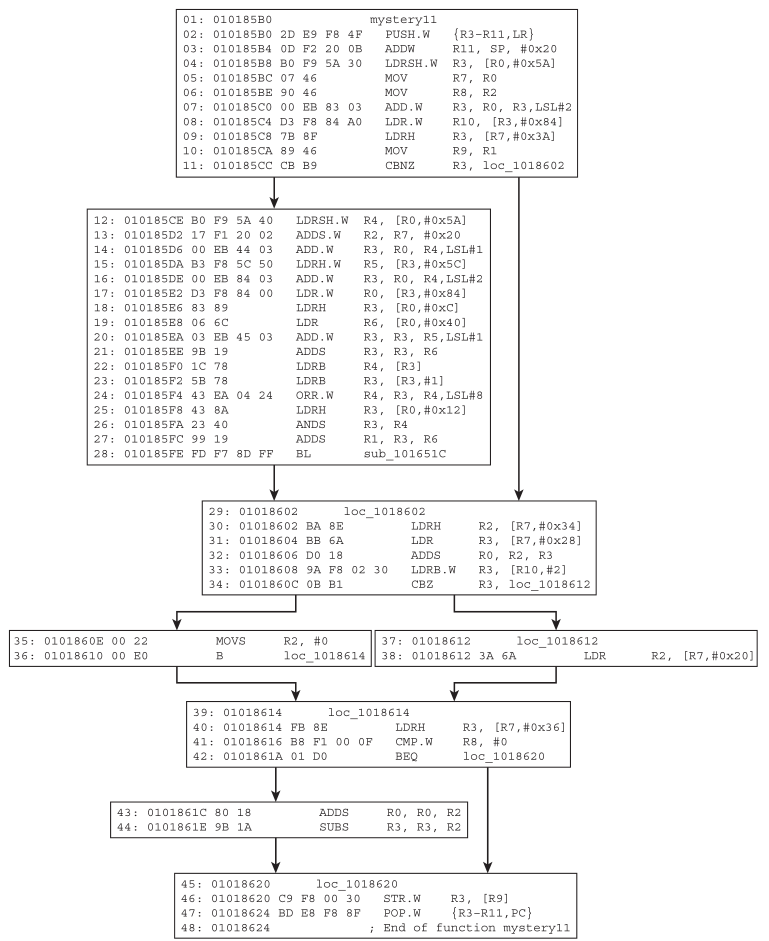

# Reverse Engineering Learning: ARM

*This artical is a note of the book called Practical Reverse Engineering*

## Basic Features
Because ARM is a RISC architecture, there are a few basic differences between ARM and CISC architectures (x86/x64). First, the ARM instruction set is very small compared to x86, but it offers more general-purpose registers. Second, the instruction length is fixed width (16 bits or 32 bits, depending on the state). Third, ARM uses a load-store model for memory access. This means data must be moved from memory into registers before being operated on, and only load/store instructions can access memory. On ARM, this translates to the `LDR` and `STR` instructions.

ARM also offers several different privilege levels to implement privilege isolation. In x86, privileges are defined by four rings, with ring 0 having the highest privilege and ring 3 having the lowest. In ARM, privileges are defined by eight different modes:
- USR (user)
- FIQ (fast interrupt request)
- IRQ (interrupt request)
- SVC (supervisor)
- MON (monitor)
- ABT (about)
- UND (undefined)
- SYS (system)

Code running in a given mode has access to certain privileges and registers that others may not; for example, code running in USR mode is not allowed to modify system registers (which are typically modifi ed only in SVC mode). USR is the least privileged mode. While there are many technical differences, for the sake of simplicity you can make the analogy that USR is like ring 3 and SVC is like ring 0. Most operating systems implement kernel mode in SVC and
user mode in USR.

ARM processors can operate in two states: ARM and Thumb. ARM/Thumb state determines only the instruction set, not the privilege level. Which state the processor executes in depends on two conditions:
1. When branching with the `BX` and `BLX` instruction, if the destination register's least significant bit is 1, then it will switch to Thumb state. (Although instructions are either 2- or 4-byte aligned, the processor will ignore the least significant bit so there won't be alignment issues.)
2. If the `T` bit in the current program status register (`CPSR`) is set, then it is in Thumb mode. The `CPSR` is just like an extended `EFLAGS` register in x86.

When an ARM core boots up, most of the time it enters ARM state and remains that way until there is an explicit or implicit change to Thumb.

ARM also supports conditional execution. This means that an instruction encodes certain arithmetic conditions that must be met in order for it to be executed. For example, an instruction can specify that it will only be executed if the result of the previous instruction is zero. All instructions in ARM state support conditional execution, but by default they execute unconditionally. In Thumb state, a special instruction `IT` is required to enable conditional execution.

Another unique ARM feature is the barrel shifter. Certain instructions can "contain" another arithmetic instruction that shifts or rotates a register. This is useful because it can shrink multiple instructions into one; for example, you want to multiply a register by 2 and then store the result in another register. Normally, this would require two instructions (a multiply followed by a move), but with the barrel shifter you can include the multiply (shift left by 1) inside the MOV instruction. The instruction would be something like the following:
```text
MOV R1, R0, LSL #1          ; R1 = R0 * 2
```

## Data Types and Register
ARM supports operations on different data types: 8-bit (byte), 16-bit (half-word), 32-bit (word), and 64-bit (double-word).

The ARM architecture defines sixteen 32-bit general-purpose registers, numbered `R0`~`R15`. While all of them are available to the application programmer, in practice the first 12 registers are for general-purpose usage (such as `EAX`, `EBX`, etc., in x86) and the last three have special meaning in the architecture:
- `R13` is denoted as the stack pointer (SP). It is the equivalent of `ESP/RSP` in x86/x64. It points to the top of the program stack.
- `R14` is denoted as the link register (LR). It normally holds the return address during a function call. Certain instructions implicitly use this register. For example, `BL` always stores the return address in LR before branching to the destination. x86/x64 does not have an equivalent register because it always stores the return address on the stack. In code that does not use LR to store the return address, it can be used as a general-purpose register.
- `R15` is denoted as the program counter (PC). When executing in ARM state, PC is the address of the current instruction plus 8 (two ARM instructions ahead); in Thumb state, it is the address of the current instruction plus 4 (two 16-bit Thumb instructions ahead). It is analogous to EIP/RIP in x86/x64 except that they always point to the address of the next instruction to be executed. Another major difference is that code can directly read from and write to the PC register. Writing an address to PC will immediately cause execution to start at that address. Consider the following snippet in Thumb state:
```text
1: 0x00008344 push      {lr}
2: 0x00008346 mov       r0, pc
3: 0x00008348 mov.w     r2, r1, lsl #31
4: 0x0000834c pop       {pc}
```
After line 2 is executed, `R0` will hold the value `0x0000834a (=0x00008346+4)`.

Similar to other architectures, ARM stores information about the current execution state in the current program status register (`CPSR`). From an application programmer's perspective, `CPSR` is similar to the `EFLAGS/RFLAG` register in x86/x64. Some documentation may discuss the application program status register (`APSR`), which is an alias for certain fields in the `CPSR`. There are many flags in the `CPSR`, some of which are illustrated here:
- `E` (Endianness bit)—ARM can operate in either big or little endian mode. This bit is set to 0 or 1 for little or big endian, respectively. Most of the time, little endian is used, so this bit will be 0.
- `T` (Thumb bit)—This is set if you are in Thumb state; otherwise, it is ARM state. One way to explicitly transition from Thumb to ARM (and vice versa) is to modify this bit.
- `M` (Mode bits)—These bits specify the current privilege mode (USR, SVC, etc.)




## System-Level Controls and Settings
ARM offers the concept of coprocessors to support additional instructions and system-level settings. For example, if the system supports a memory management unit (MMU), then its settings must be exposed to boot or kernel code. On x86/x64, these settings are stored in `CR0` and `CR4`; on ARM, they are stored in coprocessor 15. There are 16 coprocessors in the ARM architecture, each identified by a number: `CP0`~`CP15`. (When used in code, these are referred to as `P0`~`P15`.) The first 13 are either optional or reserved by ARM; the optional ones can be used by manufacturers to implement manufacturer-specific instructions or features. For example, `CP10` and `CP11` are usually used for floating-point and NEON support. Each coprocessor contains additional "opcodes" and registers that can be controlled through special ARM instructions. `CP14` and `CP15` are used for debug and system settings;  CP15 , usually known as the system control coprocessor, stores most of the system settings (caching, paging, exceptions, and so forth).

Each coprocessor has 16 registers and eight corresponding opcodes. The semantic of these registers and opcodes is specific to the coprocessor. Accessing coprocessors can only be done through the `MRC` (read) and `MCR` (write) instructions; they take a coprocessor number, register number, and opcodes. For example, to read the translation base register (similar to `CR3` in x86/x64) and save it in `R0`, you use the following:
```text
MRC p15, 0, r0, c2, c0, 0           ; save TTBR in r0
```
This says, "read coprocessor 15's C2/C0 register using opcode 0/0 and store the result in the general-purpose register `R0`." Some registers (C13/C0) are reserved for operating systems in order to store process- or thread-specific data.

While the `MRC` and `MCR` instructions do not require high privilege (i.e., they can be executed in USR mode), some of the coprocessor registers and opcodes are only accessible in SVC mode. Attempts to read certain registers without sufficient privilege will result in an exception. In practice, you will infrequently see these instructions in user-mode code; they are commonly found in very low-level code such as ROM, boot loaders, firmware, or kernel-mode code.


## Introduction to the Instruction Set
Besides conditional execution and barrel shifters, there are several other peculiarities about the instructions that are not found in x86. First, some instructions can operate on a range of registers in sequence. For example, to store five registers, R6~R10 , at a particular memory location referenced by `R1`, you would write `STM R1, {R6-R10}`. `R6` would be stored at memory address `R1`, `R7` at `R1+4`, `R8` at `R1+8`, and so on. Nonconsecutive registers can also be specifi ed via comma separation (e.g.,  `{R1,R5,R8}`). In ARM assembly syntax, the register ranges are usually specified inside curly brackets. Second, some instructions can optionally update the base register after a read/write operation. This is usually done by affixing an exclamation mark (`!`) after the register name. For example, if you were to rewrite the previous instruction as `STM R1!, {R6-R10}` and execute it, then `R1` will be updated with the address immediately after where `R10` was stored. To make it clearer, here is an example:
```text
01: (gdb) disas main
02: Dump of assembler code for function main:
03: =>  0x00008344 <+0>:  mov    r6, #10
04:     0x00008348 <+4>:  mov    r7,  #11
05:     0x0000834c <+8>:  mov    r8,  #12
06:     0x00008350 <+12>: mov    r9,  #13
07:     0x00008354 <+16>: mov    r10, #14
08:     0x00008358 <+20>: stmia  sp!, {r6, r7, r8, r9, r10}
09:     0x0000835c <+24>: bx     lr
10: End of assembler dump.
11: (gdb) si
12: 0x00008348 in main ()
13: ...
14: 0x00008358 in main ()
15: (gdb) info reg sp
16: sp      0xbedf5848      0xbedf5848
17: (gdb) si
18: 0x0000835c in main ()
19: (gdb) info reg sp
20: sp      0xbedf585c      0xbedf585c
21: (gdb) x/6x 0xbedf5848
22: 0xbedf5848:     0x0000000a      0x0000000b      0x0000000c
0x0000000d
23: 0xbedf5858:     0x0000000e      0x00000000
```
Line 15 displays the value of SP (`0xbedf5848`) before executing the `STM` instruction; lines 17 and 19 execute the `STM` instruction and display the updated value of SP. Line 21 dumps six words starting at the old value of SP. Note that `R6` was stored at the old SP, `R7` at SP+0x4, `R8` at SP+0x8, `R9` at SP+0xc, and `R10` at SP+0x10. The new SP (`0xbedf585c`) is immediately after where  R10 was stored.


## Loading and Storing Data
We know that ARM is a load-store architecture, which means that data must be loaded into registers before it can be operated on. The only instructions that can touch memory are load and store; all other instructions can operate only on registers. To load means to read data from memory and save it in a register; to store means to write the content of a register to a memory location. On ARM, the load/store instructions are `LDR/STR`, `LDM/STM`, and `PUSH/POP`.

### LDR and STR
These instructions can load and store 1, 2, or 4 bytes to and from memory. Their
full syntax is somewhat complicated because there are several different ways
to specify the offset and side effects for updating the base register. Consider
the simplest case:
```text
01: 03 68   LDR     R3, [R0] ; R3 = *R0
02: 23 60   STR     R3, [R4] ; *R4 = R3;
```
For the instruction in line 1, `R0` is the base register and `R3` is the destination; it loads the word value at address `R0` into `R3`. In line 2, `R4` is the base register and `R3` is the destination; it takes the value in `R3` and stores at the memory address `R4`. This example is simple because the memory address is specified by the base register.

At a fundamental level, the `LDR/STR` instructions take a base register and an offset; there are three offset forms and three addressing modes for each form. We begin by discussing the offset forms: immediate, register, and scaled register.

The first offset form uses an immediate as the offset. An immediate is simply an integer. It is added to or subtracted from the base register to access data at an offset known at compile time. The most common usage is to access a particular field in a structure or vtable. The general format is as follows:
```text
STR Ra, [Rb, imm]
LDR Ra, [Rc, imm]
```
`Rb` is the base register, and `imm` is the offset to be added to `Rb`.

For example, suppose that `R0` holds a pointer to a `KDPC` structure and the following code:
```text
// Structure Definition

0:000> dt ntkrnlmp!_KDPC
    +0x000 Type             : UChar
    +0x001 Importance       : UChar
    +0x002 Number           : Uint2B
    +0x004 DpcListEntry     : _LIST_ENTRY
    +0x00c DeferredRoutine  : Ptr32 void
    +0x010 DeferredContext  : Ptr32 Void
    +0x014 SystemArgument1  : Ptr32 Void
    +0x018 SystemArgument2  : Ptr32 Void
    +0x01c DpcData          : Ptr32 Void
```
```text
// Code

01: 13 23       MOVS    R3, #0x13
02: 03 70       STRB    R3, [R0]
03: 01 23       MOVS    R3, #1
04: 43 70       STRB    R3, [R0,#1]
05: 00 23       MOVS    R3, #0
06: 43 80       STRH    R3, [R0,#2]
07: C3 61       STR     R3, [R0,#0x1C]
08: C1 60       STR     R1, [R0,#0xC]
09: 02 61       STR     R2, [R0,#0x10]
```
In this case, `R0` is the base register and the immediates are `0x1`, `0x2`, `0xC`, `0x10`, and `0x1C`. The snippet can be translated into C as follows:
```text
KDPC *obj = ...;            /* R0 is obj */
obj->Type = 0x13;
obj->Importance = 0x1;
obj->Number = 0x0;
obj->DpcData = NULL;
obj->DeferredRoutine = R1;  /* R1 is unknown to us */
obj->DeferredContext = R2;  /* R2 is unknown to us */
```
This offset form is similar to the `MOV Reg, [Reg + Imm]` on the x86/x64.

The second offset form uses a register as the offset. It is commonly used in code that needs to access an array but the index is computed at runtime. The general format is as follows:
```text
STR Ra, [Rb, Rc]
LDR Ra, [Rb, Rc]
```
Depending on the context, either `Rb` or `Rc` can be the base/offset. Consider the following two examples:
```text
// Example 1

01: 03 F0 F2 FA     BL strlen
02: 06 46           MOV R6, R0
; R0 is strlen's return value
03: ...
04: BB 57           LDRSB R3, [R7,R6]
; in this case, R6 is the offset
```
```text
// Example 2

01: B3 EB 05 08     SUBS.W  R8, R3, R5
02: 2F 78           LDRB    R7, [R5]
03: 18 F8 05 30     LDRB.W  R3, [R8,R5]
; here, R5 is the base and R8 is the offset
04: 9F 42           CMP     R7, R3
```
This is similar to the `MOV Reg, [Reg + Reg]` form on x86/x64.

The third offset form uses a scaled register as the offset. It is commonly used in a loop to iterate over an array. The barrel shifter is used to scale the offset. The general format is as follows:
```text
LDR Ra, [Rb, Rc, <shifter>]
STR Ra, [Rb, Rc, <shifter>]
```
`Rb` is the base register; `Rc` is an immediate; and `<shifter>` is the operation performed on the immediate-typically, a left/right shift to scale the immediate. For example:
```text
01: 0E 4B           LDR     R3, =KeNumberNodes
02: ...
03: 00 24           MOVS    R4, #0
04: 19 88           LDRH    R1, [R3]
05: 09 48           LDR     R0, =KeNodeBlock
06: 00 23           MOVS    R3, #0
07:               loop_start
08: 50 F8 23 20     LDR.W   R2, [R0,R3,LSL#2]
09: 00 23           MOVS    R3, #0
10: A2 F8 90 30     STRH.W  R3, [R2,#0x90]
11: 92 F8 89 30     LDRB.W  R3, [R2,#0x89]
12: 53 F0 02 03     ORRS.W  R3, R3, #2
13: 82 F8 89 30     STRB.W  R3, [R2,#0x89]
14: 63 1C           ADDS    R3, R4, #1
15: 9C B2           UXTH    R4, R3
16: 23 46           MOV     R3, R4
17: 8C 42           CMP     R4, R1
18: EF DB           BLT     loop_start
```
`KeNumberNodes` and `KeNodeBlock` are a global integer and an array of `KNODE` pointers, respectively.

Lines 1 and 5 simply load those globals into a register. Line 8 iterates over the `KeNodeBlock` array (`R0` is the base), `R3` is the index multiplied by 2 (because it is an array of pointers; pointers are 4 bytes in size on this platform). Lines 10~13 initialize some fields of the `KNODE` element. Line 14 increments the index. Line 17 compares the index against the size of the array (`R1` is the size; see line 4) and if it is less than the size then continues the loop.

This snippet can be roughly translated to C as follows:
```text
int KeNumberNodes = …;
KNODE *KeNodeBlock[KeNumberNodes] = …;
for (int i=0; i < KeNumberNodes; i++) {
    KeNodeBlock[i].x = …;
    KeNodeBlock[i].y = …;
    …
}
```
This is similar to the `MOV, Reg, [Reg + idx * scale]` form on x86/x64.

Having covered the three offset forms, the rest of this section discusses addressing modes: offset, pre-indexed, and post-indexed. The only distinction among them is whether the base register is modified and, if so, in what way. All the preceding offset examples use offset addressing mode, which means that the base register is never modified. This is the simplest and most common mode. You can quickly recognize it because it does not contain an exclamation mark (`!`) anywhere and the immediate is inside the square brackets. The general syntax for the offset mode is `LDR Rd, [Rn, offset]`.

Pre-indexed address mode means that the base register will be updated with the final memory address used in the reference operation. The semantic is very similar to the prefix form of the unary `++` and `--` operator in C. The syntax for this mode is `LDR Rd, [Rn, offset]!`. For example:
```text
12 F9 01 3D     LDRSB.W R3, [R2 ,#-1]! ; R3 = *(R2-1) ; R2 = R2-1
```
Post-indexed address mode means that the base register is used as the final address, then updated with the offset calculated. This is very similar to the postfix form of the unary `++` and `--` operator in C. The syntax for this mode is `LDR Rd, [Rn], offset`. For example:
```text
10 F9 01 6B     LDRSB.W R6, [R0],#1 ; R6 = *R0 ; R0 = R0+1
```
The pre- and post-index forms are normally observed in code that accesses an offset in the same buffer multiple times. For example, suppose the code needs to loop and check whether a character in a string matches one of five characters; the compiler may update the base pointer so that it can shave off an increment instruction.

Here's a tip to recognize and remember the different address modes in `LDR/STR`: If there is a `!`, then it is prefix; if the base register is in brackets by itself, then it is postfix; anything else is off set mode.

### Other Usage for LDR
As explained earlier, `LDR` is used to load data from memory into a register; however, sometimes you see it in these forms:
```text
01: DF F8 50 82     LDR.W   R8, =0x2932E00      ; LDR R8, [PC, x]
02: 80 4A           LDR     R2, =a04d           ; "%04d" ; LDR R2, [PC, y]
03: 0E 4B           LDR     R3, =__imp_realloc  ; LDR R3, [PC, z]
```
Clearly, this is not valid syntax according to the previous section. Technically, these are called pseudo-instructions and they are used by disassemblers to make manual inspection easier. Internally, they use the immediate form of `LDR` with PC as a base register; sometimes, this is called `PC-relative` addressing (or `RIP-relative addressing` on x64). ARM binaries usually have a literal pool that is a memory area in a section to store constants, strings, or offsets that others can reference in a position-independent manner. (The literal pool is part of the code, so it will be in the same section.) In the preceding snippet, the code is referencing a 32-bit constant, a string, and an offset to an imported function stored in the literal pool. This particular pseudo-instruction is useful because it allows a 32-bit constant to be moved into a register in one instruction. To make it clearer, consider the following snippet:
```text
01: .text:0100B134 35 4B    LDR     R3, =0x68DB8BAD
            ; actually LDR R3, [PC, #0xD4]
            ; at this point, PC = 0x0100B138
02: ...
03: .text:0100B20C AD 8B DB 68 dword_100B20C DCD 0x68DB8BAD
```
How did the disassembler shorten the first instruction from `LDR R3, [PC, #0xD4]` to the alternate form? Because the code is in Thumb state, PC is the current instruction plus 4, which is `0x0100B138`; it is using the immediate form of PC, so it is trying to read the word at `0x0100B20C (=0x100B138+0xD4`), which happens to be the constant we want to load. Another related instruction is `ADR`, which gets the address for a label/function and puts it in a register. For example:
```text
01: 00009390 65 A5          ADR     R5, dword_9528
02: 00009392 D5 E9 00 45    LDRD.W  R4, R5, [R5]
03: ...
04: 00009528 00 CE 22 A9+dword_9528 DCD 0xA922CE00 , 0xC0A4
```
This instruction is typically used to implement jump tables or callbacks where you need to pass the address of a function to another. Internally, this instruction just calculates an offset from PC and saves it in the destination register.

### LDM and STM
`LDM` and `STM` are similar to `LDR/STR` except that they load and store multiple words at a given base register. They are useful when moving multiple data blocks to and from memory. The general syntax is as follows:
```text
LDM<mode> Rn[!], {Rm}
STM<mode> Rn[!], {Rm}
```
`Rn` is the base register and it holds the memory address to load/store from; the optional exclamation mark (`!`) means that the base register should be updated with the new address (writeback). `Rm` is the range of register to load/store. There are four modes:
- `IA` (Increment After)--Store data starting at the memory location specified by the base address. If there is writeback, then the address 4 bytes above the last location is written back. This is the default mode if nothing is specified.
- `IB` (Increment Before)--Stores data starting at the memory location 4 bytes above the address. If there is writeback, then the address of the last location is written back.
- `DA` (Decrement After)--Stores data such that the last location is the base address. If there is writeback, then the address 4 bytes below the lowest location is written back.
- `DB` (Decrement Before)--Stores data such that the last location is 4 bytes below the base address. If there is writeback, then the address of the first location is written back.

This may sound a bit confusing at first, so let's walk through an example with the debugger:
```text
01: (gdb) br main
02: Breakpoint 1 at 0x8344
03: (gdb) disas main
04: Dump of assembler code for function main:
05:     0x00008344 <+0>:    ldr     r6, =mem         ; edited a bit
06:     0x00008348 <+4>:    mov     r0, #10
07:     0x0000834c <+8>:    mov     r1, #11
08:     0x00008350 <+12>:   mov     r2, #12
09:     0x00008354 <+16>:   ldm     r6, {r3, r4, r5} ; IA mode
10:     0x00008358 <+20>:   stm     r6, {r0, r1, r2} ; IA mode
11: ...
12: (gdb) r
13: Breakpoint 1, 0x00008344 in main ()
14: (gdb) si
15: 0x00008348 in main ()
16: (gdb) x/3x $r6
17: 0x1050c <mem>: 0x00000001  0x00000002  0x00000003
18: (gdb) si
19: 0x0000834c in main ()
20: ...
21: (gdb)
22: 0x00008358 in main ()
23: (gdb) info reg r3 r4 r5
24: r3      0x1     1
25: r4      0x2     2
26: r5      0x3     3
27: (gdb) si
28: 0x0000835c in main ()
29: (gdb) x/3x $r6
30: 0x1050c <mem>: 0x0000000a  0x0000000b  0x0000000c
```
Line 5 stores a memory address in `R6`; the content of this memory address (`0x1050c`) is three words (line 17). Lines 6~8 set `R0~R2` with some constants. Line 9 loads three words into `R3~R5`, starting at the memory location specified by `R6`. As shown in lines 24~26, `R3~R5` contain the expected value. Line 10 stores `R0~R2`, starting at the memory location specified by `R6`. Line 29 shows that the expected values were written.


Here’s the same experiment with writeback:
```text
01: (gdb) br main
02: Breakpoint 1 at 0x8344
03: (gdb) disas main
04: Dump of assembler code for function main:
05:     0x00008344 <+0>:    ldr     r6, =mem            ; edited a bit
06:     0x00008348 <+4>:    mov     r0, #10
07:     0x0000834c <+8>:    mov     r1, #11
08:     0x00008350 <+12>:   mov     r2, #12
09:     0x00008354 <+16>:   ldm     r6!, {r3, r4, r5}   ; IA mode w/ writeback
10:     0x00008358 <+20>:   stmia   r6!, {r0, r1, r2}   ; IA mode w/ writeback
11: ...
12: (gdb) r
13: Breakpoint 1, 0x00008344 in main ()
14: (gdb) si
15: 0x00008348 in main ()
16: ...
17: (gdb)
18: 0x00008354 in main ()
19: (gdb) x/3x $r6
20: 0x1050c <mem>: 0x00000001  0x00000002  0x00000003
21: (gdb) si
22: 0x00008358 in main ()
23: (gdb) info reg r6
24: r6 0x10518 66840
25: (gdb) si
26: 0x0000835c in main ()
27: (gdb) info reg $r6
28: r6 0x10524 66852
29: (gdb) x/4x $r6-12
30: 0x10518 : 0x0000000a  0x0000000b  0x0000000c
0x00000000
```
Line 9 uses `IA` mode with writeback, so the `r6` is updated with an address 4 bytes above the last location (line 23). The same can be observed in lines 10, 27, and 30.


Because `LDM` and `STM` can move multiple words at a time, they are typically used in block- copy or move operations. For example, they are sometimes used to inline `memcpy` when the copy length is known at compile time. They are similar to the `MOVS` instruction with the REP prefix on x86. Consider the following blobs of code generated by two different compilers from the same source file:
```text
// Compiler A

01: A4 46           MOV         R12, R4
02: 35 46           MOV         R5, R6
03: BC E8 0F 00     LDMIA.W     R12!, {R0-R3}
04: 0F C5           STMIA       R5!, {R0-R3}
05: BC E8 0F 00     LDMIA.W     R12!, {R0-R3}
06: 0F C5           STMIA       R5!, {R0-R3}
07: 9C E8 0F 00     LDMIA.W     R12, {R0-R3}
08: 85 E8 0F 00     STMIA.W     R5, {R0-R3}
```
```text
// Compiler B

01: 30 22           MOVS    R2, #0x30
02: 21 46           MOV     R1, R4
03: 30 46           MOV     R0, R6
04: 23 F0 17 FA     BL      memcpy
```
All this does is copy 48 bytes from one buffer to another; the first compiler uses LDM/STM with writebacks to load/store 16 bytes at a time, while the second simply calls into its implementation of `memcpy`. When reverse engineering code, you can spot the inlined `memcpy` form by recognizing that the same source and destination pointers are being used by LDM/STM with the same register set. This is a good trick to keep in mind because you will see it often.

Another common place where LDM/STM can be seen is at the beginning and end of functions in ARM state. In this context, they are used as the prologue and epilogue. For example:
```text
01: F0 4F 2D E9     STMFD   SP!, {R4-R11,LR}    ; save regs + return address
02: ...
03: F0 8F BD E8     LDMFD   SP!, {R4-R11,PC}    ; restore regs and return
```
`STMFD` and `LDMFD` are pseudo-instructions for `STMDB` and `LMDIA/LDM`, respectively.

You will often see the suffixes `FD`, `FA`, `ED`, or `EA` after `STM/LDM`. They are simply pseudo-instructions for the `LDM/STM` instructions in different modes (IA, IB, etc.). The association is `STMFD/STMDB`, `STMFA/STMIB`, `STMED/STMDA`, `STMEA/STMIA`, `LDMFD/LDMIA`, `LDMFA/LDMDA`, and `LDMEA/LDMDB`.

### PUSH and POP
The final set of load/store instructions is `PUSH` and `POP`. They are similar to `LDM/STM` except for two characteristics:
- They implicitly use SP as the base address.
- SP is automatically updated.
The stack grows downward to lower addresses as it does in the x86/x64 architecture. The general syntax is `PUSH/POP {Rn}`, where `Rn` can be a range of registers.

`PUSH` stores the registers on the stack such that the last location is 4 bytes below the current stack pointer, and updates SP with the address of the first location. `POP` loads the registers starting from the current stack pointer and updates SP with the address 4 bytes above the last location. `PUSH/POP` are actually the same as `STMDB/LDMIA` with writeback and SP as the base pointer. Here is a short walk-through demonstrating the instructions:
```text
01: (gdb) disas main
02: Dump of assembler code for function main:
03:     0x00008344 <+0>:    mov.w   r0, #10
04:     0x00008348 <+4>:    mov.w   r1, #11
05:     0x0000834c <+8>:    mov.w   r2, #12
06:     0x00008350 <+12>:   push    {r0, r1, r2}
07:     0x00008352 <+14>:   pop     {r3, r4, r5}
08: ...
09: (gdb) br main
10: Breakpoint 1 at 0x8344
11: (gdb) r
12: Breakpoint 1, 0x00008344 in main ()
13: (gdb) si
14: 0x00008348 in main ()
15: ...
16: (gdb)
17: 0x00008350 in main ()
18: (gdb) info reg sp       ; current stack pointer
19: sp  0xbee56848  0xbee56848
20: (gdb) si
21: 0x00008352 in main ()
22: (gdb) x/3x $sp          ; sp is updated after the push
23: 0xbee5683c: 0x0000000a  0x0000000b  0x0000000c
24: (gdb) si                ; pop into the registers
25: 0x00008354 in main ()
26: (gdb) info reg r3 r4 r5 ; new registers
27: r3      0xa  10
28: r4      0xb  11
29: r5      0xc  12
30: (gdb) info reg sp       ; new sp (4 bytes above the last location)
31: sp  0xbee56848  0xbee56848
32: (gdb) x/3x $sp-12
33: 0xbee5683c: 0x0000000a  0x0000000b  0x0000000c
```


The most common place for `PUSH/POP` is at the beginning and end of functions. In this context, they are used as the prologue and epilogue (like `STMFD/LDMFD` in ARM state). For example:
```text
01: 2D E9 F0 4F     PUSH.W  {R4-R11,LR} ; save registers + return address
02: ...
03: BD E8 F0 8F     POP.W   {R4-R11,PC} ; restore registers and return
```
Some disassemblers actually use this pattern as a heuristic to determine function boundaries.


## Functions and Function Invocation
Unlike x86/x64, which has only one instruction for function invocation (`CALL`) and branching (`JMP`), ARM offers several depending on how the destination is encoded. When you call a function, the processor needs to know where to resume execution after the function returns; this location is typically referred to as the `return address`. In x86, the `CALL` instruction implicitly pushes the return address on the stack before jumping to the target function; when it is done executing, the target function resumes execution at the return address by popping it off the stack into EIP.

The mechanism on ARM is essentially the same with a few minor differences. First, the return address can be stored on the stack or in the link register (LR); to resume execution after the call, the return address is explicitly popped off the stack into PC or there will be an unconditional branch to LR. Second, a branch can switch between ARM and Thumb state, depending on the destination address's LSB. Third, a standard calling convention is defined by ARM: The first four 32-bit parameters are passed via registers (`R0~R3`) and the rest are
on the stack. Return value is stored in `R0`.

The instructions used for function invocations are `B`, `BX`, `BL`, and `BLX`.

Although it is rare to see `B` used in the context of function invocation, it can be used for transfer of control. It is simply an unconditional branch and is identical to the `JMP` instruction in x86. It is normally used inside of loops and conditionals to go back to the beginning or break out; it can also be used to call a function that never returns. `B` can only use label offsets as its destination; it cannot use registers. In this context, the syntax of `B` is as follows: `B imm`, where `imm` is an offset relative from the current instruction. One important fact to note is that because ARM and Thumb instructions are 4- and 2-byte aligned, the target offset needs to be an even number. Here is a snippet showing the usage of `B`:
```text
01: 0001C788   B        loc_1C7A8
02: 0001C78A
03: 0001C78A loc_1C78A
04: 0001C78A   LDRB     R7, [R6,R2]
05: ...
06: 0001C7A4   STRB.W   R7, [R3,#-1]
07: 0001C7A8
08: 0001C7A8 loc_1C7A8
09: 0001C7A8   MOV      R7, R3
10: 0001C7AA   ADDS     R3, #2
11: 0001C7AC   CMP      R2, R4
12: 0001C7AE   BLT      loc_1C78A
```
In line 1, you see `B` being used as an unconditional jump to start off a loop.

`BX` is Branch and Exchange. It is similar to `B` in that it transfers control to a target, but it has the ability to switch between ARM/Thumb state, and the target address is stored in a register. Branching instructions that end with X indicate that they are capable of switching between states. If the LSB of the target address is 1, then the processor automatically switches to Thumb state; otherwise, it executes in ARM state. The instruction format is `BX <register>`, where `register` holds the destination address. The two most common uses of this instruction are returning from a function by branching to `LR` (i.e., `BX LR`) and transferring of control to code in a different mode (i.e., going from ARM to Thumb or vice versa). In compiled code, you will almost always see `BX LR` at the end of functions; it is basically the same as `RET` in x86.

`BL` is Branch with Link. It is similar to `B` except that it also stores the return address in `LR` before transferring control to the target offset. This is probably the closest equivalence to the `CALL` instruction in x86 and you will often see it used to invoke functions. The instruction format is the same as `B` (that is, it takes only offsets). Here is a short snippet demonstrating function invocation and returning:
```text
01: 00014350   BL       foo     ; LR = 0x00014354
02: 00014354   MOVS     R4, #0x15
03: ...
04: 0001B224 foo
05: 0001B224   PUSH     {R1-R3}
06: 0001B226   MOV      R3, 0x61240
07: ...
08: 0001B24C   BX       LR      ; return to 0x00014354
```
Line 1 calls the function `foo` using `BL`; before transferring control to the destination, `BL` stores the return address (`0x000014354`) in `LR`. `foo` does some work and returns to the caller (`BX LR`).

`BLX` is Branch with Link and Exchange. It is like `BL` with the option to switch state. The major difference is that `BLX` can take either a register or an offset as its branch destination; in the case where `BLX` uses an offset, the processor always swaps state (ARM to Thumb and vice versa). Because it shares the same characteristics as `BL`, you can also think of it as the equivalent of the `CALL` instruction in x86. In practice, both `BL` and `BLX` are used to call functions. `BL` is typically used if the function is within a 32MB range, and `BLX` is used whenever the target range is undetermined (like a function pointer). When operating in Thumb state, `BLX` is usually used to call library routines; in ARM state, `BL` is used instead.

Now you can consolidate your knowledge by looking at a full routine:
```text
01: 0100C388              ; void *__cdecl mystery(int)
02: 0100C388              mystery
03: 0100C388 2D E9 30 48    PUSH.W {R4,R5,R11,LR}
04: 0100C38C 0D F2 08 0B    ADDW R11, SP, #8
05: 0100C390 0C 4B          LDR R3, =__imp_malloc
06: 0100C392 C5 1D          ADDS R5, R0, #7
07: 0100C394 6F F3 02 05    BFC.W R5, #0, #3
08: 0100C398 1B 68          LDR R3, [R3]
09: 0100C39A 15 F1 08 00    ADDS.W R0, R5, #8
10: 0100C39E 98 47          BLX R3
11: 0100C3A0 04 46          MOV R4, R0
12: 0100C3A2 24 B1          CBZ R4, loc_100C3AE
13: 0100C3A4 EB 17          ASRS R3, R5, #0x1F
14: 0100C3A6 63 60          STR R3, [R4,#4]
15: 0100C3A8 25 60          STR R5, [R4]
16: 0100C3AA 08 34          ADDS R4, #8
17: 0100C3AC 04 E0          B loc_100C3B8
18: 0100C3AE              loc_100C3AE
19: 0100C3AE 04 49          LDR R1, =aFailed ; "failed..."
20: 0100C3B0 2A 46          MOV R2, R5
21: 0100C3B2 07 20          MOVS R0, #7
22: 0100C3B4 01 F0 14 FC    BL foo
23: 0100C3B8
24: 0100C3B8              loc_100C3B8
25: 0100C3B8 20 46          MOV R0, R4
26: 0100C3BA BD E8 30 88    POP.W {R4,R5,R11,PC}
27: 0100C3BA              ; End of function myster
```
This function covers several of the ideas discussed earlier:
- Line 3 is the prologue, using the `PUSH {..., LR}` sequence; `L26` is the epilogue.
- Line 10 calls `malloc` via `BLX`.
- Line 22 calls `foo` via `BL`.
- Line 26 returns, using the `POP {..., PC}` sequence.


## Arithmetic Operations
After loading a value from memory into a register, the code can move it around and perform operations on it. The simplest operation is to move it to another register with the `MOV` instruction. The source can be a constant, a register, or something processed by the barrel shifter. Here are examples of its usage:
```text
01: 4F F0 0A 00     MOV.W   R0, #0xA        ; r0 = 0xa
02: 38 46           MOV     R0, R7          ; r0 = r7
03: A4 4A A0 E1     MOV     R4, R4, LSR #21 ; r4 = (r4>>21)
```
Line 3 shows the source operand being processed by the barrel shifter before being moved to the destination. The barrel shifter's operations include left shift (LSL), right shift (LSR, ASR), and rotate (ROR, RRX). The barrel shifter is useful because it allows the instruction to work on constants that cannot normally be encoded in immediate form. ARM and Thumb instructions can be either 16 or 32 bits wide, so they cannot directly have 32-bit constants as a parameter; with the barrel shifter, an immediate can be transformed into a larger value and moved to another register. Another way to move a 32-bit constant into a register is to split the constant into two 16-bit halves and move them one a time; this is normally done with the `MOVW` and `MOVT` instructions. `MOVT` sets the top 16 bits of a register, and `MOVW` sets the bottom 16 bits.

The basic arithmetic and logical operations are `ADD`, `SUB`, `MUL`, `AND`, `ORR`, and `EOR`. Here are examples of their usage:
```text
01: 4B 44           ADD     R3, R9              ; r3 = r3+r9
02: 0D F2 08 0B     ADDW    R11, SP, #8         ; r11 = sp+8
03: 04 EB 80 00     ADD.W   R0, R4, R0,LSL#2    ; r0 = r4 + (r0<<2)
04: EA B0           SUB     SP, SP, #0x1A8      ; sp = sp-0x1a8
05: 03 FB 05 F2     MUL.W   R2, R3, R5          ; r2 = r3*r5 (32bit result)
06: 14 F0 07 02     ANDS.W  R2, R4, #7          ; r2 = r4 & 7 (flag)
07: 83 EA C1 03     EOR.W   R3, R3, R1,LSL#3    ; r3 = r3 ^ (r1<<3)
08: 53 40           EORS    R3, R2              ; r3 = r3 ^ r2 (flag)
09: 43 EA 02 23     ORR.W   R3, R3, R2,LSL#8    ; r3 = r3 | (r2<<8)
10: 53 F0 02 03     ORRS.W  R3, R3, #2          ; r3 = r3 | 2 (flag)
11: 13 43           ORRS    R3, R2              ; r3 = r3 | r2 (flag)
```
Note the "S" after some of these instructions. Unlike x86, ARM arithmetic instructions do not set the conditional flag by default. The "S" suffix indicates that the instruction should set arithmetic conditional flags (zero, negative, etc.) depending on its result. Note that the `MUL` instruction truncates the result such that only the bottom 32 bits are stored in the destination register; for full 64-bit multiplication, use the `SMULL` and `UMULL` instructions.

Where is the divide instruction? ARM does not have a native divide instruction. In practice, the runtime will have a software implementation for division and code simply call into it when needed. Here is an example with the Windows C runtime:
```text
01: 41 46           MOV     R1, R8
02: 30 46           MOV     R0, R6
03: 35 F0 9E FF     BL      __rt_udiv   ; software implementation of udiv
```


## Branching and Conditional Execution
Most programs have conditionals and loops. At the assembly level, these constructs are implemented using conditional flags, which are stored in the application program status register (`APSR`). The `APSR` is an alias of the `CPSR` and is similar to the `EFLAG` in x86.
- `N` (Negative flag)—It is set when the result of an operation is negative (the result's most significant bit is 1).
- `Z` (Zero flag)—It is set when the result of an operation is zero.
- `C` (Carry flag)—It is set when the result of an operation between two unsigned values overfl ows.
- `V` (Overflow flag)—It is set when the result of an operation between two signed values overfl ows.
- `IT` (If-then bits)—These encode various conditions for the Thumb instruction `IT`.
The `N`, `Z`, `C`, and `V` bits are identical to the `SF`, `ZF`, `CF`, and `OF` bits in the `EFLAG` register on x86. They are used to implement conditionals and loops in higher-level languages; they are also used to support conditional execution at the instruction level. Equality is described in terms of these flags.



|SUFFIX/CODE|MEANING|FLAGS|
|--
|EQ|Equal|z==1|
|NE|Not equal|z==0|
|MI|Minus, negative|N==1|
|PL|Plus, positive, or zero|N==0|
|HI|Unsigned higher/above|C==1 and Z==0|
|LS|Unsigned higher/below|C==0 or Z==1|
|GE|Signed greater than or equal|N==V|
|LT|Signed less than|N!=V|
|GT|Signed greater than|Z==0 and N==V|
|LE|Signed less than or equal|Z==1 or N!=V|

Instructions can be conditionally executed by adding one of these suffixes at the end. For example, `BLT` means to branch if the `LT` condition is true. (This is the same as JL in x86.) By default, instructions do not update conditional flags unless the "S" suffix is used; the comparison instructions (`CBZ`, `CMP`, `TST`, `CMN`, and `TEQ`) update the flags automatically because they are usually used before branch instructions.

The most common comparison instruction is probably `CMP`. Its syntax is `CMP Rn, X`, where `Rn` is a register and `X` can be an immediate, a register, or a barrel shift operation. Its semantic is identical to that in x86: It performs `Rn - X`, sets the appropriate flags, and discards the result. It is usually followed by a conditional branch. Here is an example of its usage and pseudo-code:
```text
// ARM

01: B3 EB E7 7F     CMP.W       R3, R7, ASR #31
02: 05 DB           BLT         loc_less
03: 01 DC           BGT         loc_greater
04: BD 42           CMP         R5, R7
05: 02 D9           BLS         loc_less
06:               loc_greater
07: 07 3D           SUBS        R5, #7
08: 6E F1 00 0E     SBC.W       LR, LR, #0
09:               loc_less
10: A5 FB 08 12     UMULL.W     R1, R2, R5, R8
11: 87 FB 08 04     SMULL.W     R0, R4, R7, R8
12: 0E FB 08 23     MLA.W       R3, LR, R8, R2
```
```text
// Pseudo C

if (r3 < r7) { goto loc_less; }
    else if ( r3 > r7) { goto loc_greater; }
    else if ( r5 < r7) { goto loc_less; }
```
The next most common comparison instruction is `TST`; its syntax is identical to that of `CMP`. Its semantic is identical to `TEST` in x86: It performs `Rn & X`, sets the appropriate flags, and discards the result. It is usually used to test whether a value is equal to another or to test for flags. Like most compare instructions, it is typically followed by a conditional branch. Here is an example:
```text
01: AB 8A           LDRH    R3, [R5,#0x14]
02: 13 F0 02 0F     TST.W   R3, #2
03: 09 D0           BEQ     loc_10179DA
04: ...
05:               loc_10179BE
06: AA 8A           LDRH    R2, [R5,#0x14]
07: 12 F0 04 0F     TST.W   R2, #4
08: 02 D0           BEQ     loc_10179E8
```
In Thumb-2 state, there are two popular comparison instructions: `CBZ` and `CBNZ`. Their syntax is simple: `CBZ/CBNZ Rn, label`, where `Rn` is a register and label is an offset to branch to if the condition is true. `CBZ` then branches to `label` if the register is zero. `CBNZ` is same except that it checks for a non-zero condition. These instructions are usually used to determine whether a number is 0 or a pointer is `NULL`. Here is a typical usage:
```text
// ARM

01: 10 F0 48 FF     BL          foo
                ; foo returns a pointer in r0
02: 28 B1           CBZ         R0, loc_100BC8E
03: ...
04:               loc_100BC8E
05: 01 20           MOVS        R0, #1
06: 28 E0           B           locret_100BCE4
07: ...
08:               locret_100BCE4
09: BD E8 F8 89     POP.W       {R3-R8,R11,PC}
```
```text
// Pseudo C

type *a;
a = foo(...);
if (a == NULL) { return 1; }
```
You have seen that the branch instruction (`B`) can be made to do conditional branches by adding a suffix (`BEQ`, `BLE`, `BLT`, `BLS`, etc.). In fact, most ARM instructions can be conditionally executed in the same way. If the condition is not met, the instruction can be seen as a no-op. Instruction-level conditional execution can reduce branches, which may speed up execution time. Here is an example:
```text
// ARM

01: 00 00 50 E3     CMP     R0, #0
02: 01 00 A0 03     MOVEQ   R0, #1
03: 68 00 D0 15     LDRNEB  R0, [R0,#0x68]
04: 1E FF 2F E1     BX      LR
```
```text
// Pseudo C

unk_type *a = ...;
if (a == NULL) { return 1; }
else { return a->off_48; }
```
You immediately know that `R0` is a pointer because of the `LDR` instruction in line 3. Line 1 checks whether `R0` is `NULL`. If true (`EQ`), then line 2 sets `R0` to `1` ; otherwise, `NEQ` loads the value at `R0+0x68` into  `R0` (line 3) and then returns. Because `EQ` and `NEQ` cannot be true at the same time, only one of the instructions will be executed. Note that there are no branch instructions.

### Thumb State
Unlike most ARM instructions, Thumb instructions cannot be conditionally executed (with the exception of `B`) without the `IT` (if-then) instruction. This is a Thumb-2-specific instruction that allows up to four instructions after it to be conditionally executed. The general syntax is as follows: `ITxyz cc`, where `cc` is the conditional code for the first instruction; `x`, `y`, and `z` describe the condition for the second, third, and fourth instruction, respectively. Conditions for instructions after the first are described by one of two letters: `T` or `E`. `T` means that the condition must match `cc` to be executed; `E` means to execute only if the condition is the inverse of `cc`. Consider the following example:
```text
// ARM

01: 00 2B           CMP         R3, #0
                ; check and set condition
02: 12 BF           ITEE NE
                ; begin IT block
03: BC FA 8C F0     CLZNE.W     R0, R12
                ; first instruction
04: B6 FA 86 F0     CLZEQ.W     R0, R6
                ; second instruction
05: 20 30           ADDEQ       R0, #0x20
                ; third instruction
```
```text
// Pseudo C

if (R3 != 0) {
    R0 = countleadzeros(R12);
} else {
    R0 = countleadzeros(R6);
    R0 += 0x20;
}
```
Line 1 performs a comparison and sets a conditional flag. Line 2 specifies the conditions and start the if-then block. `NE` is the execution condition for the first instruction; the first `E` (after `IT`) indicates that the execution condition for the second instruction is the inverse of the first. (`EQ` is the inverse of `NE`.) The second `E` indicates the same for the third instruction. Lines 3~5 are instructions inside the `IT` block.

Due to its flexibility, the `IT` instruction can be used to reduce the number of instructions required to implement short conditionals in Thumb state.

### Switch-Case
Switch-case statements can be understood as many if-else statements bundled together. Because the test expression and target label are known at compile time, compilers usually construct a jump table to store addresses (ARM) or offsets (Thumb) for each case handler. After determining the index into the jump table, the compiler indirectly branches to the destination by loading the destination address into PC. In ARM state, this is normally done by `LDR` with PC as the destination and base register. Consider the following example:
```text
01:                                     ; R1 is the case
02: 0B 00 51 E3     CMP     R1, #0xB    ; is it within range?
03: 01 F1 9F 97     LDRLS   PC, [PC,R1,LSL#2] ; yes, switch by
                                        ; indexing into the table
04: 14 00 00 EA     B       loc_DD10 ; no, break
05: 3C DD 00 00+    DCD loc_DD3C        ; begin of jump table
06: 4C DD 00 00+    DCD loc_DD4C
07: 68 DD 00 00+    DCD loc_DD68
08: 8C DD 00 00+    DCD loc_DD8C
09: BC DD 00 00+    DCD loc_DDBC
10: F0 DD 00 00+    DCD loc_DDF0
11: 38 DE 00 00+    DCD loc_DE38
12: 38 DE 00 00+    DCD loc_DE38
13: EC DC 00 00+    DCD loc_DCEC        ; case/index 8
14: EC DC 00 00+    DCD loc_DCEC        ; case/index 9
15: 3C DD 00 00+    DCD loc_DD3C
16: 3C DD 00 00     DCD loc_DD3C
17:               loc_DCEC              ; handler for case 8,9
18: 00 00 A0 E3     MOV     R0, #0
19: 08 10 41 E2     SUB     R1, R1, #8
20: 04 30 A0 E3     MOV     R3, #4
21: 14 00 82 E5     STR     R0, [R2,#0x14]
22: BC 31 C2 E1     STRH    R3, [R2,#0x1C]
23: 10 10 82 E5     STR     R1, [R2,#0x10]
```
Line 2 checks whether the case is within range; if not, then it executes the default handler (line 4). Line 3 conditionally executes if `R1` is within range; it branches to the case-handler by indexing into the jump table and loads the destination address in PC. Recall that PC is 8 bytes after the current instruction (in ARM state), so the jump table is usually stored 8 bytes from the `LDR` instruction.

In Thumb mode, the same concept applies except that the jump table contains offsets instead of addresses. ARM added new instructions to support table-branching with byte or half-word offsets: `TBB` and `TBH`. For `TBB`, the table entries are byte values; for `TBH`, they are half-words. The table entries must be multiplied by two and added to PC to get the final branch destination. Here is the preceding example using `TBB`:
```text
01: 0101E600 0B 29          CMP     R1, #0xB    ; is it within range?
02: 0101E602 76 D8          BHI     loc_101E6F2 ; no, break
03: 0101E604 04 26          MOVS    R6, #4
04: 0101E606 DF E8 01 F0    TBB.W   [PC,R1]     ; branch using table offset
05: 0101E60A 06           jpt_101E606 DCB 6     ; begin of jump table
06: 0101E60B 09             DCB 9
07: 0101E60C 0F             DCB 0xF
08: 0101E60D 18             DCB 0x18
09: 0101E60E 24             DCB 0x24
10: 0101E60F 32             DCB 0x32
11: 0101E610 45             DCB 0x45
12: 0101E611 45             DCB 0x45
13: 0101E612 6D             DCB 0x6D            ; offset for 8
14: 0101E613 6D             DCB 0x6D            ; offset for 9
15: 0101E614 06             DCB 6
16: 0101E615 06             DCB 6
17: ...
18: 0101E6E4              loc_101E6E4           ; handler for case 8,9
19: 0101E6E4 B1 F1 08 03    SUBS.W  R3, R1, #8
20: 0101E6E8 00 20          MOVS    R0, #0
21: 0101E6EA 60 61          STR     R0, [R4,#0x14]
```
Because it is in Thumb state, PC is 4 bytes after the current instruction; hence, for case 8, the table entry would be at address `0x0101E612 (=0x0101E60A+8)`, which is `0x6d`, and the handler is at `0x101E6E4 (=PC+(0x6d*2))`. Similar to the previous example, the jump table is usually placed after the `TBB/TBH` instruction. Note that the `TBB/TBH` are used only in Thumb state.


## Walk-Through
Now let's fully decompiling an unknow function. Following is the context in which it is called:
```text
01: 17 9B           LDR     R3, [SP,#0x5c]
02: 16 9A           LDR     R2, [SP,#0x58]
03: 51 46           MOV     R1, R10
04: 20 46           MOV     R0, R4
05: FF F7 98 FF     BL      unk_function
```


When approaching an unknown function (or any block of code), the first step is to determine what you know for certain about it. The following list enumerates these facts and how you know them:
- The code is Thumb state and the instruction set is Thumb-2. You know this because: 1) prologue and epilogue (lines 1 and 49) use the `PUSH/POP` pattern; 2) instruction size is either 16 or 32 bits in width; 3) the disassembler shows the `. W` prefix for some instructions, indicating that they are using the 32-bit encoding.
- The function preserves `R3~R6` and `R11`. You know this because they are saved and restored in the prologue (line 1) and epilogue (line 49), respectively.
- The function takes at most four arguments (`R0~R3`) and returns a Boolean (`R0`). You know this because according to the ARM ABI (Application Binary Interface), the first four parameters are passed in `R0~R3` (the rest are pushed on the stack) and the return value is in `R0`. It is "at most four" in this case because you saw that before calling the function in line 5, `R0~R3` are initialized with some values and you do not see any other instructions
writing to the stack (for additional arguments). At this point, the function prototype is as follows: `BOOL unk_function(int, int, int, int)`
- The first two arguments' type is "pointer to an object." You know this because `R0` and `R1` are the base address in a load instruction (lines 10~11). The types are most likely structures because there is access to offset `0x10`, `0x18`, `0x1c`, and so on (line 10, 11, 19, 22, 24, 28, etc.). You can be nearly certain that they are not arrays because the access/load pattern is not sequential. It is uncertain whether `R0` and `R1` are pointers to one or two different structure types without further context. For now, you can assume that they are two different types. You update the prototype as follows: `BOOL unk_function(struct1 *, struct2 *, int, int)`
- `loc_103C4BA` is the exit path to return `0`; `loc_103C4FA` is the exit path to return `1`; and `locret_103C4FC` returns from the function. Hence, branches to these locations indicate that you are done with the function.
- The third and fourth arguments are of type integer. You know this because `R2` and `R3` are being used in `AND/ORR` operations (lines 23, 25, and 26). While there is indeed a possibility that they can be pointers, it is unlikely to be the case unless they were encoding/decoding pointers; and even if they were pointers, you should see them being used in load/store operations but you don't.
- Even though `R11` is adjusted to be `0x10` bytes above the stack pointer, it is never used after that instruction. Hence, it can be ignored.
- The function `foo` (line 35) takes one argument. Its entire body is not included here due to space constraints. Just assume this is a given for the sake of simplicity.

Having enumerated known facts, you now need to use them to logically derive other useful facts. The next important task is to delve into the two unknown structures identified. Obviously you cannot recover its entire layout because only some of its elements are referenced in the function; however, you can still infer the field type information.

`R0` is of type `struct1 *`. In line 10, it loads a field member at offset `0x8` and then compares it with `R4` (line 13). `R4` is a field member at offset `0x18` in the structure `struct2` (`R1`). Because they are being compared to each other, you know that they are of the same type. Line 13 compares these two fields. If they are equal, then execution proceeds to `loc_103C4BE`; otherwise, `0` is returned (line 15). Because of the equality compare, you can infer that these two fields are integers.

Line 19 loads another fi eld member from `struct1` and compares it against `2`; if it is not equal, then `0` is returned (line 21). You can infer that the field type is a short because of the `LDRH` instruction (loads a half-word).

Lines 22–23 load another field member from `struct1` and `AND`s it against the third argument (which is assumed to be an integer). Lines 25–27 do something similar with the fourth argument. Because of these operations, you can infer that field members at offset `0x18` and `0x1c` are integers.

The structure definitions so far are as follows:
```text
struct1
...
    +0x008 field08_i ; same type as struct2.field18_i
...
    +0x010 field10_s ; short
...
    +0x018 field18_i ; int
    +0x01c field1c_i ; int

struct2
...
    +0x018 field18_i ; same type as struct1.field08_i
```
Given these types, you can already recover the pseudo-code of everything from line 1 to 27. It is as follows:
```text
struct1 *arg1 = ...;
struct1 *arg2 = ...;
int arg3 = ...;
int arg4 = ...;

BOOL result = unk_function(arg1, arg2, arg3, arg4);
if (arg1->field08_i == arg2->field18_i) {
    if (arg1->field10_s != 2) return 0;
    if ( ((arg1->field18_i & arg3) |
          (arg1->field1c_i & arg4)
        ) != 0
      ) return 0;
...
} else {
    return 0;
}
```
Astute readers will notice that lines 25~27 may seem a bit redundant. `ANDS` sets the condition flags, `ORRS` immediately overwrites it, and `BNE` takes the flag from `ORRS`; hence, the conditions set by `ANDS` are really not necessary. The compiler generates this redundancy because it is optimizing for code density: `AND` will be 4 bytes long, but `ANDS` is only 2 bytes. `MOV` and `MOVS` are also subjected to the same optimization. You will often see this pattern in code optimized for Thumb.

Line 28 loads another field from `struct1` into `R3`; line 29 loads from offset zero of the same structure into `R0`; and line 30 sets `R2` to `R3*3 (=R3+(R3<<1))`. Line 31 loads a field from `struct2` into `R3` and then accesses another field using that as a base pointer. This implies that you have a pointer to another structure inside `struct2` at offset `0xC`. Line 32 loads a field from that new structure into `R3`; line 33 updates it to be `R3+R2*8`; and line 34 uses that as a base address and loads a signed short value at offset `0x16` of another structure into `R4`.

Let’s update the structure definition before continuing:
```text
struct1
    +0x000 field00_i    ; int
...
    +0x008 field08_i    ; same type as struct2.field18_i
    +0x00c field0c_i    ; integer
...
    +0x010 field10_s    ; short
...
    +0x018 field18_i    ; int
    +0x01c field1c_i    ; int
...
struct2
...
    +0x00c field0c_p    ; struct3 *
...
    +0x018 field18_i    ; same type as struct1.field08_i
...
struct3
...
    +0x00c field0c_p    ; struct4 *
...
struct4 (size=0x18=24)  // why?
...
    +0x016 field16_c    ; char
    +0x017 end
```
You could deduce that there was an array involved because of the multiplication/scaling factor (lines 30 and 33); there were not two arrays because `R2 – R3` in line 30 is not a base address but an index. Also, it does not make sense for a base address to be multiplied by 3. The base address of the array is `R3` in line 33 because it is being indexed with `R2`. You inferred that each array element must be 0x18 (24) because after simplification, it was `R2*3*8`, where `R2` is the index and 24 is the scale.



Here is the pseudo-code for lines 28~35:
```text
r3 = arg1->field0c_i;
r2 = r3 + r3<<1
   = arg1->field0c_i*3;
r3 = arg2->field0c_p;
r3 = arg2->field0c_p->field0c_p;
r3 = arg2->field0c_p->field0c_p + r2*8
   = arg2->field0c_p->field0c_p + arg1->field0c_i*24;
   = arg2->field0c_p->field0c_p[arg1->field0c_i];
r4 = arg2->field0c_p->field0c_p[arg1->field0c_i].field16_c;
r0 = foo(arg1->field00_i);
```
The rest of the function is simply comparing the return value from `foo` and `r4`. The full pseudo-code now looks like this:
```text
struct1 *arg1 = ...;
struct2 *arg2 = ...;
int arg3 = ...;
int arg4 = ...;

BOOL result = unk_function(arg1, arg2, arg3, arg4);

BOOL unk_function(struct1 *arg1, struct2 *arg2, int arg3, int arg4)
{
    char a;
    int b;
    if (arg1->field08_i == arg2->field18_i) {
        if (arg1->field10_s != 2) return 0;
        if ( ((arg1->field18_i & arg3) |
              (arg1->field1c_i & arg4)
            ) != 0
        ) return 0;
        b = foo(arg1->field00_i);
        a = arg2->field0c_p->field0c_p[arg1->field0c_i].field16_c;
        if (b == 0x61 && a != 0x61) {
            return 0;
        } else { return 1;}
        if (b == 0x62 && a >= 0x63) {
            return 1;
        } else { return 0;}
    } else {
    return 0;
    }
}
```
While this function used multiple, interconnected data structures whose full layout is unclear, you can see how you were still able to recover some of the field types and their relationship with others. You also learned how to recognize a type's width and signedness by considering the instruction and conditional code associated with them.


## Exercises
For the code in each exercise, do the following in order:
- Determine whether it is in Thumb or ARM state.
- Explain each instruction's semantic. If the instruction is `LDR/STR`, explain the addressing mode as well.
- Identify the types (width and signedness) for every possible object. For structures, recover field size, type, and friendly name whenever possible. Not all structure fields will be recoverable because the function may only access a few fields. For each type recovered, explain how you inferred it.
- Recover the function prototype.
- Identify the function prologue and epilogue.
- Explain what the function does and then write pseudo-code for it.
- Decompile the function back to C and give it a meaningful name.

### Ex1
Here is a function that takes two arguments. It may seem somewhat challenging at first, but its functionality is very common. Have patience.



### Ex2
It shows a function that was found in the export table.


### Ex3
Here is a simple function:
```text
01:         mystery3
02: 83 68       LDR     R3, [R0,#8]
03: 0B 60       STR     R3, [R1]
04: C3 68       LDR     R3, [R0,#0xC]
05: 00 20       MOVS    R0, #0
06: 4B 60       STR     R3, [R1,#4]
07: 70 47       BX      LR
08:         ; End of function mystery3
```

### Ex4
Here is another easy function.



### Ex5
It is simple as well. The actual string names have been removed so you cannot cheat by searching the Internet.


### Ex6
It involves some twiddling.


### Ex7
It illustrates a common routine, but you may not have seen it implemented this way.


### Ex8
`byteArray` is a 256-character array whose content is `byteArray[] = {0, 1, …, 0xff}`.


### Ex9
What does the function do?


### Ex10
It is a function from Windows RT. Read MSDN if needed. Ignore the security  `PUSH/POP` cookie routines.


### Ex11  
`sub_101651C` takes three arguments and returns nothing.


