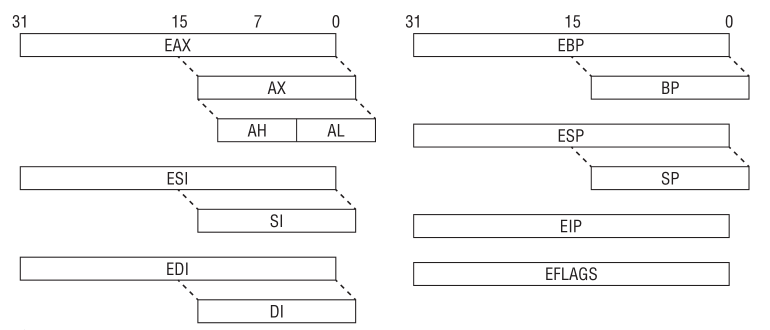
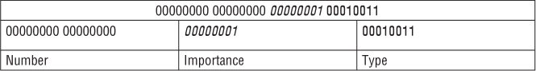

# Reverse Engineering Learning: X86 and X64

*This artical is a note of the book called Practical Reverse Engineering*

The x86 is little-endian architecture based on the Intel 8086 processor. Generally speaking, it can operate in two modes: `real` and `protected`. Real mode is the processor state when it is first powered on and only supports a 16-bit instruction set. Protected mode is the processor state supporting virtual memory, paging, and other features; it is the state in which modern operating systems execute.

x86 supports the concept of privilege seperation through a abstraction called `ring level`. The processor supports four ring levels, numbered from 0 to 3, ring 0 is the highest privilege level and can modify all system settings, ring 3 is the lowest privileged level and can only read/modify a subset of system settings. Hence, modern operating systems typically implement user/kernel privilege separation by having user-mode applications run in ring 3, and the kernel in ring 0.


## 0x01 Register Set and Data Types
When operating in protected mode, the x86 architecture has eight 32-bit general-purpose registers (GPRs): `EAX`, `EBX`, `ECX`, `EDX`, `EDI`, `ESI`, `EBP`, and `ESP`. Some of them can be further divided into 8- and 16-bit registers.



Some GPRs and Their Usage:

|REGISTER|PURPOSE|
|---|---|
|ECX|Counter in loops|
|ESI|Source in string/memory operations|
|EDI|Destination in string/memory operations|
|EBP|Base frame pointer|
|ESP|Stack pointer|

Some data type:

|TYPE|LENGTH|EXAMPLES|
|---|---|
|Bytes|8-bit|AL, BL, CL|
|Word|16-bit|AX, BX, CX|
|Double word|32-bit|EAX, EBX, ECX|
|Quad word|64-bit|combine two registers: EDX:EAX|

The 32-bit `EFLAGS` register is used to store the status of arithmetic operations and other execution states. The flags in `EFLAGS` are primarily used to implement conditional branching. And the `EIP` register is used to store the instruction pointer.


## 0x02 Instruction Set
The x86 instruction set allow a high level of flexibility in terms of data movement between registers and memory. The movement can be classified into five general methods:
- Immediate to register
- Register to register
- Immediate to memory
- Register to memory and vice versa
- Memory to memory

The first four methods are supported by all modern architectures, but the last one is specific to x86.

Another important characteristic is that x86 uses variable-length instruction size: the instruction length can range from 1 to 15 bytes.

### Syntax
Depending on the assembler/disassembler, there are two syntax notations for x86 assembly code, Intel and AT&T. Disassamblers/assemblers and other reverse-engineering tools (IDA Pro, OllyDbg, MASM, etc.) on Windows typically use Intel notation, where those on UNIX frequently follow AT&T notation (GCC).
```text
// Intel
mov ecx, AABBCCDDh
mov ecx, [eax]
mov ecx, eax
```
```text
// AT&T
movl $0xAABBCCDD, %ecx
movl (%eax), %ecx
movl %eax, %ecx
```

We can find that there are several differences between Intel and AT&T notation:
- AT&T prefixes the register with %, and immediates with $. Intel does not do this
- AT&T adds a prefix to the instruction to indicate operation width. For example, MOVL(long), MOVB(byte), etc. Intel does not do this.
- AT&T puts the source operand before the destination. Intel does not do this.

### Data Movement
Instructions operate on values that come from registers or main memory. The most common instruction for moving data is `MOV`. Similar to other assembly language conventions, x86 uses square brackets([]) to indicate memory access.
```text
// Assembly

01: C7 00 01 00 00+    mov  dword ptr [eax], 1
; set the memory at address EAX to 1
02: 8B 08              mov  ecx, [eax]
; set ECX to the value at address EAX
03: 89 18              mov  [eax], ebx
; set the memory at address EAX to EBX
04: 89 46 34           mov  [esi+34h], eax
; set the memory address at (ESI+34) to EAX
05: 8B 46 34           mov  eax, [esi+34h]
; set EAX to the value at address (EAX+34)
06: 8B 14 01           mov  edx, [ecx+eax]
; set EDX to the value at address (ECX+EAX)
```
```text
// Pseudo C

01: *eax = 1;
02: ecx = *eax;
03: *eax = ebx;
04: *(esi+34) = eax;
05: eax = *(esi+34);
06: edx = *(ecx+eax);
```
These examples demonstrate memory access through a base register and offset, where offset can be a register or immediate. This form is commonly used to access structure members or data buffers at a location computed at runtime. For example, suppose that `ECX` points to a structure of type `KDPC` with the layout:
```text
kd> dt nt!_KDPC
    +0x000 Type             : UChar
    +0x001 Importance       : UChar
    +0x002 Number           : Uint2B
    +0x004 DpcListEntry     : _LIST_ENTRY
    +0x00c DeferredRoutine  : Ptr32 void
    +0x010 DeferredContext  : Ptr32 Void   
    +0x014 SystemArgument1  : Ptr32 Void   
    +0x018 SystemArgument2  : Ptr32 Void   
    +0x01c DpcData          : Ptr32 Void
```
and used in the following context:
```text
// Assembly
01: 8B 45 0C         mov   eax, [ebp+0Ch]
02: 83 61 1C 00      and   dword ptr [ecx+1Ch], 0
03: 89 41 0C         mov   [ecx+0Ch], eax
04: 8B 45 10         mov   eax, [ebp+10h]
05: C7 01 13 01 00+  mov   dword ptr [ecx], 113h
06: 89 41 10         mov   [ecx+10h], eax
```
```text
// Pseudo C
KDPC *p = ...;
p->DpcData = NULL;
p->DeferredRoutine = ...;
*(int *)p = 0x113;
p->DeferredContext = ...;
```
Line 1 reads a value from memory and stores it in EAX. The `DeferredRoutine` field is set to this value in line 3. Line 2 clears the `DpcData` field by `AND`'ing it with 0. Line 4 reads another value from memory and stores it in EAX. The `DeferredContext` field is set to this value in line 6.

Line 5 writes the double-word value 0x113 to the base of the structure. The first field is only 1 byte in size. So, the `Typt` field is set to 0x13, `Importance` is set to 0x1, and `Number` is set to 0x0.



By writing one value, the code managed to initialize three fields with a single instruction! The following two codes are same. Another interesting thing is that memory access can be done at three granularity levels: byte, word, and double-word. The default granularity is 4 bytes,
which can be changed to 1 or 2 bytes with an override prefix. In the example,
the override prefix bytes are `C6` and `66`.
```text
// first type
05: C7 01 13 01 00+     mov dword ptr [ecx], 113h

// second type
05: C6 01 13            mov byte ptr [ecx],13h
06: C6 41 01 01         mov byte ptr [ecx+1],1
07: 66 C7 41 02 00+     mov word ptr [ecx+2],0
```

The next memory access form is commonly used to access array-type objects. Generally, the format is as follows: [Base + Index * scale].
```text
01: 8B 34 B5 40 05+        mov esi, _KdLogBuffer[esi*4]
; always written as mov esi, [_KdLogBuffer + esi * 4]
; _KdLogBuffer is the base address of a global array and
; ESI is the index; we know that each element in the array
; is 4 bytes in length (hence the scaling factor)
02: 89 04 F7        mov [edi+esi*8], eax
; here is EDI is the array base address; ESI is the array
; index; element size is 8.
```
In practice, this is observed in code looping over an array.
```text
01:                 loop_start:
02: 8B 47 04            mov     eax, [edi+4]
03: 8B 04 98            mov     eax, [eax+ebx*4]
04: 85 C0               test    eax, eax
...
05: 74 14               jz      short loc_7F627F
06:                 loc_7F627F:
07: 43                  inc     ebx
08: 3B 1F               cmp     ebx, [edi]
09: 7C DD               jl      short loop_start
```
Line 2 reads a double-word from offset +4 from `EDI` and then uses it as the base address into an array in line 3; hence, you know that `EDI` is likely a structure that has an array at +4. Line 7 increments the index. Line 8 compares the index against a value at offset +0 in the same structure. This small loop can be decompiled as follows:
```c
typedef struct_FOO
{
    DWORD size;         // +0x00
    DWORD array[...];   // +0x04
} FOO, *PFOO;

PFOO bar = ...;
for (i = ...; i < bar->size; i++) {
    if (bar->array[i] != 0) {
    }
}
```
The `MOVSB/MOVSW/MOVSD` instructions move data with 1-, 2-, or 4-byte granularity between two memory addresses. They implicitly use `EDI/ESI` as the destination/source address, respectively. In addition, they also automatically update the source/destination address depending on the direction flag (`DF`) flag in `EFLAGS`. If `DF` is 0, the addresses are decremented; otherwise, they are incremented. These instructions are typically used to implement string or memory copy functions when the length is known at compile time. In some cases, they are accompanied by the `REP` prefix, which repeats an instruction up to `ECX` times.
```text
// Assembly
01: BE 28 B5 41 00      mov esi, offset _RamdiskBootDiskGuid
; ESI = pointer to RamdiskBootDiskGuid
02: 8D BD 40 FF FF+     lea edi, [ebp-0C0h]
; EDI is an address somewhere on the stack
03: A5                  movsd
; copies 4 bytes from EDI to ESI; increment each by 4
04: A5                  movsd
; same as above
05: A5                  movsd
; save as above
06: A5                  movsd
; same as above
```
```text
// Pseudo C
// a GUID is 16-byte structure
GUID RamDiskBootDiskGuid = ...; // global
...
GUID foo;
memcpy(&foo, &RamdiskBootDiskGuid, sizeof(GUID));
```
Line 2 deserves some special attention. Although the `LEA` instruction uses `[]`, it actually does not read from a memory address; it simply evaluates the expression in square brackets and puts the result in the destination register. For example, if `EBP` were 0x1000, then `EDI` would be 0xF40 (=0x1000 – 0xC0) after executing line 2. The point is that `LEA` does not access memory, despite the misleading syntax.

The following example, from  `nt!KiInitSystem` , uses the `REP` prefix:
```text
01: 6A 08               push 8      ; push 8 on the stack
02: ...
03: 59                  pop  ecx    ; pop the stack. Basically sets ECX to 8.
04: ...
05: BE 00 44 61 00      mov  esi, offset _KeServiceDescriptorTable
06: BF C0 43 61 00      mov  edi, offset _KeServiceDescriptorTableShadow
07: F3 A5               rep movsd   ; copy 32 bytes (movsd repeated 8 times)
; from this we can deduce that whatever these two objects are, they are
; likely to be 32 bytes in size.
```
The rough C equivalent of this would be as follows:
```c
memcpy(&KeServiceDescriptorTableShadow, &KeServiceDescriptorTable, 32);
```
The final example, `nt!MmInitializeProcessAddressSpace`, uses a combination of these instructions because the copy size is not a multiple of 4:
```text
01: 8D B0 70 01 00+     lea esi, [eax+170h]
; EAX is likely the base address of a structure. Remember what we said
; about LEA ...
02: 8D BB 70 01 00+     lea edi, [ebx+170h]
; EBX is likely to be base address of another structure of the same type
03: A5                  movsd
04: A5                  movsd
05: A5                  movsd
06: 66 A5               movsw
07: A4                  movsb
```
After lines 1–2, you know that `EAX` and `EBX` are likely to be of the same type because they are being used as source/destination and the offset is identical. This code snippet simply copies 15 bytes from one structure field to another. Note that the code could also have been written using the `MOVSB` instruction with a `REP` prefix and `ECX` set to 15; however, that would be inefficient because it results in 15 reads instead of only five.

Another class of data movement instructions with implicit source and destination includes the `SCAS` and `STOS` instructions. Similar to `MOVS`, these instructions can operate at 1-, 2-, or 4-byte granularity. `SCAS` implicitly compares  `AL/AX/EAX` with data starting at the memory address `EDI`; `EDI` is automatically incremented/decremented depending on the `DF` bit in `EFLAGS`. Given its semantic, `SCAS` is commonly used along with the `REP` prefix to find a byte, word, or double-word in a buffer. For example, the C `strlen()` function can be implemented as follows:
```text
01: 30 C0           xor     al, al
; set AL to 0 (NUL byte). You will frequently observe the XOR reg, reg pattern in code.
02: 89 FB           mov     ebx, edi
; save the original pointer to the string
03: F2 AE           repne scasb
; repeatedly scan forward one byte at a time as long as AL does not match the byte at
; EDI when this instruction ends, it means we reached the NUL byte in the string buffer
04: 29 DF           sub     edi, ebx
; edi is now the NUL byte location. Subtract that from the original pointer to the length.
```
`STOS` is the same as `SCAS` except that it writes the value `AL/AX/EAX` to `EDI`. It is commonly used to initialize a buffer to a constant value (such as `memset()`). Here is an example:
```text
01: 33 C0           xor     eax, eax
; set EAX to 0
02: 6A 09           push    9
; push 9 on the stack
03: 59              pop     ecx
; pop it back in ECX. Now ECX = 9.
04: 8B FE           mov     edi, esi
; set the destination address
05: F3 AB           rep stosd
; write 36 bytes of zero to the destination buffer (STOSD repeated 9 times)
; this is equivalent lent to memset(edi, 0, 36)
```
`LODS` is another instruction from the same family. It reads a 1-, 2-, or 4-byte value from `ESI` and stores it in `AL`, `AX`, or `EAX`.

### Arithmetic Operations
Fundamental arithmetic operations such as addition, subtraction, multiplication, and division are natively supported by the instruction set. Bit-level operations such as `AND`, `OR`, `XOR`, `NOT`, and left and right shift also have native corresponding instructions.
```text
01: 83 C4 14        add     esp, 14h        ; esp = esp + 0x14
02: 2B C8           sub     ecx, eax        ; ecx = ecx - eax
03: 83 EC 0C        sub     esp, 0Ch        ; esp = esp - 0xC
04: 41              inc     ecx             ; ecx = ecx + 1
05: 4F              dec     edi             ; edi = edi - 1
06: 83 C8 FF        or      eax, 0FFFFFFFFh ; eax = eax | 0xFFFFFFFF
07: 83 E1 07        and     ecx, 7          ; ecx = ecx & 7
08: 33 C0           xor     eax, eax        ; eax = eax ^ eax
09: F7 D7           not     edi             ; edi = ~edi
10: C0 E1 04        shl     cl, 4           ; cl = cl << 4
11: D1 E9           shr     ecx, 1          ; ecx = ecx >> 1
12: C0 C0 03        rol     al, 3           ; rotate AL left 3 positions
13: D0 C8           ror     al, 1           ; rotate AL right 1 position
```
The left and right shift instructions are frequently observed in real-life code. These instructions are typically used to optimize multiplication and division operations where the multiplicand and divisor are a power of two.

Unsigned and signed multiplication is done through the `MUL` and `IMUL` instructions, respectively. The `MUL` instruction has the following general form: `MUL reg/memory`. That is, it can only operate on register or memory values. The register is multiplied with `AL`, `AX`, or `EAX` and the result is stored in `AX`, `DX:AX`, or `EDX:EAX`, depending on the operand width.
```text
01: F7 E1           mul ecx                 ; EDX:EAX = EAX * ECX
02: F7 66 04        mul dword ptr [esi+4]   ; EDX:EAX = EAX * dword_at(ESI+4)
03: F6 E1           mul cl                  ; AX = AL * CL
04: 66 F7 E2        mul dx                  ; DX:AX = AX * DX
```
`IMUL` has three forms:
- `IMUL reg/mem              (Same as MUL)`
- `IMUL reg1, reg2/mem       (reg1 = reg1 * reg2/mem)`
- `IMUL reg1, reg2/mem, imm  (reg1 = reg2 *imm)`

Unsigned and signed division is done through the `DIV` and `IDIV` instructions, respectively. They take only one parameter (divisor) and have the following form: `DIV/IDIV reg/mem`. Depending on the divisor’s size, `DIV` will use either `AX`, `DX:AX`, or `EDX:EAX` as the dividend, and the resulting quotient/remainder pair are stored in `AL/AH`, `AX/DX`, or `EAX/EDX`.
```text
01: F7 F1           div ecx         ; EDX:EAX / ECX, quotient in EAX,
02: F6 F1           div cl          ; AX / CL, quotient in AL, remainder in AH
03: F7 76 24        div dword ptr [esi+24h]     ; see line 1
04: B1 02           mov cl,2        ; set CL = 2
05: B8 0A 00 00 00  mov eax,0Ah     ; set EAX = 0xA
06: F6 F1           div cl          ; AX/CL = A/2 = 5 in AL (quotient), AH = 0 (remainder)
07: B1 02           mov cl,2        ; set CL = 2
08: B8 09 00 00 00  mov eax,09h     ; set EAX = 0x9
09: F6 F1           div cl          ; AX/CL = 9/2 = 4 in AL (quotient), AH = 1 (remainder)
```

### Stack Operations and Function Invocation
The stack is a fundamental data structure in programming languages and operating systems. A stack is a last-in first-out data structure supporting two operations: push and pop. Push means to put something on top of the stack; pop means to remove an item from the top. Concretely speaking, on x86, a stack is a contiguous memory region pointed to by `ESP` and it grows downwards. Push/pop operations are done through the PUSH/POP instructions and they implicitly modify `ESP`. The PUSH instruction decrements `ESP` and then writes data at the location pointed to by `ESP`; POP reads the data and increments `ESP`. The default auto-increment/decrement value is 4, but it can be changed to 1 or 2 with a prefix override. In practice, the value is almost always 4 because the OS requires the stack to be double-word aligned.

Suppose that `ESP` initially points to 0xb20000 and you have the following code:
```text
; initial ESP = 0xb20000
01: B8 AA AA AA AA      mov     eax,0AAAAAAAAh
02: BB BB BB BB BB      mov     ebx,0BBBBBBBBh
03: B9 CC CC CC CC      mov     ecx,0CCCCCCCCh
04: BA DD DD DD DD      mov     edx,0DDDDDDDDh
05: 50                  push    eax
; address 0xb1fffc will contain the value 0xAAAAAAAA and ESP will be 0xb1fffc (=0xb20000-4)
06: 53                  push    ebx
; address 0xb1fff8 will contain the value 0xBBBBBBBB and ESP will be 0xb1fff8 (=0xb1fffc-4)
07: 5E                  pop     esi
; ESI will contain the value 0xBBBBBBBB and ESP will be 0xb1fffc (=0xb1fff8+4)
08: 5F                  pop     edi
; EDI will contain the value 0xAAAAAAAA and ESP will be 0xb20000 (=0xb1fffc+4)
```


At the lowest level, the processor operates only on concrete objects, such as registers or data coming from memory. So functions are implemented through the stack data structure. Consider the following function:
```c
// C
int
__cdecl addme(short a, short b)
{
return a+b;
}
```
```text
01: 004113A0 55             push    ebp
02: 004113A1 8B EC          mov     ebp, esp
03: ...
04: 004113BE 0F BF 45 08    movsx   eax, word ptr [ebp+8]
05: 004113C2 0F BF 4D 0C    movsx   ecx, word ptr [ebp+0Ch]
06: 004113C6 03 C1          add     eax, ecx
07: ...
08: 004113CB 8B E5          mov     esp, ebp
09: 004113CD 5D             pop     ebp
10: 004113CE C3             retn
```
The function is invoked with the following code:
```c
// C
sum = addme(x, y);
```
```text
// Assembly
01: 004129F3 50              push  eax
02: ...
03: 004129F8 51              push  ecx
04: 004129F9 E8 F1 E7 FF FF  call  addme
05: 004129FE 83 C4 08        add   esp, 8
```
Before going into the details, first consider the `CALL/RET` instructions and calling conventions. The `CALL` instruction performs two operations:
1. It pushes the return address (address immediately after the `CALL` instruction) on the stack.
2. It changes `EIP` to the call destination. This effectively transfers control to the call target and begins execution there.

`RET` simply pops the address stored on the top of the stack into `EIP` and transfers control to it (literally like a "`POP EIP`" but such instruction sequence does not exist on x86). For example, if you want to begin execution at 0x12345678, you can just do the following:
```text
01: 68 78 56 34 12   push 0x12345678
02: C3               ret
```
A calling convention is a set of rules dictating how function calls work at the machine level. It is defined by the Application Binary Interface (ABI) for a particular system. For example, should the parameters be passed through the stack, in registers, or both? Should the parameters be passed in from left-to-right or right-to-left? Should the return value be stored on the stack, in registers, or both? The most popular calling conventions are `CDECL`, `STDCALL`, `THISCALL`, and `FASTCALL`.

||CDECL|STDCALL|FASTCALL|
|--
|Parameters|Pushed on the stack from right-to-left. Caller must clean up the stack|Same as CDECL except that the callee must clean the stack.|First two parameters are passed in ECX and EDX. The rest are on the stack.|
|Return value|Stored in EAX.|Stored in EAX.|Stored in EAX.|
|Non-volatile registers|EBP, ESP, EBX, ESI, EDI.|EBP, ESP, EBX, ESI, EDI.|EBP, ESP, EBX, ESI, EDI.|

We now return to the code snippet to discuss how the function `addme` is invoked. In line 1 and 3, the two parameters are pushed on the stack; `ECX` and `EAX` are the first and second parameter, respectively. Line 4 invokes the `addme` function with the `CALL` instruction. This immediately pushes the return address, 0x4129FE, on the stack and begins execution at 0x4113A0.


After line 4 executes, we are now in the `addme` function body. Line 1 pushes `EBP` on the stack. Line 2 sets `EBP` to the current stack pointer. This two-instruction sequence is typically known as the function prologue because it establishes a new function frame. Line 4 reads the value at address `EBP+8`, which is the first parameter on the stack; line 5 reads the second parameter. Note that the parameters are accessed using `EBP` as the base register. When used in this context, `EBP` is known as the base frame pointer because it points to the stack frame for the current function, and parameters/locals can be accessed relative to it. Line 6 adds the numbers and saves the result in `EAX`. Line 8 sets the stack pointer to the base frame pointer. Line 9 pops the saved `EBP` from line 1 into `EBP`. This two-instruction sequence is commonly referred to as the `function epilogue` because it is at the end of the function and restores the previous function frame. At this point, the top of the stack contains the return address saved by the `CALL` instruction at 0x4129F9. Line 10 performs a `RET`, which pops the stack and resumes execution at 0x4129FE. Line 5 in the snippet shrinks the stack by 8 because the caller must clean up the stack per `CDECL`'s calling convention.
If the function `addme` had local variables, the code would need to grow the stack by subtracting `ESP` after line 2. All local variables would then be accessible through a negative offset from `EBP`.

### Control Flow
This section describes how the system implements conditional execution for higher-level constructs like if/else, switch/case, and while/for. All of these are implemented through the `CMP`, `TEST`, `JMP`, and `Jcc` instructions and `EFLAGS` register. The following list summarizes the common flags in `EFLAGS`:
- ZF (Zero flag): Set if the result of the previous arithmetic operation is zero.
- SF (Sign flag): Set to the most significant bit of the result.
- CF (Carry flag): Set when the result requires a carry. It applies to unsigned numbers.

The `Jcc` instructions, where "`cc`" is a conditional code, changes control flow depending on these flags. There can be up to 16 conditional codes, here are the most common ones:

|CONDITIONAL CODE|ENGLISH DESCRIPTION|MACHINE DESCRIPTION|
|--
|B/NAE|Below/Neither Above nor Equal. Used for unsigned operations.|CF=1|
|NB/AE|Not Below/Above or Equal. Used for unsigned operations.|CF=0|
|E/z|Equal/Zero|ZF=1|
|NE/NZ|Not Equal/Not Zero|ZF=0|
|L|Less than/Neither Greater nor Equal. Used for signed operations.|(SF ^ OF) = 1|
|GE/NL|Greater or Equal/Not Less than. Used for signed operations.|(SF ^ OF) = 0|
|G/NLE|Greater/Not Less nor Equal. Used for signed operations.|((SF ^ OF) | ZF) = 0|

The `CMP` instruction compares two operands and sets the appropriate conditional code in `EFLAGS`; it compares two numbers by subtracting one from another without updating the result. The `TEST` instruction does the same thing except it performs a logical `AND` between the two operands.

#### If-Else
If-else constructs are quite simple to recognize because they involve a compare/test followed by a `Jcc`.
```text
// Assembly

01:   mov   esi, [ebp+8]
02:   mov   edx, [esi]
03:   test  edx, edx
04:   jz    short loc_4E31F9
05:   mov   ecx, offset _FsRtlFastMutexLookasideList
06:   call  _ExFreeToNPagedLookasideList@8
07:   and   dword ptr [esi], 0
08:   lea   eax, [esi+4]
09:   push  eax
10:   call  _FsRtlUninitializeBaseMcb@4
11: loc_4E31F9:
12:   pop   esi
13:   pop   ebp
14:   retn  4
15: _FsRtlUninitializeLargeMcb@4 endp
```
```text
// Pseudo C

if (*esi == 0) {
    return;
}
ExFreeToNPagedLookasideList(...);
*esi = 0;
...
return;

OR

if (*esi != 0) {
    ...
    ExFreeToNPagedLookasideList(...);
    *esi = 0;
    ...
}
return;
```
Line 2 reads a value at location `ESI` and stores it in `EDX`. Line 3 `ANDs EDX` with itself and sets the appropriate flags in `EFLAGS`. Note that this pattern is commonly used to determine whether a register is zero. Line 4 jumps to loc_4E31F9 (line 12) if ZF=1. If ZF=0, then it executes line 5 and continues until the function returns.

Note that there are two slightly different but logically equivalent C translations for this snippet.

#### Switch-Case
A switch-case block is a sequence of if/else statements. For example:
```c
// Switch-Case

switch(ch) {
    case 'c':
        handle_C();
        break;
    case 'h':
        handle_H();
        break;
    default:
        break;
}
domore();
...
```
```c
// If-Else

if (ch == 'c') {
    handle_C();
} else
if (ch == 'h') {
    handle_H();
}
domore();
...
```
Hence, the machine code translation will be a series if/else.
```text
// Assembly

01:   push ebp
02:   mov ebp, esp
03:   mov   eax, [ebp+8]
04:   sub   eax, 41h
05:   jz    short loc_caseA
06:   dec   eax
07:   jz    short loc_caseB
08:   dec   eax
09:   jz    short loc_caseC
10:   mov   al, 5Ah
11:   movzx eax, al
12:   pop   ebp
13:   retn
14: loc_caseC:
15:   mov   al, 43h
16:   movzx eax, al
17:   pop   ebp
18:   retn
19: loc_caseB:
20:   mov   al, 42h
21:   movzx eax, al
22:   pop   ebp
23:   retn
24: loc_caseA:
25:   mov   al, 41h
26:   movzx eax, al
27:   pop   ebp
28:   retn
```
```c
// C

unsigned char switchme(int a)
{
    unsigned char res;
    switch(a) {
        case 0x41:
            res = 'A';
            break;
        case 0x42:
            res = 'B';
            break;
        case 0x43:
            res = 'C';
            break;
        default:
            res = 'Z';
            break;
        }
        return res;
}
```

### Loops
At the machine level, loops are implemented using a combination of `Jcc` and `JMP` instructions. In other words, they are implemented using `if/else` and `goto` constructs.
```c
// Using for
for (int i=0; i<10; i++) {
    printf("%d\n", i);
}
printf("done!\n");
```
```c
// Using if/else and goto
int i = 0;
loop_start:
    if (i < 10) {
        printf("%d\n", i);
        i++;
        goto loop_start;
    }
printf("done!n");
```
When compiled, both versions are identical at the machine-code level:
```text
01: 00401002   mov      edi, ds:__imp__printf
02: 00401008   xor      esi, esi
03: 0040100A   lea      ebx, [ebx+0]
04: 00401010 loc_401010:
05: 00401010   push     esi
06: 00401011   push     offset Format           ; "%d\n"
07: 00401016   call     edi                     ; __imp__printf
08: 00401018   inc      esi
09: 00401019   add      esp, 8
10: 0040101C   cmp      esi, 0Ah
11: 0040101F   jl       short loc_401010
12: 00401021   push     offset aDone            ; "done!\n"
13: 00401026   call     edi                     ; __imp__printf
14: 00401028   add      esp, 4
```
Line 1 sets `EDI` to the `printf` function. Line 2 sets `ESI` to 0. Line 4 begins the loop; however, note that it does not begin with a comparison. There is no comparison here because the compiler knows that the counter was initialized to 0 (see line 2) and is obviously going to be less than 10 so it skips the check. Lines 5–7 call the `printf` function with the right parameters (format specifier and our number). Line 8 increments the number. Line 9 cleans up the stack because `printf` uses the `CDECL` calling convention. Line 10 checks to see if the
counter is less than 0xA. If it is, it jumps back to `loc_401010`. If the counter is not less than 0xA, it continues execution at line 12 and finishes with a `printf`.

One important observation to make is that the disassembly allowed us to infer that the counter is a signed integer. Line 11 uses the "less than" conditional code (`JL`), so we immediately know that the comparison was done on signed integers. Remember: If "above/below," it is unsigned; if "less than/greater than," it is signed.

Outside of the normal Jcc constructs, certain loops can be implemented using the `LOOP` instruction. The `LOOP` instruction executes a block of code up to `ECX`
time.
```text
// Assembly
01: 8B CA       mov ecx, edx
02:           loc_CFB8F:
03: AD          lodsd
04: F7 D0       not eax
05: AB          stosd
06: E2 FA       loop loc_CFB8F
```
```text
// Rough C
while (ecx != 0) {
    eax = *edi;
    edi++;
    *esi = ~eax;
    esi++;
    ecx--;
}
```
Line 1 reads the counter from `EDX`. Line 3 is the loop start; it reads in a double-word at the memory address `EDI` and saves that in `EAX`; it also increments `EDI` by 4. Line 4 performs the `NOT` operator on the value just read. Line 5 writes the modified value to the memory address `ESI` and increments `ESI` by 4. Line 6 checks to see if `ECX` is 0; if not, execution is continued at the loop start.


## Walk-Through
```text
01:     ; BOOL __stdcall DllMain(HINSTANCE hinstDLL, DWORD fdwReason, LPVOID lpvReserved)
02:                 _DllMain@12 proc near
03: 55                  push    ebp
04: 8B EC               mov     ebp, esp
05: 81 EC 30 01 00+     sub     esp, 130h
06: 57                  push    edi
07: 0F 01 4D F8         sidt    fword ptr [ebp-8]
08: 8B 45 FA            mov     eax, [ebp-6]
09: 3D 00 F4 03 80      cmp     eax, 8003F400h
10: 76 10               jbe     short loc_10001C88 (line 18)
11: 3D 00 74 04 80      cmp     eax, 80047400h
12: 73 09               jnb     short loc_10001C88 (line 18)
13: 33 C0               xor     eax, eax
14: 5F                  pop     edi
15: 8B E5               mov     esp, ebp
16: 5D                  pop     ebp
17: C2 0C 00            retn    0Ch
18:                 loc_10001C88:
19: 33 C0               xor     eax, eax
20: B9 49 00 00 00      mov     ecx, 49h
21: 8D BD D4 FE FF+     lea     edi, [ebp-12Ch]
22: C7 85 D0 FE FF+     mov     dword ptr [ebp-130h], 0
23: 50                  push    eax
24: 6A 02               push    2
25: F3 AB               rep stosd
26: E8 2D 2F 00 00      call    CreateToolhelp32Snapshot
27: 8B F8               mov     edi, eax
28: 83 FF FF            cmp     edi, 0FFFFFFFFh
29: 75 09               jnz     short loc_10001CB9 (line 35)
30: 33 C0               xor     eax, eax
31: 5F                  pop     edi
32: 8B E5               mov     esp, ebp
33: 5D                  pop     ebp
34: C2 0C 00            retn    0Ch
35:                 loc_10001CB9:
36: 8D 85 D0 FE FF+     lea eax, [ebp-130h]
37: 56                  push    esi
38: 50                  push    eax
39: 57                  push    edi
40: C7 85 D0 FE FF+     mov     dword ptr [ebp-130h], 128h
41: E8 FF 2E 00 00      call    Process32First
42: 85 C0               test    eax, eax
43: 74 4F               jz      short loc_10001D24 (line 70)
44: 8B 35 C0 50 00+     mov     esi, ds:_stricmp
45: 8D 8D F4 FE FF+     lea     ecx, [ebp-10Ch]
46: 68 50 7C 00 10      push    10007C50h
47: 51                  push    ecx
48: FF D6               call    esi ; _stricmp
49: 83 C4 08            add     esp, 8
50: 85 C0               test    eax, eax
51: 74 26               jz      short loc_10001D16 (line 66)
52:                 loc_10001CF0:
53: 8D 95 D0 FE FF+     lea     edx, [ebp-130h]
54: 52                  push    edx
55: 57                  push    edi
56: E8 CD 2E 00 00      call    Process32Next
57: 85 C0               test    eax, eax
58: 74 23               jz      short loc_10001D24 (line 70)
59: 8D 85 F4 FE FF+     lea     eax, [ebp-10Ch]
60: 68 50 7C 00 10      push    10007C50h
61: 50                  push    eax
62: FF D6               call    esi ; _stricmp
63: 83 C4 08            add     esp, 8
64: 85 C0               test    eax, eax
65: 75 DA               jnz     short loc_10001CF0 (line 52)
66:                 loc_10001D16:
67: 8B 85 E8 FE FF+     mov     eax, [ebp-118h]
68: 8B 8D D8 FE FF+     mov     ecx, [ebp-128h]
69: EB 06               jmp     short loc_10001D2A (line 73)
70:                 loc_10001D24:
71: 8B 45 0C            mov     eax, [ebp+0Ch]
72: 8B 4D 0C            mov     ecx, [ebp+0Ch]
73:                 loc_10001D2A:
74: 3B C1               cmp     eax, ecx
75: 5E                  pop     esi
76: 75 09               jnz     short loc_10001D38 (line 82)
77: 33 C0               xor     eax, eax
78: 5F                  pop     edi
79: 8B E5               mov     esp, ebp
80: 5D                  pop     ebp
81: C2 0C 00            retn    0Ch
82:                 loc_10001D38:
83: 8B 45 0C            mov     eax, [ebp+0Ch]
84: 48                  dec     eax
85: 75 15               jnz     short loc_10001D53 (line 93)
86: 6A 00               push    0
87: 6A 00               push    0
88: 6A 00               push    0
89: 68 D0 32 00 10      push    100032D0h
90: 6A 00               push    0
91: 6A 00               push    0
92: FF 15 20 50 00+     call    ds:CreateThread
93:                 loc_10001D53:
94: B8 01 00 00 00      mov     eax, 1
95: 5F                  pop     edi
96: 8B E5               mov     esp, ebp
97: 5D                  pop     ebp
98: C2 0C 00            retn    0Ch
99:                 _DllMain@12 endp
```
Lines 3–4 set up the function prologue, which saves the previous base frame pointer and establishes a new one. Line 5 reserves 0x130 bytes of stack space. Line 6 saves `EDI`. Line 7 executes the `SIDT` instruction, which writes the 6-byte `IDT` register to a specified memory region. Line 8 reads a double-word at `EBP-6` and saves it in `EAX`. Lines 9–10 check if `EAX` is below-or-equal to 0x8003F400. If it is, execution is transferred to line 18; otherwise, it continues executing at line 11. Lines 11–12 do a similar check except that the condition is not-below 0x80047400. If it is, execution is transferred to line 18; otherwise, it continues executing at line 13. Line 13 clears `EAX`. Line 14 restores the saved `EDI` register in line 6. Lines 15–16 restore the previous base frame and stack pointer. Line 17 adds 0xC bytes to the stack pointer and then returns to the caller.

Before discussing the next area, note a few things about these first 17 lines. The `SIDT` instruction (line 7) writes the content of the IDT register to a 6-byte memory location. What is the IDT register? The Intel/AMD reference manual states that IDT is an array of 256 8-byte entries, each containing a pointer to an interrupt handler, segment selector, and offset. When an interrupt or exception occurs, the processor uses the interrupt number as an index into the IDT and calls the entry's specified handler. The IDT register is a 6-byte register; the top 4 bytes contain the base of the IDT array/table and the bottom 2 bytes store the table limit. With this in mind, you now know that line 8 is actually reading the IDT base address. Lines 9 and 11 check whether the base address is in the range (0x8003F400, 0x80047400). And we know that 0x8003F400 is an IDT base address on Windows XP on x86. Why does the code check for this behavior? One possible explanation is that the developer assumed that an IDT base address falling in that range is considered "invalid" or may be the result of being virtualized. The function automatically returns zero if the IDTR is "invalid". You can decompile this code to C as follows:
```c
typedef struct _IDTR {
    DWORD base;
    SHORT limit;
} IDTR, *PIDTR;
BOOL __stdcall DllMain (HINSTANCE hinstDLL, DWORD fdwReason, LPVOID lpvReserved)
{
    IDTR idtr;
    __sidt(&idtr);
    if (idtr.base > 0x8003F400 && idtr.base < 0x80047400) { return FALSE; }
    //line 18
    ...
}
```
If the IDT base seems valid, the code continues execution at line 18. Lines 19–20 clear `EAX` and set `ECX` to 0x49. Line 21 uses sets `EDI` to whatever `EBP-0x12C` is; since `EBP` is the base frame pointer, `EBP-0x12C` is the address of a local variable. Line 22 writes zero at the location pointed to by `EBP-0x130`. Lines 23–24 push `EAX` and `2` on the stack. Line 25 zeroes a 0x124-byte buffer starting from `EBP-0x12C`. Line 26 calls `CreateToolhelp32Snapshot`:
```c
HANDLE WINAPI CreateToolhelp32Snapshot(
    _In_  DWORD dwFlags,
    _In_  DWORD th32ProcessID
);
```
This Win32 API function takes two integer parameters. As a general rule, Win32 API functions follow `STDCALL` calling convention. Hence, the `dwFlags` and `th32ProcessId` parameters are 0x2 (line 24) and 0x0 (line 23). This function enumerates all processes on the system and returns a handle to be used in `Process32Next`. Lines 27–28 save the return value in `EDI` and check if it is -1. If it is, the return value is set to 0 and it returns (lines 30–34); otherwise, execution continues at line 35. Line 36 sets `EAX` to the address of the local variable previously initialized to 0 in line 22; line 40 initializes it to 0x128. Lines 37–39 push `ESI`, `EAX`, and `EDI` on the stack. Line 41 calls `Process32First`:
```c
// Function prototype

BOOL WINAPI Process32First(
    _In_ HANDLE hSnapshot,
    _Inout_ LPPROCESSENTRY32 lppe
);
```
```c
// Relevant structure definition

typedef struct tagPROCESSENTRY32 {
    DWORD       dwSize;
    DWORD       cntUsage;
    DWORD       th32ProcessID;
    ULONG_PTR   th32DefaultHeapID;
    DWORD       th32ModuleID;
    DWORD       cntThreads;
    DWORD       th32ParentProcessID;
    LONG        pcPriClassBase;
    DWORD       dwFlags;
    TCHAR       szExeFile[MAX_PATH];
} PROCESSENTRY32, *PPROCESSENTRY32;

00000000 PROCESSENTRY32 struc ; (sizeof=0x128)
00000000 dwSize dd ?
00000004 cntUsage dd ?
00000008 th32ProcessID dd ?
0000000C th32DefaultHeapID dd ?
00000010 th32ModuleID dd ?
00000014 cntThreads dd ?
00000018 th32ParentProcessID dd ?
0000001C pcPriClassBase dd ?
00000020 dwFlags dd ?
00000024 szExeFile db 260 dup(?)
00000128 PROCESSENTRY32 ends
```
Because this API takes two parameters, `hSnapshot` is `EDI` (line 39, previously the returned handle from `CreateToolhelp32Snapshot` in line 27), and `lppe` is the address of a local variable (`EBP-0x130`). Because `lppe` points to a `PROCESSENTRY32` structure, we immediately know that the local variable at `EBP-0x130` is of the same type. It also makes sense because the documentation for `Process32First` states that before calling the function, the `dwSize` field must be set to the size of a `PROCESSENTRY32` structure (which is 0x128). We now know that lines 19–25 were simply initializing this structure to 0. In addition, we can say that this local variable starts at `EBP-0x130` and ends at `EBP-0x8`.

Line 42 tests the return value of `Process32First`. If it is zero, execution begins at line 70; otherwise, it continues at line 43. Line 44 saves the address of the `stricmp` function in `ESI`. Line 45 sets `ECX` to the address of a local variable (`EBP-0x10C`), which happens to be a field in `PROCESSENTRY32` (see the previous paragraph). Lines 46–48 push `0x10007C50/ECX` on the stack and call `stricmp`. We know that `stricmp` takes two character strings as arguments; hence, `ECX` must be the `szExeFile` field in `PROCESSENTRY32` and 0x10007C50 is the address of a string:
```text
.data:10007C50 65 78 70 6C 6F+Str2 db 'explorer.exe',0
```
Line 49 cleans up the stack because `stricmp` uses `CDECL` calling convention. Line 50 checks `stricmp`'s return value. If it is zero, meaning that the string matched "`explorer.exe`", execution begins at line 66; otherwise, it continues execution at line 52. We can now decompile lines 18–51 as follows:
```c
HANDLE h;
PROCESSENTRY32 procentry;
h = CreateToolhelp32Snapshot(TH32CS_SNAPPROCESS, 0);
if (h == INVALID_HANDLE_VALUE) { return FALSE; }

memset(&procentry, 0, sizeof(PROCESSENTRY32));
procentry.dwSize = sizeof(procentry); // 0x128
if (Process32Next(h, &procentry) == FALSE) {
    // line 70
    ...
}
if (stricmp(procentry.szExeFile, "explorer.exe") == 0) {
    // line 66
    ...
}
// line 52
```
Lines 52–65 are nearly identical to the previous block except that they form a loop with two exit conditions. The first exit condition is when `Process32Next` returns `FALSE` (line 58) and the second is when `stricmp` returns zero. We can decompile lines 52–65 as follows:
```c
while (Process32Next(h, &procentry) != FALSE) {
    if (stricmp(procentry.szExeFile, "explorer.exe") == 0)
        break;
}
```
After the loop exits, execution resumes at line 66. Lines 67–68 save the matching `PROCESSENTRY32`'s `th32ParentProcessID/th32ProcessID` in `EAX/ECX` and continue execution at 73. Notice that Line 66 is also a jump target in line 52.

Lines 70–74 read the `fdwReason` parameter of `DllMain` (`EBP+C`) and check whether it is 0 (`DLL_PROCESS_DETACH`). If it is, the return value is set to 0 and it returns; otherwise, it goes to line 82. Lines 82–85 check if the `fdwReason` is greater than 1 (i.e., `DLL_THREAD_ATTACH`, `DLL_THREAD_DETACH`). If it is, the return value is set to 1 and it returns; otherwise, execution continues at line 86. Lines 86–92 call `CreateThread`:
```c
HANDLE WINAPI CreateThread(
    _In_opt_    LPSECURITY_ATTRIBUTES lpThreadAttributes,
    _In_        SIZE_T dwStackSize,
    _In_        LPTHREAD_START_ROUTINE lpStartAddress,
    _In_opt_    LPVOID lpParameter,
    _In_        DWORD dwCreationFlags,
    _Out_opt_   LPDWORD lpThreadId
);
```
with `lpStartAddress` as 0x100032D0. This block can be decompiled as follows:
```c
if (fdwReason == DLL_PROCESS_DETACH) { return FALSE; }
if (fdwReason == DLL_THREAD_ATTACH || fdwReason == DLL_THREAD_DETACH) {
    return TRUE; }
CreateThread(0, 0, (LPTHREAD_START_ROUTINE) 0x100032D0, 0, 0, 0);
return TRUE;
```
Having analyzed the function, we can deduce that the developer’s original intention was this:
1. Detect whether the target machine has a "sane" IDT.
2. Check whether "explorer.exe" is running on the system—i.e., someone logged on.
3. Create a main thread that infects the target machine.


## x64
x64 is an extension of x86, so most of the architecture properties are the same, with minor differences such as register size and some instructions are unavailable (like PUSHAD).

### Register Set and Data Types
The register set has 18 64-bit GPRs, note that 64-bit registers have the "R" prefix.


While RBP can still be used as the base frame pointer, it is rarely used for that purpose in real-life compiler-generated code. Most x64 compilers simply treat RBP as another GPR, and reference local variables relative to RSP.

### DATA Movement
x64 supports a concept referred to as RIP-relative addressing, which allows instructions to reference data at a relative position to RIP. For example:
```text
01: 0000000000000000 48 8B 05 00 00+    mov rax, qword ptr cs:loc_A
02:                                     ; originally written as "mov rax, [rip]"
03: 0000000000000007                  loc_A:
04: 0000000000000007 48 31 C0           xor rax, rax
05: 000000000000000A 90                 nop
```
Line 1 reads the address of `loc_A` (which is 0x7) and saves it in RAX. RIP-relative addressing is primarily used to facilitate position-independent code.

Most arithmetic instructions are automatically promoted to 64 bits even though the operands are only 32 bits. For example:
```text
48 B8 88 77 66+     mov rax, 1122334455667788h
31 C0               xor eax, eax ; will also clear the upper 32bits of RAX. i.e., RAX=0 after this
48 C7 C0 FF FF+     mov rax, 0FFFFFFFFFFFFFFFFh
FF C0               inc eax ; RAX=0 after this
```

### Canonical Address
On x64, virtual addresses are 64 bits in width, but most processors do not support a full 64-bit virtual address space. Current Intel/AMD processors only use 48 bits for the address space. All virtual memory addresses must be in canonical form. A virtual address is in canonical form if bits 63 to the most significant implemented bit are either all 1s or 0s. In practical terms, it means that bits 48–63 need to match bit 47. For example:
```text
0xfffff801`c9c11000 = 11111111 11111111 11111000 00000001 11001001 11000001
    00010000 00000000 ; canonical
0x000007f7`bdb67000 = 00000000 00000000 00000111 11110111 10111101 10110110
    01110000 00000000 ; canonical
0xffff0800`00000000 = 11111111 11111111 00001000 00000000 00000000 00000000
    00000000 00000000 ; non-canonical
0xffff8000`00000000 = 11111111 11111111 10000000 00000000 00000000 00000000
    00000000 00000000 ; canonical
0xfffff960`000989f0 = 11111111 11111111 11111001 01100000 00000000 00001001
    10001001 11110000 ; canonical
```
If code tries to dereference a non-canonical address, the system will cause an exception.

### Function Invocation
Recall that some calling conventions require parameters to be passed on the stack on x86. On x64, most calling conventions pass parameters through registers. For example, on Windows x64, there is only one calling convention and the first four parameters are passed through `RCX ,  RDX ,  R8 , and  R9 ; the remaining
are pushed on the stack from right to left. On Linux, the fi rst six parameters are
passed on  RDI ,  RSI ,  RDX ,  RCX ,  R8 , and  R9


## Exercise

### Ex1
This function uses a combination `SCAS` and `STOS` to do its work. First, explain what is the type of the `[EBP+8]` and `[EBP+C]` in line 1 and 8, respectively. Next, explain what this snippet does.
```text
01: 8B 7D 08            mov     edi, [ebp+8]
02: 8B D7               mov     edx, edi
03: 33 C0               xor     eax, eax
04: 83 C9 FF            or      ecx, 0FFFFFFFFh
05: F2 AE               repne scasb
06: 83 C1 02            add     ecx, 2
07: F7 D9               neg     ecx
08: 8A 45 0C            mov     al, [ebp+0Ch]
09: 8B FA               mov     edi, edx
10: F3 AA               rep stosb
11: 8B C2               mov     eax, edx
```

#### Solution:
`[EBP+8]` is of type pointer to a char, `[EBP+C]` is of type char. The snippet is a body of a function responsible for replacing every character from a given string with another predefined character.

First, we look at a standard representation of the stack layout after a function call. We will know that `[EBP+8]` and `[EBP+C]` are used to point to the function arguments.


Now, let's put the function prologue and epilogue around it and added a caller to get a fully functional assembly code.
```text
SECTION  .data
my_str:
    db     'The string will be replaced', 0
SECTION  .text
GLOBAL _start
_start:
    push byte 'x'      ; second function parameter
    push dword my_str  ; first function parameter
    call TestFunc      ; call function
    add  esp, 8        ; cleaning out the stack
    mov  ebx,0         ; parameter for exit call (return value)
    mov  eax,1         ; exit system call
    int  080h          ; run system call, see page 79 pal

TestFunc:
    push ebp           ; function prologue, save stack base pointer
    mov  ebp, esp      ; point base pointer to ESP    
    ; ------------ start code from book ---------
    mov  edi, [ebp+8]   
    mov  edx, edi       
    xor  eax, eax       
    or   ecx, 0FFFFFFFFh
    repne scasb        
    add  ecx, 2         
    neg  ecx            
    mov  al, [ebp+0Ch]  
    mov  edi, edx       
    rep  stosb          
    mov  eax, edx       
    ; ------------ end code from book -----------
    mov  esp, ebp       ; restore stack pointer
    pop  ebp            ; restore stack base pointer
    ret
```
We can compiled the code on a 64bit machine with:
```text
$ nasm -f elf32 -g -F dwarf code.asm
$ ld -m elf_i386 -o code code.o
```

Snippet walk-through:
- Line 1 (`mov edi, [ebp+8]`): Load the first function argument to `EDI` (pointer to our string `The string will be replaced`).
- Line 2 (`mov edx, edi`): Store the current `EDI` value into `EDX`for purpose clarified later.
- Line 3 (`xor eax, eax`): EAX=0.
- Line 4 (`or ecx, 0FFFFFFFFh`): Set ECX to maximum representable value (-1 when viewed as signed value).
- Line 5 (`repne scasb`): Traverse through every string character (the one pointed by `EDI`) till Null terminator is reached. That comes as a combination of `SCASB` instruction which compares `EDI` and `AL` values. `REPNE` repeats `SCASB` until `EDI` and `AL`(0) match or until `ECX` becomes 0. The operation increments EDI and decrements ECX automatically.
- Line 6 (`add ecx, 2`), Line 7 (`neg ecx`): Before executing the instruction at line 06 the initial string has been traversed including the Null terminator. Assuming that the string is `N` characters long, then the `ECX` has been decreased `N+1` times (because of the Null terminator) and taking in account the fact that its initial value was `-1` then at that point `ECX = -N-2`. So line 6 increase the `ECX` value with 2, i.e. `ECX=-N`, line 7 is `ECX=-(-N)=N`. That means that after executing line 6 and 7, `ECX` register contains the length of the initial string.
- Line 8 (`mov al, [ebp+0Ch]`): Load the second function argument into `AL`.
- Line 9 (`mov edi, edx`): Load what is stored in `EDX` to `EDI`.
- Line 10 (`rep stosb`): `STOSB` reads `AL` value and stores it at the address pointed by `EDI`. `REP` will execute `STOSB` until `ECX` value becomes 0. After each execution `EDI` is incremented and `ECX` is decremented automatically. Before executing this instruction `ECX=N` which means that the operation will be repeated `N` times.
- Line 11 (`mov eax, edx`): `EDX` points to the first character of the modified string. Usually the result of a function is stored in `EAX` register. From here we can know that the snipped is part of a function body.

The walk-through demonstrated that the function is overwriting every character in the string passed as the first function parameter with a character passed as the second argument. Here's a working C-Code, where the function `TestFunc` corresponds to the snippet in this exercise:
```text
#include <stdio.h>

char* TestFunc(char *str, char ch)
{
    /* find length of string */
    int len = 0;
    char *str_cpy = str;
    while (*str_cpy != '\0') {
        len++;
        str_cpy++;
    }
    /* set each character of string to <ch> */
    while (len-- > 0) {
        str[len] = ch;
    }
    return str;
}

int main (int argc, char *argv[] )
{
    if (argc != 3 )
        printf("usage: %s string character", argv[0]);
    else {
        char *test2 = TestFunc(argv[1], *argv[2]);
        printf("%s\n", test2);
    }
}
```
The function can be simplified by using the strlen and memset functions:
```text
char* TestFunc(char *str, char ch)
{
    /* find length of string */
    int len = strlen(str);
    /* set each character of string to  */
    memset(str, ch, len);
    return str;
}
```

### Ex2
1. Given what you learned about `CALL` and `RET`, explain how you would read the value of `EIP`? Why can’t you just do `MOV EAX, EIP`?
2. Come up with at least two code sequences to set `EIP` to 0xAABBCCDD.
3. In the example function, `addme`, what would happen if the stack pointer were not properly restored before executing `RET`?
4. In all of the calling conventions explained, the return value is stored in a 32-bit register (EAX). What happens when the return value does not fit in a 32-bit register? Write a program to experiment and evaluate your answer. Does the mechanism change from compiler to compiler?

#### Solution
(1). According to the "Intel® 64 and IA-32 Architectures Developer's Manual: Vol. 1" the EIP register is not designed to be accessed directly by the software and could be affected implicitly only by handful of control flow instructions. In order to read the value of the EIP register one needs to execute CALL instruction to a function. CALL saves the EIP value in the stack as the function return address. While in the function body one could read the return address saved in the stack.

We can therefor get the value of `EIP` by jumping to a dummy function `read_eip` (thereby placing `EIP` at the top of the stack), and then copying the value from the stack memory to a register, i.e., `EAX`:
```text
SECTION  .data
SECTION  .text
GLOBAL _start
_start:
    call read_eip
    mov  ebx,0x0         
    mov  eax,0x1         
    int  0x80           

read_eip:
    mov  eax, [esp]
    ret
```
Now let's test the code with gdb:
```text
seed@ubuntu:~$ nasm -f elf32 -g -F dwarf xxx.asm
seed@ubuntu:~$ ld -m elf_i386 -o xxx xxx.o
seed@ubuntu:~$ gdb -q xxx
Reading symbols from /home/seed/xxx...done.
(gdb) set disassemble-next-line on
(gdb) b *_start
Breakpoint 1 at 0x8048060: file xxx.asm, line 5.
(gdb) r
Starting program: /home/seed/xxx

Breakpoint 1, _start () at xxx.asm:5
5	xxx.asm: No such file or directory.
=> 0x08048060 <_start+0>:	e8 0c 00 00 00	call   0x8048071 <read_eip>
(gdb) s
11	in xxx.asm
=> 0x08048071 <read_eip+0>:	8b 04 24	mov    (%esp),%eax
(gdb) s
read_eip () at xxx.asm:12
12	in xxx.asm
=> 0x08048074 <read_eip+3>:	c3	ret    
(gdb) p/x $eip
$1 = 0x8048074
(gdb) p/x $eax
$2 = 0x8048065
(gdb) s
_start () at xxx.asm:6
6	in xxx.asm
=> 0x08048065 <_start+5>:	bb 00 00 00 00	mov    $0x0,%ebx
(gdb) p/x $eip
$3 = 0x8048065
(gdb) p/x $eax
$4 = 0x8048065
```

(2). We know the following three instructions that manipulate the `EIP`: `RET`, `JMP`, `C
```text
// Based on RET

SECTION  .data
SECTION  .text
GLOBAL _start
_start:
    mov eax 0 AABBCCDDh
    push eax
    ret
```
```text
// Based on JMP

SECTION  .data
SECTION  .text
GLOBAL _start
_start:
    mov eax 0AABBCCDDh
    jmp eax
```
```text
// Based on CALL

SECTION  .data
SECTION  .text
GLOBAL _start
_start:
    mov eax 0AABBCCDDh
    call eax
```

(3). We can see the `addme` function below.
```text
SECTION  .data
SECTION  .text
GLOBAL _start
_start:
    mov   eax, 7
    mov   ecx, 5
_before:
    push  eax
    push  ecx
    call  add_me
    add   esp, 8
_after:
    mov   ebx,0         
    mov   eax,1         
    int   080h           

add_me:
    push  ebp
    mov   ebp, esp
    movsx eax, word [ebp+8]
    movsx eax, word [ebp+0Ch]
    add   eax, ecx
    mov   esp, ebp
    pop   ebp
    retn
```
The restore is part of the function epilogue, which is standard for C-style functions. Resetting the `ESP` ensures that any values placed on the stack whithin the function, but not cleaned up, don't mess with the `RET` statement. If, for instance, the function would have pushed a value on the stack but never retrieve it, then the `RET` instruction would jump to this location instead of the `EIP`. Restoring the `ESP` prevents this. But if the function properly cleans the stack there is no need to backup and restore the `ESP`. In the present `add_me` function there are not instruction that modify the `ESP` between the prologue and epilogue. So there is no need to restore the `ESP`, removing the instruction will have no effect.

(4). I used the following C program to verify.
```c
#include <stdio.h>
#include <stdlib.h>
#include <string.h>

char* stringConcat(char* s1, char* s2) {
   char* result = malloc(strlen(s1)+strlen(s2)+1);
   strcpy(result, s1);
   strcat(result, s2);
   return result;
}

int main() {
   char* r;
   char* a = "Test ";
   char* b = "string";
   r = stringConcat(a, b);
   return 0;
}
```
I compiling the code with gcc and nasm, then analyse whih IDA Pro. Line 40 in the dissassembled function clearly indicate that the return value stored in EAX is a pointer to a memory location holding the function result.
```text
.text:080484AB ; int __cdecl stringConcat(char *s, char *src)
.text:080484AB                 public stringConcat
.text:080484AB stringConcat    proc near               ; CODE XREF: main+28p
.text:080484AB
.text:080484AB dest            = dword ptr -0Ch
.text:080484AB var_4           = dword ptr -4
.text:080484AB s               = dword ptr  8
.text:080484AB src             = dword ptr  0Ch
.text:080484AB
.text:080484AB                 push    ebp
.text:080484AC                 mov     ebp, esp
.text:080484AE                 push    ebx
.text:080484AF                 sub     esp, 14h
.text:080484B2                 sub     esp, 0Ch
.text:080484B5                 push    [ebp+s]         ; s
.text:080484B8                 call    _strlen
.text:080484BD                 add     esp, 10h
.text:080484C0                 mov     ebx, eax
.text:080484C2                 sub     esp, 0Ch
.text:080484C5                 push    [ebp+src]       ; s
.text:080484C8                 call    _strlen
.text:080484CD                 add     esp, 10h
.text:080484D0                 add     eax, ebx
.text:080484D2                 add     eax, 1
.text:080484D5                 sub     esp, 0Ch
.text:080484D8                 push    eax             ; size
.text:080484D9                 call    _malloc
.text:080484DE                 add     esp, 10h
.text:080484E1                 mov     [ebp+dest], eax
.text:080484E4                 sub     esp, 8
.text:080484E7                 push    [ebp+s]         ; src
.text:080484EA                 push    [ebp+dest]      ; dest
.text:080484ED                 call    _strcpy
.text:080484F2                 add     esp, 10h
.text:080484F5                 sub     esp, 8
.text:080484F8                 push    [ebp+src]       ; src
.text:080484FB                 push    [ebp+dest]      ; dest
.text:080484FE                 call    _strcat
.text:08048503                 add     esp, 10h
.text:08048506                 mov     eax, [ebp+dest]
.text:08048509                 mov     ebx, [ebp+var_4]
.text:0804850C                 leave
.text:0804850D                 retn
.text:0804850D stringConcat    endp
```

### Ex3
1. Repeat the walk-through by yourself. Draw the stack layout, including parameters and local variables.
2. In the example walk-through, we did a nearly one-to-one translation of the assembly code to C. As an exercise, re-decompile this whole function so that it looks more natural. What can you say about the developer’s skill level/experience? Explain your reasons. Can you do a better job?
3. In some of the assembly listings, the function name has a `@` prefix followed by a number. Explain when and why this decoration exists.
4. Implement the following functions in x86 assembly: `strlen`, `strchr`, `memcpy`, `memset`, `strcmp`, `strset`.
5. Decompile the following kernel routines in Windows:
  - KeInitializeDpc
  - KeInitializeApc
  - ObFastDereferenceObject (and explain its calling convention)
  - KeInitializeQueue
  - KxWaitForLockChainValid
  - KeReadyThread
  - KiInitializeTSS
  - RtlValidateUnicodeString
6. Sample H (SHA1: cb3b2403e1d777c250210d4ed4567cb527cab0f4). The function `sub_13846` references several structures whose types are not entirely clear. Your task is to first recover the function prototype and then try to reconstruct the structure fi elds. After reading Chapter 3, return to this exercise to see if your understanding has changed. (Note:
This sample is targeting Windows XP x86.)
7. Sample H (SHA1: cb3b2403e1d777c250210d4ed4567cb527cab0f4). The function `sub_10BB6` has a loop searching for something. First recover the function prototype and then infer the types based on the context. Hint: You should probably have a copy of the PE specifi cation nearby.
8. Sample H (SHA1: cb3b2403e1d777c250210d4ed4567cb527cab0f4). Decompile `sub_11732` and explain the most likely programming construct used in the original code.
9. Sample L (SHA1: 7679d1aa1f957e4afab97bd0c24c6ae81e23597e). Explain what function `sub_1000CEA0` does and then decompile it back to C.
10. If the current privilege level is encoded in CS, which is modifiable by user-mode code, why can't user-mode code modify CS to change CPL?
11. Read the Virtual Memory chapter in `Intel Software Developer Manual, Volume 3` and `AMD64 Architecture Programmer's Manual, Volume 2: System Programming`. Perform a few virtual address to physical address translations yourself and verify the result with a kernel debugger. Explain how data execution prevention (DEP) works.

### Ex4
1. Explain two methods to get the instruction pointer on x64. At least one of the methods must use RIP addressing.
2. Perform a virtual-to-physical address translation on x64. Were there any major differences compared to x86?
